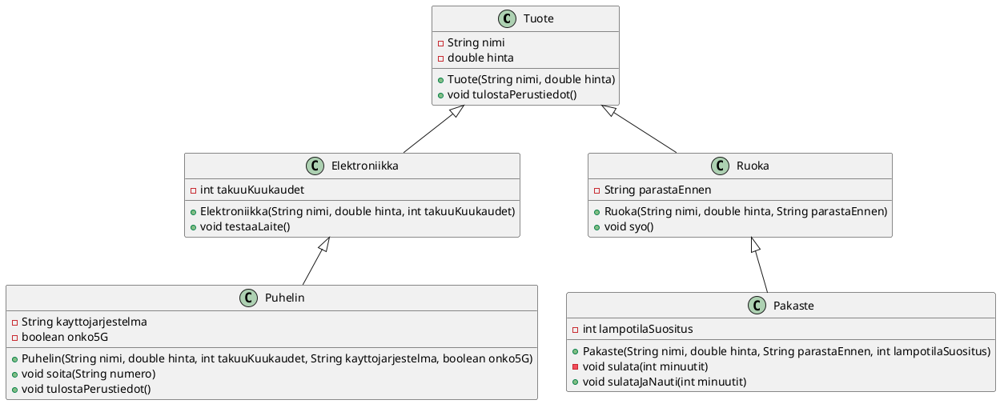

Laajenna aiemmin tekemääsi verkkokaupan luokkahierarkiaa siten, että lisäät
kaksi uutta aliluokkaa `Puhelin` ja `Pakaste`, jotka perivät olemassa olevat
luokat `Elektroniikka` ja `Ruoka`.

 1. `Puhelin` (perii `Elektroniikka`)
    * Lisää attribuutit:
        * `private String kayttojarjestelma` (esim. "Android" tai "iOS")
        * `private boolean onko5G`
    * Lisää metodit:
        * `public void soita(String numero)`. Metodi tulostaa esimerkiksi:
          `Soitetaan numeroon 0401234567 (Appleroid, 4G)`
        * `public void tulostaPuhelimenTiedot()`. Metodin tulee kutsua ensin
          perittyä metodia (`tulostaPerustiedot();`), ja sitten tulostaa
          puhelimeen liittyvät lisätiedot (takuu, käyttöjärjestelmä ja 5G-tuki).

 2. `Pakaste` (perii `Ruoka`)
    * Lisää attribuutti:
        * `private int lampotilaSuositus` (esim. -18)
    * Lisää metodi:
        * `private void sulata(int minuutit)` (huomaa private-määre)
        * Kun metodia kutsutaan, se tulostaa esimerkiksi: `Sulatat pakastetta 10
          minuuttia. Säilytyssuositus: -18 C.`
    * Lisää metodi:
        * `public void sulataJaNauti(int minuutit)`
        * Metodi kutsuu ensin `sulata(minuutit)`-metodia ja sitten perittyä
          `syo()`-metodia.
        * Metodi tulostaa esimerkiksi:
```
Sulatit pakastetta Hernepussi 10 minuuttia. Säilytyssuositus on -18 astetta C.
Syödään Hernepussi.
Parasta ennen oli 31.5.2026, toivottavasti on hyvää.
```

Kokeile luokkia luomalla olioita ja kutsumalla metodeja. Dokumentoi luokat ja
metodit huolellisesti.

Alla on luokkakaavio UML-muodossa.



Tehtäväsivulla on valmiiksi annettuna pääohjelma, jota voit käyttää luokkiesi
testaamiseen.