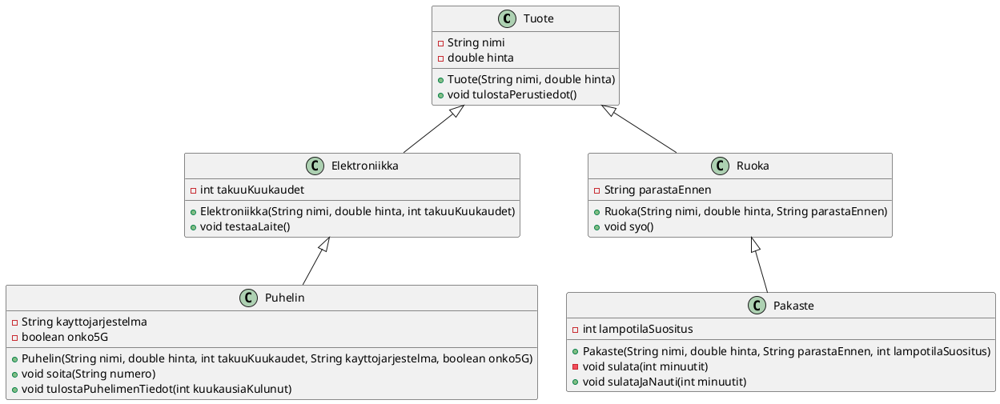

Laajenna aiemmin tekemääsi verkkokaupan luokkahierarkiaa alla olevan UML-kaavion
mukaisesti. Saat kuvan suuremmaksi oikeaklikkaamalla (Windows) tai
Control-klikkaamalla (macOS) sitä ja valitsemalla "Avaa kuva uudessa
välilehdessä".

Tehtäväsivulla on valmiiksi annettuna pääohjelma, jota voit käyttää luokkiesi
testaamiseen. 

<details><summary>Avaa tästä ohjelman antama esimerkkituloste.</summary>

```
Kutsutaan perittyjä metodeja:
Talvitakki Dulce & Käppänä: 120.0 €
Ruisleipä Reissurähjä: 2.5 €
Tietokone HighPower: 899.0 €

----------------------------

Kutsutaan omia metodeja:
Testi 1: Sovitetaan M-kokoista käyttäjää:
Sovitetaan vaatetta Talvitakki Dulce & Käppänä...
Ei välttämättä sopivin koko. Sinä olet kokoa M, mutta tämä vaate on L.

Testi 2: Sovitetaan L-kokoista käyttäjää:
Sovitetaan vaatetta Talvitakki Dulce & Käppänä...
Mahtavaa! Koko L istuu sinulle täydellisesti!

Syödään Ruisleipä Reissurähjä.
Parasta ennen oli 20.12.2024, toivottavasti on hyvää.

Takuuta jäljellä: 19 kk.

pHone: 999.99 €
Takuuta puhelimessa jäljellä: 19 kk
Käyttöjärjestelmä: Orange
Yhteystyyppi: 4G
Soitetaan käyttöjärjestelmästä Orange(4G) numeroon 0401122330

Hernepussi: 0.99 €
Sulatit pakastetta Hernepussi 10 minuuttia. Säilytyssuositus on -18 astetta C.
Syödään Hernepussi.
Parasta ennen oli 31.5.2026, toivottavasti on hyvää.
```
</details>

<br />

<details><summary>Tehtävän kuvaus sanallisessa muodossa</summary>

Tässä on kuvaus uusista luokista ja niiden vaadituista ominaisuuksista. Löydät
vastaavat tiedot UML-kaaviosta.

 1. `Puhelin` (perii `Elektroniikka`)
    * Lisää attribuutit:
        * `private String kayttojarjestelma` (esim. "Droid" tai "AiOS")
        * `private boolean onko5G`
    * Lisää metodit:
        * `public void soita(String numero)`. Metodi tulostaa esimerkiksi:
          `Soitetaan käyttöjärjestelmästä Orange(4G) numeroon 0401122330`
        * `public void tulostaPuhelimenTiedot(int kuukausiaKulunut)`. Metodin tulee kutsua ensin
          perittyä metodia (`tulostaTiedot()`), ja sitten tulostaa
          puhelimeen liittyvät lisätiedot (jäljellä olevan takuuajan, käyttöjärjestelmän ja 5G-tuki).

 2. `Pakaste` (perii `Ruoka`)
    * Lisää attribuutti:
        * `private int lampotilaSuositus` (esim. -18)
    * Lisää metodi:
        * `private void sulata(int minuutit)` (huomaa private-määre)
        * Kun metodia kutsutaan, se tulostaa esimerkiksi: `Sulatat pakastetta 10
          minuuttia. Säilytyssuositus: -18 C.`
    * Lisää metodi:
        * `public void sulataJaNauti(int minuutit)`
        * Metodi kutsuu ensin `sulata(minuutit)`-metodia ja sitten perittyä
          `syo()`-metodia.
</details>

<br />


