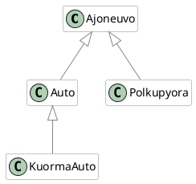

Lisää `Ajoneuvo`-luokkaan metodi `vaihdaRenkaat()`, joka tulostaa konsoliin tekstin "Renkaita x kpl vaihdettu", missä x on parametrina annettu renkaiden lukumäärä. Ylikirjoita tämä metodi `Auto`, `Polkupyora`, ja `KuormaAuto`-luokissa siten, että ne tulostavat sopivan tekstin kyseiselle ajoneuvolle (esim. Auto: "Auton renkaat 4 kpl vaihdettu", Polkupyörä: "Polkupyörän renkaat 2 kpl vaihdettu", KuormaAuto: "Kuorma-auton renkaat 18 kpl vaihdettu").

Tee sitten pääohjelma, jossa luot jokaisen ajoneuvoluokan olion ja kutsut niiden `vaihdaRenkaat()`-metodia testataksesi ylikirjoituksia.

Luokkarakenteen tulee olla seuraava:

