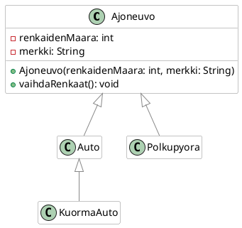

Tee oheisen luokkakaavion mukainen luokkarakenne. Lisää `Ajoneuvo`-luokkaan
`renkaidenMaara`-ominaisuus, joka määritellään muodostajassa. Lisää
`Ajoneuvo`-luokkaan metodi `vaihdaRenkaat()`, joka tulostaa konsoliin tekstin
"Renkaat vaihdettu". Ylikirjoita tämä metodi `Auto`, `Polkupyora`, ja
`KuormaAuto`-luokissa siten, että ne tulostavat sopivan tekstin kyseiselle
ajoneuvolle, esimerkiksi

```
Auton Skoda renkaat 4 kpl vaihdettu.
Polkupyörän Trek renkaat 2 kpl vaihdettu.
Kuorma-auton Scania renkaat 18 kpl vaihdettu.
```

Tee sitten pääohjelma, jossa 
 1. luot jokaisen ajoneuvoluokan olion,
 2. lisäät ne `List<Ajoneuvo>`-kokoelmaan ja 
 3. kutsut kunkin olion `vaihdaRenkaat()`-metodia, jotta saat yllä olevan
    kaltaisen tulosteen aikaiseksi. 

Luokkarakenteen tulee olla seuraava:

