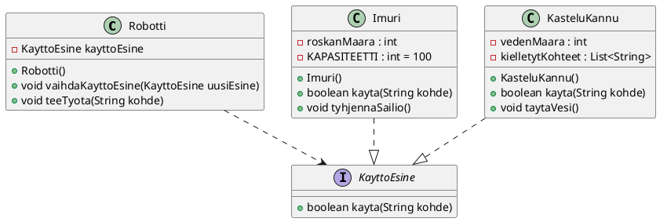

Tee `Robotti`, joka osaa suorittaa erilaisia kotitöitä, kuten imurointia ja
kukkien kastelua. 

Toteuta tehtävä oheisen UML-kaavion mukaisesti. Katkoviiva, jossa on musta
nuoli, tarkoittaa, että `Robotti`-luokka käyttää `KayttoEsine`-rajapintaa:
`Robotti`-luokka sisältää attribuutin, joka on tyyppiä `KayttoEsine`.

Kuvaus sanallisessa muodossa

Tässä on kuvaus luokista ja niiden vaadituista ominaisuuksista (vastaavat kuin UML-kaaviossa):

Robotilla on seuraavat metodit:

 * `void vaihdaKayttoEsine(KayttoEsine esine)`: Vaihtaa robotin käyttämän esineen
   (esim. imuri tai kastelukannu).
 * `void teeTyota(String kohde)`: Suorittaa kotityön. Jos `kohde` on
   sillä listalla, jotka kyseiseltä käyttöesineeltä on kielletty (esim.
   `KasteluKannu`-oliolla ei saa kastella `"Tietokone"`-kohdetta), robotin tulee
   tulostaa virheilmoitus. Kielletyt käyttökohteet määritellään käyttöesineen
   attribuuttina merkkijonolistana. 
 * `Kastelukannu`-olio ei kastele jos vettä ei ole riittävästi. Sen voi täyttää
   `taytaVesi()`-metodilla. Kastelukannun vesimäärä on aluksi 50 yksikköä. Voit
   halutessasi tehdä uuden muodostajan, joka asettaa vesimäärän alkutilan
   toiseksi.
 * `Imuri`-olio ei imuroi jos roskasäiliö on täynnä. Sen voi tyhjentää
   `tyhjennaSailio()`-metodilla. Roskasäiliön kapasiteetti on 100 yksikköä. Voit
   halutessasi tehdä uuden muodostajan, joka asettaa roskasäiliön alkutilan
   toiseksi. 
 * Molemmat käyttöesineet palauttavat `kayta(String kohde)`-metodin avulla
   totuusarvon, joka kertoo onnistuiko työ.

