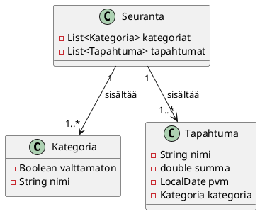
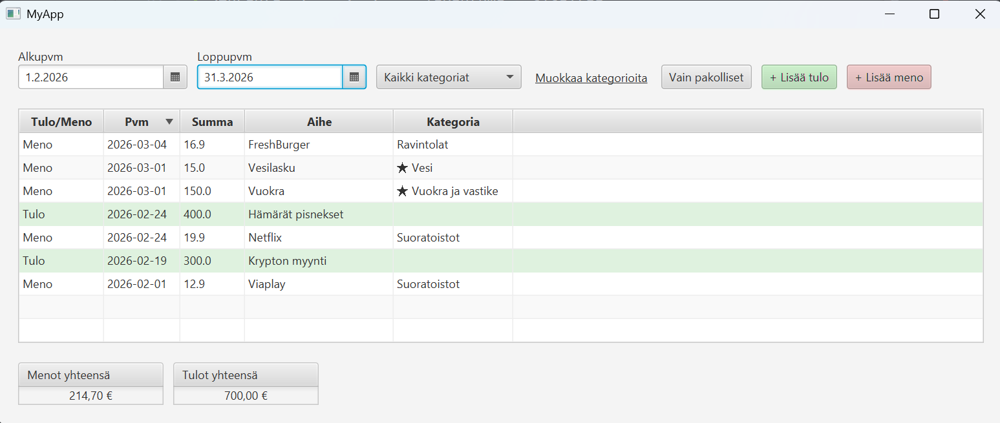
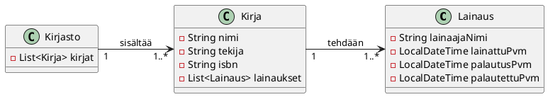
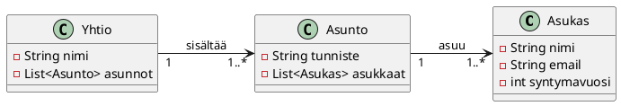
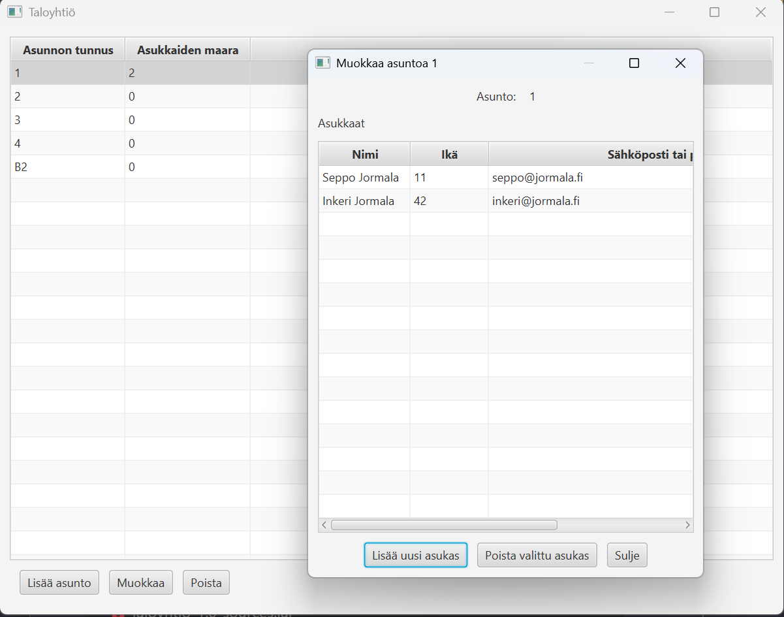
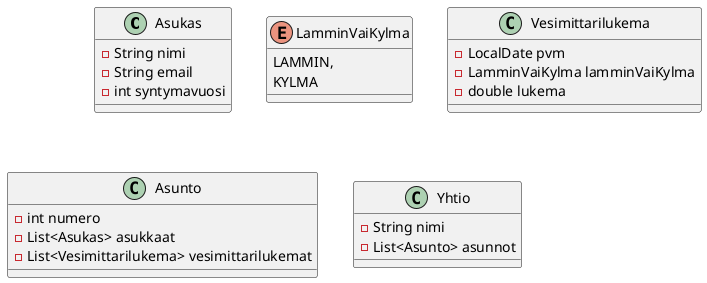
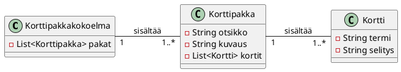

# Harjoitustyö

[Opintojaksoon kuuluu harjoitustyö](./suorittaminen.md), jossa toteutat
graafisen Java-käyttöliittymäsovelluksen käyttäen JavaFX-kirjastoa. Löydät alta
harjoitustyön tarkat arvioitavat vaatimukset.

Voit tehdä harjoitustyön joko valmiin vaatimusmäärittelyn perusteella tai keksiä
oman aiheen. Löydät kaikki aiheiden kuvaukset ja vaatimukset alla.

Harjoitustyö toteutetaan vaiheittain osissa 9–12. Jokainen osa sisältää ohjeita,
joiden tarkoituksena on auttaa sinua etenemään, mutta voit toteuttaa vaatimukset
myös muulla tavoin, kunhan ne täyttyvät.

Suosittelemme, että ennen harjoitustyön tekemistä tutustut ja teet osissa 7-8
tehdyn Todo-sovelluksen. Saat siitä merkittävästi apua harjoitustyön toteutukseen.

**Näytä lopullinen, kaikkia vaatimuksia täyttävä harjoitustyösi kurssin
tuntiopettajalle ennen osan 12 palautusta etä- tai lähiohjauksessa.** Kun
tuntiopettaja on hyväksynyt työsi, hän tekee siitä merkinnän TIMissä.

## Aihe

Voit valita valmiin aiheen alla olevista vaihtoehdoista, tai keksiä oman aiheen,
joka täyttää vaatimukset. Näet kunkin aiheen tarkemmat vaatimukset klikkaamalla.

Bonus-merkinnällä (<i class="bi bi-stars jyu-gold"></i>) olevia vaatimuksia ei
ole pakko toteuttaa. 

### Kulujen seuranta

Tässä sovelluksessa käyttäjä voi seurata omia kulujaan ja menojaan. 

**Toiminnalliset vaatimukset**

 * Käyttäjä voi syöttää kuluja ja menoja ("tapahtuma").
 * Käyttäjä näkee kaikki tapahtumat taulukossa, jossa on ainakin tapahtuman nimi,
   summa ja päivämäärä. 
 * Käyttäjä voi määrittää kulukategorioita. 
 * Käyttäjä voi määrittää, mihin kategoriaan kulu kuuluu. Tuloilla ei tarvitse
   välttämättä olla kategoriaa.
 * Käyttäjä näkee tietyn kategorian tapahtumat
 * Käyttäjä voi katsoa tapahtumat tietyltä aikaväliltä (kaksi päivämäärää).
 * Käyttäjä voi muokata tapahtumia ja kategorioita.
 * Kategorian nimen vaihtaminen siirtää kaikki kyseiseen kategoriaan liittyvät tapahtumat uuteen kategoriaan.
 * <i class="bi bi-stars jyu-gold"></i> Kulukategoria voi olla *pakollinen*, mikä tarkoittaa välttämätöntä
   menoa, kuten vuokra tai sähkölasku. 
 * <i class="bi bi-stars jyu-gold"></i> Käyttäjä voi valita useita kategorioita
   filtteriin. Käytä esimerkiksi ControlsFX:n `CheckComboBox`-komponenttia
   (<https://controlsfx.github.io/features/checkcombobox/>).
 * <i class="bi bi-stars jyu-gold"></i> Käyttäjä näkee kuvaajan, jossa esitetään kaikki tapahtumat kuukausittain.
 * <i class="bi bi-stars jyu-gold"></i> Käyttäjä näkee kategorioittain aikasarjan kuluista.

Voit hyötyä ainakin seuraavista komponenteista: 

 * DatePicker päivämäärän valitsemiseen.
 * CheckBox ja ComboBox kategorian valitsemiseen ja suodattamiseen.
 * TableView-komponenttiin FilteredList, joka tuottaa suodatetun näkymän. Lue
   ohjeet [FilteredListin käyttöön](./javafx/tableview.md#filteredlist).

**Sovelluksen tietomalli**

Tietomalli voi näyttää esimerkiksi seuraavalta.

Tällaisessa mallissa tieto siitä onko tapahtuma kulu vai meno voidaan ilmaista
summan positiivisuudella tai negatiivisuudella. Toinen vaihtoehto olisi tehdä
`TuloVaiMeno`-enum, ja lisätä `Tapahtuma`-luokkaan `TuloVaiMeno tuloVaiMeno`
-attribuutti. Kannattaa ehkä aloittaa ilman enumia, ja lisätä se myöhemmin, jos
tuntuu, että siitä on hyötyä.

Valmiit kulukategoriat

Voit antaa sovelluksessa valmiiksi vaikkapa nämä [Marttojen
budjettioppaan](https://www.martat.fi/omat-rahat/taloudenhallinnan-perustaidot/talouden-suunnittelu/)
mukaiset kulukategoriat. Toki voit keksiä myös omasi tai antaa käyttäjälle vapauden luoda omat kategoriansa.

 * Ruoka kotona
 * Ravintolat
 * Vuokra ja vastike
 * Vesi
 * Sähkö
 * Muu asuminen
 * Vaatteet
 * Terveys
 * Auto
 * Julkinen liikenne
 * Muu matkustus
 * Suoratoistot
 * Päivähoito
 * Vakuutukset
 * Kodin hankinnat
 * Vapaa-aika
 * Lahjat, lahjoitukset
 * Säästäminen
 * Lainanhoito ja korot
 * Muut menot

Valmis sovellus voisi näyttää vaikkapa tältä. Ei haittaa, vaikka oma
käyttöliittymäsi ei näyttäisi samanlaiselta -- tärkeintä on, että sovelluksesi täyttää vaatimukset, ei se, miltä se näyttää.

### Tuotteiden varastohallinta
 
Tässä sovelluksessa käyttäjä voi hallita tuotteita ja tehdä ostotapahtumia. 

 * Käyttäjä voi syöttää tuotteita ja niiden määriä varastossa. 
 * Käyttäjä näkee kaikki tuotteet taulukossa, jossa on ainakin tuotteen nimi, määrä ja hinta. 
 * Käyttäjä voi tehdä ostotapahtumia, joissa hän syöttää ostettavan tuotteen,
   ostettavan määrän. Ei voi ostaa, jos tuotetta ei ole varastossa tarpeeksi 
 * Näytetään rivin yksikköhinta ja rivin loppuhinta (yksikköhinta * määrä)
   ostotapahtuman yhteydessä. Tarvitset sarakkeen, joka laskee
   kertolaskun tuotteiden hinnasta ja ostettavasta määrästä. 
 * Näytetään ostosten loppuhinta. 
 * <i class="bi bi-stars jyu-gold"></i> Maksutapa voi olla kortti tai käteinen
 * <i class="bi bi-stars jyu-gold"></i> Käteismaksujen jälkeen käteiskassa päivittyy
 * <i class="bi bi-stars jyu-gold"></i> Rivialennus tai ostotapahtumakohtainen alennus

### Kirjasto

Sovellus kirjaston kirjojen ja lainojen hallintaan.
Kirjaston hoitaja voi hallita kirjojen tietoja ja lainatilannetta, sekä tutkia
kirjojen lainahistoriaa.

**Toiminnalliset vaatimukset**

* Käyttäjä voi syöttää kirjoja ja niiden tietoja. 
* Käyttäjä näkee kaikki kirjat taulukossa, jossa on ainakin kirjan nimi, tekijä,
 ISBN-tunniste ja lainatilanne. Käyttäjä voi myös helposti nähdä, kuinka monta
 kertaa jokaista kirjaa on lainattu.
* Käyttäjä voi lainata kirjoja henkilölle ja merkata lainaukset palautetuksi.
* Käyttäjä voi katsoa kirjojen lainaushistoriaa. 
* Jokainen kirja voi olla samaan aikaan lainassa vain yhdellä lainaajalla.
  Samaa kirjaa voi lainata, jos se on parhaillaan lainassa.
* Käyttäjä voi helposti nähdä, mitkä kirjat ovat lainassa. Käyttäjä voi lisäksi
  helposti nähdä, minkä kirjojen lainausten palautuspäivämäärä on mennyt jo ohi
  (eli ns. myöhästyneet palautukset).

**Sovelluksen tietomalli**

Sovellus sisältää kaksi oleellista tietomallin kohdetta: `Kirja` ja
`Lainaus`. Lisäksi tietomallissa on kaikkia asuntoja hallinnoiva
`Kirjasto`-luokka. Tietomalli näyttää seuraavalta:

Esimerkki siitä, miltä JSON voisi näyttää. 

### Taloyhtiön hallinta

Taloyhtiön hallintasovelluksessa taloyhtiön isännöitsijä voi hallita taloyhtiön
tietoja, kuten asuntoja, asukkaita ja taloyhtiön tapahtumia. 

**Toiminnalliset vaatimukset**

 * Käyttäjä voi syöttää asuntoja ja niiden tietoja. 
 * Käyttäjä näkee kaikki asunnot taulukossa, jossa on asunnon
   numero ja asukkaiden lukumäärä
 * Käyttäjä voi lisätä ja poistaa asukkaita asuntoon.
 * Käyttäjä näkee asunnon asukkaat taulukossa, jossa on ainakin asukkaiden
   nimet, sähköpostiosoitteet ja syntymävuodet.

**Sovelluksen tietomalli**

Sovellus sisältää kaksi oleellista tietomallin kohdetta: `Asunto` ja
`Asukas`. Lisäksi tietomallissa on kaikkia asuntoja hallinnoiva
`Yhtio`-luokka. Tietomalli näyttää seuraavalta:

Valmis sovellus voisi näyttää vaikkapa tältä. 

<i class="bi bi-stars jyu-gold"></i> Bonus: Lisää ominaisuuksia

Voit halutessasi lisätä sovellukseen myös alla olevia ominaisuuksia.
Lisäominaisuudet eivät vaikuta harjoitustyön hyväksyntään, ja voit toteuttaa ne
haluamallasi tavalla. Mikäli kuitenkin
lisäät ylimääräisiä ominaisuuksia, tulee ne toteuttaa [harjoitustyön vaatimuksia
noudattaen](../harjoitustyo.md).

**Isännöitsijän ja asukkaan näkymät**

* Sovelluksessa on kaksi tilaa: Isännöitsijän näkymä ja asukkaan näkymä.
* Sovelluksen aloitusnäytössä käyttäjä valitsee, haluaako hän käyttää isännöitsijän vai asukkaan näkymää.
  Jos valitaan asukkaan näkymä, käyttäjän tulee valita asukas, jona hän
  "kirjautuu" näkymään.
* Isännöitsijä voi hallita asuntojen tietoja, asukkaita ja taloyhtiön tapahtumia (kuten perusversiossakin)
* Asukkaan näkymässä käyttäjä näkee sen asunnon tiedot, johon hän kuuluu. Asukas ei
  voi muokata asunnon perustietoja.
* Asukkaan näkymässä käyttäjä voi antaa palautetta isännöitsijälle.
* Isännöitsijänäkymässä käyttäjä näkee palautteet taulukossa, jossa on ainakin palautteen tekijän nimi, päivämäärä ja palautteen sisältö.

**Vesimittarilukemien kirjaus**

 * Asukasnäkymässä asukas voi syöttää asunnolle vesimittarilukemia. Vesimittarilukema sisältää
   lukeman, päivämäärän ja sen, onko lukema otettu kylmästä vai lämpimästä
   vedestä.
 * Asukas näkee asuntonsa vesimittarilukemat taulukossa
 
**Vesilaskun luominen**

* Isännöitsijä voi syöttää taloyhtiölle lämpimän ja kylmän veden hinnat ja niiden
  alkamispäivät.
* Käyttäjä voi luoda asunnolle vesilaskun. Vesilasku sisältää kahden
  viimeisimmän kylmän ja lämpimän veden lukeman erotuksen. Riittää, että
  vesilasku näyttää laskukauden (alku- ja loppupvm), kulutetun kylmän ja
  lämpimän veden määrän, sekä vesilaskun loppusumman (kylmä ja lämmin vesi eroteltuina).

Voit hyötyä seuraavista tietomalleista.

<!-- DZ: Tuo ei toimi vielä, sillä vaatii JRE:n asennusta tai osassa 1 olevan PATH-kikan käyttäminen  -->
<!-- Voit halutessasi tutkia valmista sovellusta
[täällä](https://github.com/ohj-perus-jy/malliharkat/blob/main/Taloyhtio-1.0.jar).
Lataa tiedosto. Selain varoittaa, että sovellus ei ole turvallinen, mutta voit
hyväksyä sen silti. Käynnistä sovellus komennolla `java -jar Taloyhtio-1.0.jar`.  -->

### Muistikorttisovellus

Sovellus, jolla voi luoda ja hallita muistikortteja (vrt. [Anki](https://fi.wikipedia.org/wiki/Anki_(ohjelma))).
Käyttäjä voi luoda muistikortteja, jotka sisältävät termin ja siihen liittyvän
selityksen. Samaan aiheeseen kuuluvia muistikortteja kerätään korttipakkoihin,
joita voi harjoitella sovelluksessa.

**Toiminnalliset vaatimukset**

* Käyttäjä voi luoda korttipakkoja, jotka sisältävät kortteja. Korttipakalla on
  nimi ja valinnainen kuvaus.
* Käyttäjä voi lisätä kortteja korttipakkaan. Kortilla on termi ja termin selitys.
* Käyttäjä voi selata ja muokata lisättyjä korttipakkoja.
* Käyttäjä voi harjoitella korttipakan kortteja ns. harjoitustilassa. Harjoitustilassa käyttäjälle näytetään yhden korttipakan kortin termi. Käyttäjä voi katsoa kortin
  selityksen (eli ns. "kääntää kortin").
  Käyttäjä voi sen jälkeen siirtyä seuraavaan korttiin tai edelliseen korttiin.
* Harjoitustilassa kortit näytetään aina satunnaisessa järjestyksessä.
* Käyttäjä voi muokata ja poistaa korttipakkoja tai sen kortteja.

**Sovelluksen tietomalli**

Sovellus sisältää kaksi oleellista tietomallin kohdetta: `Kortti` ja
`Korttipakka`. Lisäksi tietomallissa on kaikkia korttipakkoja hallinnoiva
`Korttipakkakokoelma`-luokka. Tietomalli näyttää siten seuraavalta:

<i class="bi bi-stars jyu-gold"></i> Bonus: Lisää ominaisuuksia

Voit halutessasi lisätä sovellukseen myös alla olevia ominaisuuksia.
Lisäominaisuudet eivät vaikuta harjoitustyön hyväksyntään, ja voit toteuttaa ne
haluamallasi tavalla. Mikäli kuitenkin
lisäät ylimääräisiä ominaisuuksia, tulee ne toteuttaa [harjoitustyön vaatimuksia
noudattaen](../harjoitustyo.md).

**Pelitilastot**

* Lisää kortteille katselukertojen lukumäärän. Aina, kun käyttäjä paljastaa
  kortin selityksen harjoitustilassa, kortin katselukerta kasvaa yhdellä.
* Korttien katselukerrat näytetään korttipakan muokkausnäkymässä korttitaulukossa.
* Lisää korttipakalle harjoituskertojen lukumäärän. Aina, kun käyttäjä avaa
  harjoitustilan ja harjoittelee jokaisen kortin kerran, kasvatetaan
  harjoituskertojen lukumäärää.
* Korttipakan harjoituskerrat näytetään päänäkymässä omana sarakkeena.

**Tenttitila**

* Lisää korttipakoille tenttitila. Tenttitilassa käyttäjälle näytetään yhden
  kortin termi ja kolme mahdollista selitystä monivalintakysymyksenä. Käyttäjän
  tulee valita oikea termiä vastaava selitys. Käyttäjä saa palautteena oikean
  vastauksen, minkä jälkeen näytetään seuraava monivalintakysymys.
* Tenttitilan tulee toimia yhtä hyvin niin kolmen kortin kuin usean sadan
  kortin pakalla. 
* Tenttitilaan pääsee vain, jos pakassa on vähintään kolme korttia.
* Voit hyötyä mm.
  [RadioButton ja
  ToggleGroup](https://jenkov.com/tutorials/javafx/radiobutton.html)
  -komponenteista.

<!-- DZ: Keväällä 2026 tämä voisi kuulua "Jokin muu oma idea" -aiheeseen.  -->
<!-- ### Bonus: Todo-sovelluksen laajentaminen

Laajenna osissa 7 ja 8 tehtyä Todo-sovellusta...

Ominaisuudet

  * Käyttäjä voi merkitä tehtävän tärkeäksi, jolloin se näkyy listassa erottuvalla tavalla.

 -->

### Oma idea

Oma vapaavalinnainen JavaFX-käyttöliittymäsovellus, joka täyttää opintojakson 
harjoitustyön vaatimukset.
Halutessasi voit myös laajentaa osissa 7 ja 8 työstettyä Todo-sovellusta.

Jos valitset oman aiheen, sinun on kirjoitettava alustava
harjoitustyösuunnitelma, jossa ilmenevät sovelluksen oleelliset toiminnalliset
vaatimukset sekä sovelluksessa käytettävä tietomalli. Voit ottaa mallia
suunnitelman laajuudesta yllä olevista harjoitustyöaiheista.

Suunnitelma tulee hyväksyttää tuntiopettajalla ennen kuin aloitat toteutuksen.

Suunnitelmaa kirjoittaessasi pohdi myös, millä tavoin täyttää [harjoitustyön
yleiset vaatimukset](#harjoitustyön-tekniset-vaatimukset-ja-arviointi). 
Tuntiopettaja voi pyytää täydennyksiä suunnitelmaan, jos työn laajuus
ei vastaa harjoitustyön vaatimuksia.

Jos päätät laajentaa osan 7 ja 8 Todo-sovellusta, harjoitustyön vaatimukset
koskevat sinun tekemää laajennosta. Esimerkiksi vaatimus 1.1 (Sovelluksessa on
vähintään kaksi kohdealueen mallinnettavaa asiaa) tarkoittaisi, että sinun tulee
määrittää kaksi uutta mallinnettavaa asiaa nykyisen `Tehtava`-mallin lisäksi.
Puolestaan vaatimus 4.1 tarkoittaa, että käyttöliittymään on lisättävä kaksi
uutta lisänäkymää tai laajentaa nykyiset näkymät merkittävästi siten, että
laajennos voisi tulkita omaksi näkymäksi. 

## Tekniset vaatimukset ja arviointi

Alla olevia vaatimuksia käytetään harjoitustyön arvioinnissa. Harjoitustyö
arvioidaan asteikolla hylätty/hyväksytty. Hylätyn harjoitustyön voi täydentää
tuntiopettajan antaman palautteen perusteella.

Lähtökohtaisesti työn on täytettävä kaikki alla olevat vaatimukset. Yksittäisten
vaatimusten kohdalla voidaan joustaa, mikäli työ on muilta osin tavanomaista
laajempi tai ansiokkaampi, tai jos työn aihe sitä vaatii. Tuntiopettaja tekee
lopullisen arvion työn hyväksymisestä tapauskohtaisesti.

### Vaatimus 1: Tietomalli

1. **Sovelluksessa on vähintään kaksi kohdealueen mallinnettavaa asiaa.**

    Se voi olla esimerkiksi tehtävä, tapahtuma, kirja, asiakas, treeni, peli,
    resepti tai vastaava. Jokaisella mallinnettavalla oliolla on omia kohdealueen
    kannalta merkittäviä attribuutteja tai ominaisuuksia. Osien 7–8
    mallisovelluksessa oli yksi mallinnettava asia: `Tehtava`. Puolestaan
    muistikorttisovelluksessa ne voisivat olla `Kortti` ja `Korttipakka`. Kulujen
    hallintasovelluksessa taas sopivat mallinnettavat asiat olisivat `Tapahtuma` ja
    `Kategoria`.

2. **Jokaisella kohdealuetta mallinnettavalla asialla on oltava vähintään yksi kohdealueen kannalta oleellinen ja asialle ominainen attribuutti.**

    Osien 7–8
    mallisovelluksessa `Tehtava`-luokka sisälsi attribuutit `tehty`, `otsikko`,
    `kuvaus` ja `prioriteetti`.

    Huomaa, että *attribuutti, jonka ainoa tarkoitus on viitata toiseen malliin tai
    jonka arvo on johdettavissa jonkun toisen attribuutin arvosta* ei lasketa tähän
    vaatimukseen mukaan. Esimerkiksi osan 7–8 mallisovelluksen
    `Tehtavakokoelma`-luokka sisältää ainoana attribuuttina `tehtavat`-kokoelman,
    joka on vain kokoelma viitteitä tehtäviin, ja siten sitä ei laskettaisi tähän
    vaatimukseen mukaan. Sen sijaan muistikorttisovelluksessa `Korttipakka` sisältää
    korttikokoelman lisäksi korttipakan otsikon ja kuvauksen, jotka lasketaan
    sovelluksen kannalta oleellisiksi ja korttipakalle ominaisiksi.

3. **Sovelluksen dataa ei mallinneta käyttöliittymäkomponenteilla, vaan omilla malliluokilla.**

4. **Sovelluksessa käytetään JavaFX:n havaittavia (observable) rakenteita
silloin, kun ne liittyvät käyttöliittymän ja datan kytkemiseen.**

    Vähintään keskeisen tietokokoelman tulee olla `ObservableList` tai vastaava.

5. **Datan esittämiseen käyttöliittymässä käytetään tarkoituksenmukaista komponenttia.**

    Jos työssä on useita samantyyppisiä olioita, `TableView` on yleensä luonteva
    ratkaisu.

### Vaatimus 2: Perustoiminnallisuus

1. **Kullekin mallinnetulle oliolle on toteutettava CRUD-toiminnallisuus käyttöliittymässä.**

    Käyttäjä voi luoda (*Create*), lukea (*Read*), päivittää (*Update*) ja poistaa
    (*Delete*) olioita käyttöliittymän kautta. Esimerkiksi osan 7–8
    mallisovelluksessa käyttäjä voi luoda tehtäviä painikkeella, lukea ne
    `TableView`-komponentista, muokata tehtäviä erillisessä näkymässä ja poistaa ne
    poistopainikkeella.

2. **Käyttäjän ei saa antaa lisätä ilmeisen virheellistä tietoa.**

    Esimerkiksi tyhjää nimeä tai pakollisen kentän puuttumista ei tule sallia.
    Validointi on toteutettava joko mallissa tai käyttöliittymässä.

3. **Käyttöliittymän tila vastaa aina mallin tilaa ja päinvastoin.**

    Tietoa päivitettäessä tai poistettaessa malliin tai käyttöliittymään ei saa
    jäädä väärää tietoa. Olion poistaminen mallista poistaa sen välittömästi myös
    näkyvistä.

### Vaatimus 3: Tallennus

1. **Sovelluksen tiedot tallennetaan tiedostoon.**

    Tiedot säilyvät ohjelman sulkemisen jälkeen. Tallennus voi tapahtua
    automaattisesti tai erillisenä "Tallenna"-toimintona.

2. **Tallennetut tiedot ladataan takaisin ohjelman käynnistyessä**

### Vaatimus 4: Käyttöliittymä

1. **Sovelluksessa on graafinen käyttöliittymä, jossa on vähintään kaksi näkymää.**

    Näkymät voivat olla esimerkiksi päänäkymä (listaus) ja muokkausnäkymä (dialogi).

2. **Käyttöliittymä on jäsennelty ja käyttökelpoinen.**

    Syöttökentät, painikkeet, nimiöt ja listaukset on aseteltu loogisesti, eivätkä
    ne ole sattumanvaraisia.

### Vaatimus 5: Arkkitehtuuri ja vastuunjako

1. **Sovelluksen rakenne noudattaa MVC-mallia (Model-View-Controller).**

    Pääasia on, että tietomalli, käyttöliittymä ja niitä yhteen kytkevä ohjainlogiikka on erotettu
    toisistaan.

2. **Sovelluksen data ja tallennuslogiikka on erotettu ohjainluokasta.**

    Käyttöliittymän ohjain ei saa sisältää kaikkea sovelluksen dataa ja
    tallennuslogiikkaa.

3. **Tiedon lataus ja tallennus on erotettu omaksi vastuualueekseen.**

    Käytännössä talletukselle ja lataukselle on vähintään oma metodi, joka on sijoitettu
    ohjainlogiikan ulkopuolelle. 

### Vaatimus 6: Testaus

1. **Sovelluksen keskeiselle mallille tai sovelluslogiikalle on kirjoitettu yksikkötestejä.**

    Testeissä on varmistettava, että keskeiset metodit (kuten lisääminen ja
    poistaminen) muokkaavat tietomallin tilaa odotetusti.

### Vaatimus 7: Versiohallinta ja projektinhallinta

1. **Työlle on luotu julkinen Git-etävarasto (esim. GitLab tai GitHub).**

2. **Projektissa on `.gitignore`-tiedosto ja `README.md`.**

    README-tiedostossa kerrotaan lyhyesti, mikä sovellus on kyseessä ja miten se
    toimii.

3. **Git-commitit on nimetty kuvaavasti.**

    Commiteista käy ilmi, mitä muutoksia kukin niistä sisältää.

4. **Työtä on edistetty iteratiivisesti tallentaen iteraatioiden tulokset omina committeina.**

    Etävarastossa ei saa olla vain yhtä "valmis sovellus" -committia, vaan
    kehityshistorian tulee näkyä.

### Vaatimus 8: Koodin laatu

1. **IntelliJ IDEA:n ei tule raportoida mitään virheitä tai varoituksia Java-lähdekoodissa.**

    IntelliJ IDEA merkitsee varoitukset keltaisella ja virheet punaisella.
    Kielen tarkistukseen liittyvät varoitukset (vihreällä) sallitaan.
    Vastaavasti `.fxml`-tiedostossa olevia virhemerkintöjä sallitaan.

    Voit ajaa virheentarkistuksen kaikille tiedostoille kerralla käyttäen [Run all
    inspections
    -toimintoa](https://www.jetbrains.com/help/idea/running-inspections.html#run-all-inspections).

    Huomaa, että monille varoituksille ja virheille IntelliJ IDEA tarjoaa valmiita
    korjauksia, jotka saa näkyviin klikkaamalla varoituksen yhteydessä näkyvästä
    toimintopainikkeesta (<i class="bi bi-lightbulb-fill"></i>).

2. **Kaikkien `.java`-lähdekooditiedostojen tulee olla muotoiltu yhtenäisellä tyylillä.**

    Käytä IDEA:n [Reformat code
    -ominaisuutta](https://www.jetbrains.com/help/idea/reformat-and-rearrange-code.html#reformat_module_directory)
    käyttäen sen kaikkia korjauksia (*Optimize imports*, *Rearrange entries*,
    *Cleanup code*).

3. **Julkisuusmääreet ovat eksplisiittisesti määritelty jokaiselle luokalle, attribuutille ja metodeille hyviä kapselointiperiaatteita noudattaen.**

    Attribuutit ovat lähtökohtaisesti merkitty `private`-määreellä. Metodien kohdalla
    julkisuusmääreen tulee sopia metodin tarkoitukseen: muiden olioiden
    käytettäväksi tarkoitetut metodit ovat `public`, kun taas luokan omat apumetodit
    ovat `private`.

