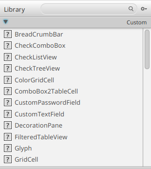

# UI-kirjastojen käyttäminen

> [!TÄRKEÄÄ]
>
> Tällä kurssilla on sallittua käyttää ulkoisia kirjastoja omassa
> harjoitustyössä, mutta omalla vastuulla. 
> 
> Ota huomioon, että ulkoisille kirjastoille on tarjolla
> vaihtelevasti ohjeita, ja pahimmillaan voit joutua selvittämään kirjaston
> toimintaa suoraan sen lähdekoodista.
> Lisäksi ulkoiset kirjastot voivat sisältää bugeja ja ongelmia, joiden
> selvittäminen voi viedä aikaa pois itse harjoitustyön tekemisestä.
> 
> Kurssin opettajat ja tuntiopettajat tarjoavat tukea
> vain JavaFX-kirjastossa valmiiksi oleviin komponentteihin ja toimintoihin.

JavaFX:lle on olemassa lukuisia lisäkirjastoja, jotka voivat helpottaa
kehitystä. Saatat hyötyä esimerkiksi seuraavista kirjastoista:

- [ControlsFX](https://controlsfx.github.io/) ([kirjaston Maven-sivu](https://central.sonatype.com/artifact/org.controlsfx/controlsfx/11.1.2))
- [GemsFX](https://github.com/dlsc-software-consulting-gmbh/GemsFX) ([kirjaston Maven-sivu](https://central.sonatype.com/artifact/com.dlsc.gemsfx/gemsfx))
- [Awesome
  JavaFX](https://github.com/mhrimaz/AwesomeJavaFX?tab=readme-ov-file#libraries-tools-and-projects):
  listaus erilaisista kiinnostavista JavaFX-kirjastoista


JavaFX-kirjastojen käyttöönotto tapahtuu samoin kuin [osan 6.4
ohjeissa](../osa6/04-ulkoiset-kirjastot-ja-java-projektien-hallintatyokalut.md#kolmannen-osapuolen-riippuvuudet):
etsitään projektia vastaava pakkaus [Maven Central
-sivustolta](https://central.sonatype.com/),
kopioidaan tarvittava `<dependency>`-määre ja lisätään se projektin
`pom.xml`-tiedostoon `<dependencies>`-listaukseen.

Esimerkiksi ControlsFX saa käyttöön lisäämällä `pom.xml`-tiedoston
`<dependencies>`-kohtaan:

```xml
<dependency>
    <groupId>org.controlsfx</groupId>
    <artifactId>controlsfx</artifactId>
    <version>11.2.3</version>
</dependency>
```

Tämä ei kuitenkaan vielä näytä kirjaston komponentteja SceneBuilderissa.
Jotta kirjaston komponentteja saa myös SceneBuilderiin, tee näin:

1. Avaa SceneBuilderissa muokattava `.fxml`-tiedosto.

2. Klikkaa Library-näkymän hakupalkin vieressä olevaa asetuspainiketta (<i
   class="bi bi-gear-fill"></i>) ja valitse sieltä **JAR/FXML Manager**:

   

3. Valitse avautuneesta dialogista **Manually add Library from repository**.

4. Syötä avautuneeseen dialogiin pakkauksen `<dependency>`-määreen tiedot:

    * Group ID: Sama arvo kuin `<groupId>`. ControlsFX-kirjastolle tämä on esimerkiksi `org.controlsfx`
    * Artifact ID: Sama arvo kuin `artifactId`. ControlsFX-kirjastolle tämä on
      esimerkiksi `controlsfx`
    
    Paina <kbd>Enter</kbd> sen jälkeen, kun syötit Group ID ja Artifact ID
    -arvot, jolloin SceneBuilder hakee kirjaston tiedot Maven Centralista.
    Valitse sen jälkeen Version-kenttään sama versio kuin `<dependency>`-määreen
    `<version>`-kentässä.
    Yllä olevassa ControlsFX-kirjaston esimerkille tämä on `11.2.3`.
    Varmista, että SceneBuilderiin lisättävä versio on sama kuin projektin `pom.xml`:ään
    lisättävä versio.

5. Paina **Add JAR**. Tämä pitäisi avata komponenttivalikon, jolla voit
   esikatsella kirjaston komponentteja ja valita, mitkä niistä ladataan
   SceneBuilderiin.
   
   Tässä yleensä riittää painaa **Import Components**, jolloin kirjaston kaikki
   komponentit ladataan.

5. Lopuksi sulje dialogi **Close**-painikkeella.

Nyt SceneBuilderin Library-näkymässä pitäisi löytyä myös kirjaston omia
komponentteja Custom-paneelista:



Voit nyt käyttää komponentteja normaalisti.


