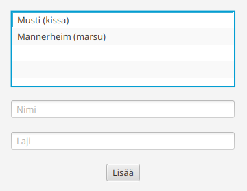

# Tietojen validointi

Tietojen validoinnilla tarkoitetaan käyttäjän antamien tietojen oikeellisuuden
tarkistusta.
Validoinnilla varmistetaan, että käyttäjän muutokset eivät tuota
kohdealueen kannalta epäkelpoa tietomallia.

## Esimerkki

Olkoon meillä seuraavanlainen yksinkertainen sovellus:

```java,ignore
// FILE: MainController.java
public class MainController implements Initializable {
    @FXML
    private ListView<Lemmikki> lemmikitList;

    @FXML
    private TextField nimiField;

    @FXML
    private TextField lajiField;

    @FXML
    private Button lisaaButton;

    ObservableList<Lemmikki> lemmikit = FXCollections.observableArrayList();

    @Override
    public void initialize(URL url, ResourceBundle resourceBundle) {
        lemmikitList.setItems(lemmikit);
        
        lisaaButton.setOnAction(_ -> lisaaLemmikki());
    }

    private void lisaaLemmikki() {
        Lemmikki lemmikki = new Lemmikki();
        lemmikki.setNimi(nimiField.getText());
        lemmikki.setLaji(lajiField.getText());
        lemmikit.add(lemmikki);

        nimiField.clear();
        lajiField.clear();
    }
}
// FILE_END
// FILE: Lemmikki.java
public class Lemmikki {
    StringProperty nimi = new SimpleStringProperty();
    StringProperty laji = new SimpleStringProperty();

    public StringProperty lajiProperty() { return laji; }

    public String getLaji() { return laji.get(); }

    public void setLaji(String laji) { this.laji.set(laji); }

    public StringProperty nimiProperty() { return nimi; }

    public String getNimi() { return nimi.get(); }

    public void setNimi(String nimi) { this.nimi.set(nimi); }

    @Override
    public String toString() { return getNimi() + " (" + getLaji() + ")"; }
}
// FILE_END
// FILE: main.fxml
<?xml version="1.0" encoding="UTF-8"?>

<?import javafx.geometry.Insets?>
<?import javafx.scene.control.Button?>
<?import javafx.scene.control.ListView?>
<?import javafx.scene.control.TextField?>
<?import javafx.scene.layout.VBox?>

<VBox alignment="CENTER" spacing="20.0" xmlns="http://javafx.com/javafx/25" xmlns:fx="http://javafx.com/fxml/1" fx:controller="fi.jyu.ohj2.esimerkki.muistikortti.MainController">
    <padding>
        <Insets bottom="20.0" left="20.0" right="20.0" top="20.0" />
    </padding>
   <children>
      <ListView fx:id="lemmikitList" prefHeight="200.0" prefWidth="200.0" />
      <TextField fx:id="nimiField" promptText="Nimi" />
      <TextField fx:id="lajiField" promptText="Laji" />
      <Button fx:id="lisaaButton" mnemonicParsing="false" text="Lisää" />
   </children>
</VBox>
// FILE_END
```

Sovelluksessa on lista, johon voi lisätä lemmikkejä, joita mallinnetaan `Lemmikki`-luokalla:



Nyt listaan voi lisätä lemmikkejä ilman nimeä tai lajia, mikä on kohdealueen
kannalta turhaa. Haluaisimme estää käyttäjää lisäämästä nimettömiä tai
lajittomia lemmikkejä listaan.

## Yksinkertainen validointi

Yksinkertaisin validointi voidaan tehdä tarkistamalla kohdealueen vaatimukset
ennen tietomallin kohteen luomista. Voisimme siis tarkistaa
`lisaaLemmikki()`-metodissa, onko nimi- ja laji-kentissä tekstiä:

```java,ignore
private void lisaaLemmikki() {
    

    // Suoritetaan lisäys vain, jos validointi menee läpi eli tieto on oikein

    Lemmikki lemmikki = new Lemmikki();
    lemmikki.setNimi(nimi);
    lemmikki.setLaji(laji);
    lemmikit.add(lemmikki);

    nimiField.clear();
    lajiField.clear();
}
```

## Validointimetodi

Validointi on usein helppoa siirtää erilliseen metodiin:

```java,ignore
private boolean validoiLemmikki() {
    // Tyhjennetään kenttien tyylit
    nimiField.setStyle("");
    lajiField.setStyle("");

    // Haetaan kenttien sisällöt
    String nimi = nimiField.getText();
    String laji = lajiField.getText();

    // Tarkistetaan eli validoitaan sisältö.
    // Validointi: Nimi ei saa olla tyhjä
    if (nimi.isBlank()) {
        // Jos validointi epäonnistuu, korostetaan virheellinen kenttä
        nimiField.setStyle("-fx-border-color: red; -fx-background-color: #ffcccc;");
        return false;
    }

    // Tarkistetaan eli validoitaan sisältö.
    // Validointi: Laji ei saa olla tyhjä
    if (laji.isBlank()) {
        lajiField.setStyle("-fx-border-color: red; -fx-background-color: #ffcccc;");
        return false;
    }

    // True = Validointi onnistuu
    return true;
}

private void lisaaLemmikki() {
    // Suorita ensin validointi ennen lisäämistä
    if (!validoiLemmikki()) {
        return;
    }

    Lemmikki lemmikki = new Lemmikki();
    lemmikki.setNimi(nimiField.getText());
    lemmikki.setLaji(lajiField.getText());
    lemmikit.add(lemmikki);

    nimiField.clear();
    lajiField.clear();
}
```

## Validoinnin siirto tietomalliin

Testaamisen ja vastuunjaon kannalta voi olla selkeämpää, että validointi on
osana tietomallia. 
Tällöin validointi voidaan siirtää esimerkiksi suoraan tietomalliluokkaan.
Erilaisia virhetilanteita varten voi käyttää esimerkiksi luetelmatyyppejä:

```java,ignore
public class Lemmikki {
    // Jo lisättyjä rakenteita piilotettu

    // Varsinainen tarkistinmetodi
    public Optional<Tarkistusvirhe> tarkistaVirheet() {
        if (getNimi().isBlank()) {
            return Optional.of(Tarkistusvirhe.NIMI_TYHJA);
        }
        if (getLaji().isBlank()) {
            return Optional.of(Tarkistusvirhe.LAJI_TYHJA);
        }
        return Optional.empty();
    }

    // Mahdolliset virhetyypit
    public enum Tarkistusvirhe  {
        NIMI_TYHJA, LAJI_TYHJA
    }
}
```

```java,ignore
private void lisaaLemmikki() {
    nimiField.setStyle("");
    lajiField.setStyle("");

    // Luodaan tietomallin kohde ja asetetaan arvot
    Lemmikki lemmikki = new Lemmikki();
    lemmikki.setNimi(nimiField.getText());
    lemmikki.setLaji(lajiField.getText());

    // Tarkistetaan, onko tietomallin kohde kohdealueen kannalta oikeellinen
    Optional<Tarkistusvirhe> virheTulos = lemmikki.tarkistaVirheet();
    // Jos virhe löytyy, näytetään käyttäjälle virheilmoitus virheen perusteella
    if (virheTulos.isPresent()) {
        Tarkistusvirhe virhe = virheTulos.get();
        if (virhe == Tarkistusvirhe.NIMI_TYHJA) {
            nimiField.setStyle("-fx-border-color: red; -fx-background-color: #ffcccc;");
        }
        if (virhe == Tarkistusvirhe.LAJI_TYHJA) {
            lajiField.setStyle("-fx-border-color: red; -fx-background-color: #ffcccc;");   
        }
        return;
    }

    // Lisätään lemmikki vain, jos lemmikki on kohdealueen kannalta oikeellinen
    lemmikit.add(lemmikki);

    nimiField.clear();
    lajiField.clear();
}
```