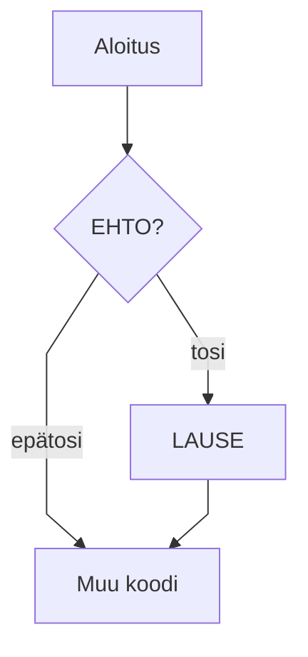

# Hei, Java!

> [!Osaamistavoitteet]
>
> - Java-kielen perusteet
> - Tiedät miten Java-ohjelma käännetään ja ajetaan (komentoriviohjelmat javac, java ja jshell, IDE-säädöt)
> - Tiedät mikä on (J)VM ja miten kääntäminen eroaa tulkkauksesta 
> - Tunnet Java-kielen vastineita yleisimmille I/O-operaatioille (tekstin tulostus, lukeminen konsolilta)

Koodiesimerkki

```java
void main() {
    var feature =  Runtime.version().feature();
    IO.println("Hei, maailma! Tässä on Java " + feature);
}
```

```java,noplayground
public class Kissa {
  private String name; 

  // HIGHLIGHT_GREEN_BEGIN
  public Kissa(String name) {
    this.name = name;
  }
// HIGHLIGHT_GREEN_END

// HIGHLIGHT_RED_BEGIN
  public String getAani() { 
// HIGHLIGHT_RED_END
// HIGHLIGHT_YELLOW_BEGIN
    return "Miau!";
// HIGHLIGHT_YELLOW_END
  } 
}
```

```java
//-void main() {
//-   IO.println("summa(2, 2) => " + summa(2, 2));
//-}
//-
/**
 * Laskee kahden kokonaisluvun summan.
 * 
 * @param a Ensimmäinen luku
 * @param b Toinen luku
 * @return Lukujen summa
 */
int summa(int a , int b) {
    return a + b;
}
```

## Monen tiedoston koodialueet

Ensimmäinen alue

```java
// FILE: Henkilo.java
public class Henkilo {
    private String name;

    public Henkilo() {
        name = "Denis";
    }

    public String getTervehdys() {
        return "Moi, " + name + "!";
    }
}
// FILE_END

// FILE: Opiskelija.java
public class Opiskelija extends Henkilo {
    public Opiskelija() {
        super();
    }

    public String getTervehdys() {
        return super.getTervehdys() + " Olen opiskelija!";
    }
}
// FILE_END

// FILE: main.java
public class Ohjelma {
    public static void main() {
        Henkilo h = new Henkilo();
        IO.println(h.getTervehdys());

        Opiskelija o = new Opiskelija();
        IO.println(o.getTervehdys());
    }
}
// FILE_END
```

Tällä hetkellä `main.java`:n pitää sisältää pääohjelman johtuen palvelinpuolen ajoympäristön takia. Tosin tuo voitaisiin muokata niin, että pääohjelman tiedostonimi pääteltäisiin automaattisesti.

Toinen koodialue testiksi, että kummatkin alueet ovat erillisiä toisistaan:

```java
// FILE: main.java
public class Ohjelma {
    public static void main() {
        Kissa k = new Kissa("Snowball");
        IO.println(k.getAani());
    }
}
// FILE_END

// FILE: Kissa.java
public class Kissa {
    private String name;

    public Kissa(String name) {
        this.name = name;
    }

    public String getAani() {
        return "Miau!";
    }
}
// FILE_END
```

## Muokattavat koodilohkot

Harjoittele tekemällä ja tulostamalla erityyppisiä muuttujia (tämä on editoitava koodausalue):

```java,editable
void main() {
    int luku = 1;
    double liukuluku = 1.0;

    IO.println("luku = " + luku);
    IO.println("liukuluku = " + liukuluku);
}
```

Taulukko

| Avainsana | Selitys                           |
| --------- | --------------------------------- |
| public    | näkyvyysmodifikaattori — julkinen |
| static    | staattinen wew kuuluu luokalle    |
| void      | ei palauta arvoa                  |


Huomautus

> [!NOTE]
> Huomautus!

Toinen

> [!HUOMAUTUS]
> Huom!

> [!VINKKI]
> Tässä voit tehdä myös näin:
> 
> ```java
> void main() {
>    IO.readln("Lue rivi >");
> }
> ```


> [!ESIMERKKI]
>
> Tämä on esimerkkilohko

> [!VAROITUS]
>
> Tämä on esimerkkilohko

> [!VARO]
>
> Tämä on esimerkkilohko

Mermaid-tuki



Testi!

Matikkaa: $$ \nabla f(x) \in \mathbb{R}^n, $$

Lisää matikkaa: $O(n)$

<task>
  <task-title>Tehtävä: Tulosta luvut 1-10 <points>1 p.</points> </task-title>
  <handout>

  {{#include ../exercises/1-1-esimerkki/handout.md}}

```plantuml
skinparam dpi 200
skinparam backgroundColor transparent
@startuml
  hide circles
  skinparam shadowing false
  skinparam shadowing false
  skinparam class {
      AttributeIconSize 0
      BackgroundColor AliceBlue
      ArrowColor Black
      BorderColor Black
  }
  hide members

  class Eläin {
      {abstract} + ääntele() : void
  }

  Koira --|> Eläin
  Kissa --|> Eläin
  Lammas --|> Eläin
  class Koira {
    + ääntele() : void
  }
  class Kissa {
    + ääntele() : void
  }
  class Lammas {
    + ääntele() : void
  }
@enduml
```

  </handout>
  <task-link><a href="https://tim.jyu.fi/view/kurssit/tie/tiep111/tehtavat/esimerkki">Tee tehtävä TIMissa</a></task-link>
</task>

