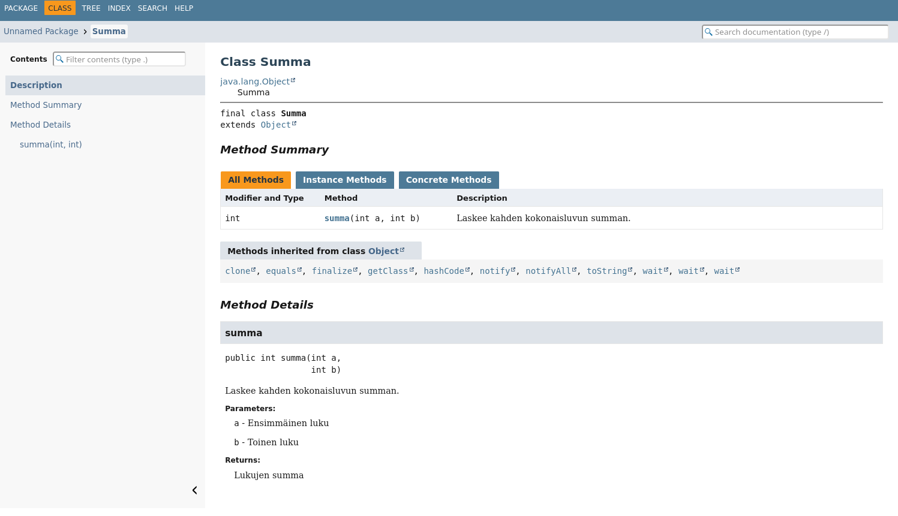

# Hei, Java!

> [!Osaamistavoitteet]
>
> - Java-kielen perusteet
> - Tiedät miten Java-ohjelma käännetään ja ajetaan (komentoriviohjelmat javac, java ja jshell, IDE-säädöt)
> - Tiedät mikä on (J)VM ja miten kääntäminen eroaa tulkkauksesta 
> - Tunnet Java-kielen vastineita yleisimmille I/O-operaatioille (tekstin tulostus, lukeminen konsolilta)

Ohjelmointi 2 -kurssilla käytämme Java-ohjelmointikieltä. Java on
yleiskäyttöinen olio-ohjelmointia tukeva kieli, joka on tarkoitettu alustasta
riippumattomien ohjelmien kirjoittamiseen. Java on suosittujen
ohjelmointikielten kärkilistoilla (ks. esim. 
[TIOBE index](https://www.tiobe.com/tiobe-index/), 
[StackOverflow 2025 developer survey](https://survey.stackoverflow.co/2025/technology), 
[suosituimmat kielet GitHub-palvelussa](https://madnight.github.io/githut)). 
Javan syntaksi on hyvin samankaltainen 
[Ohjelmointi 1 -kurssilla](https://ohjelmointi1.it.jyu.fi)
käytettyyn C#-kieleen.

## Java-kielen perusteet

Lähdetään liikkeelle perinteisellä 'Hei, maailma' -esimerkillä Javalla:

```java
/* 1 */ void main() {
/* 2 */     IO.println("Hei, maailma!");
/* 3 */ }
```

Käydään läpi ohjelma rivi riviltä:

1. Java-ohjeman suoritus alkaa `main`-nimisestä aliohjelmasta. `void`
   tarkoittaa, että aliohjelma ei palauta mitään arvoja. Koska pääohjelma ei ota
   parametreja, sulut voidaan jättää tyhjäksi. Javassa samalla rivillä
   aloitetaan myös aliohjelman runko aaltosululla`{`.

2. Javassa lause loppuu yleensä puolipisteeseen `;`. Tekstin tulostaminen
   onnistuu `IO.println`-metodilla.

3. Aliohjelman runko lopetetaan aaltosululla `}`.

## Javan koodauskäytänteistä

Kuten eri kielissä on tapana, Javassa on oma joukko vakiintuneita
koodauskäytänteitä. Tutustumme erilaisiin käytänteisiin tämän materiaalin
edetessä. Mainittakoon, että Javan koodauskäytänteet poikkeavat hieman C#-kielen
käytänteistä aliohjelmien nimeämisessä ja aaltosulkujen asettamisessa.

Tässä olennaisimmat Javan koodauskäytänteet, joita on tässä vaiheessa hyvä pitää
mielessä:

- Aliohjelman runkoa aloittava aaltosulku `{` laitetaan yleensä samalle riville
  kuin aliohjelman määrittely. Sama pätee muille rakenteille, jossa käytetään
  aaltosulkuja, kuten `if`-, `for`-, `while` ja `do-while` -rakenteille.

- Aliohjelmien nimeämisessä käytetään camelCasing-tyyliä, eli ensimmäinen
  kirjain on pienellä ja seuraavat sanat aloitetaan isolla kirjaimella.
  Esimerkiksi `tamaOnFunktionNimi`. Samaa tyyliä käytetään myös muuttujien
  nimeämisessä.

- Tiedostot ja myöhemmin kurssilla käytettävät luokat, rajapinnat ja listaukset
  nimitetään PascalCasing-tyylillä, Esimerkiksi `HeiMaailma.java`, `public class
  Opiskelija {...`, `public interface Saadettava {...` tai `public enum
  Viikonpaiva { ...`.


## Opas: Java ohjelmien kääntäminen ja ajaminen

> [!TÄRKEÄÄ]
>
> Tässä osiossa tarvitset opintojakson työkaluja. Käy ensin asentamassa kaikki
> työkalut [Työkaluohjeesta](../tyokalut.md).

Tässä materiaalissa käytämme IntelliJ IDEA -kehitysympäristöä Java-ohjelmien
luomiseen, ajamiseen ja virheenjäljitykseen.

### Luo uusi Java projekti

Luodaan seuraavaksi yksinkertainen Java-projekti IDEAssa.
Projekti on IDEA-kehitysympäristön tapa koostaa lähdekooditiedostoja,
testeja, kirjastoja ja muita lisätiedostoja yhteen kokonaisuuteen.

Tee seuraavasti:

1. Avaa IntelliJ IDEA ja avaa uuden projektin dialogi.

    Jos sinulle avautui *Welcome to IntelliJ IDEA*, valitse
    **New Project**.
    
    Jos sinulle avautui jokin valmis Java-projekti, valitse yläpalkissa 
      **File** <i class="bi bi-chevron-right"></i>
      **New** <i class="bi bi-chevron-right"></i>
      **Project**.
      
      

      Yläpalkin valinnat saattavat olla hampurilaisvalikkopainikkeen (<i class="bi bi-list"></i>) takana.

2. Uuden projektin dialogissa aseta seuraavat tiedot:

    * Valitse vasemmalla puolella olevasta listasta projektityypiksi **Java**.

    * Aseta projektin nimeksi **Name**-kenttään `HelloWorld`. Projektien nimet yleensä
      kirjoitetaan ilman välilyöntejä.

    * Aseta projektin sijainti **Location**-kentässä. Klikkaa kentän oikealla puolella 
      olevaa kansiokuvaketta (<i class="bi bi-folder2"></i>) ja valitse
      projektille sopiva kansio. Valitse sellainen kansio, jonka löydät tulevaisuudessakin
      helposti omalta tietokoneelta.

    * Valitse **Build system**-rivillä **IntelliJ**.  
      Tutustumme muihin projektien rakennusjärjestelmiin myöhemmissä osissa.

    * Varmista, että **JDK**-kentässä on sama JDK-versio kuin minkä olet asentanut [Työkaluohjeissa](../tyokalut.md#java-development-kit-jdk).

    * Laita ruksi **Add sample code** pois päältä. Lisäämme kooditiedoston itse.

    * Laita ruksi **Create Git repository** pois päältä. Emme tarvitse vielä versiohallintaa tässä vaiheessa.

    Yllä olevien muutosten jälkeen tuloksen pitäisi näyttää seuraavalta:

    
    
3. Paina **Create**. Tämän jälkeen IDEA luo uuden projektin valitsemaasi kansioon.

    Käydään pikaisesti läpi IDEAn olennaisimmat osat:

    


    1. **Koodialue**: projektissa olevien tiedostojen sisällöt näkyvät tässä, kun ne avataan.
       Kukin avattu tiedosto avautuu omaan välilehteen.
    2. **Projektiselain**: projektissa olevat kansiot ja tiedostot näkyvät tässä.
       Selaimen kautta voidaan lisätä, poistaa, siirtää tai uudelleennimetä tiedostoja ja kansioita.
    3. **Projektin ajaminen ja debuggaus**: tässä näkyy ajettavan Java-ohjelman nimi,
       ohjelman ajopainike (<i class="bi bi-play-fill"></i>) ja debuggauspainike (<i class="bi bi-bug"></i>).
    4. **Valikot ja näkymät**: IDEAssa on erilaisia näkymiä, jotka ovat oletuksella piilossa.
       Sivupalkin avulla voidaan avata ja piilottaa näkymät tarpeen mukaan. Esimerkiksi
       projektiselaimen voi piilottaa painamalla sivupalkissa olevasta kansiokuvakkeesta (<i class="bi bi-folder2"></i>).

### Luo lähdekooditiedosto

IntelliJ-projektissa kaikki koodi laitetaan `src`-kansioon.
Luodaan seuraavaksi yksinkertainen Java-lähdekooditiedosto, johon
voidaan kirjoittaa koodi.

Tee seuraavasti:

1. Projektiselaimessa klikkaa oikealla hiiren painikkeella `src` kansiosta
   ja valitse **New** <i class="bi bi-chevron-right"></i> **Java Compact File**.

2. Aseta avautuneessa dialogissa lähdekooditiedoston nimeksi `Ohjelma` ja paina <kbd>Enter</kbd>.

<video src="images/intellij-new-java-file.mp4" controls></video>

IDEA luo uuden `Ohjelma.java`-nimisen tiedoston `src`-kansioon. IDEA myös lisää
automaattisesti `main`-aliohjelman määrittelyn lähdekooditiedostoon.

Samalla IDEA avaa lähdekooditiedoston koodialueelle. Voit jatkossa avata
tiedoston myös klikkaamalla se kahdesti projektinäkymästä.

### Kirjoita koodi

Kirjoitetaan seuraavaksi yksinkertainen "Hei, maailma" ohjelma alusta alkaen
juuri luotuun `Ohjelma.java`-tiedostoon.

Tee seuraavasti:

1. Poista kaikki koodi `Ohjelma.java` -tiedostosta.

   IDEA lisää yleensä valmista pohjakoodia uusiin lähdekooditiedostoihin.
   Tätä harjoitusta varten kirjoitamme kuitenkin koodia itse.

2. *Kirjoita* seuraava koodi `Ohjelma.java` -tiedostoon:

    ```java,noplayground
    void main() {
        IO.println("Hei, maailma!");
    }
    ```

    *Vältä kopioimasta koodia*, vaan kirjoita se itse. Kirjoittaminen itse
    usein auttaa muistamaan, mistä eri ohjelmoinnissa käytettävät merkit,
    kuten aaltosulut, kaarisulut ja puolipiste löytyvät.

<details>
<summary>Bonus: IDEAn täydennysominaisuuksien käyttäminen</summary>

IDEA tarjoaa lisäksi erilaisia aikaa säästäviä täydennysominaisuuksia, 
joiden käyttöä on hyvä harjoitella.

Voit kokeilla seuraavia täydennysominaisuuksia:

* `main`-pääohjelman automaattinen lisääminen: Aloita kirjoittamalla `main`.
    Paina sen jälkeen <kbd>Ctrl</kbd>+<kbd>Space</kbd> (macOS: <kbd>⌘</kbd>+<kbd>Space</kbd>).
    Valitse nuolinäppäimillä `main`-pohja ja paina <kbd>Enter</kbd>:

    <video src="images/intellij-main-template.mp4" controls></video>
    
    IDEA sisältää erilaisia valmiita pohjia, jotka nopeuttavat
    koodin kirjoittamista ja helpottavat yleisempien rakenteiden muistamista.
    Näet kaikki koodipohjat painamalla <kbd>Ctrl</kbd>+<kbd>J</kbd>
    (macOS: <kbd>⌘</kbd>+<kbd>J</kbd>).

* `println`-aliohjelman automaattinen täydentäminen: Siirrä kursori 
`main`-pääohjelmaan tyhjälle riville. 

Kirjoita alkuun kirjain `I`, minkä jälkeen IDEA automaattisesti näyttää
kaikki kursorin kohdalle sopivat rakenteet, jotka alkavat kirjaimella I.
Valitse nuolipainikkeilla `IO` ja paina <kbd>Enter</kbd>. Tämä 
täydentää `IO` kursorin kohdalle.

Kirjoita sen jälkeen `.` (piste), minkä jälkeen IDEA automaattisesti näyttää
kaikki `IO`-luokassa olevat aliohjelmat. Siirry listassa nuolipainikkeilla
`println`-aliohjelman kohdalle ja paina <kbd>Enter</kbd>.
Tämä täydentää `printl`-tekstin kursorin kohdalle.

Kirjoita sen jälkeen kaarisulku `(`. IDEA automaattisesti täydentää
lopettavan kaarisulun `)`. Siirry nuolipainikkeilla kaarisulkujen väliin
ja kirjoita `"Hei, maailma!"`. Lopuksi siirry rivin loppuun painamalla <kbd>End</kbd>
tai nuolinäppäimiä käyttäen ja lisää loppuun puolipiste `;`.

<video src="images/intellij-auto-completion.mp4" controls></video>

IDEA osaa automaattisesti siis ehdottaa luokkien ja aliohjelmien nimiä
konteksin perusteella. Voit myös aina erikseen avata automaattisen
täydennyksen painamalla

</details>
        

## Java ohjelmien kääntäminen ja ajaminen
Lähdetäänpä katsomaan mitä "konepellin alla tapahtuu", kun painat aja -näppäintä :

### java
`java` on komento, jolla ajetaan .java päätteisiä tiedostoja. Voit nyt ajaa kääntämäsi tiedoston komentorivillä ajamalla komennon `java Ohjelma.java`. Java 11:sta jälkeen on ollut mahdollista ajaa komennolla `java` javalähdekooditiedostoja ilman, että ensin kääntää lähdekooditiedostoa Java-tavukoodiksi. Sisäisesti JVM siis tarkistaa, että onko lähdetiedosto(i)sta olemassa käännöksiä, jos ei, kääntää ja sen jälkeen ajaa saadut tavukooditiedostot.

<details closed><summary>Extra: javac </summary>
Java on <i>käännettävä</i> ohjelmointikieli, joten lähdekoodi tulee kääntää, jotta se voidaan ajaa.

Jotta tämä prosessi olisi mahdollista, täytyy tietokoneelle asentaa Java-kehitysympäristö, joka tunnetaan nimellä <i>Java Development Kit</i> (JDK). 
Kokeillaan seuraavaksi ohjelmamme kääntämistä JDK:n sisältämällä <code>javac</code> -kääntäjäohjelmalla.

Avaa komentorivi ja siirry siihen kansioon, johon tallensit <code>Hei.java</code>-ohjelman. Kirjoita komento <code>javac Hei.java</code>.

Kääntämisen seurauksena syntyy niin sanottua *tavukoodia* sisältävä tiedosto <code>Hei.class</code>. 
Tavukoodi ei ole suoraan prosessorilla ajettava ohjelma, vaan eräänlainen välivaihe. 
Java 11:sta mukana tuli mahdollisuus kirjoittaa Javaohjelmia ilman luokkaa, niinkuin yllä olevassa esimerkissä. javac komennon jälkeen huomataan kuitenkin, että ohjelma kääritään käännettäessä silti luokkaan. Mahdollisuus tuotiin Javaan, jotta yhden tiedoston lähdekoodiohjelmat olisivat helpompia kirjoittaa.

Isommissa Java-ohjelmissa käytetään usein myös erillisiä hallintatyökaluja, kuten
Gradle tai Maven. Näihin tutustutaan osassa 6 (TODO: Linkki?).

</details>

### jshell
jshell on interaktiivinen tulkki Javaohjelmoinnin opetteluun. Interaktiivisuus tarkoittaa, että voit kokeilla eri komentoja rivi/lohko kerrallaan ilman erillistä kääntämistä ja ajamista, luokkia tai `main`-metodia. Pääset kokeilemaan jshelliä ajamalla komennon `jshell`. Nyt voit esimerkiksi kirjoittaa komennon `IO.println("Hei maailma!");` ja painaa `Enter`, jolloin näet heti tulostuksen komentorivillä. Vastaavasti voit luoda muuttujia ja näet heti, mitä niihin on sijoitettu.

jshellistä poistutaan ajamalla komento `/exit`

## (J)VM
JVM tulee sanoista **J**ava **V**irtual **M**achine joka on spesifikaatio teoreettisesta tietokoneesta. Tämän spesifikaation toteutuksella voidaan ajaa Java-tavukoodia. Hyöty on siinä, että ohjelma joka on käännetty Java-tavukoodiksi voidaan nyt ajaa alustariippumattomasti (Windows, macOS, Linux, jne.), kunhan toteutus pyörii kyseisellä alustalla. Javalla onkin iskulause: "Write Once, Run Anywhere", jolla viitataan tähän periaatteeseen.

Käytetyin JVM:n spesifikaation toteutus on nimeltään HotSpot, joka sisältää sekä tulkin, että JIT (**J**ust **I**n **T**ime) kääntäjän. Tulkki käynnistää ohjelman ja JVM etsii koodista toistuvia pätkiä, jotka käännetään kyseisen alustan konekieliseksi koodiksi JIT kääntäjällä, jotta ohjelma pyörisi nopeammin. Alustakohtainen käännetty konekieli on aina nopeampi ajaa kuin tulkattava kieli. Javan tyyli käyttää sekä tulkkausta, että kääntämistä on kompromissi alustariippumattomuuden ja suoritusnopeuden välillä.

## Java I/O operaatioita
Javan IO-luokalla voidaan käyttäjältä lukea syötettä näin:

```java
void main() {
    String syote = IO.readln();
    IO.println("Kirjoitit: " + syote);
}
```

Yllä opittiinkin jo kirjoittamaan konsoliin rivinvaihdollisesti. IO-luokasta löytyy myös perinteinen `print`, joka kirjoittaa standardiin ulostuloon tekstiä ilman rivinvaihtoa. Esimerkiksi:

```java
void main() {
    IO.print("Samalle");
    IO.print(" riville");
}
```

## Kommentointi ja dokumentointi

Lähdekoodiin voi kirjoittaa tekstiä, joka ei ole varsinaista koodia, vaan selittää sitä. Tällaista selitystekstiä on kahdentyyppisiä: (1) koodin sekaan kirjoitettavia kommentteja (nimitetään näitä lyhyesti *kommenteiksi*) sekä (2) dokumentaatiokommentteja. 

Kommenttien tarkoitus on palvella *kehityksen aikaista* tekemistä. Ne näkyvät sisäisesti, eli ohjelmoijalle itselleen.  Dokumentaatiokommenttien tarkoitus on palvella kaikkia, jotka *käyttävät* koodia. Ne näkyvät paitsi ohjelmoijalle itselleen, myös niille, jotka hyödyntävät koodia esimerkiksi API:n (*application programming interface*) kautta.

### Yhden rivin kommentointi
Yhden rivin kommentteja, jonka syntaksi on `//` voidaan käyttää esimerkiksi merkitsemään TODO-kohtia koodissa:

```java
void main() {
    // TODO: Tarkista millaisia ongelmia tästä ratkaisusta voi tulla
    String syote = IO.readln();
    IO.println("Kirjoitit: " + syote);
}
```

Yleisesti hyvä periaate on se, että ohjelmoija pyrkii kirjoittamaan koodia, joka selittää itse itseään. Tällöin asiat, jotka voidaan nimetä (kuten muuttujat, luokat, funktiot), pyritään nimeämään mahdollisimman kuvaavasti, jolloin yksittäisten rivien kommentointi ei välttämättä ole tarpeen. Joskus tältä ei voi välttyä, koska jotakin operaatiota ei voida olettaa itsestäänselväksi tai muuttujan nimestä tulisi kohtuuttoman pitkä:

```java,editable
void main() {
    int n = 9;
    // Pyöristää alaspäin lähimpään neljällä jaolliseen lukuun
    int pyoristetty = n & ~3; 
    IO.println(pyoristetty);
}
```
Nyt muuttujan `pyoristetty` tilalla voisi olla `pyoristaaAlaspainLahimpaanNeljallaJaolliseenLukuun`, joka ei sekään ole oikein järkevä vaihtoehto.

### Monirivinen kommentti

Javassa monirivinen kommentti tulee `/*` ja  `*/` väliin. Tällaista suositellaan käytettäväksi, kun jokin monimutkaisempi logiikka vaatii tarkempaa avaamista ja/tai on järkevää selittää miksi juuri kyseinen ratkaisu on valittu. Tätä kommenteissa olevaa tarkempaa avaamista ei kuitenkaan ole tarkoitus näyttää koodin käyttäjille.

```java.ignore
if (kayttaja.kayttaaVanhaa) {
    /* 
     * Vanhat käyttäjät (rekisteröityneet ennen vuotta 2022) käyttävät 
     * toistaiseksi vanhaa käyttöoikeusmallia.
     * Älä poista tarkistusta, ennen kuin kaikki tilit on siirretty.
     */
    return kaytaVanhojaKayttooikeuksia(kayttaja);
}
```

### Dokumentaatiokommentti

> [!Huomautus]
> Dokumentaatiokommentit alkavat `/**` ja päättyvät `*/`, eli ovat syntaksiltaan hyvin lähellä monirivistä kommenttia.

```java
/**
 * Laskee kahden kokonaisluvun summan.
 * 
 * @param a Ensimmäinen luku
 * @param b Toinen luku
 * @return Lukujen summa
 */
public int summa(int a , int b) {
    return a + b;
}
```

Aliohjelman dokumentaatiokommentin runko syntyy automaattisesti sovelluskehittimessä, kun aliohjelman esittelyrivin yläpuolelle kirjoittaa merkit `/**` ja painaa `Enter`. 

<details closed><summary>Extra: miltä Javan dokumentaatio näyttää? </summary>
Oletetaan nyt, että tallennat ylläolevan tiedostoon <code>Summa.java</code> ja ajat sen jälkeen komennon <code>javadoc Summa.java</code>. Nyt voit avata luodun <code>index.html</code> -tiedoston selaimessa, klikata selaimessa luokkaa <code>Summa</code> ja pääset seuraavanlaiseen näkymään:



Näyttääkö tutulta? Vertaa esimerkiksi [Javan dokumentaatioon IO-luokasta](https://docs.oracle.com/javase/8/docs/api/java/lang/Object.html)
</details>