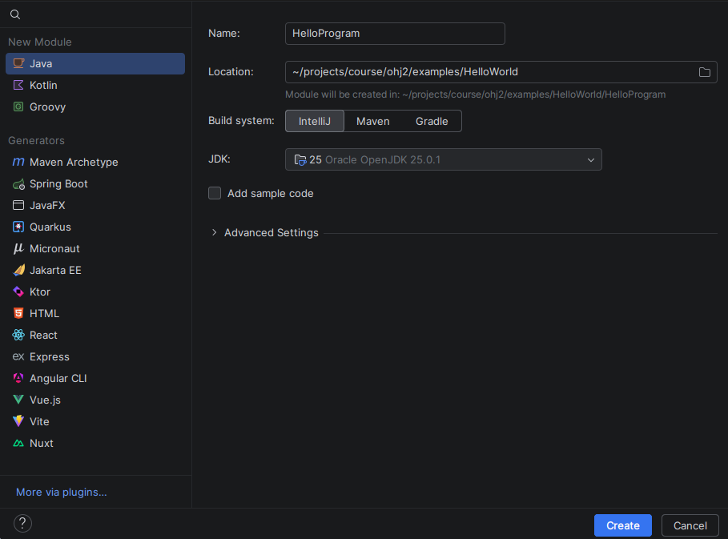
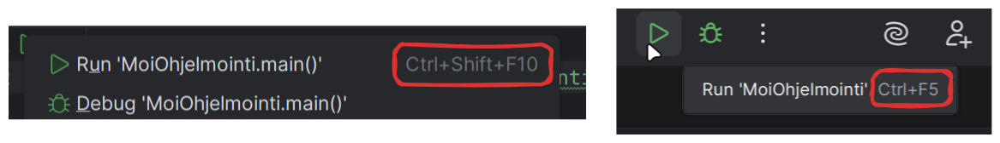

# Hei, Java!

> [!VAROITUS]
> Tämä osio julkaistaan 12. tammikuuta 2026.
> {{#include ../ei-julkaistu.md}}

> [!Osaamistavoitteet]
>
> - Tutustut Java-kielen perusteisiin
> - Tiedät, miten Java-ohjelma käännetään ja ajetaan
> - Tiedät, mikä on (J)VM ja miten kääntäminen eroaa tulkkauksesta
> - Tunnet Java-kielen vastineita yleisimmille I/O-operaatioille

Ohjelmointi 2 -kurssilla käytämme Java-ohjelmointikieltä. Java on
yleiskäyttöinen olio-ohjelmointia tukeva kieli, joka on tarkoitettu alustasta
riippumattomien ohjelmien kirjoittamiseen. Java on suosittujen
ohjelmointikielten kärkilistoilla (ks. esim. 
[TIOBE index](https://www.tiobe.com/tiobe-index/), 
[StackOverflow 2025 developer survey](https://survey.stackoverflow.co/2025/technology), 
[suosituimmat kielet GitHub-palvelussa](https://madnight.github.io/githut)). 
Javan syntaksi muistuttaa paljon 
[Ohjelmointi 1 -kurssilla](https://ohjelmointi1.it.jyu.fi)
käytettyä C#-kieltä.

## Java-kielen perusteet

Lähdetään liikkeelle perinteisellä 'Hei, maailma' -esimerkillä Javalla:

```java
/* 1 */ void main() {
/* 2 */     IO.println("Hei, maailma!");
/* 3 */ }
```

Käydään läpi ohjelma rivi riviltä:

1. Java-ohjelman suoritus alkaa `main`-nimisestä aliohjelmasta. `void`
   tarkoittaa, että aliohjelma ei palauta mitään arvoja. Koska pääohjelma ei ota
   parametreja, `main`-sanan perässä olevat kaarisulkeet voidaan jättää
   tyhjäksi. Aliohjelman runko alkaa avaavalla aaltosululla `{`.

2. Tekstin tulostaminen komentorivi-ikkunaan onnistuu `IO.println`-metodilla.
   Javassa lause loppuu yleensä puolipisteeseen `;`, kuten tässäkin.  

3. Aliohjelman runko lopetetaan aaltosululla `}`. Ohjelman suoritus päättyy
   automaattisesti, kun `main`-aliohjelma on suoritettu loppuun.

Vaikka ohjelma on hyvin yksinkertainen, se on silti aivan toimiva Java-ohjelma.
Opintojakson aikana teemme paljon juuri komentorivi-ikkunaan kirjoittavia ja
sieltä lukevia ohjelmia. Opintojakson loppupuoliskolla painopiste siirtyy
graafisten käyttöliittymien parissa työskentelyyn. 

## Javan koodauskäytänteistä

Monesti ohjelmointikielessä on joukko kyseiseen kieleen vakiintuneita
koodauskäytänteitä. Näin on myös Javassa. Tutustumme erilaisiin käytänteisiin tämän materiaalin
edetessä. Mainittakoon, että Javan koodauskäytänteet poikkeavat hieman C#-kielen
käytänteistä muun muassa nimeämisessä ja koodin muotoilussa.

Tässä olennaisimmat Javan koodauskäytänteet, joita on tässä vaiheessa hyvä pitää
mielessä:

 - Aliohjelman runkoa aloittava aaltosulku `{` laitetaan yleensä samalle riville
  kuin aliohjelman määrittely. Sama pätee muihin rakenteisiin, joissa käytetään
  aaltosulkuja, kuten `if`-, `for`-, `while`- ja `do-while`-rakenteille.

 - Muuttujien ja aliohjelmien nimeämisessä käytetään camelCasing-tyyliä, eli ensimmäinen
  kirjain on pienaakkonen ja seuraavat sanat aloitetaan suuraakkosella.
  Esimerkiksi `tamaOnFunktionNimi`. 

 - Tiedostojen ja luokkien nimeämisessä käytetään PascalCasing-tyyliä, eli
  ensimmäinen kirjain on suuraakkonen ja seuraavat sanat aloitetaan isolla
  kirjaimella: `HeiMaailma.java`, `public class Opiskelija`, jne. Samoin monissa
  muissa myöhemmin opittavissa rakenteissa, kuten rajapinnoissa ja
  enumeraatioissa käytetään PascalCasing-tyyliä. 
  
## Opas: Java-ohjelmien kääntäminen ja ajaminen

> [!TÄRKEÄÄ]
>
> Tässä osiossa tarvitset opintojakson työkaluja. Käy ensin asentamassa kaikki
> työkalut [Työkaluohjeesta](../tyokalut.md).

Vaikka monet yllä olevan tapaiset pienet ohjelmat voidaan periaatteessa tehdä
nettiselaimessa, on ohjelmia kehittäessä varsin käytännöllistä käyttää erillistä kehitysympäristöä. 
Tässä materiaalissa käytämme IntelliJ IDEA -kehitysympäristöä Java-ohjelmien
luomiseen, ajamiseen ja virheenjäljitykseen. 

### Luo uusi projekti

Luodaan seuraavaksi yksinkertainen projekti IDEAssa. Projekti on
IDEA-kehitysympäristön tapa koostaa lähdekooditiedostoja, testejä, kirjastoja ja
muita lisätiedostoja yhteen kokonaisuuteen.

Tee seuraavasti:

1. Avaa IntelliJ IDEA ja avaa uuden projektin dialogi.

    Jos sinulle avautui *Welcome to IntelliJ IDEA*, valitse
    **New Project**.
    
    Jos sinulle avautui jokin valmis Java-projekti, valitse yläpalkissa 
      **File** <i class="bi bi-chevron-right"></i>
      **New** <i class="bi bi-chevron-right"></i>
      **Project**.
      
      

      Yläpalkin valinnat saattavat olla hampurilaisvalikkopainikkeen (<i class="bi bi-list"></i>) takana.

2. Uuden projektin dialogissa aseta seuraavat tiedot:

    * Valitse vasemmalla puolella olevasta listasta projektityypiksi **Empty Project**.

    * Aseta projektin nimeksi **Name**-kenttään `HelloWorld`. Projektien nimet
      kirjoitetaan yleensä ilman välilyöntejä.

    * Aseta projektin sijainti **Location**-kenttään. Klikkaa kentän oikealla puolella 
      olevaa kansiokuvaketta (<i class="bi bi-folder2"></i>) ja valitse
      projektille sopiva kansio. Valitse sellainen kansio, jonka löydät tulevaisuudessakin
      helposti omalta tietokoneelta.

    * Laita ruksi **Create Git repository** pois päältä. Emme tarvitse
      versiohallintaa vielä tässä vaiheessa.

    Yllä olevien valintojen jälkeen tuloksen pitäisi näyttää seuraavalta
    (Location-kenttä voi olla erilainen riippuen käyttöjärjestelmästäsi):

    
    
3. Paina **Create**. Tämän jälkeen IDEA luo uuden projektin valitsemaasi kansioon.

    Käydään pikaisesti läpi IDEAn olennaisimmat osat:

    


    1. **Koodialue**: projektissa olevien tiedostojen sisällöt näkyvät tässä, kun ne avataan.
       Kukin avattu tiedosto avautuu omaan välilehteen.
    2. **Projektiselain**: projektissa olevat kansiot ja tiedostot näkyvät tässä.
       Selaimen kautta voidaan lisätä, poistaa, siirtää tai uudelleennimetä tiedostoja ja kansioita.
    3. **Projektin ajaminen ja debuggaus**: tässä näkyy ajettavan Java-ohjelman nimi,
       ohjelman ajopainike (<i class="bi bi-play-fill"></i>) ja debuggauspainike (<i class="bi bi-bug"></i>).
    4. **Valikot ja näkymät**: IDEAssa on erilaisia näkymiä, jotka ovat oletuksella piilossa.
       Sivupalkin avulla voidaan avata ja piilottaa näkymät tarpeen mukaan. Esimerkiksi
       projektiselaimen voi piilottaa painamalla sivupalkissa olevasta kansiokuvakkeesta (<i class="bi bi-folder2"></i>).

### Luo Java-moduuli

Oletuksella uusi projekti on tyhjä. IDEA:ssa ohjelmakoodi kirjoitetaan
*moduuleihin* (engl. module). Samaan projektiin voi lisätä useita
moduuleita, joita voi kehittää ja ajaa erikseen.
Esimerkiksi, voit näin tehdä yhden projektin tietyn viikon tehtäville
(esim. `Viikko1` tai `Viikon1Tehtavat`) ja lisätä
kunkin tehtävän omana moduulina.

Luodaan seuraavaksi alimoduuli nimeltään `HelloProgram`, lisätään
siihen uusi ohjelma ja kokeillaan ajaa se.

Tee seuraavasti:

1. Klikkaa hiiren toissijaisella painikkeella projektin nimeä projektinäkymässä (`HelloWorld`)
   ja valitse **New** <i class="bi bi-chevron-right"></i> **Module**.

2. Avautuvassa **New Module** -dialogissa aseta seuraavat tiedot:

    * Valitse vasemmalla puolella olevasta listasta projektityypiksi **Java**.

    * Aseta projektin nimeksi **Name**-kenttään `HelloProgram`. Projektien nimet
      kirjoitetaan yleensä ilman välilyöntejä.

    * Jätä **Location**-kenttä sellaisenaan. IDEA automaattisesti valitsee
      moduulille oikean sijainnin.

    * Valitse **Build system**-rivillä **IntelliJ**. 
      Tutustumme muihin projektien rakennusjärjestelmiin myöhemmissä osissa.

    * Varmista, että **JDK**-kentässä on sama JDK-versio kuin minkä olet asentanut [Työkaluohjeissa](../tyokalut.md#java-development-kit-jdk).

    * Laita ruksi **Add sample code** pois päältä. Lisäämme kooditiedoston itse.

   Yllä olevien valintojen jälkeen tuloksen pitäisi näyttää seuraavalta
    (Location-kenttä voi olla erilainen riippuen käyttöjärjestelmästäsi):

    


   Paina lopuksi **Create**. Tämä luo uuden `HelloProgram`-kansion, joka
   sisältää `src`-kansion.

   <video src="images/intellij-module-create.mp4" controls></video>

### Luo lähdekooditiedosto

IntelliJ-projektissa moduuliin kuuluva koodi laitetaan `src`-kansioon.
Jos projektissa on useampi moduuli, jokaisella moduulilla on oma `src`-kansio.

Luodaan seuraavaksi yksinkertainen Java-lähdekooditiedosto, johon
voidaan kirjoittaa koodi. 

1. Klikkaa projektiselaimessa olevaa 
   `HelloProgram`-moduulin alasvetopainiketta. Sen jälkeen
   klikkaa toissijaisella hiiren painikkeella 
   `src`-kansiosta ja valitse **New** <i class="bi bi-chevron-right"></i> **Java
   Compact File**.

1. Anna lähdekooditiedoston nimeksi `Ohjelma` ja paina <kbd>Enter</kbd>.

<video src="images/intellij-new-java-file.mp4" controls></video>

IDEA luo uuden `Ohjelma.java`-nimisen tiedoston `src`-kansioon. IDEA myös lisää
automaattisesti `main`-aliohjelman määrittelyn lähdekooditiedostoon. Samalla
IDEA avaa lähdekooditiedoston koodialueelle. Voit jatkossa avata tiedoston myös
tuplaklikkaamalla sitä.

### Kirjoita ohjelma

Kirjoitetaan seuraavaksi yksinkertainen "Hei, maailma"-ohjelma alusta alkaen
juuri luotuun `Ohjelma.java`-tiedostoon.

Tee seuraavasti:

1. Poista kaikki koodi `Ohjelma.java`-tiedostosta.

   IDEA lisää yleensä valmista pohjakoodia uusiin lähdekooditiedostoihin.
   Tätä harjoitusta varten kirjoitamme kuitenkin koodia itse.

2. *Kirjoita* seuraava koodi `Ohjelma.java` -tiedostoon:

    ```java,noplayground
    void main() {
        IO.println("Hei, maailma!");
    }
    ```

    *Vältä kopioimasta koodia*, vaan kirjoita se itse. Kirjoittaminen itse
    usein auttaa muistamaan, mistä eri ohjelmoinnissa käytettävät merkit,
    kuten aaltosulut, kaarisulut ja puolipiste löytyvät.

<details closed>
<summary><i class="bi bi-stars jyu-gold"></i> Bonus: IDEAn täydennysominaisuuksien käyttäminen</summary>

IDEA tarjoaa erilaisia aikaa säästäviä täydennysominaisuuksia, joiden käyttöä on
hyvä harjoitella.

Kokeile ainakin seuraavia ominaisuuksia.

* `main`-pääohjelman automaattinen lisääminen: Aloita kirjoittamalla `main`.
    Paina sen jälkeen <kbd>Ctrl</kbd>+<kbd>Space</kbd> (macOS: <kbd>⌘</kbd>+<kbd>Space</kbd>).
    Valitse nuolinäppäimillä `main`-pohja ja paina <kbd>Enter</kbd>:

    <video src="images/intellij-main-template.mp4" controls></video>
    
    IDEA sisältää erilaisia valmiita pohjia, jotka nopeuttavat
    koodin kirjoittamista ja helpottavat yleisempien rakenteiden muistamista.
    Näet kaikki koodipohjat painamalla <kbd>Ctrl</kbd>+<kbd>J</kbd>
    (macOS: <kbd>⌘</kbd>+<kbd>J</kbd>).

* `println`-aliohjelman automaattinen täydentäminen: Siirrä kursori 
`main`-pääohjelmaan tyhjälle riville. 

Kirjoita alkuun kirjain `I`, minkä jälkeen IDEA automaattisesti näyttää
kaikki kursorin kohdalle sopivat rakenteet, jotka alkavat kirjaimella I.
Valitse nuolipainikkeilla `IO` ja paina <kbd>Enter</kbd>. Tämä 
täydentää `IO` kursorin kohdalle.

Kirjoita sen jälkeen `.` (piste), minkä jälkeen IDEA automaattisesti näyttää
kaikki `IO`-luokassa olevat aliohjelmat. Siirry listassa nuolipainikkeilla
`println`-aliohjelman kohdalle ja paina <kbd>Enter</kbd>.
Tämä täydentää `println`-tekstin kursorin kohdalle.

Kirjoita sen jälkeen kaarisulku `(`. IDEA automaattisesti täydentää
lopettavan kaarisulun `)`. Siirry nuolipainikkeilla kaarisulkujen väliin
ja kirjoita `"Hei, maailma!"`. Lopuksi siirry rivin loppuun painamalla <kbd>End</kbd>
tai nuolinäppäimiä käyttäen ja lisää loppuun puolipiste `;`.

<video src="images/intellij-auto-completion.mp4" controls></video>

IDEA osaa automaattisesti siis ehdottaa luokkien ja aliohjelmien nimiä
kontekstin perusteella. Voit myös aina erikseen avata automaattisen
täydennyksen painamalla

</details>
        
### Ohjelman ajaminen

Kooditiedostoja, jotka sisältävät `main`-aliohjelman, voidaan suorittaa.
Suorittaminen onnistuu ajopainikkeella (<i class="bi bi-play-fill"></i>), joka
sijaitsee `main`-aliohjelman vieressä sekä IDEA:n yläpalkissa.

Tee seuraavasti:

1. Klikkaa `main`-aliohjelman vasemmalla puolella olevaa ajopainiketta (<i
   class="bi bi-play-fill"></i>).

   IDEA ensin kääntää ohjelmasi. Kun ohjelma on käännetty, IDEA ajaa ohjelmasi,
   ja editorin alapuolelle avautuu **Run**-ikkuna, jossa näkyy tekstiä.
   Ensimmäinen rivi on se komento, jota IDEA käytti käännetyn tiedoston
   ajamiseksi. Seuraavalla rivillä on oman ohjelmamme tuottama tuloste `Hei,
   maailma!`. Viimeinen rivi kertoo, että ohjelman suoritus päättyi ilman
   virheitä.

   <video src="images/intellij-run-gutter.mp4" controls></video>

2. Kokeile vielä ohjelman ajamista luodulla ajokonfiguraatiolla.

   Kun ajat kooditiedoston ensimmäistä kertaa, IDEA luo *ajokonfiguraation*.
   Ajokonfiguraatio on pieni tiedosto, johon tallentuu koodin suorittamiseen
   liittyviä asetuksia, kuten käytettävä JDK-versio, mahdolliset
   komentoriviparametrit ja työhakemisto. Oletusarvoisesti tämä tiedosto syntyy
   projektin juurikansioon `.idea` <i class="bi bi-chevron-right"></i>
   `workspace.xml`. 

   Kun ajokonfiguraatio on luotu ensimmäisen ajon jälkeen, voit jatkossa ajaa
   koodin aina IDEA:n yläpalkissa olevalla ajopainikkeella. Tällä tavoin voit
   helposti ajaa ohjelmia ilman, että kooditiedostoa tarvitsee erikseen avata.

   IDEAn yläpalkissa pitäisi nyt näkyä `Ohjelma`-ajokonfiguraation nimi,
   jonka vieressä on ajopainike (<i class="bi bi-play-fill"></i>).
   Kokeile sulkea `Ohjelma.java` ja suorittaa ohjelma yläpalkin kautta.

   <video src="images/intellij-run-config.mp4" controls></video>

   Ajokonfiguraatioiden avulla voit ajaa eri moduuleissa kirjoitettuja ohjelmia. Myöhemmin materiaalissa
   tutustumme lisäksi Gradle-hallintatyökaluun, jonka avulla teemme muun muassa
   erillisiä ajokonfiguraatioita projektin ajamiselle, testaamiselle ja
   kääntämiselle.

> [!VINKKI]
>
> **Tutustu yleisimpiin pikanäppäinkomentoihin**
>
> Näppäinkomennot nopeuttavat kehitysympäristön käyttöä, ja pienellä
> harjoittelulla ohjelmointi voi sujua kokonaan hiirtä käyttämättä.
> Näppäinkomennot riippuvat käyttöjärjestelmästä ja valituista näppäinasetuksista.
> IDEA kuitenkin näyttää näppäinkomennot valikoissa sekä vihjeteksteissä,
> mikä helpottaa komentojen oppimista.
>
> 
>
> Voit myös muokata näppäinkomentoja asetuksista kohdassa **File** <i class="bi
> bi-chevron-right"></i> **Settings** <i class="bi bi-chevron-right"></i>
> **Keymap**. Voit myös ladata muiden kehitysympäristöjen, kuten Visual Studio
> Coden, näppäinasetuksia laajennoskaupasta kohdassa **File** <i class="bi
> bi-chevron-right"></i> **Plugins**.

## Miten Java-ohjelmat ajetaan?

Ennen kuin IDEA varsinaisesti ajaa ohjelman, se käännetään ajettavaan muotoon.
Tutkitaan seuraavaksi, mitä tämä käytännössä tarkoittaa kääntämällä ja ajamalla
ohjelma suoraan komentoriviltä.

<details closed><summary>Miten voin seurata mukana?</summary>

Tee alkuun yksinkertainen ohjelma [yllä olevan oppaan](#opas-java-ohjelmien-kääntäminen-ja-ajaminen)
mukaisesti.

Sen jälkeen avaa IDEA:n vasemmasta näkymäpalkista komentorivi painamalla
komentorivipainikkeesta (<i class="bi bi-terminal"></i>). Tämä avaa
käyttöjärjestelmän komentorivin (zsh macOS:lla, Powershell Windowsilla,
oletuskomentorivi Linuxilla).

Jos latasit Java-kehitysympäristön seuraamalla [työkaluohjeita](../tyokalut.md#java-development-kit-jdk),
komentorivi ei löydä mitään Javan kääntämiseen tarkoitettuja työkaluja.
Ota työkalut käyttöön kopioimalla ja liittämällä alla oleva komento:

#### [Windows](#tab/win)

```bash
Get-ChildItem -Path "$env:USERPROFILE\.jdks" -Directory | Sort-Object Name -Descending | Select-Object -First 1 | ForEach-Object { $env:JAVA_HOME = $_.FullName; $env:PATH = "$_.FullName\bin;$env:PATH" }
```

***

#### [macOS](#tab/macos)

```bash
export JAVA_HOME=$(/usr/libexec/java_home) && export PATH="$JAVA_HOME/bin:$PATH"
```

***

### [Linux](#tab/linux)

```bash
export JAVA_HOME=$(printf "%s\n" ~/.jdks/* | sort -V | tail -n 1) && export PATH="$JAVA_HOME/bin:$PATH"
```

***

### [Valitse](#tab/default)

Valitse käyttöjärjestelmäsi yllä olevista vaihtoehdoista.

***

</details>

Avataan nyt komentorivi ja siirrytään alkuun projektikansioon.
Tarkastellaan vielä, mitä tiedostoja projektista löytyy:

<asciinema src="images/rec_ls_files.cast" rows="3" poster="npt:3"></asciinema>

Koska käytössämme on IntelliJ-projekti, sieltä löytyy vain muutama olennainen tiedosto ja kansio:

- `HelloWorld.iml` on projektin asetustiedosto, jolla IDEA tunnistaa kansion olevan Java-projekti
- `HelloProgram` on lähdekoodikansio, jossa kaikki lähdekooditiedostot sijaitsevat
- `out` on kansio, joka sisältää käännetyt ohjelmat

Siirrytään nyt kansioon `HelloProgram` ja tarkastellaan sen sisältö:

<asciinema src="images/rec_cd_module.cast" rows="4" poster="npt:10"></asciinema>

Yksittäisestä moduulista löytyvät vastaavasti seuraavat tiedostot ja kansiot:

- `HelloProgram.iml` on moduulin asetustiedosto, jolla IDEA tunnistaa kansion olevan Java-moduuli
- `src` on lähdekoodikansio, joka sisältää ohjelman lähdekoodin

Siirrytään vastaavasti kansioon `src` ja tarkastellaan sen sisältö:

<asciinema src="images/rec_cd_project.cast" rows="4" poster="npt:5"></asciinema>

`.java`-tiedostopäätettä käytettävät tiedostot ovat Javan
*lähdekooditiedostoja*. Ne sisältävät ohjelman lähdekoodia tekstinä eivätkä ne
ole vielä suoraan ajettavissa.

Jotta ohjelma voidaan ajaa, se pitää kääntää. IDEA tekee tämän automaattisesti
kun käynnistämme tekemämme ohjelman, mutta Java-lähdekoodin kääntäminen onnistuu
myös komentoriviltä käyttäen Java-kehitysympäristön mukana tullutta
`javac`-kääntäjäohjelmaa. Kokeillaan kääntää `Ohjelma.java`:

<asciinema src="images/rec_javac.cast" rows="2" poster="npt:5"></asciinema>

Jos kääntäminen onnistui, `javac`-komento ei tulosta oletuksena mitään.
Tutkitaan vielä kansion rakenne `ls`-komennolla:

<asciinema src="images/rec_javac_ls.cast" rows="3" poster="npt:5"></asciinema>

Kääntämisen seurauksena syntyy `.class`-päätteinen tiedosto. Tämä tiedosto
sisältää niin sanottua tavukoodia (engl. *bytecode*), joka on tiedoston
käännetty muoto. Tavukoodi ei ole suoraan prosessorilla ajettava ohjelma, vaan
eräänlainen välivaihe. Tavukoodia voidaan kuitenkin suorittaa Javan
virtuaalikoneella (JVM, Java Virtual Machine), joka on erillinen ohjelma, joka
osaa tulkita ja suorittaa tavukoodia. Vaikka tämä voi kuulostaa turhan
monimutkaiselta, hyöty on siinä, että ohjelma joka on käännetty
Java-tavukoodiksi voidaan nyt ajaa eri alustoilla (Windows, macOS, Linux, jne.),
kunhan JVM on toteutettu kyseisellä alustalla. JVM voi puolestaan optimoida
tavukoodia juuri alustalle ja prosessorille sopivaan muotoon. Javalla onkin
iskulause: "Write Once, Run Anywhere", jolla viitataan tähän periaatteeseen.

<!-- DZ: Onko tarpeellinen tähän? Yllä vähän tiivistetty versio.
Käytetyin JVM:n spesifikaation toteutus on nimeltään HotSpot, joka sisältää sekä tulkin että JIT (**J**ust **I**n **T**ime) kääntäjän. Tulkki käynnistää ohjelman ja JVM etsii koodista toistuvia pätkiä, jotka käännetään kyseisen alustan konekieliseksi koodiksi JIT kääntäjällä, jotta ohjelma pyörisi nopeammin. Alustakohtainen käännetty konekieli on aina nopeampi ajaa kuin tulkattava kieli. Javan tyyli käyttää sekä tulkkausta, että kääntämistä on kompromissi alustariippumattomuuden ja suoritusnopeuden välillä. -->

JDK:n kanssa tulee myös valmiiksi Java-virtuaalikone sekä Javan ajoympäristö
(JRE, Java Runtime Environment), joka sisältää yleisempiä toimintoja, joita
Java-ohjelma saattaa käyttää. Tavukooditiedosto voidaan ajaa JVM:llä käyttäen
`java`-komentoa:

<asciinema src="images/rec_java.cast" rows="3" poster="npt:5"></asciinema>

Huomaa, että `java`-komentoa antaessa kirjoitetaan tavukooditiedoston nimi
ilman `.class`-päätettä.
Myöhemmin materiaalissa tutustumme Gradle-projektinhallintaohjelmaan, jolla
pystyy kääntämään useita lähdekooditiedostoja yhteen `.jar`-tiedostoon, johon
voidaan pakata kaikki ohjelman ajamiseen tarvittavat tiedostot.
Myös `.jar`-tiedostot voidaan suorittaa `java`-komennolla.

> [!VINKKI]
>
> Alkaen Javan versiosta 11 `java`-komento osaa myös automaattisesti kääntää 
> ja suorittaa `.java`-lähdekooditiedostot ilman erillistä `javac`-kääntäjän
> ajamista.
>
> Lisäksi tässä materiaalissa käytämme pääosin IDEA-kehitysympäristöä, joka
> hoitaa lähdekooditiedostojen kääntämisen automaattisesti ja tehokkaasti.

<details closed>
<summary><i class="bi bi-stars jyu-gold"></i> Bonus: <code>jshell</code>-tulkkiohjelma</summary>

Vaikka Java lasketaan käännettäväksi kieleksi, toisinaan voi olla hyödyllistä
kokeilla Java-ohjelmien kirjoittamista interaktiivisesti ilman jatkuvaa
kääntämistä.
Interaktiivisuus tässä tarkoittaa, että voit kokeilla eri komentoja rivi/lohko
kerrallaan ilman erillistä kääntämistä ja ajamista, luokkia tai `main`-pääohjelmaa.

Tätä varten JDK sisältää `jshell`-ohjelman, joka on Java-ohjelman 
komentorivitulkki eli ns. REPL-tulkki (read-evaluate-print-loop).

`jshell` tarjoaa useita hyödyllisiä toimintoja, kuten:

- Luokkien ja aliohjelmien nimien täydennys ja haku <kbd>Tab</kbd>-painikkeella
- Lausekkeiden suorittaminen ilman tarvetta `main`-aliohjelmalle

`jshell`-ohjelmasta voi poistua `/exit`-komennolla.

<asciinema src="images/rec_jshell.cast" rows="25" poster="npt:60" controls></asciinema>

</details>

<!-- ### jshell
jshell on interaktiivinen tulkki Java-ohjelmoinnin opetteluun. Interaktiivisuus tarkoittaa, että voit kokeilla eri komentoja rivi/lohko kerrallaan ilman erillistä kääntämistä ja ajamista, luokkia tai `main`-metodia. Pääset kokeilemaan jshelliä ajamalla komennon `jshell`. Nyt voit esimerkiksi kirjoittaa komennon `IO.println("Hei maailma!");` ja painaa `Enter`, jolloin näet heti tulostuksen komentorivillä. Vastaavasti voit luoda muuttujia ja näet heti, mitä niihin on sijoitettu.

jshellistä poistutaan ajamalla komento `/exit` -->

## Tekstin tulostaminen ja syötteen lukeminen komentorivi-ikkunassa

Jatkossa voi olla hyödyllistä tulostaa erilaisia asioita komentorivin avulla ja
toisaalta lukea tietoa sieltä. Javan `IO`-luokka tarjoaa kolme perustoimintoa
tekstin tulostamiseen ja lukemiseen komentorivillä:

| Aliohjelma | Esimerkki                              | Selitys                                                                            |
| ---------- | -------------------------------------- | ---------------------------------------------------------------------------------- |
| `println`  | `[java] IO.println("Moi!");`           | Tulostaa parametrina annetun arvon ja lisää loppuun rivinvaihdon                   |
|            | `[java] IO.println();`                 | Tulostaa rivin rivinvaihdolla                                                      |
| `print`    | `[java] IO.print("Samalla rivillä!");` | Tulostaa parametrina annetun arvon ilman rivinvaihtoa                              |
| `readln`   | `[java] IO.readln();`                  | Lukee syöterivin käyttäjältä (ts. Enterin painallukseen saakka)                    |
|            | `[java] IO.readln("Anna sana > ");`    | Sama kuin `readln`, mutta tulostaa ensin annetun tekstin ennen syötteen lukemista. |


Katsotaan vielä näiden yhteistoimintaa. Voit muokata alla olevaa esimerkkiä
vapaasti ja kokeilla, miten erilainen tulostus toimii.

```java,editable
void main() {
    String nimi = IO.readln("Anna nimesi: > ");
    IO.println();
    IO.println("Moi, " + nimi + "!");

    IO.print("Tämä teksti");
    IO.print(" menee samalle");
    IO.print(" riville");
    
    IO.println(); // Kokeile ottaa tämä pois ja katso, mitä tapahtuu

    IO.println("Tervetuloa Ohjelmointi 2 -kurssille!");
}
```
