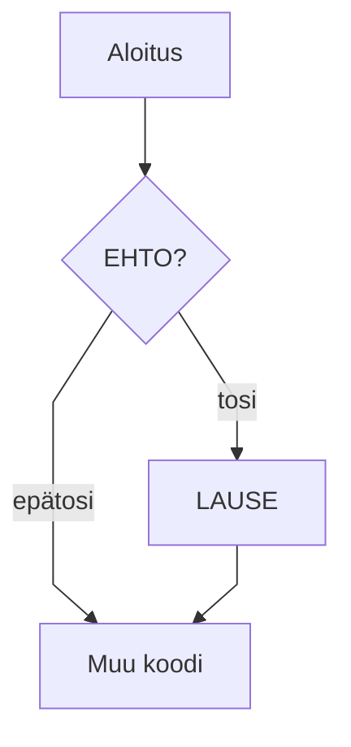

# Hei, Java!

> [!Osaamistavoitteet]
>
> - Java-kielen perusteet
> - Tiedät miten Java-ohjelma käännetään ja ajetaan (komentoriviohjelmat javac, java ja jshell, IDE-säädöt)
> - Tiedät mikä on (J)VM ja miten kääntäminen eroaa tulkkauksesta 
> - Tunnet Java-kielen vastineita yleisimmille I/O-operaatioille (tekstin tulostus, lukeminen konsolilta)

Tekstiä

asoasdoilk aokd alkd alksd lkj


```java
void main() {
    var feature =  Runtime.version().feature();
    IO.println("Hei, maailma! Tässä on Java " + feature);
}
```

```java
//-void main() {
//-   IO.println("summa(2, 2) => " + summa(2, 2));
//-}
//-
/**
 * Laskee kahden kokonaisluvun summan.
 * 
 * @param a Ensimmäinen luku
 * @param b Toinen luku
 * @return Lukujen summa
 */
int summa(int a , int b) {
    return a + b;
}
```

Harjoittele tekemällä ja tulostamalla erityyppisiä muuttujia (tämä on editoitava koodausalue):

```java,editable
void main() {
    int luku = 1;
    double liukuluku = 1.0;

    IO.println("luku = " + luku);
    IO.println("liukuluku = " + liukuluku);
}
```

Taulukko

| Avainsana | Selitys                           |
| --------- | --------------------------------- |
| public    | näkyvyysmodifikaattori — julkinen |
| static    | staattinen — kuuluu luokalle      |
| void      | ei palauta arvoa                  |


Huomautus

> [!NOTE]
> Huomautus!

Toinen

> [!HUOMAUTUS]
> Huom!

> [!VINKKI]
> Tässä voit tehdä myös näin:
> 
> ```java
> void main() {
>    IO.readln("Lue rivi >");
> }
> ```

Mermaid-tuki



Testi!