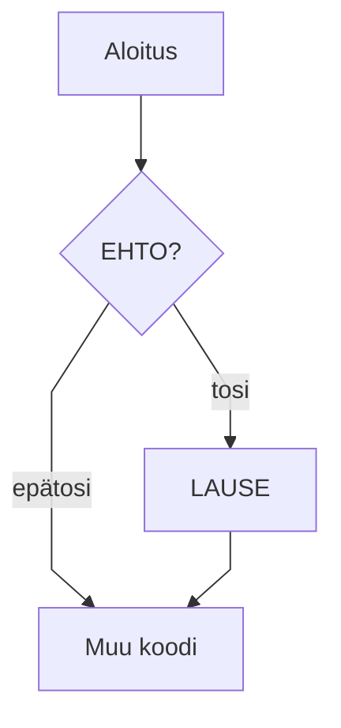

# Aliosan 1 otsikko

> 📖 Osaamistavoitteet
>
> - TODO

Koodiesimerkki

```java
void main() {
    IO.println("Hei, maailma!");
}
```

```java
//-void main() {
//-   IO.println("summa(1, 2) => " + summa(1 , 2));
//-}
//-
/**
 * Laskee kahden kokonaisluvun summan.
 * 
 * @param a Ensimmäinen luku
 * @param b Toinen luku
 * @return Lukujen summa
 */
int summa(int a , int b) {
    return a + b;
}
```

Harjoittele tekemällä ja tulostamalla erityyppisiä muuttujia (tämä on editoitava koodausalue):

```java,editable
void main() {
    int luku = 1;
    double liukuluku = 1.0;

    IO.println("luku = " + luku);
    IO.println("liukuluku = " + liukuluku);
}
```

Taulukko

| Avainsana | Selitys                           |
| --------- | --------------------------------- |
| public    | näkyvyysmodifikaattori — julkinen |
| static    | staattinen — kuuluu luokalle      |
| void      | ei palauta arvoa                  |


Huomautus

> [!NOTE]
> Huomautus!

Mermaid-tuki



Testi!