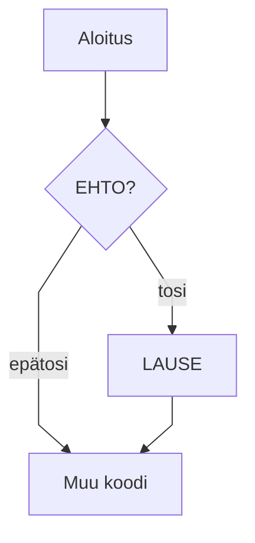

# Aliosan 1 otsikko

> 📖 Osaamistavoitteet
>
> - TODO

Koodiesimerkki

```java,editable
public class Main {
    public static void main(String[] args) {
        System.out.println("""It’s the job that’s never started as takes longest to finish, as my old Gaffer used to say.

    [Samwise Gamgee; The Lord of the Rings, Bk. II, Chp. 7, The Mirror of Galadriel]

— J.R.R. Tolkien""");
    }
}
```

```rust,editable
println!("wew");
```

Taulukko

| Avainsana | Selitys                           |
| --------- | --------------------------------- |
| public    | näkyvyysmodifikaattori — julkinen |
| static    | staattinen — kuuluu luokalle      |
| void      | ei palauta arvoa                  |


Huomautus

> [!NOTE]
> Huomautus!

Mermaid-tuki



Testi!