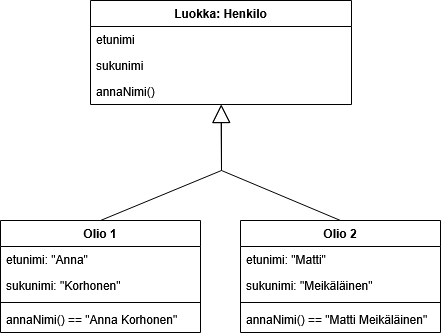
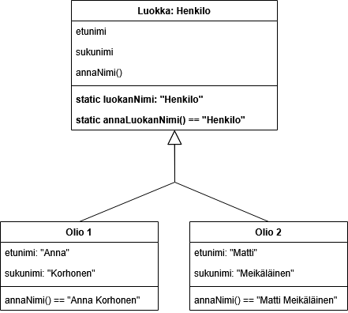

# Luokka ja olio

> [!Osaamistavoitteet]
>
> - Luokka ja olio
> - Konstruktori, metodi, attribuutti
> - Luokan rakenne ja suhde olioon (konstruktori, attribuutti, metodi, this-viite, "luokka blueprintina oliolle")
> - `final` attribuuttien kanssa
> - Osaat määritellä ja hyödyntää omia luokkia Javalla

TODO: Tyyli, huomiopalkit ym.

TODO: Koodiesimerkit; siistimistä (liian pitkät rivit), multifile ja ehkä jaa pidempiä useammaksi esimerkiksi (yksi asia kerrallaan)

TODO: Onko osaamistavoitteiden kannalta tarpeellista: luokka on käännosaikainen/staattinen käsite (olio ajonaikainen/dynaaminen), luokalle varataan muistia (metadata ja staattiset osat)?

## Luokka

Ensimmäinen askel olio-ohjelmointiin on luokan määritteleminen `class`-avainsanaa käyttäen. Luokkaa voi ajatella kaavana tai muottina, jonka pohjalta olioita luodaan. Luokka kertoo, mitä tietoja olio sisältää (attribuutit) ja mitä se voi tehdä (metodit). Luokassa määriteltyjä attribuutteja ja metodeja kutsutaan myös *luokan jäseniksi* (engl. *class member*).

Tehdään pieni ajatusharjoitus: mietitään hetki talonrakennusta. Arkkitehdin piirtämän yhden rakennuspiirustuksen pohjalta voidaan rakentaa monta rakennusta. Ne olisivat rakenteeltaan samanlaisia, sillä ne ovat saman kaavan mukaan tehty, mutta jokaisella rakennuksella olisi kuitenkin oma tila; eri omistaja, väri, sisustus, ja niin edelleen. Rakennuspiirustusta voi (ainakin etäisesti) ajatella olio-ohjelmoinnin luokkana, kun taas rakennukset ovat sen pohjalta tehtyjä olioita. Luokan nimi kertoo, *mikä* olio on, joten jos tekisimme luokan rakennuksille, sen nimeksi sopisi `Rakennus`. 

> [!HUOMAUTUS]
> Huomaa, että Javassa on tapana aloittaa luokkien nimet aina isolla kirjaimella.

Määritellään aluksi tyhjä luokka `Rakennus`, jota lähdemme täydentämään.

```java
class Rakennus {
    // Luokan sisällä määritellään rakenne, jota luokasta 
    // tehdyt oliot vastaavat.
}
```

Voimme luoda luokasta olioita käyttämällä avainsanaa `new`. Tämä varaa muistista oliolle sopivan tilan, valitsee ja suorittaa sopivan muodostajan, ja palauttaa viitteen juuri luotuun olioon. Sijoitamme tämän viitten muuttujaan, jotta pääsemme olioon sitä kautta käsiksi. Viitemuuttujan tyyppi kertoo, _minkälainen_ olio muistisijainnissa täytyy olla - eli mitä _luokkaa_ se edustaa. Käytämme siis luokkaa muuttujan tyyppinä.

```java
void main() {
    // 'new Rakennus()' luo olion ja palauttaa viitteen siihen. 
    // Sijoitamme tämän viitteen muuttujaan 'rakennus'.
    Rakennus rakennus = new Rakennus();
}
```

> [!HUOMAUTUS]
> On tärkeää pitää mielessä se, että viitemuuttuja ja olio ovat kaksi eri asiaa. Viitemuuttuja on kuin nuoli, joka voi osoittaa olioon. Sen ei kuitenkaan ole pakko osoittaa mihinkään, jolloin sen arvo on null. Olio on vastaavasti mahdollista luoda ilman siihen viittaavaa muuttujaa, mutta jos olioon osoittavia viitteitä ei ole, siihen ei päästä käsiksi ja se tuhoutuu. Useampi viitemuuttuja voi viitata samaan olioon, mutta viitemuuttuja voi osoittaa vain yhteen olioon kerrallaan. Voimme toki tehdä listan viitteistä, joista jokainen osoittaa eri olioon. Tämä onkin täysin tavallista, kun teemme listan "olioista".

## Attribuutit

Attribuutti on luokan sisällä määritelty muuttuja, joka edustaa olion ominaisuutta, piirrettä tai tilaa. Siinä missä luokka määrittelee, mitä tietoja olioilla voi olla, attribuutit tallentavat kunkin yksittäisen olion konkreettiset arvot. Kuten muuttujat yleensä, attribuutit voivat olla alkeistietotyyppejä tai viitteitä. Niiden nimeämisessä käytetään myös samoja käytänteitä. 

Lisätään nyt muutama attribuutti `Rakennus`-luokkaamme.

```java
public class Rakennus {
    // Nämä muuttujat ovat olion attribuutteja. Jokaisella rakennuksella
    // on omistaja ja väri, mutta ne eivät välttämättä ole kaikilla 
    // olioilla arvoiltaan samat.
    private String omistaja;

    // Värin oletusarvo on sininen, joten kaikilla tämän luokan pohjalta 
    // tehdyillä olioilla on aluksi värin arvona sininen.
    private String väri = "sininen";
}
```

Attribuutit poikkeavat esimerkiksi aliohjelmien paikallisista muuttujista siten, että niiden näkyvyyttä voidaan hallita erilaisten näkyvyysmääreiden avulla. Aliohjelman paikalliset muuttujat ovat olemassa ja nähtävillä vain aliohjelman sisällä sen suorituksen ajan, mutta attribuutit ovat olemassa koko olion eliniän ajan ja voivat olla nähtävissä myös olion ulkopuolelta. Palaamme näkyvyysmääreisiin myöhemmin tässä osassa.

Luokasta tehdyt oliot sisältävät aina luokassa määritellyt attribuutit. Attribuutille voidaan luokassa antaa oletusarvo, jolloin luokasta luodut oliot saavat sen myös oman attribuuttinsa alkuarvoksi. Tavallisesti jokaisella oliolla on attribuutille oma arvo, sillä attribuutit muodostavat olion tilan. Näin ei kuitenkaan aina ole, sillä attribuutit voidaan jakaa tavallisiin **olion attribuutteihin** (engl. *instance attribute*) sekä staattisiin **luokan attribuutteihin** (engl. *class attribute*), joista jälkimmäiset tunnistaa esittelyriville lisätystä `static`-määritteestä. Nimensä mukaisesti olion attribuutti kiinnittyy olioon, eli jokaisella oliolla on tällaiselle attribuutille oma arvo. Luokan attribuutti sen sijaan sijaitsee luokassa, minkä vuoksi jokaisella oliolla ei ole sille omaa arvoa, vaan se katsotaan aina luokasta. Katsomme mitä tämä tarkoittaa käytännössä, kun tutustumme tarkemmin `static`-määritteeseen.

> [!HUOMAUTUS]
> Luokassa olevien aliohjelmien sisällä esitellyt muuttujat eivät ole attribuutteja, vaan aliohjelman *lokaaleja* eli *paikallisia* muuttujia. Vain suoraan luokan alla olevat muuttujat ovat attribuutteja. Lokaalien muuttujien sisältämä tieto katoaa aliohjelman suorituksen lopussa, eli ne eivät ole osa olion tilaa. Paikallisella muuttujalla voi olla sama nimi kuin attribuutilla, jolloin se peittää attribuutin. Tätä kutsutaan varjostamiseksi (engl. *shadowing*). Jos attribuutilla ja paikallisella muuttujalla on sama nimi, käytetään lausekkeissa ensisijaisesti lokaalia muuttujaa. Olion metodeista voi yhä päästä käsiksi sen attribuuttiin käyttämällä `this`-viitettä, johon palaamme hyvin pian.

```java
public class Rakennus {
    private String väri = "sininen"; // Olion attribuutti

    public void teeJotain()
    {
        // Tämä lokaali muuttuja peittää saman nimen omaavan attribuutin 
        // aliohjelman sisällä.
        String väri = "punainen"; 

        // Tulostaa "punainen". Tunniste 'väri' viittaa ensisijaisesti 
        // lokaaliin muuttujaan, jos sellainen on näkyvissä.
        IO.println(väri); 

        // Tulostaa "sininen". Voimme viitata olion metodin sisältä sen 
        // attribuuttiin 'this'-viitteen avulla.
        IO.println(this.väri); 
    }
}
```

## Metodit

Luokassa määriteltyjä aliohjelmia kutsutaan *metodeiksi*. Siinä missä attribuuttia voisi kuvailla niin, että se muodostaa olion sisäisen tilan, metodia voisi kuvailla olion kyvyksi tehdä jotain.

Metodien määrittely ei syntaksiltaan eroa muista aliohjelmista, ja niiden nimeämisessä käytetään myös samanlaisia käytänteitä. Kuten yleensä aliohjelmia tehdessä, metodin tulisi suorittaa tehtävä, jota sen nimi kuvastaa. Liian suuret tehtävät on hyvä jakaa pienempiin osiin eli useammaksi metodiksi. Metodeja voidaan myös kuormittaa kuin muitakin aliohjelmia. Javassa erikoista on se, että kaikki aliohjelmat ovat itse asiassa aina *jonkin* luokan sisällä ja siten metodeja.

Kuten attribuutit, myös metodit voidaan jakaa tavallisiin **olion metodeihin** (engl. *instance method*) sekä staattisiin **luokan metodeihin** (engl. *class method*). Nämä eroavat toisistaan samalla tavalla kuin attribuuttienkin kohdalla; olion metodit liittyvät aina johonkin olioon, kun taas luokan metodit kuuluvat luokalle, eivätkä siten voi päästä suoraan käsiksi minkään olion tilaan. Metodien näkyvyyttä luokan ulkopuolelle voidaan hallita attribuuttien tapaan näkyvyysmääreiden avulla.

Voidaksemme kutsua **olion metodia**, meillä täytyy olla olio ja siihen viite. Staattista **luokan metodia** sen sijaan voimme kutsua suoraan luokan kautta ilman olion luomista. Staattista metodia *on mahdollista* kutsua myös olion kautta, mutta se ei silti mahdollista olion tilan käsittelyä metodin sisältä.

Lisätään nyt `Rakennus`-luokkaamme pari yksinkertaista olion metodia tilan käsittelyyn ja kutsutaan näitä. Tällaisia metodeja kutsutaan usein *saantimetodeiksi*.

```java
// FILE: Rakennus.java
public class Rakennus {
    private String omistaja;
    private String väri;

    // Olion metodi, joka ottaa vastaan merkkijonon ja sijoittaa 
    // sen 'väri'-attribuuttiin.
    public void setVäri(String väri) {
        // Parametrilla ja attribuutilla on sama nimi, joten käytämme this-viitettä.
        this.väri = väri;
    }

    // Olion metodi, joka palauttaa 'väri'-attribuutin arvon kutsujalle.
    public String getVäri() {
        return this.väri;
    }
}
// FILE_END
// FILE: main.java
void main() {
    // Luodaan kaksi rakennusta.
    Rakennus rakennus1 = new Rakennus();
    Rakennus rakennus2 = new Rakennus();

    // Käytetään olioiden metodeja muuttamaan niiden tilaa.
    rakennus1.setVäri("vihreä");
    rakennus2.setVäri("valkoinen")

    // Tulostetaan olioiden värit saantimetodien avulla.
    IO.println(rakennus1.getVäri()); // Tulostaa "vihreä"
    IO.println(rakennus2.getVäri()); // Tulostaa "valkoinen"

    // Huom! Emme voi kutsua olion metodia ilman oliota. Jos yritämme 
    // kutsua olion metodia luokan kautta seuraavasti, se aiheuttaa virheen.
    // Rakennus.setVäri("sininen");
}
// FILE_END
```

## Tehtävä 2.X

<task>
  <task-title>Tehtävä 2.X: Ensimmäinen luokka<points>1 p.</points></task-title>
  <handout>
  TODO: Tehdään oma luokka attribuuteilla ja metodeilla (yksinkertaiset saantimetodit riittävät). Pääohjelmassa luodaan olio, jonka tilaa muutetaan metodien avulla.
  </handout>
  <task-link><a href="https://tim.jyu.fi/view/kurssit/tie/tiep111/tehtavat/esimerkki">Tee tehtävä TIMissä</a></task-link>
</task>

## Static

Tähän muistiin tällainen "määritelmäteksti". Siirrä tai muokkaa tarpeen mukaan. Voit myös lainata tekstiä täältä (minun kirjoittama teksti): https://tim.jyu.fi/view/kurssit/tie/ohj1/materiaali/staattiset

Attribuutti tai metodi voidaan määritellä *staattiseksi* käyttämällä `static`-sanaa. Staattisuus tarkoittaa Java-kielen yhteydessä sitä, että kyseinen attribuutti tai metodi määritellään kuuluvaksi luokalle itselleen, ei olioinstanssille. Staattinen jäsen on siis tavallaan yhteinen kaikille luokan olioille.

Attribuuttien ja metodien yhteydessä tuli esille staattisuuden käsite. Tämä käsite aiheuttaa usein alussa hieman sekaannusta. Jos haluamme tehdä esimerkiksi attribuutista yhteisen kaikille luokan olioille niin, että jokaisella oliolla ei voi olla omaa arvoa, voimme tehdä siitä staattisen. Sekä attribuutit että metodit voidaan määritellä staattiseksi `static`-määritteellä, jolloin ne kuuluvat luokalle, eikä niistä tehdä "kopioita" jokaiselle oliolle. Nämä *luokan* attribuutit ja metodit ovat edelleen saman luokan olioiden käytettävissä, mutta ne eivät ole osa olioiden tilaa; luokan attribuutista ei ole jokaisella oliolla omaa "versiota" eikä luokan metodi voi päästä minkään olion tilaan suoraan käsiksi, sillä sitä ei kiinnitetä mihinkään olioon.

Havainnollistimme tämän osan alussa luokkia ja olioita näin:

```java
class Henkilo {
    private String etunimi;
    private String sukunimi;

    public String annaNimi() {
        return etunimi + " " + sukunimi;
    }
}
```



Luokka määrittelee mitä attribuutteja ja metodeja olioilla on. Kuvassa esiintyvät oliot sisältävät omat, luokassa määriteltyä rakennetta vastaavat attribuutit ja metodit. Jokaisella oliolla on kuitenkin oma tila, eli omat attribuuttien arvot. Olion metodit myös käyttävät omistavan olion tilaa, eli tässä tapauksessa molemmat oliot palauttavat oman nimensä. Todellisuudessa metodeista ei tehdä kopioita jokaista luokan oliota varten, mutta tämä auttaa havainnollistamaan olion attribuuttien ja metodien toimintaa.

Voimme määritellä luokkaan myös muuttujia ja aliohjelmia, joiden ei ole tarkoitus olla kiinnitetty minkään olion tilaan. Tämä onnistuu `static`-avainsanaa käyttämällä, eli tekemällä muuttujista tai aliohjelmista *staattisia*. Staattisia aliohjelmia ja muuttujia voidaan käyttää ilman luokan ilmentymiä eli olioita, sillä ne eivät ole osa tai käsittele minkään olion tilaa. Voisimme havainnollistaa tätä niin, että nämä *luokan* attribuutit ja metodit sijaitsevat nimensä mukaisesti vain luokassa.

Lisätään esimerkkiin nyt staattinen attribuutti `luokanNimi` ja metodi `annaLuokanNimi`, joka yksinkertaisesti palauttaa staattisen attribuutin arvon.

> [!HUOMAUTUS]
> Vastaava staattinen metodi itse asiassa on jo olemassa nimellä `getClass`, vaikka emme sellaista itse määrittelekään. Tällaisia valmiita metodeja on kaikissa luomissamme luokissa valmiiksi. Palaamme siihen miksi näin on osassa 3.

```java
class Henkilo {
    private String etunimi;
    private String sukunimi;
    private static String luokanNimi = "Henkilo";

    public String annaNimi() {
        return etunimi + " " + sukunimi;
    }

    public static String annaLuokanNimi() {
        return luokanNimi;
    }
}
```



Tämäkään havainnollistus ei ehkä täysin vastaa todellisuutta, mutta se auttaa toivottavasti ymmärtämään staattisuuden käsitettä paremmin olioiden osalta.

Oliot pääsevät aina käsiksi oman luokkansa staattisiin attribuutteihin ja metodeihin. Nämä ovat kuitenkin jaettuja kaikkien luokan olioiden kesken, sillä ne eivät kuulu yhdellekään oliolle. Jos olio muuttaa luokkansa staattisen attribuutin arvoa, tämä muutos näkyy kaikille saman luokan olioille. Vastaavasti staattinen metodi "sijaitsee" vain luokassa, eikä kyseisestä metodista voi nähdä minkään olion tilaa edes silloin, kun sitä kutsutaan jonkin olion metodin sisältä. Staattisista metodeista päästään toki käsiksi saman luokan staattisiin attribuutteihin. Staattisia metodeja voidaan kutsua suoraan luokan kautta ilman olion luomista, mikä tekee niiden kutsumisesta hieman helpompaa.

> [!HUOMAUTUS]
> Tulostamisessa tähän mennessä käyttämämme `IO.println()` on itse asiassa [IO-luokan](https://docs.oracle.com/en/java/javase/24/docs/api/java.base/java/io/IO.html) staattinen metodi. Sen käyttäminen on helpompaa, kun meidän ei tarvitse joka kerta luoda IO-oliota ja kutsua sen `println`-metodia.

```java
void main() {
    // Kutsumme tässä Henkilo-luokan metodia. Meidän ei tarvitse 
    // luoda oliota kutsuaksemme staattista metodia.
    String luokka = Henkilo.annaLuokanNimi();
    IO.println(luokka);
}
```

Koska staattiset metodit eivät liity mihinkään olioon, niiden sisällä ei myöskään voi käyttää `this`-viitettä. Tutustutaan tähän seuraavaksi.

## Tehtävä 2.X

<task>
  <task-title>Tehtävä 2.X: Staattisuus<points>1 p.</points></task-title>
  <handout>
  TODO: Joko teoriatehtävä (useampi monivalinta) tai ohjelmointitehtävä, jossa lisätään luokkaan staattinen attribuutti ja metodi. Pääohjelmassa kokeillaan, että staattisen attribuutin muuttaminen yhdessä oliossa vaikuttaa kaikkiin olioihin.
  </handout>
  <task-link><a href="https://tim.jyu.fi/view/kurssit/tie/tiep111/tehtavat/esimerkki">Tee tehtävä TIMissä</a></task-link>
</task>

## This-viite

Sana `this` viittaa olioon itseensä. Se toimii viitteenä "tähän olioon", jonka kontekstissa koodia suoritetaan. 

Käytimme tämän osan alun esimerkeissä `this`-viitettä lukeaksemme olion attribuutteja näin:

```java
public class Rakennus {
    private String väri;

    public String getVäri() {
        return this.väri;
    }
}
```

Tämä viite on automaattisesti käytettävissä aina, kun kutsutaan jonkin olion metodia. Metodikutsun yhteydessä `this` asetetaan osoittamaan metodin suorituksen sisällä siihen olioon, jonka metodia kutsuttiin, eikä sitä voi muuttaa. Viitteen kautta metodi pääsee käsiksi oikean olion tilaan sekä sen muihin metodeihin. Olion metodien sisällä `this`-viitettä käytetään implisiittisesti, jos samalla näkyvyysalueella ei ole konfliktia tunnisteissa - esimerkiksi attribuutin kanssa samaa nimeä käyttävää lokaalia muuttujaa. Meidän ei siis tarvitse kirjoittaa aina attribuutin tai metodikutsun eteen `this`, sillä kääntäjä osaa päätellä sen itse, jos konfliktia ei ole. Joissain ohjelmointikielissä tällaista viitettä kutsutaan myös nimellä `self`.

> [!HUOMAUTUS]
> Staattiset luokan metodit eivät kiinnity mihinkään olioon, eli niissä ei silloin voi myöskään olla olioon viittaavaa `this`-viitettä.

Katsotaan muutamaa esimerkkiä `this`-viitteen käytöstä.

```java
// FILE: Rakennus.java
public class Rakennus {
    private String omistaja;
    private String väri;

    public void setVäri(String väri) {
        // Käytämme tässä this-viitettä, sillä attribuutilla ja parametrilla 
        // on sama nimi. Lokaalia muuttujaa käytettäisiin muuten ensisijaisesti.
        this.väri = väri; 
    }

    public String getVäri() {
        // Tässä this on vapaaehtoinen. Samalla näkyvyysalueella ei ole muita 
        // "väri" nimisiä muuttujia, joten sekaannusta ei tapahdu.
        // this-viitteen käyttö on kuitenkin täysin sallittua.
        return this.väri;
    }

    // Huom! Teimme tästä metodista virheellisesti staattisen, eli vaikka kutsumme 
    // sitä jonkin olion kautta, sen sisällä ei ole tietoa oliosta.
    public static void tulosta() {
        // Kumpikaan alla olevista ei onnistu, sillä emme voi päästä 'this' viitteen 
        // kautta olion tilaan käsiksi, eikä metodissa ole 
        // lokaalia muuttujaa 'omistaja'.
        // IO.println(omistaja);
        // IO.println(this.omistaja);
    }
}
// FILE_END
// FILE: main.java
void main() {
    Rakennus talo = new Rakennus();
    Rakennus autotalli = new Rakennus();

    // Kutsumme 'talo' viitteen kautta löytyvän olion setVäri-metodia, joten tämän 
    // metodikutsun suorituksessa 'this' viittaa samaan olioon kuin pääohjelman 'talo'.
    talo.setVäri("harmaa"); 

    // Tämän metodikutsun sisällä 'this' viittaa samaan olioon kuin 'autotalli'.
    autotalli.setVäri("valkoinen");
}
// FILE_END
```

Metodien sisällä voimme käyttää `this`-viitettä kuin muitakin viitemuuttujia. Voimme esimerkiksi välittää sen toiselle aliohjelmalle parametrina, jos haluamme käsitellä oliota toisen aliohjelman sisällä. Tämä ei ole tarpeen, jos kutsumme toista saman olion metodia, mutta tällä tavalla voisimme välittää olion esimerkiksi staattiselle metodille.

```java
// FILE: Rakennus.java
public class Rakennus {
    private String omistaja;
    private String väri;

    // Olion metodi.
    public void teeJotain() {
        // Välitetään omistava olio tulosta-metodille.
        tulosta(this);
    }

    // Staattinen metodi, joka ottaa vastaan Rakennus-olion.
    public static void tulosta(Rakennus rakennus) {
        IO.println(rakennus.omistaja + " " + rakennus.väri);
    }
}
// FILE_END
// FILE: main.java
void main() {
    // Kutsumme olion metodia, joka välittää itse olion 
    // eteenpäin staattiselle metodille.
    Rakennus talo = new Rakennus();
    talo.teeJotain(); 
}
// FILE_END
```

Voimme käyttää `this`-avainsanaa olion luomisen yhteydessä hieman eri tavalla. Palaamme tähän tutustuessamme olion muodostajiin.

## Muodostaja eli konstruktori

Muodostaja eli konstruktori on erikoismetodi, jota kutsutaan automaattisesti uuden olion luomisen yhteydessä ja jolla voidaan asettaa olion alkuperäinen tila. Muodostajan nimi on aina sama kuin luokan nimi ja se kirjoitetaan isolla alkukirjaimella, mikä poikkeaa muiden metodien nimeämistyylistä. Muodostajalle ei määritetä paluuarvon tyyppiä, vaan muodostaja palauttaa aina viitteen muodostettuun olioon.

Luokassa täytyy olla ainakin yksi muodostaja. Olemme kuitenkin tähän asti tehneet luokan olioita määrittelemättä luokkaan muodostajaa. Tämä onnistuu Javassa, sillä jos luokkaan *ei* ole tehty yhtään muodostajaa, luokkaan syntyy automaattisesti parametriton muodostaja. Automaattisesti luotu parametriton muodostaja on toteutukseltaan tyhjä siinä mielessä, että se ei sisällä yhtään lausetta. 

Parametritonta muodostajaa ei kuitenkaan luoda automaattisesti silloin, kun määrittelemme luokkaan itse yhdenkin muodostajan. Muodostajan nimen täytyy olla aina sama, joten teemme siis muodostajia lisätessämme metodin kuormitusta erilaisilla parametreilla. Jos luokalla on useampi muodostaja eri parametreilla, oikea muodostaja valitaan kääntäjän toimesta automaattisesti olion luomisen yhteydessä annettujen argumenttien perusteella.

Käytimme aikaisemmassa esimerkissä `Rakennus`-luokkaa määrittelemättä muodostajaa. Otetaan metodit hetkeksi pois selkeyden vuoksi ja katsotaan, mitä olioita luodessa tapahtuu.

```java
// FILE: Rakennus.java
public class Rakennus {
    private String omistaja;
    private String väri;
}
// FILE_END
// FILE: main.java
void main() {
    // Olio luodaan oletusmuodostajaa käyttäen.
    Rakennus rakennus = new Rakennus();
}
// FILE_END
```

Tässä tapauksessa olio muodostetaan automaattista oletusmuodostajaa käyttäen, sillä yhtään muodostajaa ei ole määritelty. Voimme tehdä vastaavan muodostajan itsekin seuraavasti.

```java
// FILE: Rakennus.java
public class Rakennus {
    private String omistaja;
    private String väri;

    // Parametriton, joka vastaa oletusmuodostajaa.
    public Rakennus() {
        // Voisimme täällä alustaa olion tilan jollain tavalla, 
        // esimerkiksi asettamalla attribuuteille alkuarvot.
    }
}
// FILE_END
// FILE: main.java
void main() {
    // Olio luodaan määrittelemäämme parametritonta muodostajaa käyttäen.
    Rakennus rakennus = new Rakennus();
}
// FILE_END
```

Joskus oletusmuodostaja voi olla riittävä, mutta usein haluamme mahdollistaa olioiden luomisen suoraan oikeaan tilaan määrittelemällä erilaisia muodostajia. Lisätään nyt `Rakennus`-luokalle toinen muodostaja, joka ottaa omistajan ja värin parametreina vastaan ja alustaa näillä olion attribuutit. Näin meidän ei tarvitse asettaa attribuutteja erikseen olion luomisen jälkeen.

```java
// FILE: Rakennus.java
public class Rakennus {
    private String omistaja;
    private String väri;

    // Parametriton muodostaja. Tämä on nyt pakollinen, koska määrittelimme luokkaan toisenkin muodostajan.
    public Rakennus() {
        // Voisimme täällä alustaa olion tilan jollain tavalla, esimerkiksi asettamalla attribuuteille alkuarvot.
    }

    public Rakennus(String omistaja, String väri) {
        // Alustetaan olion tila parametreilla. Huomaa tässä this-viitteen käyttö, sillä parametrien ja attribuuttien nimet ovat samat.
        this.omistaja = omistaja;
        this.väri = väri;
    }
}
// FILE_END
// FILE: main.java
void main() {
    // Oliolle ei anneta luonnin yhteydessä argumentteja. Kääntäjä valitsee parametrittoman muodostajan.
    Rakennus rakennus1 = new Rakennus();

    // Oliolle annetaan kaksi merkkijonoa argumentteina. Nämä vastaavat määrittelemäämme parametrillista muodostajaa, joten sitä käytetään olion muodostamiseen.
    Rakennus rakennus2 = new Rakennus("DVV", "valkoinen");

    // Tämä ei onnistuisi, sillä emme ole määritelleet muodostajaa, jossa on vain yksi parametri. 
    // Rakennus rakennus3 = new Rakennus("DVV");
}
// FILE_END
```

Lisätään vielä lopuksi hieman erikoisempi muodostaja, joka ottaa vastaan toisen saman luokan olion ja kopioi sen tilan muodostettavalle oliolle. Tällaisesta muodostajasta puhuttaessa käytetään usein termiä *copy constructor*.

```java
// FILE: Rakennus.java
public class Rakennus {
    private String omistaja;
    private String väri;

    public Rakennus() {
        // Voisimme täällä alustaa olion tilan jollain tavalla, esimerkiksi asettamalla attribuuteille alkuarvot.
    }

    public Rakennus(String omistaja, String väri) {
        this.omistaja = omistaja;
        this.väri = väri;
    }

    // Muodostaja, joka ottaa vastaan toisen saman luokan olion ja kopioi sen arvot muodostettavalle oliolle.
    public Rakennus(Rakennus kopioitava) {
        this.omistaja = kopioitava.omistaja;
        this.väri = kopioitava.väri;
    }
}
// FILE_END
// FILE: main.java
void main() {
    Rakennus rakennus1 = new Rakennus("DVV", "valkoinen");

    // Antamalla argumenttina toisen Rakennus-tyyppisen olion, käytämme uutta muodostaa, joka kopioi olion arvot. Molemmilla rakennuksilla on nyt sama omistaja ja väri.
    Rakennus rakennus2 = new Rakennus(rakennus1);
}
// FILE_END
```

Voimme lisäksi käyttää muodostajassa `this`-avainsanaa kuin metodia, jos haluamme siirtää muodostamisen toiselle muodostajalle. Muutetaan luokkaa nyt niin, että parametriton muodostaja käyttää parametrillista muodostajaa antamaan attribuuteille alkuarvot.

```java
// FILE: Rakennus.java
public class Rakennus {
    private String omistaja;
    private String väri;

    public Rakennus() {
        // Kutsutaan muodostajaa, jossa on kaksi merkkijonoa parametrina.
        this("JYU", "valkoinen");
    }

    public Rakennus(String omistaja, String väri) {
        this.omistaja = omistaja;
        this.väri = väri;
    }

    // Muodostaja, joka ottaa vastaan toisen saman luokan olion ja kopioi sen arvot muodostettavalle oliolle.
    public Rakennus(Rakennus kopioitava) {
        this.omistaja = kopioitava.omistaja;
        this.väri = kopioitava.väri;
    }
}
// FILE_END
// FILE: main.java
void main() {
    Rakennus rakennus1 = new Rakennus();
    IO.println(rakennus1.omistaja); // JYU
    IO.println(rakennus1.väri); // valkoinen
}
// FILE_END
```

## Tehtävä 2.X

<task>
  <task-title>Tehtävä 2.X: Muodostajat<points>1 p.</points></task-title>
  <handout>
  TODO: Lisätään luokkaan sopivat muodostajat, että annettu pääohjelma toimii oikein.
  </handout>
  <task-link><a href="https://tim.jyu.fi/view/kurssit/tie/tiep111/tehtavat/esimerkki">Tee tehtävä TIMissä</a></task-link>
</task>

## Olion elinkaari

TODO: Tämä osio pitää vielä siistiä.

Olion elinkaari lyhyesti; olion rakenne määritellään ensin luokalla. Ohjelman ajon aikana luokasta luodaan ilmentymä eli olio. Olion luonnin yhteydessä sille varataan ensin sopiva tila Javan virtuaalikoneen kekomuistista. Jotta olioon voidaan päästä käsiksi, luodaan sitä varten viitemuuttuja. Java-kääntäjä tarkistaa käännöksen yhteydessä, että muuttuja on yhteensopiva luodun olion kanssa, ja asettaa viitteen osoittamaan luotuun olioon.

Kun olioon ei enää ole yhtään viitettä olemassa, se tuhoutuu. Javassa ohjelmoijan ei tarvitse itse pitää huolta muistin varaamisesta tai vapauttamisesta. Tuhoutuneiden olioiden varaama muisti vapautetaan lopulta Javan automaattisen roskienkeräyksen toimesta.

Käydään vielä olion koko elinkaari läpi esimerkkien avulla. Tarvitsemme olioiden luomista varten ensimmäiseksi luokan. Tehdään esimerkkejä varten yksinkertainen luokka `Henkilo`, johon voimme tallentaa henkilön nimen ja syntymävuoden.

```java
public class Henkilo {
    private String nimi; // Nimen oletusarvo on null, sillä kyseessä on viitemuuttuja.
    private int syntymavuosi; // Syntymävuoden oletusarvo on 0, sillä kyseessä on kokonaislukumuuttuja.

    // Parametriton muodostaja. Tämä täytyy määritellä, koska olemme määritelleet muodostajan, jolla on parametreja.
    public Henkilo() {
        // Jos emme alusta attribuutteja täällä, yllä mainitut oletusarvot pysyvät voimassa tämän muodostajan avulla luoduilla olioilla.
    }

    // Parametrillinen muodostaja.
    public Henkilo(String nimi, int vuosi) {
        this.nimi = nimi;
        this.syntymavuosi = vuosi;
    }

    public String getNimi() { 
        return nimi; 
    }

    public void setNimi(String nimi) { 
        this.nimi = nimi; 
    }

    public int getSyntymavuosi() { 
        return syntymavuosi; 
    }

    public void setSyntymavuosi(int vuosi) { 
        this.syntymavuosi = vuosi; 
    }
}
```

Määrittelimme `Henkilo`-luokassa, että parametriton muodostaja ei alusta olion tilaa, kun taas parametrillinen muodostaja alustaa tilan argumentteina annettujen arvojen perusteella. Käytetään molempia muodostajia luomaan eri olioita ja kerrataan samalla hieman viitemuuttujien käyttöä:

```java
void main() {
    // Voimme luoda viitemuuttujan ilman että se viittaa mihinkään 
    // olioon. Oliota ei tässä luoda.
    Henkilo h0;

    // Tässä luodaan olio ja sijoitetaan viite h0-muuttujaan. 
    // Kääntäjä valitsee käytettäväksi parametrittoman muodostajan, 
    // sillä muodostajalle ei anneta argumentteja.
    h0 = new Henkilo(); 

    // Tässä luodaan olio, mutta viitettä ei sijoiteta mihinkään. 
    // Emme pääse tähän olioon enää käsiksi ja se merkitään tuhottavaksi.
    new Henkilo();

    // Yleensä on suoraviivaisempaa esitellä viitemuuttuja ja 
    // luoda siihen sijoitettava olio yhdessä.
    Henkilo h1 = new Henkilo();

    // Voimme käyttää parametrillista muodostajaa antamalla muodostajalle 
    // parametreja vastaavat arvot - nimi ja syntymävuosi.
    Henkilo h2 = new Henkilo("Anna", 1995);

    // Tämä ei käy, sillä emme määritelleet luokalle muodostajaa, jolla 
    // on vain nimi parametrina.
    // Henkilo h3 = new Henkilo("Mikko");

    // Voimme luoda toisenkin viitteen Anna-olioon. 
    // Sekä h2 että h3 osoittavat nyt samaan olioon.
    Henkilo h3 = h2;
}
```

Kun olemme luoneet olioita, voimme tarkastella ja muokata niiden tilaa ohjelman suorituksen aikana. Jatketaan hieman yllä olevan esimerkin pohjalta ja tarkastellaan olioiden tilaa.

```java
void main() {
    Henkilo h1 = new Henkilo();
    Henkilo h2 = new Henkilo("Anna", 1995);

    IO.println(h1.getNimi()); // Tämä tulostaa "null", sillä parametriton muodostaja ei alusta nimeä millään tavalla.
    IO.println(h1.getSyntymavuosi()); // Tämä vastaavasti tulostaa "0". Alustamattoman kokonaisluvun oletusarvo on Javassa 0.

    IO.println(h2.getNimi()); // Tulostaa "Anna"
    IO.println(h2.getSyntymavuosi()); // // Tulostaa "1995"

    // Annetaan nyt ensimmäiselle henkilölle oikea nimi ja syntymävuosi.
    h1.setNimi("Joni");
    h1.setSyntymavuosi(1995);

    // Olion tila on muuttunut ja saamme nyt uudet arvot tulostumaan.
    IO.println(h1.getNimi());
    IO.println(h1.getSyntymavuosi());
}
```

Tarkastellaan lopuksi olioiden elinkaaren loppua, eli niiden tuhoutumista. Kun olioon ei enää ole yhtään viitettä, se merkitään "roskaksi", jonka Javan automaattinen roskienkeräys (engl. *garbage collection*) voi aikanaan poistaa muistista vapauttaen sitä varten varten varatun tilan.

```java
void main() {
    // Luomme taas kaksi oliota.
    Henkilo h1 = new Henkilo();
    Henkilo h2 = new Henkilo("Anna", 1995);

    // Muuttuja h1 on tällä hetkellä ainoa viite ensimmäiseen olioon.
    // Jos sijoitamme h1-muuttujaan jonkin muun viitten tai asetamme sen arvoksi null, ensimmäinen olio merkitään tuhottavaksi, sillä siihen ei ole enää viitteitä.
    h2 = null;

    // Aliohjelman näkyvyysalueen päättyessä kaikki sen sisällä luodut lokaalit muuttujat (h1 ja h2) tuhoutuvat.
    // Tässä tapauksessa olioihin ei ole enää muita viitteitä, joten nekin tuhoutuvat.
}
```

Emme tällä kurssilla perehdy kovin syvällisesti Javan automaattiseen roskienkeräykseen tai muistin hallintaan. Tämän kurssin kannalta riittää, että tiedämme milloin olio muuttuu roskaksi ja tuhoutuu. Jos haluat tutustua aiheeseen hieman tarkemmin, voit aloittaa lukemalla täältä [täältä](https://www.geeksforgeeks.org/java/jvm-heap-area/) lisää kekomuistista ja sen varaamisesta sekä [täältä](https://www.geeksforgeeks.org/java/garbage-collection-in-java/) Javan roskienkeräyksestä suhteellisen helposti lähestyttävässä muodossa.

### Olioiden vertaileminen

TODO: Tämä siirtyy osaan 3 siistimisen jälkeen.

Jokaisella oliolla on oma identiteetti. Vaikka kahden olion tilat olisivat täysin samat, ne eivät silti ole sama olio. Tämä aiheuttaa toisinaan hieman päänvaivaa olio-ohjelmointiin tutustumisen alkuvaiheissa. Olemme tottuneet vertailemaan muuttujien arvoja `==`-operaattorilla (pl. liukuluvut), mutta tämä ei toimi olioiden tapauksessa toivotulla tavalla, sillä se vertaa itse asiassa olioiden *identiteettiä*. Sama koskee myös `!=`-operaattoria.

Katsotaan, mitä tämä käytännössä tarkoittaa ottamalla taas esimerkiksi yksinkertaistettu `Henkilo`-luokka:

```java
public class Henkilo {
    private String nimi;
    private int syntymavuosi;

    public Henkilo() {}

    public Henkilo(String nimi, int vuosi) {
        this.nimi = nimi;
        this.syntymavuosi = vuosi;
    }

    // ...
}

void main() {
    Henkilo h1 = new Henkilo("Anna", 1995);
    Henkilo h2 = new Henkilo("Anna", 1995);
    Henkilo h3 = h1; // Viittaa samaan olioon kuin h1.

    IO.println(h1 == h2); // False. Olioilla on sama sisältö (tila), mutta ne eivät ole sama olio.
    IO.println(h1 == h3); // True. Molemmat viitteet osoittava samaan olioon, eli identiteetti on sama.
}
```

Parempi tapa vertailla olioita on käyttää `equals`-metodia. Metodista on jo toteutus olemassa kaikilla olioilla (palaamme tähän seuraavassa osassa), mutta valitettavasti Java ei voi tietää, kuinka itse luomiemme luokkien yhdenvertaisuus määritellään, joten meidän täytyy toteuttaa se itse. Lisätään sellainen `Henkilo`-luokkaamme.

```java
public class Henkilo {
    private String nimi;
    private int syntymavuosi;

    public Henkilo() {}

    public Henkilo(String nimi, int vuosi) {
        this.nimi = nimi;
        this.syntymavuosi = vuosi;
    }

    // ...

    @Override
    public boolean equals(Object obj) {
        if (this == obj) return true;
        if (obj == null || getClass() != obj.getClass()) return false;

        // Vertaillaan olioita ominaisuuksien perusteella ja palautetaan true, jos oliot voidaan tulkita yhdenvertaisiksi.
        Henkilo toinen = (Henkilo)obj;
        return Objects.equals(nimi, toinen.nimi) && syntymavuosi == toinen.syntymavuosi;
    }
}

void main() {
    Henkilo h1 = new Henkilo("Anna", 1995);
    Henkilo h2 = new Henkilo("Anna", 1995);

    IO.println(h1 == h2); // False. Olioilla on edelleen eri identiteetti.
    IO.println(h1.equals(h2)); // True

    IO.println(Objects.equals(h1, h2));
}
```

Metodista on olemassa myös staattinen versio `Objects.equals`, joka on turvallisempi käyttää tietyissä tilanteissa. Jos viitemuuttuja `h1` olisi arvoltaan `null` eli ei osoittaisi mihinkään olioon, emme voisi yrittää kutsua olion `equals`-metodia normaalisti. `Objects.equals` kuitenkin vaatii myös `equals`-metodin toteutuksen toimiakseen oikein.

```java
void main() {
    Henkilo h1 = new Henkilo("Anna", 1995);
    Henkilo h2 = new Henkilo("Anna", 1995);
    Henkilo h3 = null;

    IO.println(Objects.equals(h1, h2)); // True
    IO.println(Objects.equals(h3, h1)); // False
}
```

Joidenkin Javan sisäänrakennettujen oliotyyppien tapauksessa `==`-operaattori *voi* toimia, vaikka edellä mainitun perusteella sen ei pitäisi. Tästä hyvä esimerkki on `String` olioiden vertailu. Java pyrkii välttämään täysin samanlaisten olioiden luomista turhaan uudelleenkäyttämällä saman sisällön omaavia, muuttumattomia olioita parhaansa mukaan. Tämä on melko yleinen ominaisuus ohjelmointikielissä. Voit halutessasi lukea lisää aiheesta täältä; [*string interning*](https://www.geeksforgeeks.org/java/interning-of-string/). Varmuuden vuoksi on paras käyttää aina olion `equals`-metodia tai `Objects.equals`-funktiota.

TODO: Jos toteutamme oman `equals`-metodin, meidän täytyisi toteuttaa myös luokalle oma `toHash`-metodi.