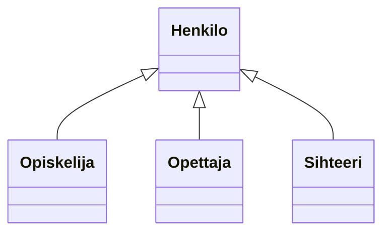
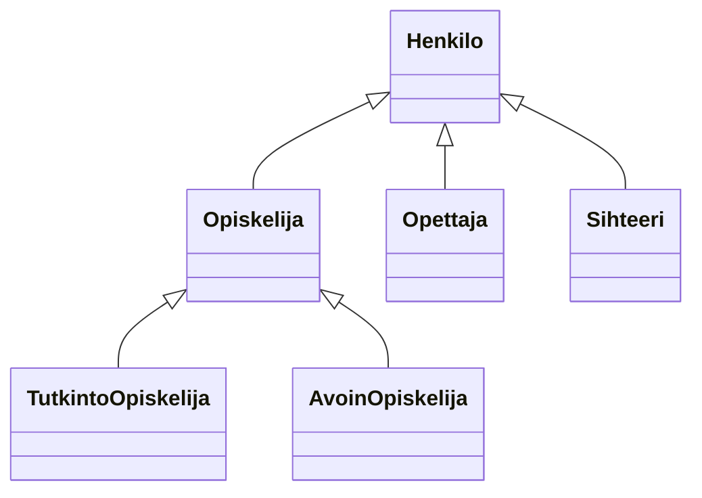

# Perintä

> [!Osaamistavoitteet]
>
> - Perintä ("Kissa on Eläin", metodin ylikirjoitus, protected, luokkahierarkia)
> - Käytetään perintää olioiden yhteistyössä
> - Ymmärrät miten luokat ja oliot voivat periä toistensa ominaisuuksia
> - Ymmärrät miten metodeja voi ylikirjoittaa luokan sisällä ja luokkien yli
> - Ylikirjoitus, @Override, final
> - Osaat luoda yksinkertaisen luokkahierarkian, jossa luokka perii toisen luokan ja ylikirjoittaa sen metodeja
> - Konkreettinen esimerkki: Javan Object-luokka ja sen ylikirjoitettavat metodit
>    - Ymmärtää, että kaikki Javan luokat perivät `Object`-luokasta
>    - Tuntee hyödylliset ylikirjoitettavat metodit `Object`-luokassa: `equals`, `toString`, (ehkä `hashCode`?)

## Määritelmä

*Perintä* tarkoittaa mekanismia, jossa luokkaan voidaan sisällyttää toisen luokan ominaisuuksia ja toiminnallisuuksia. Tämä mahdollistaa koodin uudelleenkäytön ja luokkien välisen hierarkian luomisen. 

Perivästä luokasta käytetään termiä *aliluokka* (subclass) ja peritystä luokasta termiä *yliluokka* (superclass).

Javassa perintä toteutetaan käyttämällä `extends`-avainsanaa.

## Esimerkki

Käytännössä olioilla on usein yhteisiä piirteitä ja toimintoja. Otetaan keksitty esimerkki henkilötietojärjestelmästä: `Opiskelija`, `Opettaja` ja `Sihteeri` voisivat kaikki olla olioita kuvitteellisessa Kisu-opintotietojärjestelmässä. Kaikilla näillä on henkilöille yhteisiä ominaisuuksia, kuten nimi ja käyttäjätunnus. Jokaisella on myös yhteisiä toimintoja, kuten kirjautuminen järjestelmään.

Kullakin henkilöllä on kuitenkin myös omia erityispiirteitään: Opiskelijalla on lista kursseista, joille hän on ilmoittautunut, sekä opintopisteet. Opettajalla on tehtävänimike ja kurssit, joita hän opettaa, mutta hänellä ei ole opintopisteitä. Sihteeri on vastuussa opintosuoritusten kirjaamisesta ja tutkinnon antamisesta, mutta hänellä ei ole opiskelijanumeroa tai opetettavia kursseja.

Voisimme nyt luoda kolme erillistä luokkaa: `Opiskelija`, `Opettaja` ja `Sihteeri`. Tutki alla olevia luokkia, niissä olevia attribuutteja ja metodeja. 

```java
// FILE: Opiskelija.java
import java.util.ArrayList;

class Opiskelija {
    String nimi;
    String kayttajatunnus;
    ArrayList<String> kurssit = new ArrayList<>();
    int opintopisteet;
    boolean kirjautunut;

    void kirjaudu() {
        IO.println("Kirjautuminen onnistui käyttäjältunnuksella: " + kayttajatunnus);
        kirjautunut = true;
    }

    void kirjauduUlos() {
        IO.println(kayttajatunnus + " kirjautui ulos.");
        kirjautunut = false;
    }

    void ilmoittauduKurssille(String kurssi) {
        IO.println("Ilmoittauduttu kurssille: " + kurssi);
        kurssit.add(kurssi);
    }
}
// FILE_END

// FILE: Opettaja.java
import java.util.ArrayList;

class Opettaja {
    String nimi;
    String kayttajatunnus;
    String tehtavanimike;
    ArrayList<String> opetettavatKurssit = new ArrayList<>();
    boolean kirjautunut;

    void kirjaudu() {
        IO.println("Kirjautuminen onnistui käyttäjältunnuksella: " + kayttajatunnus);
        kirjautunut = true;
    }

    void kirjauduUlos() {
        IO.println(kayttajatunnus + " kirjautui ulos.");
        kirjautunut = false;
    }

    void lisaaKurssi(String kurssi) {
       IO.println(nimi + " (" + tehtavanimike + ") opettaa nyt kurssia: " + kurssi);
       opetettavatKurssit.add(kurssi);
    }
}
// FILE_END

// FILE: Sihteeri.java
class Sihteeri {
    String nimi;
    String kayttajatunnus;
    boolean kirjautunut;


    void kirjaudu() {
        IO.println("Kirjautuminen onnistui käyttäjältunnuksella: " + kayttajatunnus);
        kirjautunut = true;
    }

    void kirjauduUlos() {
        IO.println(kayttajatunnus + " kirjautui ulos.");
        kirjautunut = false;
    }

    void kirjaaOpintosuoritus(String opiskelija, String kurssi) {
        // Opintosuorituksen kirjaamisen logiikka ...
        // Jätetään tässä esimerkissä toteuttamatta
    }
}
// FILE_END

//FILE: main.java
public class Main {
    public static void main() {
        Opiskelija opiskelija = new Opiskelija();
        opiskelija.nimi = "Matti Meikäläinen";
        opiskelija.kayttajatunnus = "matti123";
        opiskelija.kirjaudu();
        opiskelija.ilmoittauduKurssille("Ohjelmointi 2");

        Opettaja opettaja = new Opettaja();
        opettaja.nimi = "Maija Opettaja";
        opettaja.kayttajatunnus = "maijaop";
        opettaja.tehtavanimike = "Yliopistonlehtori";
        opettaja.kirjaudu();
        opettaja.lisaaKurssi("Ohjelmointi 1");
        opettaja.lisaaKurssi("Ohjelmointi 2");

        Sihteeri sihteeri = new Sihteeri();
        sihteeri.nimi = "Sari Sihteeri";
        sihteeri.kayttajatunnus = "saris";
        sihteeri.kirjaudu();
        sihteeri.kirjaaOpintosuoritus("matti123", "Ohjelmoinnin perusteet");
    }
}
// FILE_END
```

Huomaat, että kaikissa kolmessa luokassa on samat attribuutit `nimi` ja `kayttajatunnus`, sekä sama metodi `kirjaudu()`. Toki näiden luokkien välillä on myös eroja, mutta tämä toisto on ongelmallista, koska:

 * jokaisessa luokassa on määriteltävä samat ominaisuudet ja toiminnot uudelleen, 
 * jos haluamme muuttaa jotain yhteistä ominaisuutta tai toimintoa, meidän täytyy tehdä se kolmessa eri paikassa,
 * uuden luokan lisääminen, jolla on samat ominaisuudet, vaatii saman koodin kopioimisen uudelleen taas uuteen paikkaan.

Jos nyt haluaisimme muuttaa esimerkiksi `nimi`-attribuuttia niin, että `etunimi` ja `sukunimi` tallennetaan erikseen kahteen attribuuttiin, meidän pitäisi tehdä tämä muutos kaikissa näissä luokissa. Tämä lisää virheiden mahdollisuutta ja tekee koodin ylläpidosta hyvin hankalaa. 

## Luokkahierarkia

Toistamisen välttämiseksi voimme luoda yliluokan nimeltä `Henkilo`, joka sisältää kaikki yhteiset ominaisuudet ja toiminnot. Sitten `Opiskelija`, `Opettaja` ja `Sihteeri` voivat *periä* `Henkilo`-luokan, jolloin ne saavat *automaattisesti* kaikki sen määrittelemät ominaisuudet ja metodit. Näin voimme lisätä vain erityispiirteet kuhunkin aliluokkaan ilman koodin toistamista.

Toteutetaan nyt yllä kuvattu tilanne uudestaan niin, että kirjoitetaan kaikissa luokissa esiintyvät ominaisuudet ja toiminnot *uuteen* `Henkilo`-luokkaan, ja muut luokat perivät kyseisen luokan.

```java
// FILE: Henkilo.java
class Henkilo {
    String nimi;
    String kayttajatunnus;
    boolean kirjautunut;

    void kirjaudu() {
        IO.println("Kirjautuminen onnistui käyttäjätunnuksella: " + kayttajatunnus);
        kirjautunut = true;
    }

    void kirjauduUlos() {
        IO.println(kayttajatunnus + " kirjautui ulos.");
        kirjautunut = false;
    }
}
// FILE_END
// FILE: Opiskelija.java
import java.util.ArrayList;
class Opiskelija extends Henkilo {
    ArrayList<String> kurssit = new ArrayList<>();
    int opintopisteet;

    void ilmoittauduKurssille(String kurssi) {
        IO.println("Ilmoittauduttu kurssille: " + kurssi);
        kurssit.add(kurssi);
    }
}
// FILE_END
// FILE: Opettaja.java
import java.util.ArrayList;
class Opettaja extends Henkilo {
    String tehtavanimike;
    ArrayList<String> opetettavatKurssit = new ArrayList<>();

    void lisaaKurssi(String kurssi) {
       IO.println(nimi + " (" + tehtavanimike + ") opettaa nyt kurssia: " + kurssi);
       opetettavatKurssit.add(kurssi);
    }
}
// FILE_END
// FILE: Sihteeri.java
class Sihteeri extends Henkilo {

    void kirjaaOpintosuoritus(String opiskelija, String kurssi) {
        // Opintosuorituksen kirjaamisen logiikka ...
        // Jätetään tässä esimerkissä toteuttamatta
    }
}
// FILE_END
// FILE: main.java
public class Main {
    public static void main() {
        Opiskelija opiskelija = new Opiskelija();
        opiskelija.nimi = "Matti Meikäläinen";
        opiskelija.kayttajatunnus = "matti123";
        opiskelija.kirjaudu();
        opiskelija.ilmoittauduKurssille("Ohjelmointi 2");

        Opettaja opettaja = new Opettaja();
        opettaja.nimi = "Maija Opettaja";
        opettaja.kayttajatunnus = "maijaop";
        opettaja.tehtavanimike = "Yliopistonlehtori";
        opettaja.kirjaudu();
        opettaja.lisaaKurssi("Ohjelmointi 1");
        opettaja.lisaaKurssi("Ohjelmointi 2");

        Sihteeri sihteeri = new Sihteeri();
        sihteeri.nimi = "Sari Sihteeri";
        sihteeri.kayttajatunnus = "saris";
        sihteeri.kirjaudu();
        sihteeri.kirjaaOpintosuoritus("matti123", "Ohjelmoinnin perusteet");
    }
}
// FILE_END
``` 

Huomaa, että `Opiskelija`, `Opettaja` ja `Sihteeri`-luokat eivät enää määrittele `nimi`- ja `kayttajatunnus`-attribuutteja tai `kirjaudu()`-metodia, koska ne perivät nämä `Henkilo`-luokasta, eikä sitä koodia enää tarvitse uudelleen kirjoittaa. Tämä tekee koodista huomattavasti siistimpää ja helpommin ylläpidettävää.

Periytymistä voidaan kuvata alla olevan tapaisella kuviolla. Tässä `Henkilo` on yliluokka (superclass) ja `Opiskelija`, `Opettaja` ja `Sihteeri` ovat aliluokkia (subclasses), jotka perivät `Henkilo`-luokan ominaisuudet ja metodit.



> [!TODO]
> Tässä esimerkissä on vielä se ongelma jatkon kannalta, että `Henkilo`-luokka itsessään on melko yleinen, eikä siitä ainakana tässä esimerkissä ole mielekästä luoda suoria ilmentymiä. Voisi olla ehkä fiksua keksiä vielä toinen esimerkki, jossa myös kantaluokka on konkreettinen ja ilmentymien tekemiselle on tarve. 

Yllä oleva kuvio on tehty mukaillen niin sanottua UML-kuvauskieltä (engl. Unified Modelling Language). Tarkkaan ottaen UML:ssä kunkin luokan kohdalle lisätään myös muutakin tietoa, kuten attribuuttien ja metodien nimet ja tieto näkyvyydestä. Jätämme ne kuitenkin tässä esimerkissä yksinkertaisuuden vuoksi pois ja käytämme UML:ää tässä sopivasti soveltaen; palaamme UML:ään tarkemmin myöhemmissä osissa.

Jatketaan vielä esimerkkiä hieman pidemmälle. Oletetaan, että järjestelmässämme olisi kahdenlaisia opiskelijoita: Tutkinto-opiskelijoita sekä Avoimen yliopiston opiskelijoita. Tutkinto-opiskelijalla on oma tutkinto-ohjelma, kun taas Avoimen opiskelijalla ei ole tutkinto-ohjelmaa. Toisaalta Avoimen opiskelijan täytyy suorittaa maksu ennen kuin hän voi saada opintopisteitä. Toteutetaan nämä luokat perimällä `Opiskelija`-luokasta.

```java,noplayground
// FILE: TutkintoOpiskelija.java
class TutkintoOpiskelija extends Opiskelija {
    String tutkintoOhjelma;
}
// FILE_END
// FILE: AvoinOpiskelija.java
class AvoinOpiskelija extends Opiskelija {
    boolean maksutSuoritettu;

    void suoritaMaksu(double summa) {
        // Otetaan yhteys maksujärjestelmään ja käsitellään maksu ...
        // Kun on todennettu, että maksu on suoritettu:
        maksutSuoritettu = true;
    }
}
// FILE_END
```

Luokkahierarkia näyttäisi nyt seuraavalta:



Perintäsuhteesta käytetään englanninkielistä termiä *is-a*-suhde. Voimmekin sanoa, että `Opiskelija` *on* `Henkilo`, `Opettaja` *on* `Henkilo` ja `Sihteeri` *on* `Henkilo` -- nimen omaan näin päin. Edelleen, myös `TutkintoOpiskelija` *on* `Henkilo`, koska se perii `Opiskelija`-luokan, joka puolestaan perii `Henkilo`-luokan. 

Tämän ansiosta voimme käsitellä `Opiskelija`, `Opettaja` ja `Sihteeri`-olioita koodissamme `Henkilo`-tyyppisinä, kun ei ole tarpeen tietää tarkasti, minkä tyyppisiä olioita käsittelemme. Tämä on hyödyllistä esimerkiksi silloin, kun haluamme käsitellä erilaisia henkilöitä yhtenä ryhmänä, esimerkiksi lisäämällä kaikki tekemämme oliot `Henkilo`-taulukkoon:

```java,noplayground
Opiskelija opiskelija = new Opiskelija();
Opettaja opettaja = new Opettaja();
Sihteeri sihteeri = new Sihteeri();

Henkilo[] henkilot = {opiskelija, opettaja, sihteeri};
```

Nyt koska `Henkilo`-luokassa on määritelty muun muassa `kirjauduUlos()`-metodi, voimme kutsua tätä metodia kaikille `henkilot`-taulukon olioille ilman, että meidän tarvitsee tietää tarkasti, minkä tyyppisiä olioita taulukossa on:

```java,noplayground
for (Henkilo henkilo : henkilot) {
    henkilo.kirjauduUlos();
}
```

Huomionarvoista on *is-a*-suhteen suunta; `Opettaja` ei ole `Sihteeri`, vaikkakin molemmat perivät `Henkilo`-luokan. Javassa on mahdollista tarkistaa, onko olio tietyn luokan ilmentymä käyttämällä `instanceof`-operaattoria:

```java,noplayground
Henkilo[] henkilot = {opiskelija, opettaja, sihteeri};
for (Henkilo henkilo : henkilot) {
    IO.println("Käsitellään henkilöä: " + henkilo.nimi);
    if (henkilo instanceof Opettaja) {
        IO.println(henkilo.nimi + " on opettaja.");
    }
}
```

## Rakentajat ja super-avainsana

Kun aliluokka perii yliluokan, sen on usein tarpeen kutsua yliluokan rakentajaa alustamaan perityt ominaisuudet. Tämä tehdään käyttämällä `super`-avainsanaa aliluokan rakentajassa.

Yllä olevassa esimerkissämme emme kirjoittaneet rakentajia, joten ne sisälsivät vain parametrittoman oletusrakentajan. Lisätään nyt `Henkilo`-luokkaan rakentaja, joka ottaa `nimi`- ja `kayttajatunnus`-parametrit, ja päivitetään `Opiskelija`-luokan rakentaja kutsumaan tätä yliluokan rakentajaa. Lisää vihreällä näkyvä koodi kumpaankin luokkaan.

```java,noplayground
// FILE: Henkilo.java
class Henkilo {

    // ...
    // HIGHLIGHT_GREEN_BEGIN
    public Henkilo(String nimi, String kayttajatunnus) {
        this.nimi = nimi;
        this.kayttajatunnus = kayttajatunnus;
    }
    // HIGHLIGHT_GREEN_END
    // ...
}
// FILE_END
// FILE: Opiskelija.java
class Opiskelija extends Henkilo {

    // ...
    // HIGHLIGHT_GREEN_BEGIN
    public Opiskelija(String nimi, String kayttajatunnus) {
        super(nimi, kayttajatunnus); // Kutsutaan yliluokan rakentajaa
        this.kurssit = new ArrayList<>();
        this.opintopisteet = 0;
    }
    // HIGHLIGHT_GREEN_END
    // ...
}
// FILE_END
```

Vastaavasti voisimme lisätä rakentajat myös `Opettaja`- ja `Sihteeri`-luokkiin, jotka kutsuvat `Henkilo`-luokan rakentajaa samalla tavalla. 

`super`-avainsanalla kutsutaan nimen omaan luokan välitöntä yliluokkaa. Luokkarakenteessa "yli hyppiminen" ei ole mahdollista. Esimerkiksi `TutkintoOpiskelija`-luokan rakentaja voisi kutsua vain `Opiskelija`-luokan rakentajaa, ei `Henkilo`-luokan rakentajaa.

## Ylikirjoittaminen

Perityn luokan metodeja voidaan *ylikirjoittaa* (override) aliluokassa, mikä tarkoittaa, että aliluokka voi määritellä oman version peritystä metodista. Tämä on hyödyllistä, kun haluamme muuttaa perityn metodin käyttäytymistä aliluokassa.

Lisätään yllä olevaan `Opiskelija`-esimerkkimme attribuutti `boolean opintoOikeusVoimassa`, joka ilmaisee, onko opiskelijalla voimassa oleva opinto-oikeus. Jos opinto-oikeus ei ole voimassa, opiskelija ei voi kirjautua järjestelmään. Ylikirjoitetaan `kirjaudu()`-metodi `Opiskelija`-luokassa tarkistamaan tämä ehto ennen kirjautumista.

```java,noplayground
class Opiskelija extends Henkilo {

    // ...

    boolean opintoOikeusVoimassa;

    @Override
    void kirjaudu() {
        if (opintoOikeusVoimassa) {
            super.kirjaudu(); // Kutsutaan yliluokan kirjaudu-metodia
        } else {
            System.out.println("Opinto-oikeus ei ole voimassa. Et voi kirjautua.");
        }
    }
}
```

Muissa `Henkilo`-luokan aliluokissa, kuten `Opettaja` ja `Sihteeri`, `kirjaudu()`-metodi toimii edelleen alkuperäisellä tavalla, koska niitä ei ole ylikirjoitettu.

## Object-luokka

Javassa kaikilla luokilla on yhteinen yliluokka nimeltä `Object`. Tämä tarkoittaa, että kaikki luokat perivät automaattisesti `Object`-luokan ominaisuudet ja metodit, ellei toisin määritellä. `Object`-luokassa on useita hyödyllisiä metodeja, joita voidaan ylikirjoittaa aliluokissa.

Yksi tyypillinen tapa käyttää ylikirjoittamista on muokata `Object`-luokan [`toString()`-metodia](https://docs.oracle.com/javase/8/docs/api/java/lang/Object.html#toString--), joka tarjoaa olion merkkijonoesityksen. Oletusarvoisesti `toString()` palauttaa olion luokan nimen ja sen hajautusarvon, mikä ei ole kovin informatiivista. Voimme ylikirjoittaa tämän metodin omassa luokassamme, jotta se palauttaa juuri meidän tarpeisiimme sopivan merkkijonoesityksen. Lisätään `toString()`-metodi `Henkilo`-luokkaan.

```java,noplayground
class Henkilo {

    // ...

    @Override
    public String toString() {
        return "Henkilö: " + nimi + ", Käyttäjätunnus: " + kayttajatunnus;
    }
}
```

## Final-avainsana

`final`-avainsanaa voidaan käyttää estämään luokan periminen tai metodin ylikirjoittaminen. Kun luokka on merkitty `final`-avainsanalla, sitä ei voi periä. Vastaavasti, kun metodi on merkitty `final`-avainsanalla, sitä ei voi ylikirjoittaa aliluokassa. 

## Näkyvyysmääreet

Java tarjoaa kolme pääasiallista näkyvyysmäärettä: `public`, `protected` ja `private`. Näkyvyysmääreet määrittelevät, mistä luokan jäseniin voidaan päästä käsiksi. 

Javassa oletuksena luokan jäsenet ovat ns. `package-private`-näkyvyydellä, mikä tarkoittaa, että ne ovat näkyvissä vain samassa paketissa oleville luokille. Alla olevassa taulukossa on yhteenveto eri näkyvyysmääreiden vaikutuksista; Oletus-sarake viittaa `package-private`-näkyvyyteen.

|                            | Luokka | Pakkaus | Aliluokka | Muu maailma |
| -------------------------- | ------ | ------- | --------- | ----------- |
| `public`                   | Kyllä  | Kyllä   | Kyllä     | Kyllä       |
| `protected`                | Kyllä  | Kyllä   | Kyllä     | Ei          |
| `package-private` (oletus) | Kyllä  | Kyllä   | Ei        | Ei          |
| `private`                  | Kyllä  | Ei      | Ei        | Ei          |

Ensimmäinen sarake ilmaisee, onko luokalla itsellään pääsy määritellyn näkyvyystason jäseneen. Kuten näet, luokalla on aina pääsy omiin jäseniinsä. Toinen sarake ilmaisee, onko luokilla, jotka ovat samassa pakkauksessa kuin kyseinen luokka (riippumatta niiden luokkarakenteesta), pääsy jäseneen. Kolmas sarake ilmaisee, onko luokasta perityillä aliluokilla, jotka sijaitsevat pakkauksen ulkopuolella, pääsy jäseneen. Neljäs sarake ilmaisee, onko millä tahansa luokalla pääsy jäseneen.

Jos ja kun muut ohjelmoijat (tai sinä itse) käyttävät tekemääsi luokkaa, näkyvyysmääreet auttavat varmistamaan, että luokkaasi käytetään sillä tavalla, jolla olet suunnitellut sen käytettävän. 
Pääsääntö on, että ohjelmoijan tulisi käyttää mahdollisimman rajoittavaa näkyvyysmäärettä -- mielellään `private`-määrettä -- ellei ole erityistä syytä käyttää jotain muuta. Tämä auttaa suojaamaan luokan sisäistä tilaa ja estämään tahalliset tai tahattomat väärinkäytökset luokan jäseniin. 
Vältä julkisia kenttiä, ellei kyseessä ole vakio. (Tässä materiaalissa saatetaan käyttää esimerkinomaisesti julkisia kenttiä. Tämä voi auttaa havainnollistamaan joitakin kohtia tiiviisti, mutta sitä ei suositella tuotantokoodissa.) 

... 

Muutetaan Henkilo-luokan `nimi`- ja `kayttajatunnus`-attribuutit `protected`-määritteisiksi:

```java
class Henkilo {
    public String nimi;
    protected String kayttajatunnus;

    public void kirjaudu() {
        // Kirjautumislogiikka
    }

    protected void muutaKayttajatunnus(String uusiTunnus) {
        this.kayttajatunnus = uusiTunnus;
    }
}
```

Nyt `nimi`-attribuutti näkyy myös muissa luokissa. Kuitenkin `kayttajatunnus`-attribuutin sisältämän arvon käyttäminen jostain muusta luokasta, joka ei ole `Henkilo`-luokan aliluokka, saamme käännösvirheen:

```java
class JokuMuuLuokka { 
    void jokuMetodi() {
        Henkilo henkilo = new Henkilo();
        henkilo.muutaKayttajatunnus("uusiTunnus"); // Käännösvirhe: ei pääsyä protected-jäseneen
    }
}
```

## Tehtävät

Tehtävä 1

Tee luokkahierarkia ajoneuvoille. Yliluokasta `Ajoneuvo` periytyvät aliluokat `Auto`, `Moottoripyora` ja `Polkupyora`. 

Määrittele yhteiset ominaisuudet (`nopeus`, `paino`) ja metodit (`kiihdyta()`, `jarruta()`) `Ajoneuvo`-luokassa. Määrittele myös renkaiden lukumäärä, jonka tulee olla vakio. 

Kiihdyttäminen kasvattaa ajoneuvon nopeutta ja jarruttaminen vähentää sitä. 

<!-- Käyttövoima voi olla esimerkiksi "bensiini", "sähkö" tai "reisilihakset". TODO: Tehdäänkö tästä enum? -->

Lisää erityispiirteitä kuhunkin aliluokkaan:

 * `Auto`: `ovienLukumaara`
 * `Moottoripyora`: `sivuvaunu`
 * `Polkupyora`: `vaihteidenLukumaara`

Testaa luokkia luomalla olioita ja kutsumalla metodeja. Dokumentoi luokat ja metodit huolellisesti.

Tehtävä 2

Laajenna edellistä ajoneuvojen luokkahierarkiaa lisäämällä uusi aliluokka `Sähköauto`, joka perii `Auto`-luokasta. Lisää `Sähköauto`-luokkaan ominaisuus `akunKapasiteetti` ja metodi `lataaAkku()`, joka simuloi akun lataamista. Jos akku on täynnä, ei ladata enää lisää. 

Testaa kumpaakin auto-luokkaa luomalla niistä olio ja kutsumalla metodeja.

Bonus 1

Lisää `Auto`-luokalle vakio `RANGE_MAX`, joka ilmaisee maksimietäisyyden kilometreinä, jonka auto voi kulkea yhdellä latauksella tai tankkauksella. Lisää `Auto`-luokkaan metodi `tankkaaKayttovoimaa()`, joka lisää ajoneuvolle käyttövoimaa (bensiiniä tai sähköä). 

Lisää sitten `Sahkoauto`-luokkaan attribuutti `akunKunto` (prosentteina; väliltä 0-100) sekä `range` (kilometreinä). Kun autoa ladataan, akun kunto heikkenee 0.1%:lla jokaisella latauskerralla. Niinpä `range` tulee laskea akun kunnon perusteella `akunKunto` / 100 * `RANGE_MAX`.

## Lähteitä
 
<https://docs.oracle.com/javase/tutorial/java/concepts/inheritance.html>

<https://docs.oracle.com/javase/tutorial/java/javaOO/accesscontrol.html>