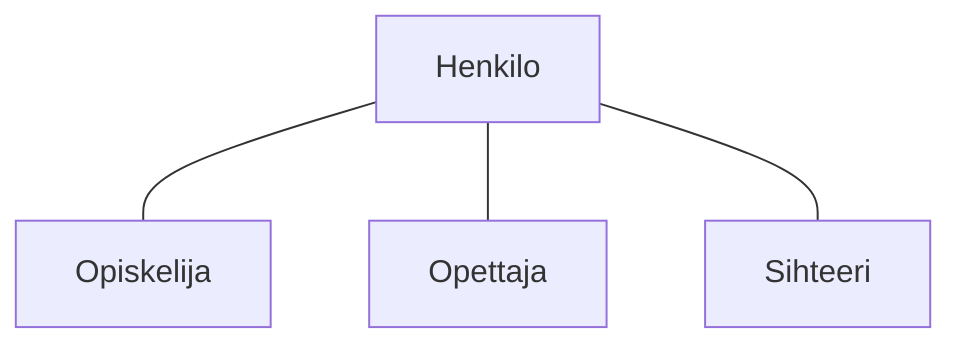

# Perintä

> [!Osaamistavoitteet]
>
> - Perintä ("Kissa on Eläin", metodin ylikirjoitus, protected, luokkahierarkia)
> - Käytetään perintää olioiden yhteistyössä
> - Ymmärrät miten luokat ja oliot voivat periä toistensa ominaisuuksia
> - Ymmärrät miten metodeja voi ylikirjoittaa luokan sisällä ja luokkien yli
> - Ylikirjoitus, @Override, final
> - Osaat luoda yksinkertaisen luokkahierarkian, jossa luokka perii toisen luokan ja ylikirjoittaa sen metodeja
> - Konkreettinen esimerkki: Javan Object-luokka ja sen ylikirjoitettavat metodit
>    - Ymmärtää, että kaikki Javan luokat perivät `Object`-luokasta
>    - Tuntee hyödylliset ylikirjoitettavat metodit `Object`-luokassa: `equals`, `toString`, (ehkä `hashCode`?)

Määritelmä

*Perintä* tarkoittaa mekanismia, jossa luokkaan voidaan sisällyttää toisen luokan ominaisuuksia ja toiminnallisuuksia. Tämä mahdollistaa koodin uudelleenkäytön ja luokkien välisen hierarkian luomisen.

## Esimerkki

Käytännössä olioilla on usein yhteisiä piirteitä ja toimintoja. Otetaan keksitty esimerkki henkilötietojärjestelmästä: `Opiskelija`, `Opettaja` ja `Sihteeri` voisivat kaikki olla `Henkilo`-olioita kuvitteellisessa Kisu-opintotietojärjestelmässä. Kaikilla näillä on henkilöille yhteisiä ominaisuuksia, kuten nimi ja käyttäjätunnus. Jokaisella on myös yhteisiä toimintoja, kuten kirjautuminen järjestelmään.

Kullakin henkilöllä on kuitenkin myös omia erityispiirteitään: Opiskelijalla on opiskelijanumero ja opintopisteet, Opettajalla on tehtävänimike ja kurssit, joita hän opettaa, mutta hänellä ei ole opintopisteitä. Sihteeri on vastuussa opintosuoritusten kirjaamisesta ja tutkinnon antamisesta, mutta hänellä ei ole opiskelijanumeroa tai opetettavia kursseja.

Voisimme nyt luoda kolme erillistä luokkaa: `Opiskelija`, `Opettaja` ja `Sihteeri`. 

### [Opiskelija.java](#tab/tabid-opiskelija)

```java
class Opiskelija {
    String nimi;
    String kayttajatunnus;
    String opiskelijanumero;
    int opintopisteet;

    void kirjaudu() {
        // Kirjautumislogiikka
    }
}

*** 

### [Opettaja.java](#tab/tabid-opettaja)

```java
class Opettaja {
    String nimi;
    String kayttajatunnus;
    String tehtavanimike;
    List<String> opetettavatKurssit;

    void kirjaudu() {
        // Kirjautumislogiikka
    }
}
```

***

### [Sihteeri.java](#tab/tabid-sihteeri)

```java
class Sihteeri {
    String nimi;
    String kayttajatunnus;

    void kirjaudu() {
        // Kirjautumislogiikka
    }
}
```

*** 


Jokaisessa luokassa määriteltäisiin kaikille henkilöille yhteiset ominaisuudet ja toiminnot. Tämä johtaisi hyvin toisteiseen koodiin ja ylläpidon vaikeutumiseen. 

## Luokkahierarkia

Toistamisen välttämiseksi voimme luoda yliluokan nimeltä `Henkilo`, joka sisältää kaikki yhteiset ominaisuudet ja toiminnot. Sitten `Opiskelija`, `Opettaja` ja `Sihteeri` voivat periä `Henkilo`-luokan, jolloin ne saavat *automaattisesti* kaikki sen määrittelemät ominaisuudet ja metodit. Näin voimme lisätä vain erityispiirteet kuhunkin aliluokkaan ilman koodin toistamista.

Periytymistä voidaan kuvata alla olevan tapaisella kuviolla. Tässä `Henkilo` on yliluokka (superclass) ja `Opiskelija`, `Opettaja` ja `Sihteeri` ovat aliluokkia (subclasses), jotka perivät `Henkilo`-luokan ominaisuudet ja metodit.



## Syntaksi

Perintä tapahtuu Java-kielessä käyttämällä `extends`-avainsanaa. Alla on esimerkki siitä, miten `Maastopyörä`-luokka perii `Pyörä`-luokan:

```java
class Henkilo {
    String nimi;
    String kayttajatunnus;

    void vaihdaKayttajatunnusta(String uusiKayttajatunnus) {
        kayttajatunnus = uusiKayttajatunnus;
    }
}

class Opiskelija extends Henkilo {
    String opiskelijanumero;
    int opintopisteet;

    void ilmoittauduKurssille(String kurssi) {
        // Kurssille ilmoittautumisen logiikka
    }
}

class Opettaja extends Henkilo {
    String tehtavanimike;
    List<String> opetettavatKurssit;

    void lisaaKurssi(String kurssi) {
        opetettavatKurssit.add(kurssi);
    }
}

class Sihteeri extends Henkilo {
    void kirjaaOpintosuoritus(String opiskelija, String kurssi) {
        // Opintosuorituksen kirjaamisen logiikka
    }
}