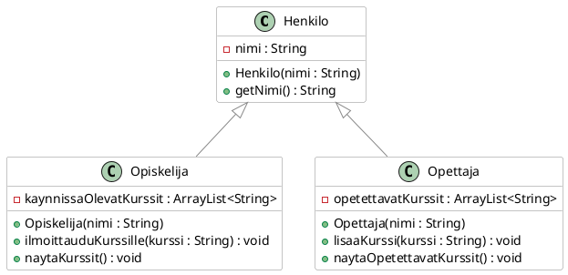
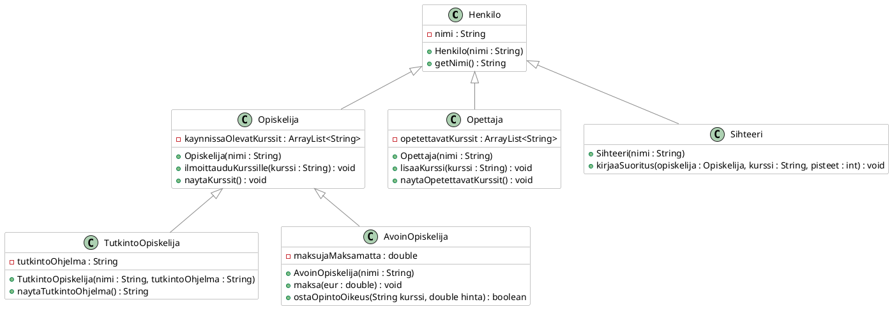

# Perintä

> [!Osaamistavoitteet]
>
> - Ymmärrät perinnän käsitteen olio-ohjelmoinnissa ja osaat periä luokkia Javassa
> - Osaat luoda yksinkertaisen luokkahierarkian, jossa luokka perii toisen luokan
> - Ymmärrät, että kaikki Javan luokat perivät `Object`-luokan

*Perintä* tarkoittaa mekanismia, jossa luokka sisällyttää itseensä toisen luokan ominaisuudet (attribuutit) ja toiminnallisuudet (metodit). Tämä mahdollistaa koodin uudelleenkäytön ja luokkien välisen hierarkian luomisen. 

Käytännössä olioilla on usein yhteisiä piirteitä. Yksi tapa näiden yhteisten piirteiden käsittelemiseen siten, että koodia ei tarvitse toistaa, on perintä.  

## Opintotietojärjestelmä

Otetaan keksitty esimerkki henkilötietojärjestelmästä: Olli Opiskelija, Maija Opettaja ja Satu Sihteeri voisivat kaikki olla olioita kuvitteellisessa Kisu-opintotietojärjestelmässä. Kaikilla näillä on kaikille käyttäjille tyypillisiä ominaisuuksia, kuten nimi ja käyttäjätunnus. Jokaisen pitäisi myös päästä kirjautumaan sisään järjestelmään ja sieltä ulos. 

Kullakin käyttäjällä on kuitenkin myös omia erityispiirteitään: Opiskelijalla voisi olla lista kursseista, joille hän on ilmoittautunut, sekä hänen suorittamansa opintopisteet. Opettajalla on kurssit, joita hän opettaa sekä tehtävänimike, mutta hänellä ei ole opintopisteitä. Sihteeri on vastuussa opintosuoritusten kirjaamisesta ja tutkinnon antamisesta, mutta hänellä ei ole opiskelijanumeroa tai opetettavia kursseja.

Lähdetään kuitenkin aluksi liikkeelle pienesti. Alla on `Opiskelija`- ja `Opettaja`-luokat, joihin olemme tehneet pari attribuuttia ja metodia. Tutki näitä luokkia.  

> [!VAROITUS]
> Useista alla olevista esimerkeistä puuttuu dokumentaatiokommentit, tai kommentit voivat olla osittain puutteellisia. Tämä on tietoinen valinta, sillä niiden lisääminen pidentäisi esimerkkikoodia, ja siten hankaloittaisi lukemista. Tässä materiaalissa koodia "dokumentoidaan" ja sitä selitetään ympäröivällä tekstillä, joten tämän materiaalin esitystavassa dokumentaatio ei ole välttämättä tarpeen. Dokumentaatiokommentit on kuitenkin kirjoitettu mukaan [GitHubissa](https://github.com/ohj-perus-jy/ohj2/tree/main/src/examples/osa3/) olevien esimerkkikoodien tiedostoihin.
>
> Lisää omaan koodiisi kuitenkin aina asianmukaiset dokumentaatiokommentit!

> [!VAROITUS]
> Alla oleva esimerkki on tarkoitettu havainnollistamaan perinnän syntaksia, eikä siitä syystä noudata (vielä) parhaita käytäntöjä. Erityisesti nimen asettaminen sellaisenaan attribuutin arvoksi käyttämällä julkista `setNimi`-metodia rikkoo tiedon piilottamisen periaatetta (ks. [Luku 2.3](../osa2/03-kapselointi.md)). Korjaamme tämän asian kuitenkin esimerkin edetessä.

```java
// FILE: Opiskelija.java  
{{#include ../examples/osa3/E31_Kisu_vaihe0/src/Opiskelija.java}}
// FILE_END  
// FILE: Opettaja.java  
{{#include ../examples/osa3/E31_Kisu_vaihe0/src/Opettaja.java}}
// FILE_END  
//FILE: main.java  
{{#include ../examples/osa3/E31_Kisu_vaihe0/src/Main.java}}
// FILE_END  
```

Huomaat, että kummassakin luokassa on samat attribuutti `nimi` sekä metodit `getNimi` ja `setNimi`. Näiden luokkien välillä on toki myös eroja, mutta nimen omaan toisto on ongelmallista, koska:

 * jokaisessa luokassa on määriteltävä samat ominaisuudet ja toiminnot uudelleen, 
 * jos haluamme muuttaa jotain yhteistä ominaisuutta tai toimintoa, meidän täytyy tehdä se kolmessa eri paikassa,
 * uuden luokan lisääminen, jolla on samat ominaisuudet, vaatii saman koodin kopioimisen uudelleen taas uuteen paikkaan.

Jos nyt haluaisimme muuttaa esimerkiksi `nimi`-attribuuttia niin, että `etunimi` ja `sukunimi` tallennetaan erikseen kahteen attribuuttiin, meidän pitäisi tehdä tämä muutos kaikissa näissä luokissa. Tämä lisää virheiden mahdollisuutta ja tekee koodin ylläpidosta hyvin hankalaa. Yksi ohjelmistokehityksen periaatteista onkin *älä toista itseäsi* (*Don't Repeat Yourself*, lyh. DRY; ks. [Wikipedia](https://en.wikipedia.org/wiki/Don%27t_repeat_yourself)). 

## Luokkahierarkia

Toistamisen välttämiseksi voimme luoda yliluokan (engl. *superclass*) nimeltä `Henkilo`, joka sisältää kaikki yhteiset ominaisuudet ja toiminnot. Sitten alaluokat (engl. *subclass*) `Opiskelija` ja `Opettaja` voivat *periä* `Henkilo`-luokan, jolloin ne saavat *automaattisesti* kaikki sen määrittelemät ominaisuudet ja metodit. Näin voimme lisätä vain erityispiirteet kuhunkin aliluokkaan ilman koodin toistamista.

Toteutetaan nyt yllä kuvattu tilanne uudestaan niin, että kirjoitetaan kaikissa luokissa esiintyvät ominaisuudet ja toiminnot *uuteen* `Henkilo`-luokkaan, ja `Opiskelija` ja `Opettaja` perivät kyseisen luokan. Javassa perintä toteutetaan käyttämällä `extends`-avainsanaa. Esimerkiksi `class Opiskelija extends Henkilo` tarkoittaa, että `Opiskelija`-luokka perii `Henkilo`-luokan. Tehdään tämä muutos koodissamme.

```java
// FILE: Henkilo.java
public class Henkilo {
    String nimi;

    String getNimi()
    {
        return this.nimi;
    }

    void setNimi(String nimi) {
        this.nimi = nimi;
    }
}
// FILE_END
// FILE: Opiskelija.java
import java.util.ArrayList;

class Opiskelija extends Henkilo {
    ArrayList<String> kaynnissaOlevatKurssit;

    public Opiskelija() {
        this.kaynnissaOlevatKurssit = new ArrayList<>();
    }

    void naytaOpintosuunnitelma() {
        String kurssit = String.join(", ", kaynnissaOlevatKurssit);
        IO.println(this.nimi + " opiskelee kursseilla: " + kurssit);
    }

    void ilmoittauduKurssille(String kurssi) {
        IO.println(this.nimi + " ilmoittautui kurssille: " + kurssi);
        kaynnissaOlevatKurssit.add(kurssi);
    }
}
// FILE_END
// FILE: Opettaja.java
import java.util.ArrayList;

class Opettaja extends Henkilo {
    ArrayList<String> opetettavatKurssit;

    public Opettaja() {
        this.opetettavatKurssit = new ArrayList<>();
    }

    void naytaOpetettavatKurssit() {
        String kurssit = String.join(", ", opetettavatKurssit);
        IO.println(this.nimi + " opettaa kursseja: " + kurssit);
    }

    void lisaaKurssi(String kurssi) {
        opetettavatKurssit.add(kurssi);
    }
}
// FILE_END
// FILE: main.java
public class Main {
    public static void main() {
        Opiskelija opiskelija = new Opiskelija();
        opiskelija.setNimi("Olli Opiskelija");
        opiskelija.ilmoittauduKurssille("Ohjelmointi 2");

        Opettaja opettaja = new Opettaja();
        opettaja.setNimi("Maija Opettaja");
        opettaja.lisaaKurssi("Ohjelmointi 1");
        opettaja.lisaaKurssi("Ohjelmointi 2");
        opettaja.naytaOpetettavatKurssit();
    }
}
// FILE_END
``` 

Huomaa, että `Opiskelija`- ja `Opettaja`-luokat eivät enää määrittele `nimi`-attribuuttia tai `getNimi`- ja `setNimi`-metodeja, koska ne perivät nämä `Henkilo`-luokasta, eikä sitä koodia enää tarvitse uudelleen kirjoittaa. Tämä tekee koodista huomattavasti siistimpää ja helpommin ylläpidettävää. Perinnällä siis määritetään *yksi* yliluokka (tässä `Henkilo`) ja aliluokka tai aliluokat (tässä `Opiskelija` ja `Opettaja`), jotka laajentavat (engl. *extend*) `Henkilo`-luokan lisätiedoilla ja -toiminnallisuuksilla opiskelijasta ja opettajasta. 

Toisin sanoen, `Opiskelija` ja `Opettaja` saavat itselleen samat (ei-yksityiset) attribuutit ja (ei-yksityiset) metodit kuin `Henkilo`-luokka ilman sitä, että ne pitää erikseen määritellä aliluokissa. 

Kirjallisuudessa käytetään joskus yliluokka- ja aliluokka-termeistä myös nimityksiä kantaluokka (engl. *base class*) ja johdettu luokka (engl. *derived class*). Myös muita nimityksiä on käytössä. Näillä termeillä tarkoitetaan samaa asiaa kuin yliluokka- ja aliluokka-termeillä. Käytämme tässä materiaalissa kuitenkin pääasiassa yliluokka- ja aliluokka-termejä.

Periytymistä voidaan kuvata alla olevan tapaisella kuviolla. Tässä `Henkilo` on yliluokka (superclass) ja `Opiskelija` ja `Opettaja` ovat aliluokkia (subclasses), jotka perivät `Henkilo`-luokan ominaisuudet ja metodit.

```plantuml
@startuml
' --- Style: square corners, no compartments, theme-safe colors ---
hide empty members
skinparam class {
    RoundCorner        0
    BorderColor        #888888
    BackgroundColor    transparent
}
skinparam arrowColor   #888888

class Henkilo
class Opiskelija
class Opettaja

Henkilo <|-- Opiskelija
Henkilo <|-- Opettaja
@enduml
``` 



Iso C-kirjain tarkoittaa, että kyseessä on luokka. Nuoli ylöspäin tarkoittaa
perintää, eli aliluokka (nuolen tyvessä) perii yliluokan (nuolen kärjessä). Yllä
oleva kuvio on tehty mukaillen niin sanottua UML-kuvauskieltä (engl. *Unified
Modelling Language*). 

## Muodostajat ja super-avainsana

Yliluokan muodostajia voidaan kutsua aliluokista käyttäen `super`-avainsanaa.
Katsotaan esimerkin kautta, missä tällainen kutsu on tarpeen.

Yllä olevassa esimerkissämme on pari ongelmaa. `Henkilo`-luokassa ei ole
muodostajaa, jolloin nimen alustaminen tapahtuu `setNimi`-metodin kautta. Tästä
seuraa, että `Henkilo`-olion muodostamisen jälkeen `nimi`-attribuutti on aina
`null`, ennen kuin se erikseen asetetaan. Tämä ei ole hyvä käytäntö kahdestakin
syystä: Ensinnäkin, on parempi, että olio on käyttökelpoinen heti luomisen
jälkeen ilman, että erillisiä asettamisia tarvitsee tehdä. Toiseksi, nimen
asettaminen julkisen `setNimi`-metodin kautta ei ole hyvä idea, sillä se rikkoo
tiedon kapseloinnin periaatetta. 

Vaikka nimen muuttaminen toki pitäisikin tietyissä tilanteissa olla
opintotietojärjestelmässä mahdollista, sen asettaminen julkisen metodin kautta,
eli niin, että mikä tahansa olio voisi kutsua minkä tahansa `Henkilo`-olion
metodia nimen muuttamiseksi, ei pitäisi olla sallittua, vaan pitäisi tapahtua
huomattavasti hallitumman prosessin kautta. 

Korjataan tilanne. Asetetaan aluksi `nimi`-attribuutti yksityiseksi
`Henkilo`-luokassa. Lisätään sitten muodostaja, joka ottaa `nimi`-parametrin, ja
alustaa attribuutin arvon vastaavasti. Tämän jälkeen voimme poistaa
`setNimi`-metodin kokonaan, jolloin nimen asettaminen onnistuu vain muodostajan
kautta. Niinpä nimen muuttaminen ei enää onnistu, mutta tämä sopii meille tässä
vaiheessa. 

Muutetaan olioiden rakentelu pääohjelmassa vastaamaan tätä uutta muodostajaa.

```java,noplayground
// FILE: Henkilo.java
class Henkilo {

    // HIGHLIGHT_GREEN_BEGIN
    private String nimi;

    public Henkilo(String nimi) {
        this.nimi = nimi;
    }
    // HIGHLIGHT_GREEN_END

    // HIGHLIGHT_RED_BEGIN
    void setNimi(String nimi) {
        this.nimi = nimi;
    }
    // HIGHLIGHT_RED_END

    public String getNimi() {
        return this.nimi;
    }
}
// FILE_END
// FILE: main.java
public class Main {
    public static void main() {
        // HIGHLIGHT_GREEN_BEGIN
        Opiskelija opiskelija = new Opiskelija("Matti Meikäläinen");        
        // HIGHLIGHT_GREEN_END
        // HIGHLIGHT_RED_BEGIN
        opiskelija.setNimi("Matti Meikäläinen");
        // HIGHLIGHT_RED_END
        opiskelija.ilmoittauduKurssille("Ohjelmointi 2");
        opiskelija.naytaOpintosuunnitelma();

        // ...
    }
}
// FILE_END
```

Nyt koska `Henkilo`-luokassa on määritelty muodostaja, joka *ottaa* parametreja,
Java ei enää luo oletusmuodostajaa—siis sellaista, jossa ei ole
parametreja—automaattisesti. Tämä aiheuttaa käännösvirheen&mdash;valitettavasti
hieman kryptisen sellaisen.

```
java: constructor Opiskelija in class Opiskelija cannot be applied to given types;
  required: no arguments
  found:    java.lang.String
  reason: actual and formal argument lists differ in length
```

Virheilmoituksen pointti on, että `Opiskelija`-olion muodostaja ei vastaa sitä,
miten yritämme luoda olion pääohjelmassa. 

Tässä tuleekin tärkeä huomio: Luokat eivät peri muodostajia yliluokiltaan.
Esimerkiksi `Opiskelija`-luokka ei peri `Henkilo`-luokan muodostajia, vaan ne
täytyy määritellä erikseen jokaisessa aliluokassa. Tehdään `Opiskelija` ja
`Opettaja`-luokkiin muodostajat vastaamaan tätä vaatimusta. Esimerkiksi
`Opiskelija`-luokassa muodostajan alku näyttäisi tältä.

```java,noplayground
class Opiskelija extends Henkilo {
    public Opiskelija(String nimi) {
        // Muodostajan runko tulee tähän
    }
}
```

Toisaalta nyt kun määrittelimme `nimi`-attribuutin yksityiseksi, emme voi
myöskään asettaa niitä perivästä luokasta käsin, esimerkiksi seuraavasti.

```java,noplayground
class Opiskelija extends Henkilo {
    public Opiskelija(String nimi) {
        // HIGHLIGHT_YELLOW_BEGIN
        this.nimi = nimi;
        // HIGHLIGHT_YELLOW_END
    }
}
```

```
Opiskelija.java:6:5
java: constructor Henkilo in class Henkilo cannot be applied to given types;
  required: java.lang.String
  found:    no arguments
  reason: actual and formal argument lists differ in length

Opiskelija.java:8:13
java: nimi has private access in Henkilo
```

Ensimmäinen virhe liittyy siihen, että `Henkilo`-luokassa ei ole ei-parametrista
muodostajaa. Korjaamme tämän hieman myöhemmin. Jälkimmäinen virhe on tämän
hetkinen ongelmamme: `nimi`-attribuutti on yksityinen, joten emme voi asettaa
sitä suoraan perivästä luokasta käsin.

Koska poistimme `setNimi`-metodin, niin ainoa tapa asettaa nimen arvo on tehdä
se kutsumalla aliluokasta muodostajasta käsin yliluokan muodostajaa ja
välittämällä tuossa kutsussa tarvittavat parametrit. Tämä kutsuminen toteutetaan
`super`-avainsanaa. Tehdään tämä muutos kumpaankin aliluokkaan. Muutetaan
samalla myös loputkin attribuutit yksityisiksi.

```java,noplayground
import java.util.ArrayList;
class Opiskelija extends Henkilo {
    // HIGHLIGHT_GREEN_BEGIN
    private ArrayList<String> kaynnissaOlevatKurssit;
    // HIGHLIGHT_GREEN_END

    // HIGHLIGHT_GREEN_BEGIN
    public Opiskelija(String nimi) {
        super(nimi);
        kaynnissaOlevatKurssit = new ArrayList<>();
    }
    // HIGHLIGHT_GREEN_END
    // ...
}
```

Huomaa, että järjestys on oltava nimen omaan tämä: `super`-kutsu tulee
ensimmäisenä muodostajan rungossa. Vasta sen jälkeen voidaan tehdä muita
alustuksia.

Tee vastaava muutos myös `Opettaja`-luokkaan.

Tämän jälkeen ohjelma ei kuitenkaan vielä käänny, koska perivissä luokissa emme
edelleenkään pääse käsiksi yliluokan yksityiseen `nimi`-attribuuttiin.

```java,noplayground
class Opiskelija extends Henkilo {
    void naytaOpintosuunnitelma() {
        String kurssit = String.join(", ", kaynnissaOlevatKurssit);
        // HIGHLIGHT_YELLOW_BEGIN
        IO.println(this.nimi + " opiskelee kursseilla: " + kurssit);
        // HIGHLIGHT_YELLOW_END
        // Käännösvirhe: nimi on yksityinen muuttuja
    }
}
```

Ainoa tapa päästä käsiksi `nimi`-attribuuttiin on kutsua yliluokan
`getNimi()`-metodia, sillä kyseinen metodi on julkinen. Tehdään tämä muutos
kaikkiin kohtiin, joissa `nimi`-attribuuttiin viitataan suoraan perivissä
luokissa.  

```java
// FILE: Henkilo.java
class Henkilo {
    private String nimi;

    public Henkilo(String nimi)
    {
        this.nimi = nimi;
    }

    public String getNimi()
    {
        return nimi;
    }
}
// FILE_END
// FILE: Opiskelija.java
import java.util.ArrayList;
class Opiskelija extends Henkilo {
    ArrayList<String> kaynnissaOlevatKurssit;

    public Opiskelija(String nimi) {
        super(nimi);
        kaynnissaOlevatKurssit = new ArrayList<>();
    }

    void ilmoittauduKurssille(String kurssi) {
        kaynnissaOlevatKurssit.add(kurssi);
    }

    public void naytaKurssit(){
        String kaikkiKurssit = String.join(", ", kaynnissaOlevatKurssit);
        IO.println(this.getNimi() + " opiskelee kursseilla: " + kaikkiKurssit);
    }
}
// FILE_END
// FILE: Opettaja.java
import java.util.ArrayList;
class Opettaja extends Henkilo {
    private ArrayList<String> opetettavatKurssit;

    public Opettaja(String nimi)
    {
        super(nimi);
        this.opetettavatKurssit = new ArrayList<>();
    }

    void lisaaKurssi(String kurssi) {
        opetettavatKurssit.add(kurssi);
    }

    void naytaOpetettavatKurssit() {
        String kurssit = String.join(", ", opetettavatKurssit);
        IO.println(this.getNimi() + " opettaa kursseja: " + kurssit);
    }
}
// FILE_END
// FILE: main.java
public class Main {
    public static void main() {
        Opiskelija opiskelija = new Opiskelija("Olli Opiskelija");
        opiskelija.ilmoittauduKurssille("Ohjelmointi 2");
        opiskelija.naytaKurssit();

        Opettaja opettaja = new Opettaja("Maija Opettaja");
        opettaja.lisaaKurssi("Ohjelmointi 1");
        opettaja.lisaaKurssi("Ohjelmointi 2");
        opettaja.naytaOpetettavatKurssit();
    }
}
// FILE_END
```

Ei-parametrista muodostajaa emme tarvitse enää, joten jätämme sen toteuttamatta. 

UML-kaavioihin on tapana lisätä perintäsuhteiden lisäksi tietoja luokkien
attribuuteista ja metodeista sekä niiden näkyvyydestä. Attribuutit tyyppeineen
merkitään luokan nimen alle, ja metodit, myös muodostajat, vastaavasti ihan
alimmaiseksi. Perittyjä attribuutteja metodeja, kuten tässä attribuutti `nimi`
ja metodi `getNimi()`, ei yleensä merkitä kaavioon, paitsi jos ne
ylikirjoitetaan aliluokassa&mdash;tästä lisää [Luvussa 3.2](02-polymorfismi.md).
Vihreä pallo tarkoittaa, että kyseessä on julkinen (public) attribuutti/metodi,
ja punainen neliö, että kyseessä on yksityinen attribuutti/metodi. Tietojen
merkitseminen kaavioon mahdollistaa rakenteiden kuvailemisen ilman, että
tarvitsee sanallisesti kuvailla kaikkia yksityiskohtia.



Luokkahierarkia voi olla enemmänkin kuin kaksi tasoa syvä. Meillä voisi olla
myös `Sihteeri`, joka voi kirjata opintosuorituksia. `Sihteeri` peritään
`Henkilo`-luokasta. Voisimme tehdä myös kahdenlaisia erilaisia opiskelijoita:
Tutkinto-opiskelijoita sekä Avoimen yliopiston opiskelijoita.
Tutkinto-opiskelijalla voisi olla oma tutkinto-ohjelma, kun taas Avoimen
opiskelijalla ei ole tutkinto-ohjelmaa. Toisaalta Avoimen opiskelijan täytyisi
suorittaa maksu ennen kuin hän voi saada opintopisteitä. 

Luokkahierarkia näyttäisi nyt seuraavalta. Merkitään tähänkin kuvioon
attribuutit ja metodit mukaan. Tekstit menevät jo aika pieneksi, joten saat
halutessasi kuvan auki uuteen välilehteen klikkaamalla sitä oikealla (tai
Ctrl+klikkaamalla macOS:ssa) ja avaamalla kuvan uuteen välilehteen. 



Koska nuoli `TutkintoOpiskelija`-luokasta osoittaa `Opiskelija`-luokkaan ja
sieltä edelleen `Henkilo`-luokkaan, niin `TutkintoOpiskelija`-luokasta
muodostettu olio perii sekä  `Opiskelija`-luokan ominaisuudet ja metodit, että
`Henkilo`-luokan ominaisuudet ja metodit. Vastaavasti `AvoinOpiskelija`-luokasta
tehty olio perii myös molemmat luokat.

Jätämme esimerkin tässä toteuttamatta, mutta [voit halutessasi tutkia valmista koodia täällä](https://github.com/ohj-perus-jy/ohj2/tree/main/src/examples/osa3/E31_Kisu_vaihe4).

Huomautetaan vielä, että yliluokan muodostajan kutsuminen `super`-avainsanalla
kutsuu nimen omaan luokan välittömän yliluokan muodostajaa. Luokkarakenteessa
"yli hyppiminen", tyyliin `super().super()` ei ole mahdollista. Niinpä
`TutkintoOpiskelija`-luokan muodostajassa voi kutsua vain `Opiskelija`-luokan
muodostajaa, ei `Henkilo`-luokan muodostajaa.

## Metodit ja super-avainsana

`super`-avainsanaa voidaan käyttää kutsuttaessa yliluokasta perittyä 
metodia, kun halutaan eksplisiittisesti viitata yliluokan metodiin. 

```java,ignore
class Opiskelija extends Henkilo {

    // ...    
    public void naytaKurssit(){
        String kaikkiKurssit = String.join(", ", kaynnissaOlevatKurssit);
        // HIGHLIGHT_RED_BEGIN
        IO.println(this.getNimi() + " opiskelee kursseilla: " + kaikkiKurssit);
        // HIGHLIGHT_RED_END
        // HIGHLIGHT_GREEN_BEGIN
        IO.println(super.getNimi() + " opiskelee kursseilla: " + kaikkiKurssit);
        // HIGHLIGHT_GREEN_END
    }
}
```

Tässä esimerkissä tällä ei ole mitään vaikutusta, koska `getNimi()` on sama sekä
yliluokassa että aliluokassa. Seuraavassa luvussa [3.2
Polymorfismi](02-polymorfismi.md) käsitellään tilannetta, jossa aliluokassa on
määritelty saman niminen metodi kuin yliluokassa. Tällöin `super`-avainsanalla
voidaan viitata nimenomaisesti yliluokan metodiin.

## Huomautus moniperinnän puuttumisesta

Javassa luokka voi periä vain yhden luokan. Joissain muissa ohjelmointikielissä, kuten C++:ssa, on mahdollista käyttää *moniperintää* (engl. *multiple inheritance*), jossa luokka voi periä useamman kuin yhden luokan. Emme tässä mene syvemmälle moniperinnän käsitteeseen, mutta mainittakoon, moniperinnän käyttö voi joissain tilanteissa olla ongelmallista (esim. [Timanttiongelma](https://en.wikipedia.org/wiki/Multiple_inheritance#The_diamond_problem)). 

Usein kirjallisuudessa mainitaan, että Javassa moniperintää muistuttaa hieman *rajapinnan* käsite (engl. *interface*). Kysymys on kuitenkin monin tavoin eri asiasta. Rajapintoja käsitellään osassa [3.4 Rajapinta](04-rajapinta.md)

## Tehtävät

<task>
  <task-title>Tehtävä 3.1: Luokkahierarkia, osa 1. <points>1 p.</points> </task-title>
  <handout>

  {{#include ../exercises/3-1-luokkahierarkia/handout.md}}

  </handout>
  <task-link><a href="https://tim.jyu.fi/view/kurssit/tie/tiep111/tehtavat/osa3/tehtava1">Tee tehtävä TIMissä</a></task-link>
</task>

<task>
  <task-title>Tehtävä 3.2: Luokkahierarkia, osa 2. <points>1 p.</points> </task-title>
  <handout>

  {{#include ../exercises/3-2-luokkahierarkia/handout.md}}

  </handout>
  <task-link><a href="https://tim.jyu.fi/view/kurssit/tie/tiep111/tehtavat/osa3/tehtava2">Tee tehtävä TIMissä</a></task-link>
</task>

<task>
  <task-title>✨ Bonus: Tehtävä 3.3: Luokkahierarkia, osa 3. <points>1 p.</points> </task-title>
  <handout>

  {{#include ../exercises/3-3-bonus-luokkahierarkia/handout.md}}

  </handout>
  <task-link><a href="https://tim.jyu.fi/view/kurssit/tie/tiep111/tehtavat/osa3/tehtava3">Tee tehtävä TIMissä</a></task-link>
</task>