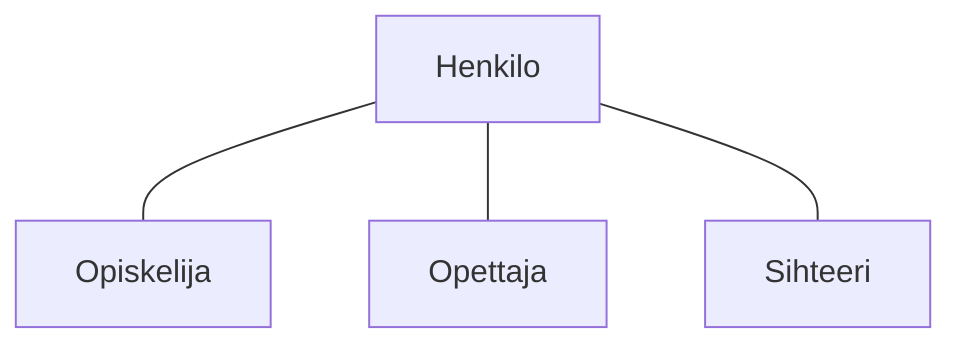
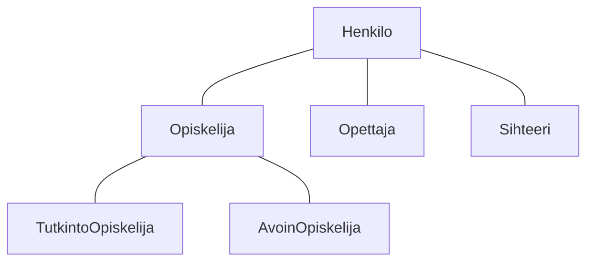

# Perintä

> [!Osaamistavoitteet]
>
> - Perintä ("Kissa on Eläin", metodin ylikirjoitus, protected, luokkahierarkia)
> - Käytetään perintää olioiden yhteistyössä
> - Ymmärrät miten luokat ja oliot voivat periä toistensa ominaisuuksia
> - Ymmärrät miten metodeja voi ylikirjoittaa luokan sisällä ja luokkien yli
> - Ylikirjoitus, @Override, final
> - Osaat luoda yksinkertaisen luokkahierarkian, jossa luokka perii toisen luokan ja ylikirjoittaa sen metodeja
> - Konkreettinen esimerkki: Javan Object-luokka ja sen ylikirjoitettavat metodit
>    - Ymmärtää, että kaikki Javan luokat perivät `Object`-luokasta
>    - Tuntee hyödylliset ylikirjoitettavat metodit `Object`-luokassa: `equals`, `toString`, (ehkä `hashCode`?)

Lähteitä

<https://docs.oracle.com/javase/tutorial/java/concepts/inheritance.html>

Määritelmä

*Perintä* tarkoittaa mekanismia, jossa luokkaan voidaan sisällyttää toisen luokan ominaisuuksia ja toiminnallisuuksia. Tämä mahdollistaa koodin uudelleenkäytön ja luokkien välisen hierarkian luomisen. Javassa perintä toteutetaan käyttämällä `extends`-avainsanaa.

## Esimerkki

Käytännössä olioilla on usein yhteisiä piirteitä ja toimintoja. Otetaan keksitty esimerkki henkilötietojärjestelmästä: `Opiskelija`, `Opettaja` ja `Sihteeri` voisivat kaikki olla olioita kuvitteellisessa Kisu-opintotietojärjestelmässä. Kaikilla näillä on henkilöille yhteisiä ominaisuuksia, kuten nimi ja käyttäjätunnus. Jokaisella on myös yhteisiä toimintoja, kuten kirjautuminen järjestelmään.

Kullakin henkilöllä on kuitenkin myös omia erityispiirteitään: Opiskelijalla on lista kursseista, joille hän on ilmoittautunut, sekä opintopisteet. Opettajalla on tehtävänimike ja kurssit, joita hän opettaa, mutta hänellä ei ole opintopisteitä. Sihteeri on vastuussa opintosuoritusten kirjaamisesta ja tutkinnon antamisesta, mutta hänellä ei ole opiskelijanumeroa tai opetettavia kursseja.

Voisimme nyt luoda kolme erillistä luokkaa: `Opiskelija`, `Opettaja` ja `Sihteeri`. Tutki alla olevia luokkia, niissä olevia attribuutteja ja metodeja. 

### [Opiskelija.java](#tab/opiskelija)

```java
class Opiskelija {
    String nimi;
    String kayttajatunnus;
    List<String> kurssit;
    int opintopisteet;

    void kirjaudu() {
        // Kirjautumislogiikka
    }

    void ilmoittauduKurssille(String kurssi) {
        // Kurssille ilmoittautumisen logiikka
    }
}
```

***

### [Opettaja.java](#tab/opettaja)

```java
class Opettaja {
    String nimi;
    String kayttajatunnus;
    String tehtavanimike;
    List<String> opetettavatKurssit;

    void kirjaudu() {
        // Kirjautumislogiikka
    }

    void lisaaKurssi(String kurssi) {
       // Kurssin lisäämisen logiikka
    }
}
``` 

***

### [Sihteeri.java](#tab/sihteeri)

```java
class Sihteeri {
    String nimi;
    String kayttajatunnus;


    void kirjaudu() {
        // Kirjautumislogiikka
    }

    void kirjaaOpintosuoritus(String opiskelija, String kurssi) {
        // Opintosuorituksen kirjaamisen logiikka
    }
}
```

*** 

Huomaat, että kaikissa kolmessa luokassa on samat attribuutit `nimi` ja `kayttajatunnus`, sekä sama metodi `kirjaudu()`. Toki näiden luokkien välillä on myös eroja, mutta tämä toisto on ongelmallista, koska:

 * jokaisessa luokassa on määriteltävä samat ominaisuudet ja toiminnot uudelleen, 
 * jos haluamme muuttaa jotain yhteistä ominaisuutta tai toimintoa, meidän täytyy tehdä se kolmessa eri paikassa,
 * uuden luokan lisääminen, jolla on samat ominaisuudet, vaatii saman koodin kopioimisen uudelleen taas uuteen paikkaan.

Jos sitten haluaisimme muuttaa esimerkiksi `nimi`-attribuuttia niin, että etunimi ja sukunimi tallennetaan erikseen kahteen attribuuttiin, meidän pitäisi tehdä tämä muutos kaikissa näissä luokissa. Tämä lisää virheiden mahdollisuutta ja tekee koodin ylläpidosta hyvin hankalaa. 

## Luokkahierarkia

Toistamisen välttämiseksi voimme luoda yliluokan nimeltä `Henkilo`, joka sisältää kaikki yhteiset ominaisuudet ja toiminnot. Sitten `Opiskelija`, `Opettaja` ja `Sihteeri` voivat *periä* `Henkilo`-luokan, jolloin ne saavat *automaattisesti* kaikki sen määrittelemät ominaisuudet ja metodit. Näin voimme lisätä vain erityispiirteet kuhunkin aliluokkaan ilman koodin toistamista.

Toteutetaan nyt yllä kuvattu tilanne uudestaan niin, että kirjoitetaan kaikissa luokissa esiintyvät ominaisuudet ja toiminnot *uuteen* `Henkilo`-luokkaan, ja muut luokat perivät kyseisen luokan.


### [Henkilo.java](#tab/henkilo)

```java
class Henkilo {
    String nimi;
    String kayttajatunnus;

    void kirjaudu() {
        // Kirjautumislogiikka
    }
}
```

***

### [Opiskelija.java](#tab/opiskelija-extends)

```java
class Opiskelija extends Henkilo {
    List<String> kurssit;
    int opintopisteet;

    void ilmoittauduKurssille(String kurssi) {
        // Kurssille ilmoittautumisen logiikka
    }
}
```

***

### [Opettaja.java](#tab/opettaja-extends)

```java
class Opettaja extends Henkilo {
    String tehtavanimike;
    List<String> opetettavatKurssit;

    void lisaaKurssi(String kurssi) {
       // Kurssin lisäämisen logiikka
    }
}
``` 

***

### [Sihteeri.java](#tab/sihteeri-extends)

```java
class Sihteeri extends Henkilo {

    void kirjaaOpintosuoritus(String opiskelija, String kurssi) {
        // Opintosuorituksen kirjaamisen logiikka
    }
}
```    

*** 

Huomaa, että `Opiskelija`, `Opettaja` ja `Sihteeri`-luokat eivät enää määrittele `nimi`- ja `kayttajatunnus`-attribuutteja tai `kirjaudu()`-metodia, koska ne perivät nämä `Henkilo`-luokasta, eikä sitä koodia enää tarvitse uudelleen kirjoittaa. 

Periytymistä voidaan kuvata alla olevan tapaisella kuviolla. Tässä `Henkilo` on yliluokka (superclass) ja `Opiskelija`, `Opettaja` ja `Sihteeri` ovat aliluokkia (subclasses), jotka perivät `Henkilo`-luokan ominaisuudet ja metodit.



Jatketaan vielä esimerkkiä hieman pidemmälle. Oletetaan, että järjestelmässämme olisi kahdenlaisia opiskelijoita: Tutkinto-opiskelijoita sekä Avoimen yliopiston opiskelijoita. Tutkinto-opiskelijalla on oma tutkinto-ohjelma, kun taas Avoimen opiskelijalla ei ole tutkinto-ohjelmaa. Toisaalta Avoimen opiskelijan täytyy suorittaa maksu ennen kuin hän voi saada opintopisteitä. Toteutetaan nämä luokat perimällä `Opiskelija`-luokasta.

### [TutkintoOpiskelija.java](#tab/tutkinto-opiskelija)

```java
class TutkintoOpiskelija extends Opiskelija {
    String tutkintoOhjelma;
}
```

***

### [AvoinOpiskelija.java](#tab/avoin-opiskelija)

```java
class AvoinOpiskelija extends Opiskelija {
    boolean maksutSuoritettu;

    void suoritaMaksu(double summa) {
        // Maksun suorittamisen logiikka
    }

}
```

***


Luokkahierarkia näyttäisi nyt seuraavalta:




## Ylikirjoittaminen

Perityn luokan metodeja voidaan *ylikirjoittaa* (override) aliluokassa, mikä tarkoittaa, että aliluokka voi määritellä oman version peritystä metodista. Tämä on hyödyllistä, kun haluamme muuttaa perityn metodin käyttäytymistä aliluokassa.

`@Override`

Esimerkki ylikirjoittamisesta: `toString()`-metodi on määritelty Javan `Object`-luokassa, josta kaikki luokat perivät. Voimme ylikirjoittaa tämän metodin omassa luokassamme, jotta se palauttaa luokallemme sopivan merkkijonoesityksen.

```java
@Override
public String toString() {
    return "Opiskelija: " + nimi + ", Käyttäjätunnus: " + kayttajatunnus;
}
```

`final`-avainsanaa voidaan käyttää estämään luokan periminen tai metodin ylikirjoittaminen. Kun luokka on merkitty `final`-avainsanalla, sitä ei voi periä. Vastaavasti, kun metodi on merkitty `final`-avainsanalla, sitä ei voi ylikirjoittaa aliluokassa. ESimerkiksi henkilötietojärjestelmässä voisimme haluta estää `kirjaudu()`-metodin ylikirjoittamisen, jotta kaikki henkilöt käyttävät samaa kirjautumislogiikkaa.

Esimerkki `final`-avainsanan käytöstä metodissa:

```java
public final void kirjaudu() {
    // Kirjautumislogiikka
}
```

## Näkyvyysmääreet

Java tarjoaa kolme pääasiallista näkyvyysmäärettä: `public`, `protected` ja `private`. Näkyvyysmääreet määrittelevät, mistä luokan jäseniin voidaan päästä käsiksi. 

Javassa oletuksena luokan jäsenet ovat ns. `package-private`-näkyvyydellä, mikä tarkoittaa, että ne ovat näkyvissä vain samassa paketissa oleville luokille. Alla olevassa taulukossa on yhteenveto eri näkyvyysmääreiden vaikutuksista; Oletus-sarake viittaa `package-private`-näkyvyyteen.

|                            | Luokka | Pakkaus | Aliluokka | Muu maailma |
| -------------------------- | ------ | ------- | --------- | ----------- |
| `public`                   | Kyllä  | Kyllä   | Kyllä     | Kyllä       |
| `protected`                | Kyllä  | Kyllä   | Kyllä     | Ei          |
| `package-private` (oletus) | Kyllä  | Kyllä   | Ei        | Ei          |
| `private`                  | Kyllä  | Ei      | Ei        | Ei          |

Ensimmäinen sarake ilmaisee, onko luokalla itsellään pääsy määritellyn näkyvyystason jäseneen. Kuten näet, luokalla on aina pääsy omiin jäseniinsä. Toinen sarake ilmaisee, onko luokilla, jotka ovat samassa pakkauksessa kuin kyseinen luokka (riippumatta niiden luokkarakenteesta), pääsy jäseneen. Kolmas sarake ilmaisee, onko luokasta perityillä aliluokilla, jotka sijaitsevat pakkauksen ulkopuolella, pääsy jäseneen. Neljäs sarake ilmaisee, onko millä tahansa luokalla pääsy jäseneen.

Jos ja kun muut ohjelmoijat (tai sinä itse) käyttävät tekemääsi luokkaa, näkyvyysmääreet auttavat varmistamaan, että luokkaasi käytetään sillä tavalla, jolla olet suunnitellut sen käytettävän. 
Pääsääntö on, että ohjelmoijan tulisi käyttää mahdollisimman rajoittavaa näkyvyysmäärettä -- mielellään `private`-määrettä -- ellei ole erityistä syytä käyttää jotain muuta. Tämä auttaa suojaamaan luokan sisäistä tilaa ja estämään tahalliset tai tahattomat väärinkäytökset luokan jäseniin. 
Vältä julkisia kenttiä, ellei kyseessä ole vakio. (Tässä materiaalissa saatetaan käyttää esimerkinomaisesti julkisia kenttiä. Tämä voi auttaa havainnollistamaan joitakin kohtia tiiviisti, mutta sitä ei suositella tuotantokoodissa.) 

... 

Muutetaan Henkilo-luokan `nimi`- ja `kayttajatunnus`-attribuutit `protected`-määritteisiksi:

```java
class Henkilo {
    public String nimi;
    protected String kayttajatunnus;

    public void kirjaudu() {
        // Kirjautumislogiikka
    }

    protected void muutaKayttajatunnus(String uusiTunnus) {
        this.kayttajatunnus = uusiTunnus;
    }
}
```

Nyt `nimi`-attribuutti näkyy myös muissa luokissa. Kuitenkin `kayttajatunnus`-attribuutin sisältämän arvon käyttäminen jostain muusta luokasta, joka ei ole `Henkilo`-luokan aliluokka, saamme käännösvirheen:

```java
class JokuMuuLuokka { 
    void jokuMetodi() {
        Henkilo henkilo = new Henkilo();
        henkilo.muutaKayttajatunnus("uusiTunnus"); // Käännösvirhe: ei pääsyä protected-jäseneen
    }
}
```

## Tehtävät

Tee tehtäviä...