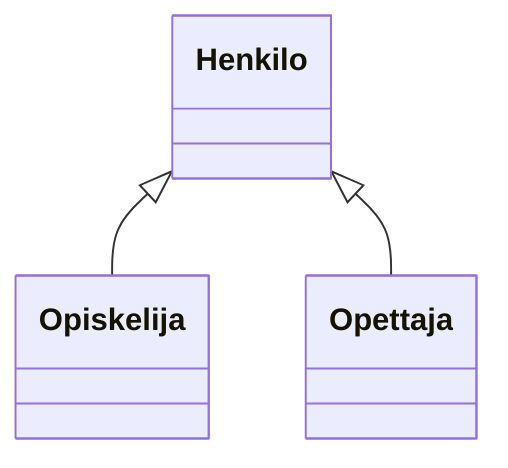
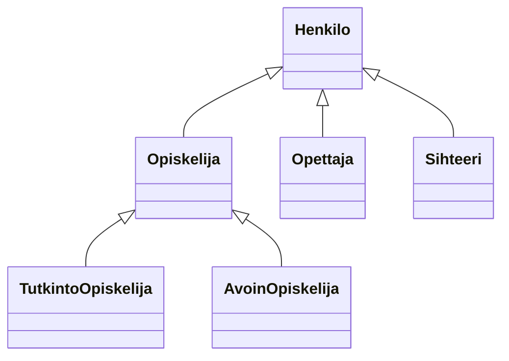

# Perintä

> [!Osaamistavoitteet]
>
> - Perintä ("Kissa on Eläin", metodin korvaaminen, protected, luokkahierarkia)
> - Käytetään perintää olioiden yhteistyössä
> - Ymmärrät miten luokat ja oliot voivat periä toistensa ominaisuuksia
> - Ymmärrät miten metodeja voi korvata luokan sisällä ja luokkien yli
> - Korvaaminen, @Override, final
> - Osaat luoda yksinkertaisen luokkahierarkian, jossa luokka perii toisen luokan ja korvaa sen metodeja
> - Konkreettinen esimerkki: Javan Object-luokka ja sen korvattavat metodit
>    - Ymmärtää, että kaikki Javan luokat perivät `Object`-luokasta
>    - Tuntee hyödylliset korvattavat metodit `Object`-luokassa: `equals`, `toString`, (ehkä `hashCode`?)

*Perintä* tarkoittaa mekanismia, jossa luokkaan voidaan sisällyttää toisen luokan ominaisuuksia ja toiminnallisuuksia. Tämä mahdollistaa koodin uudelleenkäytön ja luokkien välisen hierarkian luomisen. 

## Esimerkki

Käytännössä olioilla on usein yhteisiä piirteitä. Otetaan keksitty esimerkki henkilötietojärjestelmästä: Maija Opiskelija, Olli Opettaja ja Satu Sihteeri voisivat kaikki olla olioita kuvitteellisessa Kisu-opintotietojärjestelmässä. Kaikilla näillä on kaikille käyttäjille tyypillisiä ominaisuuksia, kuten nimi ja käyttäjätunnus. Jokaisen pitäisi myös päästä kirjautumaan sisään järjestelmään ja sieltä ulos. 

Kullakin käyttäjällä on kuitenkin myös omia erityispiirteitään: Opiskelijalla voisi olla lista kursseista, joille hän on ilmoittautunut, sekä hänen suorittamansa opintopisteet. Opettajalla on kurssit, joita hän opettaa sekä tehtävänimike, mutta hänellä ei ole opintopisteitä. Sihteeri on vastuussa opintosuoritusten kirjaamisesta ja tutkinnon antamisesta, mutta hänellä ei ole opiskelijanumeroa tai opetettavia kursseja.

Lähdetään kuitenkin aluksi liikkeelle pienesti. Alla on `Opiskelija`- ja `Opettaja`-luokat, joihin olemme tehneet pari attribuuttia ja metodia. Tutki näitä luokkia.  

> [!VAROITUS]
> Alla oleva esimerkki on tarkoitettu havainnollistamaan perinnän syntaksia, eikä siitä syystä noudata (vielä) parhaita käytäntöjä. Erityisesti nimen asettaminen julkisella `setNimi`-metodilla rikkoo tiedon piilottamisen periaatetta (ks. [Luku 2.1](../osa2/03-kapselointi.md)). Korjaamme tämän asian kuitenkin esimerkin edetessä.

```java
// FILE: Opiskelija.java  
import java.util.ArrayList;

class Opiskelija {
    String nimi;
    ArrayList<String> kaynnissaOlevatKurssit;

    public Opiskelija() {
        this.kaynnissaOlevatKurssit = new ArrayList<>();
    }

    String getNimi() {
        return this.nimi;
    }

    void setNimi(String nimi) {
        this.nimi = nimi;
    }

    void naytaOpintosuunnitelma() {
        String kurssit = String.join(", ", kaynnissaOlevatKurssit);
        IO.println(this.nimi + " opiskelee kursseilla: " + kurssit);
    }

    void ilmoittauduKurssille(String kurssi) {
        IO.println(this.nimi + " ilmoittautui kurssille: " + kurssi);
        kaynnissaOlevatKurssit.add(kurssi);
    }

}
// FILE_END  

// FILE: Opettaja.java  
import java.util.ArrayList;

class Opettaja {
    String nimi;
    ArrayList<String> opetettavatKurssit;

    public Opettaja() {
        this.opetettavatKurssit = new ArrayList<>();
    }

    String getNimi() {
        return this.nimi;
    }

    void setNimi(String nimi) {
        this.nimi = nimi;
    }

    void naytaOpetettavatKurssit() {
        String kurssit = String.join(", ", opetettavatKurssit);
        IO.println(this.nimi + " opettaa kursseja: " + kurssit);
    }

    void lisaaKurssi(String kurssi) {
        opetettavatKurssit.add(kurssi);
    }
}

// FILE_END  

//FILE: main.java  
public class Main {
    public static void main() {
        Opiskelija opiskelija = new Opiskelija();
        opiskelija.setNimi("Olli Opiskelija");
        opiskelija.ilmoittauduKurssille("Ohjelmointi 2");

        Opettaja opettaja = new Opettaja();
        opettaja.setNimi("Maija Opettaja");
        opettaja.lisaaKurssi("Ohjelmointi 1");
        opettaja.lisaaKurssi("Ohjelmointi 2");
        opettaja.naytaOpetettavatKurssit();
    }
}
// FILE_END  
```

Huomaat, että kummassakin luokassa on samat attribuutti `nimi` sekä metodit `getNimi` ja `setNimi`. Näiden luokkien välillä on toki myös eroja, mutta nimen omaan toisto on ongelmallista, koska:

 * jokaisessa luokassa on määriteltävä samat ominaisuudet ja toiminnot uudelleen, 
 * jos haluamme muuttaa jotain yhteistä ominaisuutta tai toimintoa, meidän täytyy tehdä se kolmessa eri paikassa,
 * uuden luokan lisääminen, jolla on samat ominaisuudet, vaatii saman koodin kopioimisen uudelleen taas uuteen paikkaan.

Jos nyt haluaisimme muuttaa esimerkiksi `nimi`-attribuuttia niin, että `etunimi` ja `sukunimi` tallennetaan erikseen kahteen attribuuttiin, meidän pitäisi tehdä tämä muutos kaikissa näissä luokissa. Tämä lisää virheiden mahdollisuutta ja tekee koodin ylläpidosta hyvin hankalaa. Yksi ohjelmistokehityksen periaatteista onkin *älä toista itseäsi* (*Don't Repeat Yourself*, lyh. DRY; ks. [Wikipedia](https://en.wikipedia.org/wiki/Don%27t_repeat_yourself)). 

## Luokkahierarkia

Toistamisen välttämiseksi voimme luoda yliluokan (engl. *superclass*) nimeltä `Henkilo`, joka sisältää kaikki yhteiset ominaisuudet ja toiminnot. Sitten alaluokat (engl. *subclass*) `Opiskelija` ja `Opettaja` voivat *periä* `Henkilo`-luokan, jolloin ne saavat *automaattisesti* kaikki sen määrittelemät ominaisuudet ja metodit. Näin voimme lisätä vain erityispiirteet kuhunkin aliluokkaan ilman koodin toistamista.

Toteutetaan nyt yllä kuvattu tilanne uudestaan niin, että kirjoitetaan kaikissa luokissa esiintyvät ominaisuudet ja toiminnot *uuteen* `Henkilo`-luokkaan, ja `Opiskelija` ja `Opettaja` perivät kyseisen luokan. Javassa perintä toteutetaan käyttämällä `extends`-avainsanaa. Esimerkiksi `class Opiskelija extends Henkilo` tarkoittaa, että `Opiskelija`-luokka perii `Henkilo`-luokan. Tehdään tämä muutos koodissamme.

```java
// FILE: Henkilo.java
public class Henkilo {
    String nimi;

    String getNimi()
    {
        return this.nimi;
    }

    void setNimi(String nimi) {
        this.nimi = nimi;
    }
}
// FILE_END
// FILE: Opiskelija.java
import java.util.ArrayList;

class Opiskelija extends Henkilo {
    ArrayList<String> kaynnissaOlevatKurssit;

    public Opiskelija() {
        this.kaynnissaOlevatKurssit = new ArrayList<>();
    }

    void naytaOpintosuunnitelma() {
        String kurssit = String.join(", ", kaynnissaOlevatKurssit);
        IO.println(this.nimi + " opiskelee kursseilla: " + kurssit);
    }

    void ilmoittauduKurssille(String kurssi) {
        IO.println(this.nimi + " ilmoittautui kurssille: " + kurssi);
        kaynnissaOlevatKurssit.add(kurssi);
    }
}
// FILE_END
// FILE: Opettaja.java
import java.util.ArrayList;

class Opettaja extends Henkilo {
    ArrayList<String> opetettavatKurssit;

    public Opettaja() {
        this.opetettavatKurssit = new ArrayList<>();
    }

    void naytaOpetettavatKurssit() {
        String kurssit = String.join(", ", opetettavatKurssit);
        IO.println(this.nimi + " opettaa kursseja: " + kurssit);
    }

    void lisaaKurssi(String kurssi) {
        opetettavatKurssit.add(kurssi);
    }
}
// FILE_END
// FILE: main.java
public class Main {
    public static void main() {
        Opiskelija opiskelija = new Opiskelija();
        opiskelija.setNimi("Olli Opiskelija");
        opiskelija.ilmoittauduKurssille("Ohjelmointi 2");

        Opettaja opettaja = new Opettaja();
        opettaja.setNimi("Maija Opettaja");
        opettaja.lisaaKurssi("Ohjelmointi 1");
        opettaja.lisaaKurssi("Ohjelmointi 2");
        opettaja.naytaOpetettavatKurssit();
    }
}
// FILE_END
``` 

Huomaa, että `Opiskelija`- ja `Opettaja`-luokat eivät enää määrittele `nimi`--attribuuttia tai `getNimi`- ja `setNimi`-metodeja, koska ne perivät nämä `Henkilo`-luokasta, eikä sitä koodia enää tarvitse uudelleen kirjoittaa. Tämä tekee koodista huomattavasti siistimpää ja helpommin ylläpidettävää. Perinnällä siis määritetään *yksi* yliluokka (tässä `Henkilo`) ja aliluokka tai aliluokat (tässä `Opiskelija` ja `Opettaja`), jotka laajentavat (engl. *extend*) `Henkilo`-luokan lisätiedoilla ja -toiminnallisuuksilla opiskelijasta ja opettajasta. 

Toisin sanoen, `Opiskelija` ja `Opettaja` saavat itselleen samat (ei-yksityiset) attribuutit ja (ei-yksityiset) metodit kuin Henkilo-luokka ilman sitä, että ne pitää erikseen määritellä aliluokissa. 

Periytymistä voidaan kuvata alla olevan tapaisella kuviolla. Tässä `Henkilo` on yliluokka (superclass) ja `Opiskelija` ja `Opettaja` ovat aliluokkia (subclasses), jotka perivät `Henkilo`-luokan ominaisuudet ja metodit.



Yllä oleva kuvio on tehty mukaillen niin sanottua UML-kuvauskieltä (engl. *Unified Modelling Language*). Tarkkaan ottaen UML:ssä kunkin luokan kohdalle lisätään myös muutakin tietoa, kuten attribuuttien ja metodien nimet ja tieto kunkin näiden näkyvyydestä. Jätämme ne kuitenkin tässä esimerkissä yksinkertaisuuden vuoksi pois ja käytämme UML:ää tässä sopivasti soveltaen; palaamme UML:ään tarkemmin myöhemmissä osissa.

## Rakentajat ja super-avainsana

Yllä olevassa esimerkissämme on pari ongelmaa. Ensinnäkin, `Henkilo`-luokassa ei ole rakentajaa, nimen alustaminen tapahtuu `setNimi`-metodin kautta. Tämän seurauksena olioiden luomisen jälkeen `nimi`-attribuutti on aina `null`, ennen kuin se asetetaan erikseen. Tämä ei ole hyvä käytäntö kahdestakin syystä: Ensinnäkin, on parempi, että olio on käyttökelpoinen heti luomisen jälkeen ilman, että erillisiä asettamisia tarvitsee tehdä. Toiseksi, nimen asettaminen julkisen `setNimi`-metodin kautta ei ole hyvä idea, sillä se rikkoo tiedon kapseloinnin periaatetta. 

Vaikka nimen muuttaminen toki pitäisikin tietyissä tilanteissa olla opintotietojärjestelmässä mahdollista, sen asettaminen julkisen metodin kautta (ts. mistä tahansa luokan ulkopuolelta) ei pitäisi olla sallittua, vaan pitäisi tapahtua huomattavasti hallitumman prosessin kautta. 

Asetetaan aluksi `nimi`-attribuutti yksityiseksi `Henkilo`-luokassa. Lisätään sitten rakentaja, joka ottaa `nimi`-parametrin, ja alustaa attribuutin arvon vastaavasti. Tämän jälkeen voimme poistaa `setNimi`-metodin kokonaan, jolloin nimen asettaminen onnistuu vain rakentajan kautta. Niinpä nimen muuttaminen ei enää onnistu, mutta tämä sopii meille tässä vaiheessa. 

Muutetaan olioiden rakentaminen pääohjelmassa vastaamaan tätä uutta rakentajaa.

```java,noplayground
// FILE: Henkilo.java
class Henkilo {

    // HIGHLIGHT_GREEN_BEGIN
    private String nimi;

    public Henkilo(String nimi) {
        this.nimi = nimi;
    }
    // HIGHLIGHT_GREEN_END

    // HIGHLIGHT_RED_BEGIN
    void setNimi(String nimi) {
        this.nimi = nimi;
    }
    // HIGHLIGHT_RED_END

    public String getNimi() {
        return this.nimi;
    }
}
// FILE_END
// FILE: main.java
public class Main {
    public static void main() {
        // HIGHLIGHT_GREEN_BEGIN
        Opiskelija opiskelija = new Opiskelija("Matti Meikäläinen", "matti123");        
        // HIGHLIGHT_GREEN_END
        // HIGHLIGHT_RED_BEGIN
        opiskelija.setNimi("Matti Meikäläinen");
        // HIGHLIGHT_RED_END
        opiskelija.ilmoittauduKurssille("Ohjelmointi 2");
        opiskelija.naytaKurssit();

        // ...
    }
}
// FILE_END
```

Nyt koska `Henkilo`-luokassa on määritelty rakentaja, joka *ottaa* parametreja, Java ei enää luo oletusrakentajaa (siis sellaista, jossa ei ole parametreja) automaattisesti, mikä aiheuttaa käännösvirheen. 

Tässä tuleekin tärkeä huomio: Ne luokat, jotka perivät `Henkilo`-luokan, eivät peri sen rakentajaa. Tämän vuoksi meidän on lisättävä myös `Opiskelija` ja `Opettaja`-luokkiin rakentajat vastaamaan tätä muutosta. 

Toisaalta nyt kun määrittelimme `nimi`-attribuutin yksityiseksi, emme voi myöskään asettaa niitä perivästä luokasta käsin, esimerkiksi seuraavasti.

```java,noplayground
class Opiskelija extends Henkilo {
    public Opiskelija(String nimi) {
        // HIGHLIGHT_YELLOW_BEGIN
        this.nimi = nimi;
        // HIGHLIGHT_YELLOW_END
    }
}
```

```
Opiskelija.java:6:5
java: constructor Henkilo in class Henkilo cannot be applied to given types;
  required: java.lang.String
  found:    no arguments
  reason: actual and formal argument lists differ in length

Opiskelija.java:8:13
java: nimi has private access in Henkilo
```

Ensimmäinen virhe liittyy siihen, että `Henkilo`-luokassa ei ole oletusrakentajaa. Palaamme tähän asiaan hieman myöhemmin. Jälkimmäinen virhe on tämän hetkinen ongelmamme: `nimi`-attribuutti on yksityinen, joten emme voi asettaa sitä suoraan perivästä luokasta käsin.

Ainoa tapa tallentaa ja lukea arvot näihin attribuutteihin on tehdä se kutsumalla aliluokasta yliluokan rakentajaa ja välittämällä tuossa kutsussa tarvittavat parametrit. Tämä kutsuminen toteutetaan käyttämällä `super`-avainsanaa. Tehdään tämä muutos kumpaankin aliluokkaan. Muutetaan samalla myös loputkin attribuutit yksityisiksi.

```java,noplayground
import java.util.ArrayList;
class Opiskelija extends Henkilo {
    // HIGHLIGHT_GREEN_BEGIN
    private ArrayList<String> kaynnissaOlevatKurssit;
    // HIGHLIGHT_GREEN_END

    // HIGHLIGHT_GREEN_BEGIN
    public Opiskelija(String nimi) {
        super(nimi);
        kaynnissaOlevatKurssit = new ArrayList<>();
    }
    // HIGHLIGHT_GREEN_END
    // ...
}
```

Tee vastaava muutos myös `Opettaja`-luokkaan.

Tämän jälkeen ohjelma ei kuitenkaan vielä käänny, koska perivissä luokissa emme edelleenkään pääse käsiksi yliluokan yksityiseen `nimi`-attribuuttiin.

```java,noplayground
class Opiskelija extends Henkilo {
    void naytaOpintosuunnitelma() {
        String kurssit = String.join(", ", kaynnissaOlevatKurssit);
        // HIGHLIGHT_YELLOW_BEGIN
        IO.println(this.nimi + " opiskelee kursseilla: " + kurssit);
        // HIGHLIGHT_YELLOW_END
        // Käännösvirhe: nimi on yksityinen muuttuja
    }
}
```

Ainoa tapa päästä käsiksi `nimi`-attribuuttiin on kutsua yliluokan `getNimi()`-metodia, sillä se on julkinen. Tehdään tämä muutos kaikkiin kohtiin, joissa `nimi`-attribuuttiin viitataan suoraan perivissä luokissa.  


```java
// FILE: Henkilo.java
class Henkilo {
    private String nimi;

    public Henkilo(String nimi)
    {
        this.nimi = nimi;
    }

    public String getNimi()
    {
        return nimi;
    }
}
// FILE_END
// FILE: Opiskelija.java
import java.util.ArrayList;
class Opiskelija extends Henkilo {
    ArrayList<String> kaynnissaOlevatKurssit;

    public Opiskelija(String nimi) {
        super(nimi);
        kaynnissaOlevatKurssit = new ArrayList<>();
    }

    void ilmoittauduKurssille(String kurssi) {
        kaynnissaOlevatKurssit.add(kurssi);
    }

    public void naytaKurssit(){
        String kaikkiKurssit = String.join(", ", kaynnissaOlevatKurssit);
        IO.println(this.getNimi() + " opiskelee kursseilla: " + kaikkiKurssit);
    }
}
// FILE_END
// FILE: Opettaja.java
import java.util.ArrayList;
class Opettaja extends Henkilo {
    private ArrayList<String> opetettavatKurssit;

    public Opettaja(String nimi)
    {
        super(nimi);
        this.opetettavatKurssit = new ArrayList<>();
    }

    void lisaaKurssi(String kurssi) {
        opetettavatKurssit.add(kurssi);
    }

    void naytaOpetettavatKurssit() {
        String kurssit = String.join(", ", opetettavatKurssit);
        IO.println(this.getNimi() + " opettaa kursseja: " + kurssit);
    }
}
// FILE_END
// FILE: main.java
public class Main {
    public static void main() {
        Opiskelija opiskelija = new Opiskelija("Olli Opiskelija");
        opiskelija.ilmoittauduKurssille("Ohjelmointi 2");
        opiskelija.naytaKurssit();

        Opettaja opettaja = new Opettaja("Maija Opettaja");
        opettaja.lisaaKurssi("Ohjelmointi 1");
        opettaja.lisaaKurssi("Ohjelmointi 2");
        opettaja.naytaOpetettavatKurssit();
    }
}
// FILE_END
```

Oletusrakentajaa emme tarvitse enää, joten jätämme sen toteuttamatta. 

Esimerkkiä voitaisiin jatkaa vielä pidemmälle. Meillä voisi olla myös `Sihteeri`, joka voi kirjata opintosuorituksia. `Sihteeri` peritään `Henkilo`-luokasta. Voisimme tehdä myös kahdenlaisia erilaisia opiskelijoita: Tutkinto-opiskelijoita sekä Avoimen yliopiston opiskelijoita. Tutkinto-opiskelijalla on oma tutkinto-ohjelma, kun taas Avoimen opiskelijalla ei ole tutkinto-ohjelmaa. Toisaalta Avoimen opiskelijan täytyy suorittaa maksu ennen kuin hän voi saada opintopisteitä. 

Luokkahierarkia näyttäisi nyt seuraavalta:



Jätämme esimerkin tässä toteuttamatta, mutta [voit halutessasi tutkia valmista koodia täällä](https://github.com/ohj-perus-jy/ohj2-mdbook-esimerkit/tree/main/E31_Vaihe3/src).

## is-a-suhde

Perintäsuhteesta käytetään englanninkielistä termiä *is-a*-suhde. Voimmekin sanoa, että `Opiskelija` *on* `Henkilo`, `Opettaja` *on* `Henkilo` ja `Sihteeri` *on* `Henkilo` -- nimen omaan näin päin. Edelleen, myös `TutkintoOpiskelija` *on* `Henkilo`, koska se perii `Opiskelija`-luokan, joka puolestaan perii `Henkilo`-luokan. 

Tämän ansiosta voimme käsitellä `Opiskelija`, `Opettaja` ja `Sihteeri`-olioita koodissamme `Henkilo`-luokan olioina, kun ei ole tarpeen tietää tarkasti, minkä aliluokan olioita käsittelemme. Tämä on hyödyllistä esimerkiksi silloin, kun haluamme käsitellä henkilöitä yhtenä ryhmänä. 

Lisätään kaikki tekemämme oliot `Henkilo`-taulukkoon:

```java,noplayground
Opiskelija opiskelija = new Opiskelija();
Opettaja opettaja = new Opettaja();
Sihteeri sihteeri = new Sihteeri();

Henkilo[] henkilot = {opiskelija, opettaja, sihteeri};
```

Jotta esimerkkimme olisi vähän mielekkäämpi, lisätään vielä `Henkilo`-luokkaan metodit `kirjaudu()` ja `kirjauduUlos()`. Nyt siis kaikki henkilöt perivät nämä metodit.

```java,noplayground
class Henkilo {
    // HIGHLIGHT_GREEN_BEGIN
    private boolean kirjautunut;
    // HIGHLIGHT_GREEN_END

    public Henkilo(String nimi) {
        // ...
        // HIGHLIGHT_GREEN_BEGIN
        this.kirjautunut = false;
        // HIGHLIGHT_GREEN_END
        // ..
    }

    // HIGHLIGHT_GREEN_BEGIN
    void kirjaudu() {
        this.kirjautunut = true;
        IO.println(this.getNimi() + " kirjautui sisään.");
    }
    void kirjauduUlos() {
        this.kirjautunut = false;
        IO.println(this.getNimi() + " kirjautui ulos.");
    }
    // HIGHLIGHT_GREEN_END
}
```

Voimme nyt kutsua vaikkapa `kirjauduUlos()`-metodia kaikille `henkilot`-taulukon olioille ilman, että meidän tarvitsee tietää tarkasti, minkä tyyppisiä olioita taulukossa on:

```java,noplayground
for (Henkilo henkilo : henkilot) {
    henkilo.kirjauduUlos();
}
```

Huomionarvoista on *is-a*-suhteen suunta; `Opettaja` ei ole `Sihteeri`, vaikkakin molemmat perivät `Henkilo`-luokan. 


Huomautetaan vielä, että `super`-avainsanalla kutsutaan nimen omaan luokan välitöntä yliluokkaa. Luokkarakenteessa "yli hyppiminen" ei ole mahdollista. Esimerkiksi `TutkintoOpiskelija`-luokan rakentaja voisi kutsua vain `Opiskelija`-luokan rakentajaa, ei `Henkilo`-luokan rakentajaa.

## Huomautus moniperinnän puuttumisesta

Javassa luokka voi periä vain yhden luokan. Esimerkiksi Kisu-järjestelmässämme saattaisi tulla eteen tilanne, jossa opiskelija toimisi tuntiopettajana jollakin kurssilla, ja tällöin hänellä pitäisi olla sekä opiskelijan että opettajan ominaisuudet ja toiminnot. Tekemämme `Opiskelija` ei voi kuitenkaan periä samanaikaisesti sekä `Henkilo`- että `Opettaja`-luokkia. Joissain muissa ohjelmointikielissä, kuten C++:ssa, on mahdollista käyttää *moniperintää* (engl. *multiple inheritance*), jossa luokka voi periä useamman kuin yhden yliluokan. Moniperinnän käyttö on kuitenkin joissain tilanteissa ongelmallista (esim. [Timanttiongelma](https://en.wikipedia.org/wiki/Multiple_inheritance#The_diamond_problem)). 

Javassa moniperintää muistuttaa hieman *rajapinnan* käsite (engl. *interfaces*), joita käsitellään osassa [3.2 Rajapinnat ja abstraktit luokat](02-rajapinnat-ja-abstraktit-luokat.md). 

## Korvaaminen

Perityn luokan metodeja voidaan *korvata* (engl. *override*) aliluokassa, mikä tarkoittaa, että aliluokka voi määritellä oman version peritystä metodista. Tämä on hyödyllistä, kun haluamme muuttaa perityn metodin käyttäytymistä aliluokassa.

Lisätään yllä olevaan `Opiskelija`-esimerkkimme attribuutti `boolean opintoOikeusVoimassa`, joka ilmaisee, onko opiskelijalla voimassa oleva opinto-oikeus. Jos opinto-oikeus ei ole voimassa, opiskelija ei voi kirjautua järjestelmään. Korvataan `kirjaudu()`-metodi `Opiskelija`-luokassa tarkistamaan tämä ehto ennen kirjautumista.

```java,noplayground
class Opiskelija extends Henkilo {

    // ...

    boolean opintoOikeusVoimassa;

    @Override
    void kirjaudu() {
        if (opintoOikeusVoimassa) {
            super.kirjaudu(); // Kutsutaan yliluokan kirjaudu-metodia
        } else {
            System.out.println("Opinto-oikeus ei ole voimassa. Et voi kirjautua.");
        }
    }
}
```

Muissa `Henkilo`-luokan aliluokissa, kuten `Opettaja` ja `Sihteeri`, `kirjaudu()`-metodi toimii edelleen alkuperäisellä tavalla, koska niitä ei ole korvattu.

Voidaan ajatella, että korvattu metodi korvaa yliluokan metodin aliluokassa. Tähän liittyy pari sääntöä: 

 * Korvaaminen koskee aina hierarkiassa *lähintä* yliluokan metodia. 
 * Kun aliluokan olion metodia kutsutaan, kutsu viittaa aina hierarkiassa lähimpään korvattuun versioon.

Alla oleva koodi havainnollistaa korvaamista ja kutsujen välittymistä luokkahierarkiassa.

```java
// FILE: A.java
class A {  
    public void hei() { IO.println("A-olio sanoo hei."); }  
    public void moikka() { IO.println("A-olio sanoo moikka."); }  
    public void huhhuh() { IO.println("A-olio sanoo huh huh!!."); }  
}  
// FILE_END
// FILE: B.java
class B extends A {  
    public void moikka() { IO.println("B-olio huutaa moikka!"); }  
    public void huhhuh() { IO.println("B-olio huutaa huh huh!!"); }  
}  
// FILE_END
// FILE: C.java
class C extends B {  
    public void huhhuh() { IO.println("C-olio huhuilee...."); }  
}  
// FILE_END
// FILE: main.java
public class KokeillaanKorvaamista {  
  public static void main(String args[]) {  
    C c = new C();  
    c.hei();
    c.moikka();  
    c.huhhuh();  
  }  
}  
// FILE_END
```
## Object-luokka

Javassa kaikilla luokilla on yhteinen yliluokka nimeltä `Object`. Tämä tarkoittaa, että kaikki luokat perivät automaattisesti `Object`-luokan ominaisuudet ja metodit, ellei toisin määritellä. `Object`-luokassa on useita hyödyllisiä metodeja, joita voidaan korvata aliluokissa.

Yksi tyypillinen tapa käyttää korvata `Object`-luokan [`toString()`-metodia](https://docs.oracle.com/javase/8/docs/api/java/lang/Object.html#toString--), joka tarjoaa olion merkkijonoesityksen. Oletusarvoisesti `toString()` palauttaa olion luokan nimen ja sen hajautusarvon, mikä ei välttämättä ole kovin informatiivista. Voimme korvata tämän metodin omassa luokassamme, jotta se palauttaa juuri meidän tarpeisiimme sopivan merkkijonoesityksen. Lisätään `toString()`-metodi `Henkilo`-luokkaan.

```java,noplayground
class Henkilo {

    // ...

    @Override
    public String toString() {
        return "Henkilö: " + this.getNimi()";
    }
}
```

## Perimisen tai korvaamisen estäminen (final-avainsana)

Luokan periminen tai metodin korvaaminen voidaan estää käyttämällä `final`-avainsanaa. Kun luokka on merkitty `final`-avainsanalla, sitä ei voi periä. Vastaavasti, kun metodi on merkitty `final`-avainsanalla, sitä ei voi korvata aliluokassa. 

Ehkä hieman hämäävästi `final`-avainsanaa voidaan käyttää myös muuttujien yhteydessä, jolloin se tarkoittaa, että muuttujan arvoa ei voi muuttaa sen alustamisen jälkeen. Tällä ei ole kuitenkaan tekemistä perinnän kanssa. 

## Näkyvyysmääreet

Java tarjoaa kolme pääasiallista näkyvyysmäärettä: `public`, `protected` ja `private`. Näkyvyysmääreet määrittelevät, mistä luokan jäseniin voidaan päästä käsiksi. 

Javassa oletuksena luokan jäsenet ovat ns. `package-private`-näkyvyydellä, mikä tarkoittaa, että ne ovat näkyvissä vain samassa pakkauksessa oleville luokille. Alla olevassa taulukossa on yhteenveto eri näkyvyysmääreiden vaikutuksista; Oletus-sarake viittaa `package-private`-näkyvyyteen.

|                            | Luokka | Pakkaus | Aliluokka | Muu maailma |
| -------------------------- | ------ | ------- | --------- | ----------- |
| `public`                   | Kyllä  | Kyllä   | Kyllä     | Kyllä       |
| `protected`                | Kyllä  | Kyllä   | Kyllä     | Ei          |
| `package-private` (oletus) | Kyllä  | Kyllä   | Ei        | Ei          |
| `private`                  | Kyllä  | Ei      | Ei        | Ei          |

Ensimmäinen sarake ilmaisee, onko luokalla itsellään pääsy määritellyn näkyvyystason jäseneen. Kuten näet, luokalla on aina pääsy omiin jäseniinsä. Toinen sarake ilmaisee, onko luokilla, jotka ovat samassa pakkauksessa kuin kyseinen luokka (riippumatta niiden luokkarakenteesta), pääsy jäseneen. Kolmas sarake ilmaisee, onko luokasta perityillä aliluokilla, jotka sijaitsevat pakkauksen ulkopuolella, pääsy jäseneen. Neljäs sarake ilmaisee, onko millä tahansa luokalla pääsy jäseneen.

Jos ja kun muut ohjelmoijat (tai sinä itse) käyttävät tekemääsi luokkaa, näkyvyysmääreet auttavat varmistamaan, että luokkaasi käytetään sillä tavalla, jolla olet suunnitellut sen käytettävän. 
Pääsääntö on, että ohjelmoijan tulisi käyttää mahdollisimman rajoittavaa näkyvyysmäärettä -- mielellään `private`-määrettä -- ellei ole erityistä syytä käyttää jotain muuta. Tämä auttaa suojaamaan luokan sisäistä tilaa ja estämään tahalliset tai tahattomat väärinkäytökset luokan jäseniin. 
Vältä julkisia attribuutteja, ellei kyseessä ole vakio. (Tässä materiaalissa saatetaan hetkittäin käyttää esimerkinomaisesti julkisia attribuutteja. Tämä voi auttaa havainnollistamaan joitakin kohtia tiiviisti, mutta sitä ei suositella tuotantokoodissa.) 

## Tehtävät

Tehtävä 1

Tee luokkahierarkia ajoneuvoille. Yliluokasta `Ajoneuvo` periytyvät aliluokat `Auto`, `Moottoripyora` ja `Polkupyora`. 

Määrittele yhteiset ominaisuudet (`nopeus`, `paino`) ja metodit (`kiihdyta()`, `jarruta()`) `Ajoneuvo`-luokassa. Määrittele myös renkaiden lukumäärä, jonka tulee olla vakio. 

Kiihdyttäminen kasvattaa ajoneuvon nopeutta ja jarruttaminen vähentää sitä. 

<!-- Käyttövoima voi olla esimerkiksi "bensiini", "sähkö" tai "reisilihakset". TODO: Tehdäänkö tästä enum? -->

Lisää erityispiirteitä kuhunkin aliluokkaan:

 * `Auto`: `ovienLukumaara`
 * `Moottoripyora`: `sivuvaunu`
 * `Polkupyora`: `vaihteidenLukumaara`

Testaa luokkia luomalla olioita ja kutsumalla metodeja. Dokumentoi luokat ja metodit huolellisesti.

Tehtävä 2

Laajenna edellistä ajoneuvojen luokkahierarkiaa lisäämällä uusi aliluokka `Sahkoauto`, joka perii `Auto`-luokasta. Lisää `Sahkoauto`-luokkaan ominaisuus `akunKapasiteetti` ja metodi `lataaAkku()`, joka simuloi akun lataamista. Jos akku on täynnä, ei ladata enää lisää. 

Testaa kumpaakin auto-luokkaa luomalla niistä olio ja kutsumalla metodeja.

Bonus 1

Lisää `Auto`-luokalle vakio `RANGE_MAX`, joka ilmaisee maksimietäisyyden kilometreinä, jonka auto voi kulkea yhdellä latauksella tai tankkauksella. Lisää `Auto`-luokkaan metodi `tankkaaKayttovoimaa()`, joka lisää ajoneuvolle käyttövoimaa (bensiiniä tai sähköä). 

Lisää sitten `Sahkoauto`-luokkaan attribuutti `akunKunto` (prosentteina; väliltä 0-100) sekä `range` (kilometreinä). Kun autoa ladataan, akun kunto heikkenee 0.1%:lla jokaisella latauskerralla. Niinpä `range` tulee laskea akun kunnon perusteella `akunKunto` / 100 * `RANGE_MAX`.

