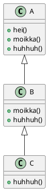

# Polymorfismi

> [!Osaamistavoitteet]
>
> - Ymmärrät polymorfismin perusajatuksen 
> - Osaat korvata yliluokan metodin aliluokassa sekä estää korvaamisen `final`-avainsanalla
> - Osaat kirjoittaa pienen ohjelman, jossa hyödynnetään polymorfismia
> - Tunnistat Object-luokan korvattavia metodeja, kuten `toString()`


*Polymorfismi* viittaa olio-ohjelmoinnissa kykyyn käsitellä erilaisia olioita yhtenäisellä tavalla. Kun metodia kutsutaan, päätös siitä, mikä metodi tosiasiallisesti suoritetaan, tehdään ajon aikana olion todellisen tyypin perusteella. Polymorfismi mahdollistaa joustavan koodin kirjoittamisen, jossa uusia olioita voidaan lisätä ilman, että olemassa olevaa koodia tarvitsee muuttaa.

Polymorfismi jaetaan yleensä kahteen päätyyppiin: (1) käännösaikaiseen polymorfismiin, jota kutsutaan myös *dynaamiseksi sidonnaksi* (engl. *dynamic binding*) ja (2) ajon aikaiseen polymorfismiin. Käännösaikaisella polymorfismilla tarkoitetaan Javassa aliohjelman kuormitusta (engl. *method overloading*). Asiaa on käsitelty Ohjelmointi 1 -kurssilla, emmekä sitä tässä käsittele tarkemmin, mutta lyhyesti: aliohjelman kuormitus tarkoittaa sitä, että aliohjelmalla voi olla useita samannimisiä toteutuksia, jotka eroavat toisistaan parametrien lukumäärän, parametrien tyyppien tai aliohjelman paluuarvon perusteella. Lue lisää Ohjelmointi 1 -kurssin materiaalista. (TODO: Linkki)

Tämä kaikki saattaa kuulostaa hitusen abstraktilta, joten otetaanpa konkreettinen esimerkki!

## Metodin korvaaminen ja dynaaminen sidonta

Kuvitellaan tilanne, jossa ohjelmassa on erilaisia soittimia: `Kitara`, `Piano` ja `Rumpusetti`. Haluamme, että soittimia voi soittaa. Yksi mahdollisuus olisi kirjoittaa jokaiselle soittimelle oma metodi soittamista varten, kuten:

```java,noplayground
Kitara kitara = new Kitara();
kitara.soitaKitaraa();
Piano piano = new Piano();
piano.soitaPianoa();
Rumpusetti rumpusetti = new Rumpusetti();
rumpusetti.soitaRumpuja();
```

Tämä lähestymistapa ei ole laajennettavissa. Jos yrittäisimme käsitellä soittimia yhtenäisenä joukkona, esimerkiksi listana, joutuisimme tekemään hankalia ja virheherkkiä tyyppitarkastuksia vain saadaksemme selville, mitä soittometodia kutsua. Ratkaisu tähän on löytää yhteinen nimittäjä kaikille soittimille. Sekä kitara että piano ovat loppujen lopuksi Soittimia. Luodaan yliluokka `Soitin`, joka sisältää toiminnon, jonka jokaisen soittimen pitäisi pystyä tekemään: `soita()`.

> [!HUOMAUTUS]
> Soitin-luokka määritellään tässä tavallisena luokkana, mutta se voisi olla myös abstrakti luokka, ja se olisikin tässä tapauksessa luontevaa. 
> Koska abstrakti luokka käsitellään vasta osassa [3.3 Abstraktit luokat](03-abstrakti-luokka.md), määrittelemme Soittimen tässä tavallisena luokkana.

```java,ignore
public class Soitin {
    // Kaikilla soittimilla on soita()-metodi
    public void soita() {
        IO.println("Tuntematon soitin soi."); // Oletusarvoinen toteutus
    }
}
```

Nyt voimme määritellä `Kitara`- ja `Piano`-luokat perimään `Soitin`-luokan.

```java,ignore
public class Kitara extends Soitin {
    // ...
}
public class Piano extends Soitin {
    // ...
}
```

Nyt meillä on kyllä yhtenäinen tapa kutsumista varten, mutta jos kutsuisimme nyt `Kitara`- tai `Piano`-olion `soita()`-metodia, ne molemmat suorittaisivat yliluokan (`Soitin`) oletustoteutuksen: *"Tuntematon soitin soi."* Tämä ei riitä! Haluamme, että kukin soitin soi itselleen ominaisella tavalla. Tätä varten aliluokassa voidaan korvata (engl. *override*) yliluokan `soita()`-metodi omalla, spesifillä toteutuksellaan.

```java,ignore
public class Kitara extends Soitin {
    // Korvataan yliluokan Soitin.soita()
    @Override
    public void soita() {
        IO.println("Kitara soi ja kieliä näppäillään.");
    }
}

public class Piano extends Soitin {
    // Korvataan yliluokan Soitin.soita()
    @Override
    public void soita() {
        IO.println("Piano soi ja koskettimia painellaan.");
    }
}
```

Perintä antoi meille yhteisen tyypin (Soitin). Metodin korvaaminen antoi meille mahdollisuuden toteuttaa toiminto olioittain. Nyt nämä kaksi mekanismia yhdessä mahdollistavat polymorfismin (nk. *monimuotoisuuden*). Kun kutsumme metodia yliluokan tyyppiä käyttäen, ohjelma valitsee automaattisesti oikean, korvatun metodin sen perusteella, mikä on olion todellinen tyyppi suoritusajankohdalla.

Tämä mahdollistaa yhtenäisen käsittelyn, jota lähdimme hakemaan:

```java
// FILE: main.java
void main() {
    ArrayList<Soitin> orkesteri = new ArrayList<>();
    orkesteri.add(new Kitara());
    orkesteri.add(new Piano());
    // Rumpusetti voitaisiin toteuttaa samoin
    // orkesteri.add(new Rumpusetti()); 

    // Kutsumme kaikille samaa soita()-metodia...
    for (Soitin soitin : orkesteri) {
        soitin.soita(); 
    }
}
// FILE_END
// FILE: Soitin.java
public class Soitin {
    // Kaikilla soittimilla on soita()-metodi
    public void soita() {
        IO.println("Tuntematon soitin soi."); // Oletusarvoinen toteutus
    }
}
// FILE_END
// FILE: Kitara.java
public class Kitara extends Soitin {
    // Korvataan yliluokan Soitin.soita()
    @Override
    public void soita() {
        IO.println("Kitara soi ja kieliä näppäillään.");
    }
}
// FILE_END
// FILE: Piano.java
public class Piano extends Soitin {
    // Korvataan yliluokan Soitin.soita()
    @Override
    public void soita() {
        IO.println("Piano soi ja koskettimia painellaan.");
    }
}
// FILE_END
```

TODO: Lisää tähän väliin UML-kaavio.

## is-a-suhde

Perintäsuhteesta käytetään myös englanninkielistä termiä *is-a*-suhde. Voimmekin
sanoa, `Piano` *on* `Soitin` ja `Kitara` *on* `Soitin` -- nimen omaan näin päin.

Palataan vielä hetkeksi edelliseen opintotietojärjestelmä-esimerkkiimme,
siinäkin voimme sanoa että `Opiskelija` *on* `Henkilo`, `Opettaja` *on*
`Henkilo` ja `Sihteeri` *on* `Henkilo`. Edelleen, myös `TutkintoOpiskelija` *on*
`Henkilo`, koska se perii `Opiskelija`-luokan, joka puolestaan perii
`Henkilo`-luokan. 

Kuten edellä opimme, polymorfismin ansiosta voimme käsitellä `Opiskelija`,
`Opettaja` ja `Sihteeri`-olioita koodissamme `Henkilo`-luokan olioina. Lisätään
kaikki tekemämme oliot `Henkilo`-taulukkoon:

```java,noplayground
Opiskelija opiskelija = new Opiskelija();
Opettaja opettaja = new Opettaja();
Sihteeri sihteeri = new Sihteeri();

Henkilo[] henkilot = {opiskelija, opettaja, sihteeri};
```

Jotta esimerkkimme olisi hieman mielekkäämpi, lisätään `Henkilo`-luokkaan vielä
metodit `kirjaudu()` ja `kirjauduUlos()`. Kaikki `Henkilo`-luokan perivät luokat 
perivät myös nämä metodit.

```java,noplayground
class Henkilo {
    // HIGHLIGHT_GREEN_BEGIN
    private boolean kirjautunut;
    // HIGHLIGHT_GREEN_END

    public Henkilo(String nimi) {
        // ...
        // HIGHLIGHT_GREEN_BEGIN
        this.kirjautunut = false;
        // HIGHLIGHT_GREEN_END
        // ..
    }

    // HIGHLIGHT_GREEN_BEGIN
    void kirjaudu() {
        this.kirjautunut = true;
        IO.println(this.getNimi() + " kirjautui sisään.");
    }
    void kirjauduUlos() {
        this.kirjautunut = false;
        IO.println(this.getNimi() + " kirjautui ulos.");
    }
    // HIGHLIGHT_GREEN_END
}
```

Voimme nyt kutsua vaikkapa `kirjauduUlos()`-metodia kaikille `henkilot`-taulukon
olioille ilman, että meidän tarvitsee tietää tarkasti, minkä tyyppisiä olioita
taulukossa on:

```java,noplayground
for (Henkilo henkilo : henkilot) {
    henkilo.kirjauduUlos();
}
```

Huomionarvoista on *is-a*-suhteen suunta; `Opettaja` ei ole `Sihteeri`, vaikkakin molemmat perivät `Henkilo`-luokan. 

Lisätään yllä olevaan `Opiskelija`-esimerkkimme attribuutti `boolean opintoOikeusVoimassa`, joka ilmaisee, onko opiskelijalla voimassa oleva opinto-oikeus. Jos opinto-oikeus ei ole voimassa, opiskelija ei voi kirjautua järjestelmään. Korvataan `kirjaudu()`-metodi `Opiskelija`-luokassa tarkistamaan tämä ehto ennen kirjautumista.

```java,noplayground
class Opiskelija extends Henkilo {

    // ...

    boolean opintoOikeusVoimassa;

    @Override
    void kirjaudu() {
        if (opintoOikeusVoimassa) {
            super.kirjaudu(); // Kutsutaan yliluokan kirjaudu-metodia
        } else {
            IO.println("Opinto-oikeus ei ole voimassa. Et voi kirjautua.");
        }
    }
}
```

Muissa `Henkilo`-luokan aliluokissa, kuten `Opettaja` ja `Sihteeri`, `kirjaudu()`-metodi toimii edelleen alkuperäisellä tavalla, koska niitä ei ole korvattu.

Metodin korvaamiseen liittyy pari sääntöä: 

 * Korvaaminen koskee aina hierarkiassa *lähintä* yliluokan metodia. 
 * Kun aliluokan olion metodia kutsutaan, kutsu viittaa aina hierarkiassa lähimpään korvattuun versioon.

Alla oleva koodi havainnollistaa korvaamista ja kutsujen välittymistä luokkahierarkiassa.

```java
// FILE: main.java
public class KokeillaanKorvaamista {  
  public static void main(String args[]) {  
    C c = new C();  
    c.hei();    // Kutsuu A-luokan hei()-metodia
    c.moikka(); // Kutsuu B-luokan moikka()-metodia
    c.huhhuh(); // Kutsuu C-luokan huhhuh()-metodia
  }  
}  
// FILE_END
// FILE: A.java
class A {  
    public void hei() { IO.println("A-olio sanoo hei."); }  
    public void moikka() { IO.println("A-olio sanoo moikka."); }  
    public void huhhuh() { IO.println("A-olio sanoo huh huh!!."); }  
}  
// FILE_END
// FILE: B.java
class B extends A {  
    @Override
    public void moikka() { IO.println("B-olio huutaa moikka!"); }  
    @Override
    public void huhhuh() { IO.println("B-olio huutaa huh huh!!"); }  
}  
// FILE_END
// FILE: C.java
class C extends B {  
    @Override
    public void huhhuh() { IO.println("C-olio huhuilee...."); }  
}  
// FILE_END
```

Tämän esimerkin UML-kaavio näyttäisi seuraavalta.




## Esimerkki: Muoto-luokka

Otetaan vielä yksi esimerkki. Tarkastellaan `Muoto`-luokkaa, jolla on metodi `laskeAla()`. 

```java
public class Muoto {
    public double laskeAla() {
        return 0.0;
    }
}
```

Huomaamme, että `laskeAla()`-metodin toteutus on vähän hassu. Tämä johtuu siitä, että ei ole oikeastaan mitään ns. yleistä muotoa, vaan `Muoto`-luokan edustajan tulee aina olla jokin konkreettinen muoto, kuten suorakulmio tai ympyrä, joilla on omat tavat laskea pinta-ala. Kuten jo Soitin-esimerkissä mainitsimme, palaamme tähän dilemmaan osassa [3.3 Abstraktit luokat](03-abstraktit-luokat.md).

Tehdään nyt aliluokat `Suorakulmio` ja `Ympyra`. Koska näiden muotojen pinta-alat ovat luonnollisesti keskenään erilaisia, tulee kummallakin olla oma toteutus `laskeAla()`-metodille.

```java,ignore
// FILE: Suorakulmio.java
public class Suorakulmio extends Muoto {
    private double leveys;
    private double korkeus;

    public Suorakulmio(double leveys, double korkeus) {
        this.leveys = leveys;
        this.korkeus = korkeus;
    }

    @Override
    public double laskeAla() {
        return leveys * korkeus;
    }
}
// FILE_END
// FILE: Ympyra.java
public class Ympyra extends Muoto {
    private double sade;

    public Ympyra(double sade) {
        this.sade = sade;
    }

    @Override
    public double laskeAla() {
        return Math.PI * sade * sade;
    }
}
// FILE_END
```

Nyt voimme kirjoittaa koodia, joka käsittelee `Muoto`-olioita ilman, että tarvitsee tietää, onko kyseessä `Suorakulmio` vai `Ympyra`. 

```java
// FILE: main.java
public class Main {
    public static void main()
    {
        Muoto muoto1 = new Ympyra(5);
        Muoto muoto2 = new Suorakulmio(5, 7);

        IO.println(muoto1.laskeAla());
        IO.println(muoto2.laskeAla());
    }
}
// FILE_END
// FILE: Muoto.java
public class Muoto {
    public double laskeAla() {
        return 0.0;
    }
}
// FILE_END
// FILE: Suorakulmio.java
public class Suorakulmio extends Muoto {
    private double leveys;
    private double korkeus;

    public Suorakulmio(double leveys, double korkeus) {
        this.leveys = leveys;
        this.korkeus = korkeus;
    }

    @Override
    public double laskeAla() {
        return leveys * korkeus;
    }
}
// FILE_END
// FILE: Ympyra.java
public class Ympyra extends Muoto {
    private double sade;

    public Ympyra(double sade) {
        this.sade = sade;
    }

    @Override
    public double laskeAla() {
        return Math.PI * sade * sade;
    }
}
// FILE_END
```

## Miksi polymorfismia tarvitaan?

Polymorfismi mahdollistaa monin tavoin joustavan ja laajennettavan koodin kirjoittamisen. Olio-ohjelmoinnissa polymorfismia tarvitaan erityisesti siksi, että sen avulla voimme tarjota yhtenäisen tavan käsitellä keskenään hyvinkin erilaisia olioita.

Kun useat luokat perivät saman yliluokan (tai toteuttavat saman rajapinnan; paneudumme rajapintoihin osassa [4.1 Rajapinta](../osa4/01-rajapinta.md)), ne voidaan käsitellä yhden yhteisen tyypin kautta. Tämä mahdollistaa sen, että ohjelma voi käsitellä joukkoa erilaisia olioita kuten:

 * kaikkia soittimia (`Soitin`), kuten kitarat, pianot ja rummut
 * kaikkia ajoneuvoja (`Ajoneuvo`), vaikka ne olisivatkin erilaisia, kuten autoja, polkupyöriä ja lentokoneita
 * kaikkia eläimiä (`Elain`), kuten koiria, kissoja ja lintuja
 * kaikkia graafiseen käyttöliittymään piirrettäviä komponentteja (`Piirrettava`), kuten painikkeita, tekstikenttiä ja kuvia
 * kaikkia maksutapoja (`Maksutapa`), kuten luottokortti, PayPal ja käteinen

Javassa on mahdollista kiertää yhtenäistä käsittelyä tutkimalla `instanceof`-operaattorin avulla, 
onko olio tietyn luokan ilmentymä. Esimerkiksi:

```java,noplayground
if (soitin instanceof Kitara) {
    ((Kitara) soitin).soitaKitaraa();
} else if (soitin instanceof Piano) {
    ((Piano) soitin).soitaPianoa();
}
```

Tällä kurssilla vältämme `instanceof`-operaattoria, ellei siihen erikseen
ohjeisteta. On nimittäin niin, että `instanceof`-operaattorin käyttö tarkoittaa
varsin usein sitä, ettei perintää ja polymorfismia ole hyödynnetty
optimaalisella tavalla, josta seuraa yllä olevan esimerkin mukainen
ehtolause-hässäkkä. Tällöin menetetään olio-ohjelmoinnin keskeinen etu, eli se,
että olioiden erilaiset toteutukset voidaan piilottaa niiden käyttäjiltä.

`instanceof`-operaattorin käyttö voi olla oikeutettua joissain
erityistilanteissa, kuten

 * kun emme hallitse olemassa olevaa luokkahierarkiaa,
 * kun koodi toimii rajalla, kuten parsittaessa tietoa ulkoisesta lähteestä,
   integroiduttaessa toiseen järjestelmään tai työskenneltäessä reflektiolla,
   tai
 * jos vaihtoehto olisi huonompi, kuten monimutkaisen luokkahierarkian tai
   toisteisen koodin kirjoittaminen.

<details><summary>Esimerkki instanceof-operaattorin käytöstä</summary>

Tarkastellaan tilannetta, jossa ohjelma vastaanottaa viestejä (tekstiviesti,
kuvaviesti) ulkoisesta järjestelmästä (esim. JSON-rajapinta, verkko, kolmannen
osapuolen kirjasto). Viestien luokkia ei voi muuttaa, ja niillä on vain yhteinen
ylityyppi.

```java,ignore
interface Viesti { }

// Konkreettiset viestityypit (ulkoisesta kirjastosta)
class TekstiViesti implements Viesti {
    String teksti;
}

class KuvaViesti implements Viesti {
    byte[] data;
}
```

Ohjelman täytyy käsitellä viestit eri tavoin niiden todellisen ajonaikaisen
tyypin perusteella.

```java,ignore
void kasittele(Viesti v) {
    if (v instanceof TekstiViesti t) {
        IO.println("Teksti: " + t.teksti);
    } else if (v instanceof KuvaViesti k) {
        IO.println("Kuvan koko: " + k.data.length);
    } else {
        throw new IllegalArgumentException("Tuntematon viestityyppi");
    }
}
```

Tämä on harvoja tilanteita, joissa `instanceof` on aidosti oikea ratkaisu:

 * Luokkahierarkiaa ei voi muuttaa: Viestiluokat tulevat ulkoisesta kirjastosta
   → niihin ei voi lisätä metodeja.
 * Polymorfia ei ole käytettävissä: Ei voida määritellä esimerkiksi metodia
   `kasittele()` rajapintaan `Viesti`.
 * Käsittely riippuu konkreettisesta tyypistä: Tekstiviesti ja kuvaviesti
   vaativat luonteeltaan eri logiikan.
 * Kyseessä on järjestelmän rajapinta: Tällainen koodi kuuluu tyypillisesti
   I/O-, integraatio- tai adapterikerrokseen.

</details>

## Object-luokan metodien korvaaminen

Javassa kaikilla luokilla on yhteinen yliluokka nimeltä `Object`. Tämä tarkoittaa, että kaikki luokat perivät automaattisesti `Object`-luokan ominaisuudet ja metodit, ellei toisin määritellä. `Object`-luokassa on useita hyödyllisiä metodeja, joita voidaan korvata aliluokissa.

`Object`-luokasta löytyy esimerkiksi [`toString()`-metodi](https://docs.oracle.com/javase/8/docs/api/java/lang/Object.html#toString--), joka tarjoaa olion merkkijonoesityksen. Oletusarvoisesti metodi palauttaa olion luokan nimen ja sen hajautusarvon, mikä ei välttämättä ole kovin informatiivista. Voimme korvata tämän metodin omassa luokassamme, jotta se palauttaa juuri meidän tarpeisiimme sopivan merkkijonoesityksen. 

Tehdään vaikkapa `Vektori3D`-luokka, joka edustaa kolmiulotteista vektoria. Tehdään pääohjelmassa muutama `Vektori3D`-olio ja tulostetaan niiden arvot.

```java
// FILE: main.java
public class Main {
    public static void main(String[] args) {
        Vektori3D v1 = new Vektori3D(1.0, 2.0, 3.0);
        Vektori3D v2 = new Vektori3D(4.0, 5.0, 6.0);
        IO.println("Vektori 1: (" + v1.getX() + ", " + v1.getY() + ", " + v1.getZ() + ")");
        IO.println("Vektori 2: (" + v2.getX() + ", " + v2.getY() + ", " + v2.getZ() + ")");
    }
}
// FILE_END
// FILE: Vektori3D.java
class Vektori3D {
    private double x;
    private double y;
    private double z;
    public Vektori3D(double x, double y, double z) {
        this.x = x;
        this.y = y;
        this.z = z;
    }
    public double getX() {
        return x;
    }
    public double getY() {
        return y;
    }
    public double getZ() {
        return z;
    }
}
// FILE_END
```

Vaikka tulostaminen kyllä toimii, olisi varsin mukavaa, jos voisimme yksinkertaisesti kirjoittaa `IO.println("Vektori 1: " + v1);` ilman, että meidän tarvitsee erikseen hakea koordinaatteja ja yhdistellä String-olioita toisiinsa. Tätä varten voimme korvata `toString()`-metodin `Vektori3D`-luokassa. 

```java
// FILE: main.java
public class Main {
    public static void main(String[] args) {
        Vektori3D v1 = new Vektori3D(1.0, 2.0, 3.0);
        Vektori3D v2 = new Vektori3D(4.0, 5.0, 6.0);
        IO.println("Vektori 1: " + v1);
        IO.println("Vektori 2: " + v2);
    }
}
// FILE_END
// FILE: Vektori3D.java
class Vektori3D {
    private double x;
    private double y;
    private double z;
    public Vektori3D(double x, double y, double z) {
        this.x = x;
        this.y = y;
        this.z = z;
    }
    public double getX() {
        return x;
    }
    public double getY() {
        return y;
    }
    public double getZ() {
        return z;
    }
    // HIGHLIGHT_GREEN_BEGIN
    @Override    
    public String toString() {
        return "(" + x + ", " + y + ", " + z + ")";
    }
    // HIGHLIGHT_GREEN_END
}
// FILE_END
```

Pääohjelma näyttää nyt huomattavasti siistimmältä.

Tutki omatoimisesti muita `Object`-luokan metodeja [Javan dokumentaatiosta](https://docs.oracle.com/javase/8/docs/api/java/lang/Object.html).

## Perimisen tai korvaamisen estäminen (final-avainsana)

Luokan periminen tai metodin korvaaminen voidaan estää käyttämällä `final`-avainsanaa. Kun luokka on merkitty `final`-avainsanalla, sitä ei voi periä. Vastaavasti, kun metodi on merkitty `final`-avainsanalla, sitä ei voi korvata aliluokassa. 

Ehkä hieman hämäävästi `final`-avainsanaa voidaan käyttää myös muuttujien yhteydessä, jolloin se tarkoittaa, että muuttujan arvoa ei voi muuttaa sen alustamisen jälkeen. Tällä ei ole kuitenkaan tekemistä perinnän kanssa. 


## Tehtävät {#tehtavat}

<task>
  <task-title><i class="bi bi-stars jyu-gold"></i> Bonus: Tehtävä 3.4: Luokkahierarkia, osa 4. <points>1 p.</points> </task-title>
  <handout>

{{#include ../exercises/3-4-verkkokauppa-4/handout.md}}

  </handout>
  <task-link><a href="https://tim.jyu.fi/view/kurssit/tie/tiep111/tehtavat/osa3/tehtava4">Tee tehtävä TIMissä</a></task-link>
</task>

<task>
  <task-title>Tehtävä 3.5: Korvaaminen, osa 1. <points>1 p.</points> </task-title>
  <handout>

  {{#include ../exercises/3-5-korvaaminen-1/handout.md}}

  </handout>
  <task-link><a href="https://tim.jyu.fi/view/kurssit/tie/tiep111/tehtavat/osa3/tehtava5">Tee tehtävä TIMissä</a></task-link>
</task>

<task>
  <task-title>Tehtävä 3.6: Korvaaminen, osa 2. <points>1 p.</points> </task-title>
  <handout>

  {{#include ../exercises/3-6-korvaaminen-2/handout.md}}

  </handout>
  <task-link><a href="https://tim.jyu.fi/view/kurssit/tie/tiep111/tehtavat/osa3/tehtava6">Tee tehtävä TIMissä</a></task-link>
</task>
