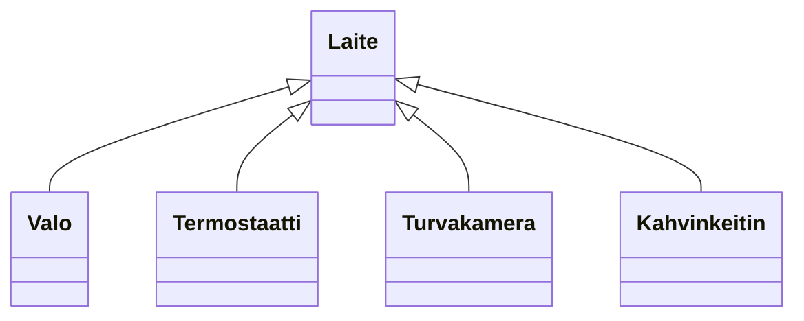

# Abstraktit luokat ja rajapinnat

> [!Osaamistavoitteet]
>
> - Abstrakti luokka tarjoaa osan toteutuksesta ja määrittelee "rajapinnan" sille, mitä perittävän luokan tulee toteuttaa itse. 
> - Abstraktit luokat (abstrakti metodi)
> - Ymmärrät, että abstraktista luokasta ei voi luoda luokan ilmentymiä

## Määritelmä

Abstrakti luokka on sellainen luokka, josta ei voi luoda suoria ilmentymiä. Sen sijaan abstrakti luokka toimii pohjana muille luokille, jotka perivät sen ja toteuttavat sen määrittelemät abstraktit metodit. Abstrakti luokka voi sisältää sekä *abstrakteja metodeja* (ts. joilla ei ole toteutusta), että *konkreettisia metodeja* (ts. joilla on toteutus). 

Aliluokka, joka perii abstraktin luokan, on velvollinen toteuttamaan kaikki perimänsä abstraktit metodit, *ellei* se itse ole myös abstrakti luokka.

## Esimerkki

Älykodissa voisi olla monenlaisia laitteita, kuten valoja, termostaatteja, turvakamera sekä tietysti älykahvinkeitin. Sovitaan, että kaikilla laitteilla olisi toiminto `vaihdaTilaa()`, joka suorittaa laitteen päätoiminnon (esim. valot syttyvät, termostaatti säätää lämpötilaa, kamera tallentaa videota, kahvinkeitin keittää kahvia). Kukin laite voisi myös raportoida oman tilansa `raportoiTila()`-metodilla.

Lähdemme tässä liikkeelle yksinkertaisesta esimerkistä, jossa laite voi vain vaihtaa tilaa, eikä esimerkiksi valita jotain erityistä tilaa. Palaamme monimutkaisempiin säätömahdollisuuksiin myöhemmin. 



// Esimerkki ilman abstraktia luokkaa

### [Laite.java](#tab/laite)

```java
public class Laite {
    public void vaihdaTilaa() {
        // Mitä kantaluokassa pitäisi tehdä tässä kohden?
    }

    public void raportoiTila() {
        // Mitä kantaluokassa pitäisi tehdä tässä kohden?
    }
}
```

***

### [Valo.java](#tab/valo)

```java
public class Valo extends Laite {
    private int kirkkaus = 0;

    @Override
    public void vaihdaTilaa() {
        // Vaihda kirkkaus 0 -> 50 -> 100 -> 0 ...
        // if (kirkkaus == 0) kirkkaus = 50;
        // else if (kirkkaus == 50) kirkkaus = 100;
        // else kirkkaus = 0;
        switch (kirkkaus) {
            case 0 -> kirkkaus = 50;
            case 50 -> kirkkaus = 100;
            case 100 -> kirkkaus = 0;
        }
    }
    @Override
    public void raportoiTila() {
        System.out.println("Valon kirkkaus on " + kirkkaus + "%.");
    }
}
```

***

### [Termostaatti.java](#tab/termostaatti)

```java
public class Termostaatti extends Laite {
    private enum Lämpötila { MUKAVUUS, SÄÄSTÖ, POISSA }
    private Lämpötila tila = Lämpötila.MUKAVUUS;

    @Override
    public void vaihdaTilaa() {
        // Vaihda tila MUKAVUUS -> SÄÄSTÖ -> POISSA -> MUKAVUUS ...
        switch (tila) {
            case MUKAVUUS -> tila = Lämpötila.SÄÄSTÖ;
            case SÄÄSTÖ -> tila = Lämpötila.POISSA;
            case POISSA -> tila = Lämpötila.MUKAVUUS;
        }
    }
    @Override
    public void raportoiTila() {
        System.out.println("Termostaatin tila on " + tila + ".");
    }
} 
```

***

### [Turvakamera.java](#tab/turvakamera)

```java
public class Turvakamera extends Laite {
    private boolean tallennusPäällä = false;

    @Override
    public void vaihdaTilaa() {
        // Kytke tallennus päälle/pois
        tallennusPäällä = !tallennusPäällä;
    }
    @Override
    public void raportoiTila() {
        String tila = tallennusPäällä ? "päällä" : "pois";
        System.out.println("Turvakameran tallennus on " + tila + ".");
    }
}
```

***

### [Kahvinkeitin.java](#tab/kahvinkeitin)

```java
public class Kahvinkeitin extends Laite {

    private boolean kiehumassa = false;    

    @Override
    public void vaihdaTilaa() {
        // Keitä kahvia tai kytke keitin pois päältä
        kiehumassa = !kiehumassa;
    }
    @Override  
    public void raportoiTila() {
        String tila = kiehumassa ? "päällä" : "pois";
        System.out.println("Kahvinkeittimen pannu on " + tila + ".");
    }
}
```

***

Jos katsotaan `Laite`-luokkaa, huomataan, että sen metodit `vaihdaTilaa()` ja `raportoiTila()` eivät tee mitään. 
Ei ole järkevää, että jokin yleinen laite voisi vaihtaa tilaa tai raportoida tilansa ilman, että tiedetään tarkemmin, minkä tyyppisestä laitteesta on kyse.
Niinpä `Laite`-luokka on oikeastaan tarkoitettu vain perittäväksi, eikä siitä ole tarkoitus luoda suoria ilmentymiä. Jokaisen aliluokan tulee toteuttaa nämä metodit itse. 

Muokataan `Laite`-luokka abstraktiksi luokaksi, ja määritellään myös metodit abstrakteiksi. 

```java
public abstract class Laite {
    public abstract void vaihdaTilaa();
    public abstract void raportoiTila();
}
```

