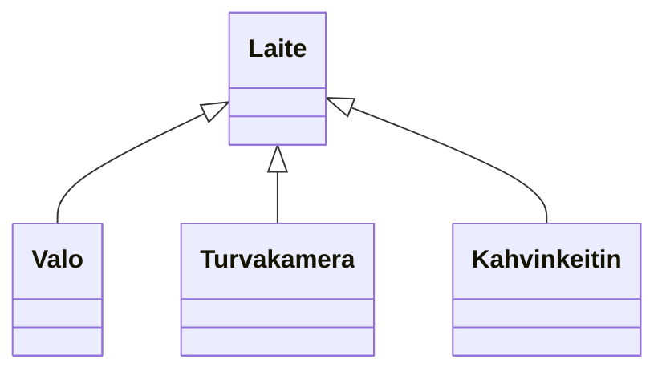

# Abstraktit luokat ja rajapinnat

> [!Osaamistavoitteet]
>
> - Abstrakti luokka tarjoaa osan toteutuksesta ja määrittelee "rajapinnan" sille, mitä perittävän luokan tulee toteuttaa itse. 
> - Abstraktit luokat (abstrakti metodi)
> - Ymmärrät, että abstraktista luokasta ei voi luoda luokan ilmentymiä

## Abstrakti luokka

*Abstrakti luokka* (engl. *abstract class*) on sellainen luokka, josta ei voi luoda suoria ilmentymiä. Sen sijaan se toimii pohjana muille luokille, jotka perivät sen. Abstrakti luokka voi sisältää sekä *abstrakteja metodeja* (ts. joilla ei ole toteutusta), että *konkreettisia metodeja* (ts. joilla on toteutus). Perivän luokan tulee sitten toteuttaa nuo abstraktit metodit, *ellei* perivä luokka ole myös abstrakti.

## Esimerkki

Älykodissa voisi olla monenlaisia laitteita, kuten valoja, turvakamera sekä tietysti älykahvinkeitin. Sovitaan, että kaikilla laitteilla olisi toiminto `vaihdaTilaa()`, joka suorittaa laitteen päätoiminnon (esim. valot syttyvät, kamera tallentaa videota, kahvinkeitin keittää kahvia). Kukin laite voisi myös raportoida oman tilansa `raportoiTila()`-metodilla.

Lähdemme tässä liikkeelle yksinkertaisesta esimerkistä, jossa laite voi vain vaihtaa tilaa, eikä esimerkiksi valita jotain erityistä tilaa. Palaamme monimutkaisempiin laitteiden säätömahdollisuuksiin myöhemmin. 



```java
//FILE: main.java
public class Main {
    public static void main(String[] args) {
        Laite[] laitteet = {
            new Valo(),
            new Turvakamera(),
            new Kahvinkeitin()
        };

        for (Laite laite : laitteet) {
            laite.vaihdaTilaa();
            laite.raportoiTila();
        }
    }
}
// FILE_END
// FILE: Laite.java
public class Laite {
    public void vaihdaTilaa() {
    }

    public void raportoiTila() {
    }
}
// FILE_END
// FILE: Valo.java
public class Valo extends Laite {
    private int kirkkaus = 0;

    @Override
    public void vaihdaTilaa() {
        switch (kirkkaus) {
            case 0 -> kirkkaus = 50;
            case 50 -> kirkkaus = 100;
            case 100 -> kirkkaus = 0;
        }
    }
    @Override
    public void raportoiTila() {
        IO.println("Valon kirkkaus on " + kirkkaus + "%.");
    }
}
// FILE_END
// FILE: Turvakamera.java
public class Turvakamera extends Laite {
    private boolean tallennusPäällä = false;

    @Override
    public void vaihdaTilaa() {
        // Kytke tallennus päälle/pois
        tallennusPäällä = !tallennusPäällä;
    }
    @Override
    public void raportoiTila() {
        String tila = tallennusPäällä ? "päällä" : "pois";
        IO.println("Turvakameran tallennus on " + tila + ".");
    }
}
// FILE_END
// FILE: Kahvinkeitin.java
public class Kahvinkeitin extends Laite {

    private boolean kiehumassa = false;

    @Override
    public void vaihdaTilaa() {
        // Keitä kahvia tai kytke keitin pois päältä
        kiehumassa = !kiehumassa;
    }
    @Override
    public void raportoiTila() {
        String tila = kiehumassa ? "päällä" : "pois";
        System.out.println("Kahvinkeittimen pannu on " + tila + ".");
    }
}
// FILE_END
```

Jos katsotaan `Laite`-luokkaa, huomataan, että sen metodit `vaihdaTilaa()` ja `raportoiTila()` eivät tee mitään. Teoriassa voisimme luoda myös `Laite`-luokasta ilmentymän ja kutsua sen metodeja:

```java,ignore
Laite laite = new Laite();
laite.vaihdaTilaa(); // Ei tee mitään
laite.raportoiTila(); // Ei tee mitään
```

Kuten nähdään, mitään ei tapahdu näitä metodeja kutsuttaessa, ja sikäli `Laite`-luokasta tehdyt oliot ovat tavallaan hyödyttömiä. Ei ole oikeastaan järkevää, että olisi olemassa jokin "yleinen laite", ilman, että tiedetään tarkemmin, minkä tyyppisestä laitteesta on kyse. Näin ollen `Laite`-luokka on oikeastaan tarkoitettu *vain* perittäväksi. 

Javassa luokkaa, joka on tarkoitettu vain perittäväksi, kutsutaan *abstraktiksi luokaksi*. 

Muutetaan `Laite`-luokka abstraktiksi luokaksi. Koska myös metodit on tarkoitettu toteutettavaksi perivissä luokissa, määritellään myös metodit abstrakteiksi. Kaikkien perivien luokkein on toteutettava nämä metodit, kuten ne esimerkissämme jo tekevätkin.

```java
// FILE: Laite.java
public abstract class Laite {
    public abstract void vaihdaTilaa();
    public abstract void raportoiTila();
}
// FILE_END
// FILE: Valo.java
public class Valo extends Laite {
    private int kirkkaus = 0;

    @Override
    public void vaihdaTilaa() {
        // Vaihda kirkkaus 0 -> 50 -> 100 -> 0 ...
        switch (kirkkaus) {
            case 0 -> kirkkaus = 50;
            case 50 -> kirkkaus = 100;
            case 100 -> kirkkaus = 0;
        }
    }
    @Override
    public void raportoiTila() {
        IO.println("Valon kirkkaus on " + kirkkaus + "%.");
    }
}
// FILE_END
// FILE: Turvakamera.java
public class Turvakamera extends Laite {
    private boolean tallennusPäällä = false;

    @Override
    public void vaihdaTilaa() {
        // Kytke tallennus päälle/pois
        tallennusPäällä = !tallennusPäällä;
    }
    @Override
    public void raportoiTila() {
        String tila = tallennusPäällä ? "päällä" : "pois";
        IO.println("Turvakameran tallennus on " + tila + ".");
    }
}
// FILE_END
// FILE: Kahvinkeitin.java
public class Kahvinkeitin extends Laite {

    private boolean kiehumassa = false;

    @Override
    public void vaihdaTilaa() {
        // Keitä kahvia tai kytke keitin pois päältä
        kiehumassa = !kiehumassa;
    }
    @Override
    public void raportoiTila() {
        String tila = kiehumassa ? "päällä" : "pois";
        System.out.println("Kahvinkeittimen pannu on " + tila + ".");
    }
}
// FILE_END
// FILE: main.java
public class Main {
    public static void main(String[] args) {
        Laite[] laitteet = {
            new Valo(),
            new Turvakamera(),
            new Kahvinkeitin()
        };

        for (Laite laite : laitteet) {
            laite.vaihdaTilaa();
            laite.raportoiTila();
        }
    }
}
// FILE_END
```

Nyt `Laite`-luokasta ei voi enää luoda ilmentymiä. Yritettäessä tehdä niin, kääntäjä antaa virheen:

```java,ignore
Laite laite = new Laite(); 
```

```
java: Laite is abstract; cannot be instantiated
```

## Miksi abstrakti luokka on hyödyllinen?

Abstrakti luokka ei ole vain kielto tehdä luokasta ilmentymiä. Sen ensisijainen tarkoitus on:

- määritellä yhteinen sopimus siitä, mitä metodeja kaikkien aliluokkien pitää tarjota, ja 
- tarjota yhteisiä ominaisuuksia ja tarvittaessa myös toteutuksia, jotta aliluokat keskittyvät vain olennaiseen. 

Kun `Laite` on abstrakti, voimme lisätä sille attribuutteja ja metodien valmiita toteutuksia, joita kaikki aliluokat käyttävät. 

Lisätään `Laite`-luokkaan attribuutti `nimi`, joka kertoo laitteen nimen, sekä attribuutti `kytketty`, joka kertoo, onko laite päällä vai pois päältä. Sellainen attribuutti on hyödyllinen kaikille laitteille, joten se sopii hyvin abstraktiin luokkaan. 

Jos kyse olisi verkkolaitteesta, hyödyllisiä tai jopa pakollisia attribuutteja voisivat olla muun muassa MAC-osoite ja IP-osoite. Pidämme kuitenkin tämän esimerkin yksinkertaisena, joten tyydymme tässä vain nimeen ja kytketty-tilan seuraamiseen.

Lisätään myös metodit `kytkePaalle()` ja `kytkePois()`, jotka sisältävät yleisen logiikan laitteen käynnistämiseen ja sammuttamiseen, jota kaikki laitteet voivat noudattavat. 

```java,ignore
public abstract class Laite {
    private String nimi;
    private boolean kytketty;

    protected Laite(String nimi) {
        this.nimi = nimi;
    }

    public void kytkePaalle() {
        if (!kytketty) {
            kytketty = true;
            System.out.println(nimi + " käynnistyy.");
        }
    }

    public void kytkePois() {
        if (kytketty) {
            kytketty = false;
            System.out.println(nimi + " sammuu.");
        }
    }

    public abstract void vaihdaTilaa();
    public abstract void raportoiTila();
}
```

Huomaa, että koska päätimme, että joka laitteella on oltava nimi, siitä seuraa, että nimi on asetettava rakentajan parametrin kautta. Tämän seurauksena emme voi enää luoda ilmentymiä oletusrakentajan avulla. 

```java,ignore
// ...
Valo valo = new Valo();
// ...
```

```
Valo.java
java: constructor Laite in class Laite cannot be applied to given types;
  required: java.lang.String
  found:    no arguments
  reason: actual and formal argument lists differ in length
```

Rakentajan kutsuminen vaatii nyt nimen välittämisen, esimerkiksi `new Valo("PhilipsHue")`. Niinpä kussakin aliluokan rakentajassa on kutsuttava yliluokan rakentajaa. Tehdään tämä muutos kaikkiin aliluokkiin.

```java
// FILE: Laite.java
public abstract class Laite {
    private String nimi;
    private boolean kytketty;

    protected Laite(String nimi) {
        this.nimi = nimi;
    }

    public void kytkePaalle() {
        if (!kytketty) {
            kytketty = true;
            System.out.println(nimi + " käynnistyy.");
        }
    }

    public void kytkePois() {
        if (kytketty) {
            kytketty = false;
            System.out.println(nimi + " sammuu.");
        }
    }

    public abstract void vaihdaTilaa();
    public abstract void raportoiTila();
}
// FILE_END
// FILE: Valo.java
public class Valo extends Laite {
    private int kirkkaus = 0;

    public Valo(String nimi)
    {
        super(nimi);
    }

    @Override
    public void vaihdaTilaa() {
        // Vaihda kirkkaus 0 -> 50 -> 100 -> 0 ...
        switch (kirkkaus) {
            case 0 -> kirkkaus = 50;
            case 50 -> kirkkaus = 100;
            case 100 -> kirkkaus = 0;
        }
    }
    @Override
    public void raportoiTila() {
        System.out.println("Valon kirkkaus on " + kirkkaus + "%.");
    }
}
// FILE_END
// FILE: Turvakamera.java
public class Turvakamera extends Laite {
    private boolean tallennusPaalla = false;

    public Turvakamera(String nimi)
    {
        super(nimi);
    }

    @Override
    public void vaihdaTilaa() {
        // Kytke tallennus päälle/pois
        tallennusPaalla = !tallennusPaalla;
    }
    @Override
    public void raportoiTila() {
        String tila = tallennusPaalla ? "päällä" : "pois";
        System.out.println("Turvakameran tallennus on " + tila + ".");
    }
}
// FILE_END
// FILE: Kahvinkeitin.java
public class Kahvinkeitin extends Laite {
    private boolean kiehumassa = false;

    public Kahvinkeitin(String nimi)
    {
        super(nimi);
    }

    @Override
    public void vaihdaTilaa() {
        // Keitä kahvia tai kytke keitin pois päältä
        kiehumassa = !kiehumassa;
    }
    @Override
    public void raportoiTila() {
        String tila = kiehumassa ? "päällä" : "pois";
        System.out.println("Kahvinkeittimen pannu on " + tila + ".");
    }
}
// FILE_END
// FILE: main.java
public class Main {
    public static void main(String[] args) {
        Laite[] laitteet = {
                new Valo("PhilipsHue"),
                new Kahvinkeitin("Moccamaster"),
                new Turvakamera("Reolink")
        };

        for (Laite laite : laitteet) {
            laite.kytkePaalle();
            laite.vaihdaTilaa();
            laite.raportoiTila();
            laite.kytkePois();
        }
    }
}
// FILE_END
```

Aliluokat perivät nyt päälle- ja pois-kytkemislogiikan sellaisenaan, mutta niiden on *pakko* toteuttaa laitteen omat, oliokohtaiset toiminnallisuudet. Tämä luo tasapainoa joustavuuden ja pakollisen rakenteen välille: Tilan vaihtaminen ja tilan raportointi ovat pakollisia, mutta niiden toteutus on vapaa. Toisaalta laitteen käynnistys- ja sammutuslogiikka on yhteinen kaikille laitteille.

<details closed><summary>✨ Valinnaista lisätietoa: Abstraktit metodit ja *template method* -malli </summary>

Abstraktilla luokalla voi olla myös valmiita metodeja, jotka kutsuvat abstrakteja metodeja. Tätä kutsutaan *template method* -malliksi. Abstrakti luokka määrittelee toimenpiteen "kaavan", mutta jättää vaiheet aliluokille.

```java
// FILE: Laite.java
public abstract class Laite {
    public final void suoritaPaivitys() {
        kytkePaalle();
        valmistelePaivitys(); // Abstrakti askel, jonka aliluokka toteuttaa
        paivitys();    
        kytkePois();
    }

    protected abstract void valmistelePaivitys();
    
    private void paivitys() {
        IO.println("Haetaan uusin päivitys verkosta...");
        IO.println("Laite päivitetään...");
    }

    // ...
}
// FILE_END
// FILE: Valo.java
public class Valo extends Laite {
    @Override
    protected void valmistelePaivitys() {
        IO.println("Valmistellaan valoa päivitystä varten.");
        IO.println("Tarkistetaan, että valo on kytkettynä.");
        IO.println("Asetetaan valo kirkkauteen 0%.");        
    }

    // ...
}
// FILE_END
```

`suoritaPaivitys()` on nyt ikään kuin valmis resep­ti, jota aliluokat eivät voi muuttaa (`final`). Sen sijaan ne täydentävät reseptin tarvitsemansa tavoilla toteuttamalla abstraktit metodit.

🤔 Pohdittavaksi: Missä tilanteissa haluaisit estää aliluokkaa ylikirjoittamasta tiettyä metodia? 

</details>

## Rajapinta

*Rajapinta* (engl. *interface*) on sopimus: se kertoo, mitä metodeja kyseisen rajapinnan toteuttavan luokan tulee tarjota. 
Yksi rajapintojen keskeisistä käyttötarkoituksista on määritellä yhteinen käyttäytyminen erilaisille luokille, jotka eivät välttämättä ole periytyneet samasta yliluokasta. Kun käyttäjä käsittelee olioita rajapinnan kautta, hän voi luottaa siihen, että olio tarjoaa rajapintansa mukaisen toiminnallisuuden, riippumatta siitä, miten toiminnallisuus on toteutettu.

Rajapinta ei tyypillisesti sisällä kyseisten metodien toteutuksia, vaan ainoastaan metodien esittelyrivit. Luokka *toteuttaa* (engl. *implements*) rajapinnan ja siten sitoutuu tarjoamaan rajapinnan määrittelemät metodit. Yksi luokka voi toteuttaa useita rajapintoja. 

Javan versiosta 8 alkaen rajapinnat voivat sisältää myös metodien oletustoteutuksia.

## Esimerkki

Jotkin älykotimme laitteet voisivat olla säädettäviä, eli niillä voisi asettaa suoraan arvon, kuten kirkkauden, lämpötilan tai äänenvoimakkuuden. Näinhän periaatteessa toimimmekin jo esimerkkimme `Valo`-luokassa, jossa kirkkaus vaihtelee kolmen arvon välillä. Käyttäjän kannalta olisi kuitenkin kätevämpää, jos voisi asettaa kirkkauden suoraan haluttuun arvoon (esim. 75%), sen sijaan, että pitäisi painaa nappia useita kertoja.

Määritellään tällaiselle toiminnallisuudelle rajapinta `Saadettava`, jossa on metodi `asetaArvo(int arvo)`.

```java,noplayground
// FILE: Saadettava.java
public interface Saadettava {
    void asetaArvo(int arvo);
}
// FILE_END
```

Tämän voi lukea seuraavasti: Jokaisella `Saadettava`-rajapinnan toteuttavalla luokalla tulee olla `asetaArvo`-metodi.

Nyt voimme muokata `Valo`-luokkaa toteuttamaan `Saadettava`-rajapinnan:

Lisätään `Valo`-luokkaan rajapinnan toteutus:

```java
// FILE: main.java
public class Main {
    public static void main(String[] args) {
        Valo valo = new Valo();
        valo.asetaArvo(33);
        valo.raportoiTila();

        valo.vaihdaTilaa();
        valo.raportoiTila();
    }
}
// FILE_END
// FILE: Valo.java
public class Valo extends Laite implements Saadettava {
    private int kirkkaus = 0;

    @Override
    public void asetaArvo(int arvo)
    {
        if (arvo < 0) arvo = 0;
        if (arvo > 100) arvo = 100;
        this.kirkkaus = arvo;
    }

    @Override
    public void vaihdaTilaa() {
        // Yksinkertainen päälle-pois
        if (kirkkaus == 100) kirkkaus = 0;
        else kirkkaus = 100;
    }

    @Override
    public void raportoiTila() {
        IO.println("Valon kirkkaus on " + kirkkaus + "%.");
    }
}
// FILE_END
// FILE: Laite.java
public abstract class Laite {
    abstract public void vaihdaTilaa();

    abstract public void raportoiTila();
}
// FILE_END
// FILE: Saadettava.java
public interface Saadettava {
    void asetaArvo(int arvo);
}
// FILE_END
```

<!-- Rajapinta keskittyy vain ulkoiseen käyttäytymiseen, ei sisäiseen toteutukseen.-->

## Abstrakti luokka vai rajapinta?

| Kysymys                              | Abstrakti luokka                              | Rajapinta                                                 |
| ------------------------------------ | --------------------------------------------- | --------------------------------------------------------- |
| Voiko sisältää attribuutteja?        | Kyllä                                         | Ei                                                        |
| Voiko sisältää metodien toteutuksia? | Kyllä                                         | Ei (Java v8 alkaen mahdollisuus ns. `default`-metodeihin) |
| Kuinka monta voi periä/toteuttaa?    | Luokka voi periä vain yhden abstraktin luokan | Luokka voi toteuttaa useita rajapintoja                   |
| Käyttötarkoitus                      | Yhteinen runko ja osittainen toteutus         | Yhteinen sopimus käyttäytymisestä                         |

Monesti molemmat yhdistyvät: abstrakti luokka tarjoaa rungon ja toteuttaa yhden tai useampia rajapintoja.

```java
// FILE: Säädettävä.java
public interface Saadettava {
    void asetaArvo(int arvo);
}
// FILE_END

// FILE: SaadettavaLaite.java
public abstract class SaadettavaLaite extends Laite implements Saadettava {
    protected int nykyinenArvo = 0;

    @Override
    public void raportoiTila() {
        IO.println("Nykyinen arvo: " + nykyinenArvo);
    }
}
// FILE_END

// FILE: Termostaatti.java
public class Termostaatti extends SaadettavaLaite {
    public Termostaatti() {
        super("Termostaatti");
    }

    @Override
    public void vaihdaTilaa() {
        nykyinenArvo = (nykyinenArvo + 1) % 5;
    }

    @Override
    public void asetaArvo(int arvo) {
        nykyinenArvo = Math.max(0, Math.min(arvo, 4));
    }
}
// FILE_END
```

`Termostaatti` saa valmiin `raportoiTila()`-metodin abstraktilta luokaltaan, mutta toteuttaa rajapinnan vaatimuksen (`asetaArvo`). Tämä osoittaa, miten abstrakti luokka ja rajapinta täydentävät toisiaan.

## Esimerkit

Löydät kaikki tällä sivulla esitellyt esimerkit [GitHubista](https://github.com/ohj-perus-jy/ohj2-mdbook-esimerkit) (E32-alkuiset kansiot).

## Harjoitusidea

Suunnittele `Hälytettävä`-rajapinta, jossa on metodit `trigger()` ja `reset()`. Toteuta rajapintaa hyödyntävä abstrakti `HälytinLaite`, joka pitää kirjaa siitä, montako kertaa hälytys on aktivoitu. Luo kaksi konkreettista laitetta (esim. `SavuHälytin` ja `VesivuotoHälytin`). Mieti, missä kohtaa sijoitat yhteisen lokituksen: rajapintaan (ei mahdollista) vai abstraktiin luokkaan?

> [!Muista]
> Rajapinta = lupaus. Abstrakti luokka = sekä lupaus että osittainen toteutus. Valitse kumpi sopii tarpeeseesi, tai yhdistä molemmat.
