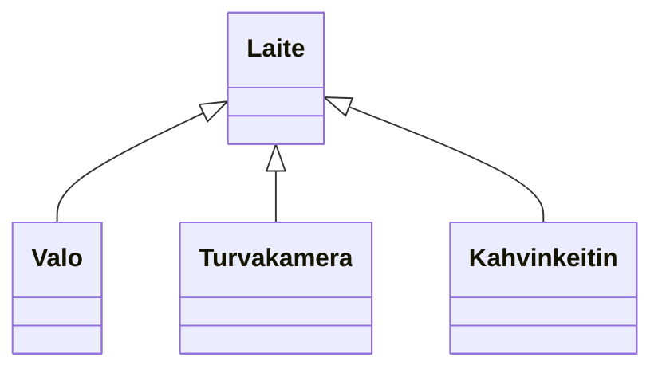

# Abstraktit luokat ja rajapinnat

> [!Osaamistavoitteet]
>
> - Abstrakti luokka tarjoaa osan toteutuksesta ja määrittelee "rajapinnan" sille, mitä perittävän luokan tulee toteuttaa itse. 
> - Abstraktit luokat (abstrakti metodi)
> - Ymmärrät, että abstraktista luokasta ei voi luoda luokan ilmentymiä

## Määritelmä

Abstrakti luokka on sellainen luokka, josta ei voi luoda suoria ilmentymiä. Sen sijaan abstrakti luokka toimii pohjana muille luokille, jotka perivät sen ja toteuttavat sen määrittelemät abstraktit metodit. Abstrakti luokka voi sisältää sekä *abstrakteja metodeja* (ts. joilla ei ole toteutusta), että *konkreettisia metodeja* (ts. joilla on toteutus). 

Aliluokka, joka perii abstraktin luokan, on velvollinen toteuttamaan kaikki perimänsä abstraktit metodit, *ellei* se itse ole myös abstrakti luokka.

## Esimerkki

Älykodissa voisi olla monenlaisia laitteita, kuten valoja, turvakamera sekä tietysti älykahvinkeitin. Sovitaan, että kaikilla laitteilla olisi toiminto `vaihdaTilaa()`, joka suorittaa laitteen päätoiminnon (esim. valot syttyvät, kamera tallentaa videota, kahvinkeitin keittää kahvia). Kukin laite voisi myös raportoida oman tilansa `raportoiTila()`-metodilla.

Lähdemme tässä liikkeelle yksinkertaisesta esimerkistä, jossa laite voi vain vaihtaa tilaa, eikä esimerkiksi valita jotain erityistä tilaa. Palaamme monimutkaisempiin laitteiden säätömahdollisuuksiin myöhemmin. 



// Esimerkki ilman abstraktia luokkaa

```java
//FILE: main.java
public class Main {
    public static void main(String[] args) {
        Laite[] laitteet = {
            new Valo(),
            new Turvakamera(),
            new Kahvinkeitin()
        };

        for (Laite laite : laitteet) {
            laite.vaihdaTilaa();
            laite.raportoiTila();
        }
    }
}
// FILE_END

// FILE: Laite.java
public class Laite {
    public void vaihdaTilaa() {
    }

    public void raportoiTila() {
    }
}
// FILE_END

// FILE: Valo.java
public class Valo extends Laite {
    private int kirkkaus = 0;

    @Override
    public void vaihdaTilaa() {
        // Vaihda kirkkaus 0 -> 50 -> 100 -> 0 ...
        switch (kirkkaus) {
            case 0 -> kirkkaus = 50;
            case 50 -> kirkkaus = 100;
            case 100 -> kirkkaus = 0;
        }
    }
    @Override
    public void raportoiTila() {
        System.out.println("Valon kirkkaus on " + kirkkaus + "%.");
    }
}
// FILE_END

// FILE: Turvakamera.java
public class Turvakamera extends Laite {
    private boolean tallennusPäällä = false;

    @Override
    public void vaihdaTilaa() {
        // Kytke tallennus päälle/pois
        tallennusPäällä = !tallennusPäällä;
    }
    @Override
    public void raportoiTila() {
        String tila = tallennusPäällä ? "päällä" : "pois";
        System.out.println("Turvakameran tallennus on " + tila + ".");
    }
}
// FILE_END

// FILE: Kahvinkeitin.java
public class Kahvinkeitin extends Laite {

    private boolean kiehumassa = false;    

    @Override
    public void vaihdaTilaa() {
        // Keitä kahvia tai kytke keitin pois päältä
        kiehumassa = !kiehumassa;
    }
    @Override  
    public void raportoiTila() {
        String tila = kiehumassa ? "päällä" : "pois";
        System.out.println("Kahvinkeittimen pannu on " + tila + ".");
    }
}
// FILE_END
```

Jos katsotaan `Laite`-luokkaa, huomataan, että sen metodit `vaihdaTilaa()` ja `raportoiTila()` eivät tee mitään. Teoriassa voisimme luoda myös `Laite`-luokasta ilmentymän ja kutsua sen metodeja:

```java.ignore
void main() {
    Laite laite = new Laite();
    laite.vaihdaTilaa(); // Ei tee mitään
    laite.raportoiTila(); // Ei tee mitään
}
```

Kuten nähdään, mitään ei tapahdu näitä `laite`-olion metodeja kutsuttaessa, ja sikäli `Laite`-luokasta tehdyt oliot ovat tavallaan hyödyttömiä, koska niillä ei olisi mitään toiminnallisuutta. Niinpä ei ole järkevää, että olisi olemassa jokin "yleinen laite", ilman, että tiedetään tarkemmin, minkä tyyppisestä laitteesta on kyse. Näin ollen `Laite`-luokka on oikeastaan tarkoitettu *vain* perittäväksi.

Javassa tällaista luokkaa kutsutaan *abstraktiksi luokaksi*. Muokataan `Laite`-luokka abstraktiksi luokaksi, ja määritellään myös metodit abstrakteiksi.  Kaikkien perivien luokkein on toteutettava nämä metodit, kuten ne esimerkissämme jo tekevätkin.

```java,ignore
public abstract class Laite {
    public abstract void vaihdaTilaa();
    public abstract void raportoiTila();
}
```

Nyt `Laite`-luokasta ei voi enää luoda ilmentymiä, ja yritettäessä tehdä niin, kääntäjä antaa virheen:

```java.ignore
void main() {
    Laite laite = new Laite(); 
    // Virhe! Cannot instantiate the type Laite
}
```

## Miksi abstrakti luokka on hyödyllinen?

Abstrakti luokka ei ole vain "instanssikielto". Sen ensisijainen tarkoitus on:

- määritellä yhteinen sopimus: mitä metodeja kaikkien aliluokkien pitää tarjota
- tarjota yhteisiä ominaisuuksia ja tarvittaessa myös toteutuksia, jotta aliluokat keskittyvät vain olennaiseen

Kun `Laite` on abstrakti, voimme myös lisätä sille kenttiä ja valmiita metodeja, joita kaikki aliluokat käyttävät.

```java
// FILE: Laite.java
public abstract class Laite {
    private final String nimi;
    private boolean kytkettyna;

    protected Laite(String nimi) {
        this.nimi = nimi;
    }

    public void kytkePaalle() {
        if (!kytkettyna) {
            kytkettyna = true;
            System.out.println(nimi + " käynnistyy.");
        }
    }

    public void kytkePois() {
        if (kytkettyna) {
            kytkettyna = false;
            System.out.println(nimi + " sammuu.");
        }
    }

    public abstract void vaihdaTilaa();
    public abstract void raportoiTila();
}
// FILE_END
```

Aliluokat perivät kytkemislogiikan sellaisenaan, mutta niiden on *pakko* toteuttaa laitteen erityiset toiminnallisuudet. Tämä tuo laatua (kukaan ei voi unohtaa määrittää `raportoiTila()`-metodia) ja vähentää duplikaattikoodia.

## Abstrakti luokka voi ohjata työnkulkua

Abstraktilla luokalla voi olla myös valmiita metodeja, jotka kutsuvat abstrakteja metodeja. Tätä kutsutaan usein *template method* -kaavaksi, koska abstrakti luokka määrittelee toimenpiteen "kaavan", mutta jättää vaiheet aliluokille.

```java
// FILE: Laite.java
public abstract class Laite {
    public final void suoritaPaivitys() {
        kytkePaalle();
        valmistelut();
        vaihdaTilaa(); // Abstrakti askel
        raportoiTila(); // Abstrakti askel
        kytkePois();
    }

    protected abstract void valmistelut();
    public abstract void vaihdaTilaa();
    public abstract void raportoiTila();
}
// FILE_END
```

`suoritaPaivitys()` on nyt valmis "resep­ti", jota aliluokat eivät voi muuttaa (`final`). Sen sijaan ne täydentävät reseptin tarvitsemansa tavoilla toteuttamalla abstraktit metodit.

> [!Pohdi]
> Missä tilanteissa haluaisit estää aliluokkaa ylikirjoittamasta tiettyä metodia? `final` on hyödyllinen silloin, kun haluat lukita algoritmin rungon ja ennen kaikkea varmistaa, että perusrutiinit (kuten kytkeminen päälle ja pois) tapahtuvat aina tietyssä järjestyksessä.

## Rajapinta (interface)

Rajapinta (interface) on puhtaasti sopimus: se kertoo, mitä metodeja joku luokka lupaa tarjota, mutta ei sisällä toteutusta. Luokka *toteuttaa* (`implements`) rajapinnan ja sitoutuu tarjoamaan sen metodit. Yksi luokka voi toteuttaa useita rajapintoja.

```java
public interface Raportoiva {
    void raportoiTila();
    String muodostaTilaviesti();
}
```

Nyt mikä tahansa luokka, oli se sitten `Laite`, `Huone` tai `Palvelin`, voi toteuttaa `Raportoiva`-rajapinnan, kunhan se kirjoittaa molemmat metodit. Tämä antaa meille mahdollisuuden käsitellä kohteita geneerisesti:

```java
public class Main {
    public static void tulostaRaportit(List<Raportoiva> kohteet) {
        for (Raportoiva kohde : kohteet) {
            kohde.raportoiTila();
        }
    }
}
```

Rajapinta keskittyy vain ulkoiseen käyttäytymiseen, ei sisäiseen toteutukseen.

## Abstrakti luokka vai rajapinta?

| Kysymys                           | Abstrakti luokka                              | Rajapinta                                                       |
| --------------------------------- | --------------------------------------------- | --------------------------------------------------------------- |
| Voiko sisältää toteutusta?        | Kyllä (kenttiä, konkreettisia metodeja)       | Ei (Java 8+: default-metodit, mutta niitä käytetään säästellen) |
| Kuinka monta voi periä/toteuttaa? | Luokka voi periä vain yhden abstraktin luokan | Luokka voi toteuttaa useita rajapintoja                         |
| Käyttötarkoitus                   | Yhteinen runko ja osittainen toteutus         | Yhteinen sopimus käyttäytymisestä                               |

Monesti molemmat yhdistyvät: abstrakti luokka tarjoaa rungon ja toteuttaa yhden tai useampia rajapintoja.

```java
// FILE: Säädettävä.java
public interface Saadettava {
    void asetaArvo(int arvo);
}
// FILE_END

// FILE: SaadettavaLaite.java
public abstract class SaadettavaLaite extends Laite implements Saadettava {
    protected int nykyinenArvo = 0;

    @Override
    public void raportoiTila() {
        System.out.println("Nykyinen arvo: " + nykyinenArvo);
    }
}
// FILE_END

// FILE: Termostaatti.java
public class Termostaatti extends SaadettavaLaite {
    public Termostaatti() {
        super("Termostaatti");
    }

    @Override
    public void vaihdaTilaa() {
        nykyinenArvo = (nykyinenArvo + 1) % 5;
    }

    @Override
    public void asetaArvo(int arvo) {
        nykyinenArvo = Math.max(0, Math.min(arvo, 4));
    }
}
// FILE_END
```

`Termostaatti` saa valmiin `raportoiTila()`-metodin abstraktilta luokaltaan, mutta toteuttaa rajapinnan vaatimuksen (`asetaArvo`). Tämä osoittaa, miten abstrakti luokka ja rajapinta täydentävät toisiaan.

## Harjoitusidea

Suunnittele `Hälytettävä`-rajapinta, jossa on metodit `trigger()` ja `reset()`. Toteuta rajapintaa hyödyntävä abstrakti `HälytinLaite`, joka pitää kirjaa siitä, montako kertaa hälytys on aktivoitu. Luo kaksi konkreettista laitetta (esim. `SavuHälytin` ja `VesivuotoHälytin`). Mieti, missä kohtaa sijoitat yhteisen lokituksen: rajapintaan (ei mahdollista) vai abstraktiin luokkaan?

> [!Muista]
> Rajapinta = lupaus. Abstrakti luokka = sekä lupaus että osittainen toteutus. Valitse kumpi sopii tarpeeseesi, tai yhdistä molemmat.
