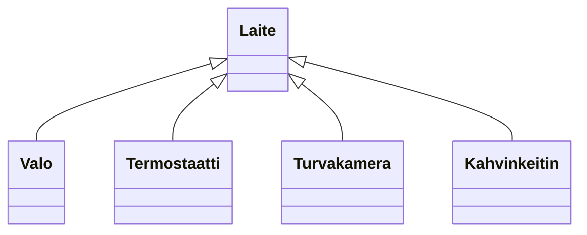

# Abstraktit luokat ja rajapinnat

> [!Osaamistavoitteet]
>
> - Abstrakti luokka tarjoaa osan toteutuksesta ja määrittelee "rajapinnan" sille, mitä perittävän luokan tulee toteuttaa itse. 
> - Abstraktit luokat (abstrakti metodi)
> - Ymmärrät, että abstraktista luokasta ei voi luoda luokan ilmentymiä

## Määritelmä

Abstrakti luokka on sellainen luokka, josta ei voi luoda suoria ilmentymiä. Sen sijaan abstrakti luokka toimii pohjana muille luokille, jotka perivät sen ja toteuttavat sen määrittelemät abstraktit metodit. Abstrakti luokka voi sisältää sekä *abstrakteja metodeja* (ts. joilla ei ole toteutusta), että *konkreettisia metodeja* (ts. joilla on toteutus).

## Esimerkki

Älykodissa voisi olla monenlaisia laitteita, kuten valoja, termostaatteja, turvakamera sekä tietysti älykahvinkeitin. Sovitaan, että kaikilla laitteilla olisi toiminto `vaihdaTilaa()`, joka suorittaa laitteen päätoiminnon (esim. valot syttyvät, termostaatti säätää lämpötilaa, kamera tallentaa videota, kahvinkeitin keittää kahvia). Kukin laite voisi myös raportoida oman tilansa `raportoiTila()`-metodilla.

