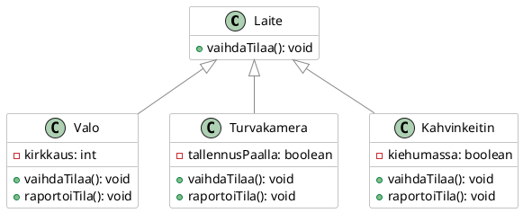
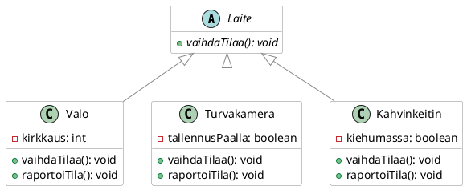

# Abstrakti luokka

> [!Osaamistavoitteet]
> 
> - Osaat tehdä abstraktin luokan ja abstrakteja metodeja Javassa.
> - Ymmärrät abstraktin luokan ja abstraktin metodin käsitteet ja niiden hyödyt olio-ohjelmoinnissa.


Suunnitellessamme ali- ja yliluokkasuhteita voi tulla tilanne, että olisi
hyödyllistä tehdä yhteistä toiminnallisuutta määrittävä yliluokka, josta
itsestään ei kuitenkaan ole mielekästä luoda ilmentymiä eli olioita.

Ajatellaan vaikkapa *tuolia*. Vaikka sana tuoli varmasti herättää meissä mielikuvan jostain tietynlaisesta tuolista, niin todellisuudessa tuoleja on monenlaisia: on puutuoleja, keinutuoleja, työtuoleja ja niin edelleen. Jokainen näistä tuolityypeistä on omanlainen ja hieman erilainen. Voidaan argumentoida, että tuoli-käsite itsessään on abstraktio. Tuolihan on oikeastaan vain asia, joka mahdollistaa istumisen. Tarvitaan aina jokin erikoistava käsite, kuten työtuoli, joka todella kuvaa millaisesta konkreettisesta tuolista on kysymys, ja jollaisia lopulta voidaan valmistaa tuotantolinjalla. 

Otetaan toinen esimerkki, joka on ehkä jo hieman lähempänä oikeaa koodia. Jatketaan edellisessä osassa esitettyä `Muoto`-esimerkkiä. Voisimme periaatteessa luoda `Muoto`-luokan ilmentymän ja kutsua sen `laskeAla()`-metodia.

```java,ignore
Muoto muoto = new Muoto();
double ala = muoto.laskeAla();
IO.println("Muodon ala on " + ala); // 0.0
```

Tässä ei kuitenkaan ole mitään järkeä. `Muoto`-olio ei edusta mitään konkreettista muotoa, vaan se on vain yleinen käsite, josta konkreettiset muodot, kuten `Ympyrä` ja `Suorakulmio`, periytyvät. Tämä on ilmeistä viimeistään siinä vaiheessa, kun yritämme tulostaa tämän yleisen muodon pinta-alaa. Näin ollen `Muoto`-luokka on tarkoitettu vain perittäväksi, eikä siitä ole mielekästä luoda ilmentymiä. Muutetaan `Muoto`-luokka abstraktiksi luokaksi, ja muutetaan myös `laskeAla()`-metodi abstraktiksi metodiksi.

```java,ignore
public abstract class Muoto {
    public abstract double laskeAla();
}
```

Tämän jälkeen `Muoto`-luokasta ei voi enää luoda ilmentymiä. 

```java,ignore
Muoto muoto = new Muoto(); 
```

```
java: Muoto is abstract; cannot be instantiated
```

*Abstrakti luokka* (engl. *abstract class*) on luokka, jonka avulla tällainen käsitteen piirre voidaan tehdä selväksi koodin tasolla luokkahierarkiassa. Abstraktista luokasta ei voi luoda suoria ilmentymiä, vaan se toimii ainoastaan pohjana muille luokille, jotka perivät sen. Abstrakti luokka voi sisältää sekä *abstrakteja metodeja* (ts. joilla ei ole toteutusta), että *konkreettisia metodeja* (ts. joilla on toteutus). Perivän luokan tulee sitten toteuttaa nuo abstraktit metodit, *ellei* perivä luokka ole myös abstrakti.
  
> [!HUOMAUTUS]
> Tässä kohtaa voi pysähtyä hetkeksi miettimään tarvitaanko [edellisen osan](02-polymorfismi.md) henkilötietojärjestelmässä laisinkaan henkilö-olioita, vai ovatko kaikki henkilöt jotain muutakin kuin henkilöitä, kuten opiskelijoita tai opettajia.

## Esimerkki: Älykoti {#alykoti}

Älykodissa voisi olla monenlaisia laitteita, kuten valoja, turvakamera sekä tietysti älykahvinkeitin. Sovitaan, että kaikilla laitteilla olisi toiminto `vaihdaTilaa()`, joka suorittaa laitteen päätoiminnon (esim. valot syttyvät tai sammuvat, kamera aloittaa tai päättää videon tallennuksen, kahvinkeitin aloittaa tai lopettaa kahvin keittämisen). Kukin laite voisi myös raportoida oman tilansa `raportoiTila()`-metodilla.

Lähdemme aluksi liikkeelle yksinkertaisesta esimerkistä, jossa voi vain vaihtaa laitteen tilaa kahden mahdollisen tilan välillä. Palaamme monimutkaisempiin säätömahdollisuuksiin myöhemmin. 

Luokkakaaviomme voisi näyttää seuraavanlaiselta. 



```java
//FILE: main.java
public class Main {
    public static void main() {
        Laite[] laitteet = {
            new Valo(),
            new Turvakamera(),
            new Kahvinkeitin()
        };

        for (Laite laite : laitteet) {
            laite.vaihdaTilaa();
            laite.raportoiTila();
        }
    }
}
// FILE_END
// FILE: Laite.java
public class Laite {
    public void vaihdaTilaa() {
    }

    public void raportoiTila() {
    }
}
// FILE_END
// FILE: Valo.java
public class Valo extends Laite {
    private int kirkkaus = 0;

    @Override
    public void vaihdaTilaa() {
        switch (kirkkaus) {
            case 0 -> kirkkaus = 50;
            case 50 -> kirkkaus = 100;
            case 100 -> kirkkaus = 0;
        }
    }
    @Override
    public void raportoiTila() {
        IO.println("Valon kirkkaus on " + kirkkaus + "%.");
    }
}
// FILE_END
// FILE: Turvakamera.java
public class Turvakamera extends Laite {
    private boolean tallennusPaalla = false;

    @Override
    public void vaihdaTilaa() {
        // Kytke tallennus päälle/pois
        tallennusPaalla = !tallennusPaalla;
    }
    @Override
    public void raportoiTila() {
        String tila = tallennusPaalla ? "päällä" : "pois";
        IO.println("Turvakameran tallennus on " + tila + ".");
    }
}
// FILE_END
// FILE: Kahvinkeitin.java
public class Kahvinkeitin extends Laite {

    private boolean kiehumassa = false;

    @Override
    public void vaihdaTilaa() {
        // Keitä kahvia tai kytke keitin pois päältä
        kiehumassa = !kiehumassa;
    }
    @Override
    public void raportoiTila() {
        String tila = kiehumassa ? "päällä" : "pois";
        IO.println("Kahvinkeittimen pannu on " + tila + ".");
    }
}
// FILE_END
```

Jos katsotaan `Laite`-luokkaa, huomataan, että sen metodit `vaihdaTilaa()` ja `raportoiTila()` eivät tee mitään. Teoriassa voisimme luoda myös `Laite`-luokasta ilmentymän ja kutsua sen metodeja:

```java,ignore
Laite laite = new Laite();
laite.vaihdaTilaa(); // Ei tee mitään
laite.raportoiTila(); // Ei tee mitään
```

Kuten nähdään, mitään ei tapahdu näitä metodeja kutsuttaessa, ja sikäli `Laite`-luokasta tehdyt oliot ovat tavallaan hyödyttömiä. Ei ole oikeastaan järkevää, että olisi olemassa jokin "yleinen laite", ilman, että tiedetään tarkemmin, minkä tyyppisestä laitteesta on kyse. Näin ollen `Laite`-luokka on oikeastaan tarkoitettu *vain* perittäväksi. 

Muutetaan `Laite`-luokka abstraktiksi luokaksi. Koska myös metodit on tarkoitettu toteutettavaksi perivissä luokissa, määritellään myös metodit abstrakteiksi. Kaikkien perivien luokkein on toteutettava nämä metodit, kuten ne esimerkissämme jo tekevätkin.

```java
// FILE: main.java
public class Main {
    public static void main() {
        Laite[] laitteet = {
            new Valo(),
            new Turvakamera(),
            new Kahvinkeitin()
        };

        for (Laite laite : laitteet) {
            laite.vaihdaTilaa();
            laite.raportoiTila();
        }
    }
}
// FILE_END
// FILE: Laite.java
public abstract class Laite {
    public abstract void vaihdaTilaa();
    public abstract void raportoiTila();
}
// FILE_END
// FILE: Valo.java
public class Valo extends Laite {
    private int kirkkaus = 0;

    @Override
    public void vaihdaTilaa() {
        // Vaihda kirkkaus 0 -> 50 -> 100 -> 0 ...
        switch (kirkkaus) {
            case 0 -> kirkkaus = 50;
            case 50 -> kirkkaus = 100;
            case 100 -> kirkkaus = 0;
        }
    }
    @Override
    public void raportoiTila() {
        IO.println("Valon kirkkaus on " + kirkkaus + "%.");
    }
}
// FILE_END
// FILE: Turvakamera.java
public class Turvakamera extends Laite {
    private boolean tallennusPaalla = false;

    @Override
    public void vaihdaTilaa() {
        // Kytke tallennus päälle/pois
        tallennusPaalla = !tallennusPaalla;
    }
    @Override
    public void raportoiTila() {
        String tila = tallennusPaalla ? "päällä" : "pois";
        IO.println("Turvakameran tallennus on " + tila + ".");
    }
}
// FILE_END
// FILE: Kahvinkeitin.java
public class Kahvinkeitin extends Laite {

    private boolean kiehumassa = false;

    @Override
    public void vaihdaTilaa() {
        // Keitä kahvia tai kytke keitin pois päältä
        kiehumassa = !kiehumassa;
    }
    @Override
    public void raportoiTila() {
        String tila = kiehumassa ? "päällä" : "pois";
        IO.println("Kahvinkeittimen pannu on " + tila + ".");
    }
}
// FILE_END
```

Vastaavasti kuin aiemmassa `Muoto`-esimerkissä, nyt `Laite`-luokasta ei voi enää luoda ilmentymiä. 

```java,ignore
Laite laite = new Laite(); 
```

```
java: Laite is abstract; cannot be instantiated
```

Luokkakaaviona kuvio näyttää samalta kuin ennen, mutta nyt `Laite`-luokka on merkitty abstraktiksi luokaksi A-kirjaimella, ja sen metodit on merkitty abstrakteiksi metodeiksi. UML-notaatiossa abstrakti luokka ja abstraktit metodit merkitään kursiivilla.



Abstraktin luokan "vastakohtana" voidaan pitää konkreettista luokkaa, josta voi luoda ilmentymiä. Esimerkiksi `Valo`, `Turvakamera` ja `Kahvinkeitin` ovat konkreettisia luokkia, koska niistä voi luoda ilmentymiä.

## Miksi abstrakti luokka on hyödyllinen?

Abstrakti luokka ei ole vain kielto tehdä luokasta ilmentymiä. Sen ensisijainen tarkoitus on

- määritellä yhteinen sopimus siitä, mitä metodeja kaikkien aliluokkien pitää tarjota, ja 
- tarjota yhteisiä ominaisuuksia ja tarvittaessa myös toteutuksia, jotta aliluokat keskittyvät vain olennaiseen. 

Kun `Laite` on abstrakti, voimme lisätä sille attribuutteja ja metodien valmiita toteutuksia, joita kaikki aliluokat käyttävät. 

Lisätään `Laite`-luokkaan attribuutti `nimi`, joka kertoo laitteen nimen, sekä attribuutti `kytketty`, joka kertoo, onko laite päällä vai pois päältä. Sellainen attribuutti on hyödyllinen kaikille laitteille, joten se sopii hyvin abstraktiin luokkaan. 

```java,ignore
public abstract class Laite {

    // HIGHLIGHT_GREEN_BEGIN
    private String nimi;
    private boolean kytketty;
    // HIGHLIGHT_GREEN_END

    public abstract void vaihdaTilaa();
    public abstract void raportoiTila();
}
```

Jos kyse olisi verkkolaitteesta, hyödyllisiä tai jopa pakollisia attribuutteja voisivat olla muun muassa MAC-osoite ja IP-osoite. Pidämme kuitenkin tämän esimerkin yksinkertaisena, joten tyydymme tässä vain nimeen ja kytketty-tilan seuraamiseen.

Lisätään myös metodit `kytkePaalle()` ja `kytkePois()`, jotka sisältävät yleisen logiikan laitteen käynnistämiseen ja sammuttamiseen, jota kaikki laitteet voivat noudattavat. 

```java,ignore
public abstract class Laite {
    private String nimi;
    private boolean kytketty;


    // HIGHLIGHT_GREEN_BEGIN
    protected Laite(String nimi) {
        this.nimi = nimi;
        this.kytketty = false; // oletus
    }

    public void kytkePaalle() {
        if (!kytketty) {
            kytketty = true;
            IO.println(nimi + " käynnistyy.");
        }
    }

    public void kytkePois() {
        if (kytketty) {
            kytketty = false;
            IO.println(nimi + " sammuu.");
        }
    }
    // HIGHLIGHT_GREEN_END

    public abstract void vaihdaTilaa();
    public abstract void raportoiTila();
}
```

Huomaa, että koska päätimme, että joka laitteella on oltava nimi, siitä seuraa, että nimi on asetettava muodostajan parametrin kautta. Tämän seurauksena emme voi enää luoda ilmentymiä ei-parametrisen muodostajan avulla. 

```java,ignore
Valo valo = new Valo();
```

```
Valo.java
java: constructor Laite in class Laite cannot be applied to given types;
  required: java.lang.String
  found:    no arguments
  reason: actual and formal argument lists differ in length
```

Muodostajan kutsuminen vaatii nyt nimen välittämisen, esimerkiksi `new Valo("PhilipsHue")`. Niinpä kussakin aliluokan muodostajassa on kutsuttava yliluokan muodostajaa. Tehdään tämä muutos kaikkiin aliluokkiin.

```java
// FILE: main.java
public class Main {
    public static void main() {
        Laite[] laitteet = {
                new Valo("PhilipsHue"),
                new Kahvinkeitin("Moccamaster"),
                new Turvakamera("Reolink")
        };

        for (Laite laite : laitteet) {
            laite.kytkePaalle();
            laite.vaihdaTilaa();
            laite.raportoiTila();
            laite.kytkePois();
        }
    }
}
// FILE_END
// FILE: Laite.java
public abstract class Laite {
    private String nimi;
    private boolean kytketty;

    protected Laite(String nimi) {
        this.nimi = nimi;
    }

    public void kytkePaalle() {
        if (!kytketty) {
            kytketty = true;
            IO.println(nimi + " käynnistyy.");
        }
    }

    public void kytkePois() {
        if (kytketty) {
            kytketty = false;
            IO.println(nimi + " sammuu.");
        }
    }

    public abstract void vaihdaTilaa();
    public abstract void raportoiTila();
}
// FILE_END
// FILE: Valo.java
public class Valo extends Laite {
    private int kirkkaus = 0;

    public Valo(String nimi)
    {
        super(nimi);
    }

    @Override
    public void vaihdaTilaa() {
        // Vaihda kirkkaus 0 -> 50 -> 100 -> 0 ...
        switch (kirkkaus) {
            case 0 -> kirkkaus = 50;
            case 50 -> kirkkaus = 100;
            case 100 -> kirkkaus = 0;
        }
    }
    @Override
    public void raportoiTila() {
        IO.println("Valon kirkkaus on " + kirkkaus + "%.");
    }
}
// FILE_END
// FILE: Turvakamera.java
public class Turvakamera extends Laite {
    private boolean tallennusPaalla = false;

    public Turvakamera(String nimi)
    {
        super(nimi);
    }

    @Override
    public void vaihdaTilaa() {
        // Kytke tallennus päälle/pois
        tallennusPaalla = !tallennusPaalla;
    }
    @Override
    public void raportoiTila() {
        String tila = tallennusPaalla ? "päällä" : "pois";
        IO.println("Turvakameran tallennus on " + tila + ".");
    }
}
// FILE_END
// FILE: Kahvinkeitin.java
public class Kahvinkeitin extends Laite {
    private boolean kiehumassa = false;

    public Kahvinkeitin(String nimi)
    {
        super(nimi);
    }

    @Override
    public void vaihdaTilaa() {
        // Keitä kahvia tai kytke keitin pois päältä
        kiehumassa = !kiehumassa;
    }
    @Override
    public void raportoiTila() {
        String tila = kiehumassa ? "päällä" : "pois";
        IO.println("Kahvinkeittimen pannu on " + tila + ".");
    }
}
// FILE_END
```

Aliluokat perivät nyt päälle- ja pois-kytkemislogiikan sellaisenaan, mutta niiden on *pakko* toteuttaa laitteen omat, oliokohtaiset toiminnallisuudet. Tämä luo tasapainoa joustavuuden ja pakollisen rakenteen välille: Tilan vaihtaminen ja tilan raportointi ovat pakollisia, mutta niiden toteutus on vapaa. Toisaalta laitteen käynnistys- ja sammutuslogiikka on yhteinen kaikille laitteille.

## Abstraktin luokan metodien näkyvyys

Abstraktin luokan metodien näkyvyys määritellään samojen periaatteiden mukaan kuin muidenkin metodien. Abstraktit metodit määritellään joko `public`- tai `protected`-metodeina, jotta aliluokat voivat toteuttaa ne. Jos metodia kutsuu koodi, joka luo olion, metodin tulee olla `public`. Jos metodia kutsutaan vain perivästä luokasta, riittää että metodi on `protected`. On kuitenkin huomattava, että aliluokan toteuttaman metodin näkyvyys ei voi olla rajoittavampi kuin abstraktin metodin näkyvyys. Esimerkiksi `public`-abstraktia metodia ei voi toteuttaa `protected`-metodina aliluokassa.

Konkreettiset metodit voivat olla myös `private`: tällöin kyseessä on vain abstraktin luokan sisäinen apumetodi, jota aliluokat eivät näe.

Abstraktia metodia ei voi määritellä `private`-määreellä. 

## Operaatiorunko-malli

Abstraktissa luokassa voi olla myös konkreettinen metodi, jonka toteutuksessa kutsutaan abstraktia metodia. Tällaista toteutusta kutsutaan ohjelmistosuunnittelussa *operaatiorunko*-suunnittelumalliksi. Abstrakti luokka määrittelee toimenpiteelle "kaavan", mutta delegoi osan vaiheista aliluokkien toteutettavaksi.

Jo aiemmin toteutetut osat on piilotettu koodista. Saat ne esiin klikkaamalla silmä-kuvaketta koodialueen oikeasta yläreunasta. 

```java
// FILE: Laite.java
public abstract class Laite {
//-    private String nimi;
//-    private boolean kytketty;
//-
//-    protected Laite(String nimi) {
//-        this.nimi = nimi;
//-    }

    public final void suoritaPaivitys() {
        kytkePaalle();
        valmistelePaivitys(); // Abstrakti askel, jonka aliluokka toteuttaa
        paivitys();
        kytkePois();
    }

    protected abstract void valmistelePaivitys();

    private void paivitys() {
        IO.println("Haetaan uusin päivitys verkosta...");
        IO.println("Laite päivitetään...");
    }

//-    public void kytkePaalle() {
//-        if (!kytketty) {
//-            kytketty = true;
//-            IO.println(nimi + " käynnistyy.");
//-        }
//-    }
//-
//-    public void kytkePois() {
//-        if (kytketty) {
//-            kytketty = false;
//-            IO.println(nimi + " sammuu.");
//-        }
//-    }
//-
//-    public abstract void vaihdaTilaa();
//-    public abstract void raportoiTila();
}
// FILE_END
// FILE: Valo.java
public class Valo extends Laite {
    private int kirkkaus = 0;

//-    public Valo(String nimi)
//-    {
//-        super(nimi);
//-    }
//-
    @Override
    protected void valmistelePaivitys() {
        IO.println("Valmistellaan valoa päivitystä varten...");
        IO.println("Asetetaan valo kirkkauteen 0%...");
    }

//-    @Override
//-    public void vaihdaTilaa() {
//-        // Vaihda kirkkaus 0 -> 50 -> 100 -> 0 ...
//-        switch (kirkkaus) {
//-            case 0 -> kirkkaus = 50;
//-            case 50 -> kirkkaus = 100;
//-            case 100 -> kirkkaus = 0;
//-        }
//-    }
    @Override
    public void raportoiTila() {
        IO.println("Valon kirkkaus on " + kirkkaus + "%.");
    }
}
// FILE_END
// FILE: Kahvinkeitin.java
public class Kahvinkeitin extends Laite {
//-    private boolean kiehumassa = false;
//-
//-    public Kahvinkeitin(String nimi)
//-    {
//-        super(nimi);
//-    }

    @Override
    protected void valmistelePaivitys() {
        IO.println("Valmistellaan keitintä päivitystä varten...");
        IO.println("Keskeytä kiehuminen...");
    }

//-    @Override
//-    public void vaihdaTilaa() {
//-        // Keitä kahvia tai kytke keitin pois päältä
//-        kiehumassa = !kiehumassa;
//-    }
//-    @Override
//-    public void raportoiTila() {
//-        String tila = kiehumassa ? "päällä" : "pois";
//-        IO.println("Kahvinkeittimen pannu on " + tila + ".");
//-    }
}
// FILE_END
// FILE: main.java
public class Main {
    public static void main() {
        Valo hue =  new Valo("PhilipsHue");
        Kahvinkeitin mocca = new Kahvinkeitin("MoccaMaster");

        hue.suoritaPaivitys();
        // Kokeile myös:
        // mocca.suoritaPaivitys();
    }
}
// FILE_END
```

`suoritaPaivitys()` on nyt ikään kuin valmis resep­ti, jota aliluokat eivät voi muuttaa (`final`). Sen sijaan ne täydentävät reseptin tarvitsemansa tavoilla toteuttamalla abstraktit metodit.

🤔 Pohdittavaksi: Missä tilanteissa haluaisit estää aliluokkaa ylikirjoittamasta tiettyä metodia? 

## Tehtävät

<task>
  <task-title num="3.7">Viestit.<points>1 p.</points></task-title>
  <handout>

{{#include ../exercises/3-7-viestit/handout.md}}

  </handout>
  <task-link><a href="https://tim.jyu.fi/view/kurssit/tie/tiep111/tehtavat/osa3/tehtava7">Tee tehtävä TIMissä</a></task-link>
</task>

<task>
  <task-title num="3.8">Abstrakti ajoneuvo.<points>1 p.</points></task-title>
  <handout>

{{#include ../exercises/3-8-abstrakti-ajoneuvo/handout.md}}

  </handout>
  <task-link><a href="https://tim.jyu.fi/view/kurssit/tie/tiep111/tehtavat/osa3/tehtava8">Tee tehtävä TIMissä</a></task-link>
</task>


<task>
  <task-title num="3.9">Viestikanavat.<points>1 p.</points></task-title>
  <handout>

{{#include ../exercises/3-9-viestikanavat/handout.md}}

  </handout>
  <task-link><a href="https://tim.jyu.fi/view/kurssit/tie/tiep111/tehtavat/osa3/tehtava9">Tee tehtävä TIMissä</a></task-link>
</task>


<task>
  <task-title num="3.10"><i class="bi bi-stars"></i>Viestipalvelu.<points>1 p.</points></task-title>
  <handout>

{{#include ../exercises/3-10-viestipalvelu/handout.md}}

  </handout>
  <task-link><a href="https://tim.jyu.fi/view/kurssit/tie/tiep111/tehtavat/osa3/tehtava10">Tee tehtävä TIMissä</a></task-link>
</task>
