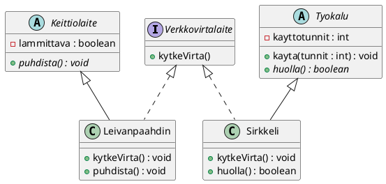

# Perintä ja rajapinnat olioiden yhteistyössä

> [!Osaamistavoitteet]
> - Osaat hyödyntää rajapintoja ja abstrakteja luokkia luokkien välisen
>   riippuvuuden välttämiseksi 


Perintä ja rajapinnat voivat toimia, ja usein toimivatkin yhdessä. Perintä
määrittelee luokkien välisen hierarkian ja jakaa yhteistä toiminnallisuutta, kun
taas rajapinnat määrittelevät kyvykkyyksiä, joita eri luokat voivat toteuttaa
riippumatta niiden sijainnista luokkahierarkiassa. 

Itse asiassa käytimme jo
[Älykoti](04-rajapinta.md#alykoti-saadettava)-esimerkissämme sekä perintää
(`Laite` abstraktina luokkana) että rajapintaa (`Saadettava`-rajapinta).
Laajennetaan kuitenkin perinnän ja rajapintojen yhteistyötä hieman eteenpäin.
Tarkastellaan tilannetta, jossa meillä on ohjelmassamme luokkia, jotka eivät jaa
yhteistä yliluokkaa, mutta kuitenkin jakavat yhteisen kyvykkyyden.

## Pistorasia ja sähkölaitteet

Tehdään pieni ajatusharjoitus. Kuvittele kotisi seinässä olevaa pistorasiaa.
Pistorasia tarjoaa sähkövirtaa, mutta se ei anna sitä mihin tahansa. Se vaatii,
että laitteessa on sopiva pistotulppa, joka sopii pistorasiaan. 

Tässä analogiassa rajapinta on se standardi eli sopimus, jonka laitteen täytyy
täyttää, jotta se voi käyttää pistorasiaa. Asiaa voidaan tarkastella myös niin
päin, että *jos* laitteessa on pistorasiaan sopiva pistotulppa, niin sillä
*täytyy* olla kyky toimia siinä tilanteessa, että se kytketään pistorasiaan. 

Pistorasiaa ei kiinnosta, kytketkö siihen leivänpaahtimen vai sirkkelin.
Laitteet ovat itse asiassa täysin erilaisia. Toisella voi tehdä ruokaa, toinen
on työkalu. Niillä ei ole yhteistä "esi-isää" laitehierarkiassa samalla tavalla,
kuin vaikkapa `Auto` ja `Moottoripyora` voisivat periä `Ajoneuvo`-luokan.  Ainoa
leivänpaahdinta ja sirkkeliä yhdistävä tekijä on kyky kytkeytyä verkkovirtaan.

Jos yrittäisimme mallintaa tämän perinnällä, joutuisimme ongelmiin heti, kun
haluaisimme käyttää leivänpaahdinta. Onko leivänpaahdin `Sahkolaite`,
`Keittiolaite`, vai kenties molempia? Javassa luokka ei kuitenkaan voi periä
kahta yliluokkaa. 

Rajapinta ratkaisee tämän ongelman tyylikkäästi: 

 * `Leivanpaahdin` on `Keittiolaite` (perintä), mutta se myös *toteuttaa*
   `Verkkovirtalaite`-rajapinnan. 
 * Samoin `Sirkkeli` voisi olla vaikkapa `Tyokalu` (perintä), joka myöskin
   toteuttaa saman `Verkkovirtalaite`-rajapinnan.

Näin pistorasia voi hyväksyä kumman tahansa laitteen, koska molemmat täyttävät
sopimuksen eli toteuttavat rajapinnan vaatiman kytkennän.

Yksinkertaisimmillaan `Verkkovirtalaite`-rajapinnan sisältö olisi määritelmä
siitä, että laitteen on pystyttävä reagoimaan siihen, kun se kytketään
pistorasiaan ja virta alkaa kulkea johdossa. 

```java,ignore
public interface Verkkovirtalaite {
    // Tämä metodi on "pistotulppa". 
    // Kun pistorasia aktivoi tämän, laite saa sähköä.
    void kytkeVirta();
}
```

Nyt `Leivanpaahdin` ja `Sirkkeli` voivat toteuttaa tämän rajapinnan.

```java,ignore
public class Leivanpaahdin implements Verkkovirtalaite {
    
    @Override
    public void kytkeVirta() {
        // Leivänpaahtimen oma tapa reagoida virtaan:
        System.out.println("Leivänpaahdin: Vastukset alkavat hehkua punaisena.");
    }
}

public class Sirkkeli implements Verkkovirtalaite {
    
    @Override
    public void kytkeVirta() {
        // Sirkkelin oma tapa reagoida virtaan:
        System.out.println("Sirkkeli: Moottori alkaa pyörittää terää 4000 rpm.");
    }
}
```

Nämä luokat voivat olla aivan eri puolella luokkahierarkiaa. Toinen on
keittiölaite, toinen työkalu. Molemmat kuitenkin reagoivat sähkövirran
kytkemiseen -- joskin omalla tavallaan. Tehdään vielä abstraktit `Keittiolaite`-
ja `Tyokalu`-yliluokat, joista `Leivanpaahdin` ja `Sirkkeli` periytyvät. Jotta
esimerkki olisi hieman mielekkäämpi, lisätään näihin yliluokkiin joitain
ominaisuuksia ja metodeja.

```java,ignore
public abstract class Keittiolaite {
    /**
     * Sisältääkö laite lämmitysvastuksia.
     */
    boolean lammittava;

    /**
     * Kaikki keittiölaitteet pitää voida pestä.
     */
    public abstract void puhdista();
}

public abstract class Tyokalu {
    /**
     * Laitteen käyttötunnit
     */
    private int kayttotunnit = 0;

    /**
     * Käytä laitetta
     * @param tunnit Montako tuntia laitetta käytetään.
     */
    public void kayta(int tunnit)
    {
        this.kayttotunnit = tunnit;
    }

    /**
     * Huolla laitetta
     * @return Onnistuiko huolto
     */
    public abstract boolean huolla();
}
```

Toteutetaan nyt nuo ominaisuudet ja metodit perivissä luokissa.

```java,ignore
// Sirkkeli on Työkalu, joka toimii verkkovirralla
public class Sirkkeli extends Tyokalu implements Verkkovirtalaite {

    @Override
    public void kytkeVirta() {
        // Sirkkelin oma tapa reagoida virtaan:
        System.out.println("Sirkkeli: Moottori alkaa pyörittää terää 4000 rpm.");

        // Kutsutaan tässä myös yliluokan kayta()-metodia, jolloin
        // käyttötunnit lisääntyvät.
        super.kayta(1);
    }

    /**
     * Huolletaan sirkkeli.
     * @return Onnistuiko huolto.
     */
    @Override
    public boolean huolla() {
        System.out.println("Huolletaan sirkkeliä... Teroitetaan terää ja säädetään kierrosnopeutta.");
        return true;
    }
}

// Leivänpaahdin on Keittiölaite, joka toimii verkkovirralla
public class Leivanpaahdin extends Keittiolaite implements Verkkovirtalaite {

    @Override
    public void kytkeVirta() {
        // Leivänpaahtimen oma tapa reagoida virtaan:
        System.out.println("Leivänpaahdin: Vastukset alkavat hehkua punaisena.");
    }

    @Override
    public void puhdista() {
        System.out.println("Leivänpaahdin: Poistetaan murut ja pyyhitään kevyesti kostealla rätillä.");
    }
}
```

Eri laitteiden luokkahierarkiat näyttäisivät seuraavanlaiselta.



Tämä on tärkein kohta ymmärryksen kannalta. Pistorasia on luokka, joka
**käyttää** rajapintaa.

```java,ignore
public class Pistorasia {
    
    // Pistorasiaan voi kytkeä MINKÄ TAHANSA verkkovirtalaitteen.
    // Pistorasiaa ei kiinnosta, onko se sirkkeli vai paahdin.
    public void kytkeLaite(Verkkovirtalaite laite) {
        System.out.println("--- Pistorasia antaa sähköä ---");
        
        // Pistorasia kutsuu sopimuksen mukaista metodia.
        // Tässä toteutuu polymorfismi: 
        // laite reagoi oikealla, sille ominaisella tavalla.
        laite.kytkeVirta();
    }
}
```

Huomaamme, että aliohjelman parametrin tyyppinä on `Verkkovirtalaite`-rajapinta!
Parametrin ei tarvitse olla `Leivanpaahdin`, `Sirkkeli` tai mikään muukaan
konkreettinen luokka. Riittää, että se toteuttaa `Verkkovirtalaite`-rajapinnan.

Tässä `kytkeLaite()`-metodi ottaa parametrinaan `Verkkovirtalaite`-rajapinnan
mukaisen tyypin. Tämä tarkoittaa, että metodi voi hyväksyä minkä tahansa olion,
joka toteuttaa tämän rajapinnan, riippumatta siitä, mihin luokkahierarkiaan
kyseinen olio kuuluu.

## Rajapinta muuttujan tyyppinä

Jotta `Pistorasia`-luokka pääsisi tositoimiin, tarvitsemme vielä pääohjelman,
jossa luomme `Pistorasia`-olion ja kytkemme siihen erilaisia laitteita. Luodaan
nyt pääohjelma, jossa kytketään ensin `Leivanpaahdin` pistorasiaan.

Esimerkki sisältää jo aika monta tiedostoa, joten lue esimerkki huolellisesti
läpi. Voit vaihtoehtoisesti selata esimerkin tiedostoja
[GitHubissa](https://github.com/ohj-perus-jy/ohj2-mdbook-esimerkit/tree/main/E35_Pistorasia/src).

```java
// FILE: main.java
public class KodinSahkot {

    public static void main(String[] args) {

        // 1. Luodaan infrastruktuuri: Pistorasia
        // Tässä kohtaa Pistorasia-olio syntyy tietokoneen muistiin.
        Pistorasia keittionPistoke = new Pistorasia();

        // 2. Luodaan laitteet
        Leivanpaahdin paahdin = new Leivanpaahdin();
        Sirkkeli sirkkeli = new Sirkkeli();

        // 3. Käytetään laitteita pistorasian kautta
        System.out.println("--- Aamu keittiössä ---");

        // Kytketään paahdin seinään
        keittionPistoke.kytkeLaite(paahdin);
        System.out.println("\n--- Remontti alkaa ---");

        // Kytketään sirkkeli SAMAAN pistorasiaan
        // Koska yhdessä pistorasiassa voi olla yksi laite kerrallaan,
        // paahdin irrotetaan, vaikka sitä ei erikseen
        // tässä esitetäkään.
        keittionPistoke.kytkeLaite(sirkkeli);
    }
}
// FILE_END
// FILE: Verkkovirtalaite.java
/**
 * Verkkovirtaan kytkettävä laite.
 */
public interface Verkkovirtalaite {
    /**
     * Kytke laite verkkovirtaan.
     */
    void kytkeVirta();
}
// FILE_END
// FILE: Leivanpaahdin.java
/**
 * Leivänpaahdin on Keittiölaite, joka toimii verkkovirralla
 */
public class Leivanpaahdin extends Keittiolaite implements Verkkovirtalaite {

    @Override
    public void kytkeVirta() {
        // Leivänpaahtimen oma tapa reagoida virtaan:
        System.out.println("Leivänpaahdin: Vastukset alkavat hehkua punaisena.");
    }

    /**
     * Puhdista leivänpaahdin. 
     */
    @Override
    public void puhdista() {
        System.out.println("Leivänpaahdin: Poistetaan murut ja pyyhitään kevyesti kostealla rätillä.");
    }
}
// FILE_END
// FILE: Sirkkeli.java
/**
 * Sirkkeli on Työkalu, joka toimii verkkovirralla
 */
public class Sirkkeli extends Tyokalu implements Verkkovirtalaite {

    @Override
    public void kytkeVirta() {
        // Sirkkelin oma tapa reagoida virtaan:
        System.out.println("Sirkkeli: Moottori alkaa pyörittää terää 4000 rpm.");

        // Kutsutaan tässä myös yliluokan kayta()-metodia, jolloin
        // käyttötunnit lisääntyvät.
        super.kayta(1);
    }

    /**
     * Huolletaan sirkkeli.
     * @return Onnistuiko huolto.
     */
    @Override
    public boolean huolla() {
        System.out.println("Huolletaan sirkkeliä... Teroitetaan terää ja säädetään kierrosnopeutta.");
        return true;
    }
}
// FILE_END
// FILE: Keittiolaite.java
/**
 * Keittiölaite
 */
public abstract class Keittiolaite {
    /**
     * Sisältääkö laite lämmitysvastuksia.
     */
    boolean lammittava;

    /**
     * Kaikki keittiölaitteet pitää voida pestä.
     */
    public abstract void puhdista();
}
// FILE_END
// FILE: Tyokalu.java
public abstract class Tyokalu {
    /**
     * Laitteen käyttötunnit
     */
    private int kayttotunnit = 0;

    /**
     * Käytä laitetta
     * @param tunnit Montako tuntia laitetta käytetään.
     */
    public void kayta(int tunnit)
    {
        this.kayttotunnit = tunnit;
    }

    /**
     * Huolla laitetta
     * @return Onnistuiko huolto
     */
    public abstract boolean huolla();
}
// FILE_END
// FILE: Pistorasia.java
public class Pistorasia {

    // Pistorasiaan voi kytkeä MINKÄ TAHANSA (yhden) verkkovirtalaitteen.
    // Pistorasiaa ei kiinnosta, onko se sirkkeli vai paahdin.
    public void kytkeLaite(Verkkovirtalaite laite) {
        System.out.println("--- Pistorasia antaa sähköä ---");

        // Pistorasia kutsuu sopimuksen mukaista metodia.
        // Tässä tapahtuu polymorfismi: oikea laite reagoi oikealla tavalla.
        laite.kytkeVirta();
    }
}
// FILE_END
```

Kuten Luvussa [3.2 Polymorfismi](02-polymorfismi.md#is-a-suhde) opimme, meidän
ei olisi pääohjelmassa pakko määritellä `paahdin`- ja `sirkkeli`-muuttujia
konkreettisten tyyppien (`Leivanpaahdin` ja `Sirkkeli`) avulla, vaan voisimme
määritellä molemmat `Verkkovirtalaite`-tyyppisiksi. Tässähän nimittäin meitä
kiinnostaa vain se, että laitteet pystytään kytkemään pistorasiaan. 

```java,ignore
public class KodinSahkot {

    public static void main(String[] args) {

        // 1. Luodaan infrastruktuuri: Pistorasia
        // Tässä kohtaa Pistorasia-olio syntyy tietokoneen muistiin.
        Pistorasia keittionPistoke = new Pistorasia();

        // 2. Luodaan laitteet
        // HIGHLIGHT_GREEN_BEGIN
        Verkkovirtalaite paahdin = new Leivanpaahdin();
        Verkkovirtalaite sirkkeli = new Sirkkeli();
        // HIGHLIGHT_GREEN_END

        // 3. Käytetään laitteita pistorasian kautta
        System.out.println("--- Aamu keittiössä ---");

        // Kytketään paahdin seinään
        keittionPistoke.kytkeLaite(paahdin);
        System.out.println("\n--- Remontti alkaa ---");

        // Kytketään sirkkeli SAMAAN pistorasiaan
        // Koska yhdessä pistorasiassa voi olla yksi laite kerrallaan,
        // paahdin irrotetaan, vaikka sitä ei erikseen
        // tässä esitetäkään.
        keittionPistoke.kytkeLaite(sirkkeli);
    }
}
```

## Ylätyyppiä vasten ohjelmointi

Yllä kuvattu tapa, jossa aliluokan oliota käsitellään ylätyypin, eli yliluokan
tai rajapinnan tyyppisenä, on olio-ohjelmoinnissa hyvin yleinen ja suositeltava
käytäntö. Tätä tapaa kutsutaan usein nimellä rajapintaa vasten ohjelmointi
(*program to an interface*) tai ylätyyppiä vasten ohjelmointi (*program to a
supertype*). Näin ohjelman eri osat kytkeytyvät toisiinsa löyhemmin, ja
yksittäisiä toteutuksia voidaan vaihtaa ilman, että muuta koodia tarvitsee
muuttaa.

Miksi ylätyyppiä vasten ohjelmointi on hyödyllistä? Yksi syy on se, että voimme
nyt käsitellä hyvin eri tyyppisiä olioita yhtenäisenä joukkona; näinhän tehtiin
jo [Tehtävässä 3.4](./02-polymorfismi.md#tehtavat). Otetaan vaikkapa
`Verkkovirtalaite`-esimerkkimme: voimme esimerkiksi luoda listan erilaisista
verkkovirtalaitteista ja kytkeä ne kaikki pistorasiaan silmukassa.

```java,ignore
List<Verkkovirtalaite> laitteet = List.of(
    new Leivanpaahdin(),
    new Sirkkeli(),
    new Imuri()
);

Pistorasia pistorasia = new Pistorasia();

for (Verkkovirtalaite v : laitteet) {
    pistorasia.kytkeLaite(v);
}
```

Jos jokainen laite olisi määritelty omaksi tyypikseen, meidän täytyisi
kirjoittaa seuraavasti (oletetaan jälleen, että `Keittiolaite` ja `Tyokalu` ovat
olemassa olevia yliluokkia).

```java,ignore
List<Keittiolaite> keittionLaitteet = ...;
List<Tyokalu> tyokalut = ...;

Pistorasia pistorasia = new Pistorasia();

for (Keittiolaite k : keittionLaitteet) {
    pistorasia.kytkeLaite(k);
}

for (Tyokalu t : tyokalut) {
    pistorasia.kytkeLaite(t);
}
```

Toinen syy on helppo vaihdettavuus, josta käytetään englanninkielistä termiä
*loose coupling*. Kun koodi käyttää rajapintaa muuttujan tyyppinä, se ei ole
sidottu tiettyyn toteutukseen. Tämä tarkoittaa, että voimme helposti vaihtaa
yhden toteutuksen toiseen ilman, että meidän tarvitsee muuttaa koodia, joka
käyttää kyseistä rajapintaa.

Kuvitellaan, että teemme ohjelmaa, joka testaa sähkölaitteita. 

```java,ignore
Leivanpaahdin testattavaLaite = new Leivanpaahdin();

// .. suoritetaan laitteen testaus ..

// Vaihdetaan testattava laite toiseen toteutukseen
testattavaLaite = new Sirkkeli(); // Ei onnistu, koska tyypit eivät täsmää
```

Kun muuttuja määritellään rajapintana, voimme helposti luoda erilaisia
testilaitteita, jotka toteuttavat saman rajapinnan, ja voimme vaihtaa
konkreettisen toteutuksen vapaasti.

```java,ignore
Verkkovirtalaite testattavaLaite = new Leivanpaahdin();
// .. suoritetaan laitteen testaus ..

// Vaihdetaan testattava laite toiseen toteutukseen
testattavaLaite = new Sirkkeli(); 

// Tämä onnistuu, koska molemmat toteuttavat 
// Verkkovirtalaite-rajapinnan
```

Kolmas syy liittyy ohjelmiston suunnitteluun ja käytännön kirjoittamiseen. Kun
määrittelet muuttujan tyypiksi `Verkkovirtalaite`, kääntäjä estää sinua
kutsumasta metodeja, jotka ovat spesifejä vain leivänpaahtimille (kuten
`saadaKuumuus()`) tai sirkkelille (kuten `asetaTeranKorkeus()`). Vaikka
tällainen itsensä rajoittaminen saattaa tuntua oudolta, se auttaa pitämään
koodin selkeänä ja estää virheitä, joissa yritetään käyttää laitetta tavalla,
joka ei ole yhteensopiva sen rajapinnan kanssa. 

## Liskovin korvausperiaate

Yllä mainittuun *loose coupling*-periaatteeseen liittyy läheisesti myös
*Liskovin korvausperiaate* (engl. *Liskov Substitution Principle*, LSP). LSP on
olio-ohjelmoinnin periaate, jonka mukaan, että olion tulee olla korvattavissa
sellaisella oliolla, joka toteuttaa saman rajapinnan tai sovitun sopimuksen
ilman, että ohjelman käyttäytyminen muuttuu. Niinpä esimerkiksi aliluokan tulee
noudattaa yliluokan määrittelemiä sopimuksia ja käyttäytymismalleja, tai
vastaavasti rajapinnan toteuttavan luokan tulee noudattaa rajapinnan
määrittelemiä sopimuksia.

Palataan hetkeksi [Luvussa 3.2 alustettuun](02-polymorfismi.md)
soitin-esimerkkiin. Oletetaan, että meillä on `Soitin`-rajapinta, joka
määrittelee yleisölle musiikkia metodin `soita()`. 

```java,noplayground
public interface Soitin {
    /**
     * Esittää kappaleen yleisölle.
     */
    void soita();
}
```

Kaikki soittimet, kuten `Kitara`, `Piano` ja `Rumpusetti`, toteuttavat tämän
rajapinnan. Konsertin järjestäjä haluaa varmistaa, että kaikki soittimet voivat
soittaa huolimatta siitä, minkä tyyppisiä soittimia ne ovat. Tehdään
`Konsertti`-luokka, jonka `soitaKaikkiaSoittimia()`-metodi laittaa kaikki
soittimet soimaan.

```java,noplayground
public class Konsertti {
    public void soitaKaikkiaSoittimia(Soitin[] soittimet) {
        for (Soitin soitin : soittimet) {
            soitin.soita();
        }
    }
}
```

Tehdään nyt uusi soitin, `HarjoitusPiano`, jolla voi soittaa vain kuulokkeilla,
jolloin yleisö ei kuule mitään. Tämäkin soitin toteuttaa `Soitin`-rajapinnan,
mutta sen käyttäytyminen poikkeaa muista soittimista. 

```java,noplayground
class HarjoitusPiano implements Soitin {
    @Override
    public void soita() {
        // Toteutus, joka tekee sinänsä jotain "järkevää", mutta rikkoo sopimuksen.
        System.out.println("Harjoitellaan kuulokkeilla. Yleisö ei kuule mitään.");
    }
}
``` 

Kootaan nyt "konsertti" pääohjelmaan.

```java,noplayground
void main() {
    Soitin[] soittimet = {
        new Kitara(),
        new Piano(),
        new HarjoitusPiano()
    };

    Konsertti konsertti = new Konsertti();
    konsertti.soitaKaikkiaSoittimia(soittimet);
}
```

Koodi kyllä sinänsä toimii teknisesti. Silti `HarjoitusPiano` rikkoo
`Soitin`-rajapinnan sopimusta: sen `soita()` ei "esitä kappaletta yleisölle",
vaan vain soittajalle itselleen. Aliluokan toiminta voisi olla järkevää jossain
toisessa kontekstissa (tässä, harjoittelutilanteessa). Hyvin suunnitellussa
luokkahierarkiassa kuitenkin jokainen olio noudattaa yliluokan tai rajapinnan
lupaamaa sopimusta. Tällöin polymorfismia voidaan käyttää luotettavasti ilman,
että ohjelman käyttäjän tarvitsee tuntea kaikkia konkreettisia aliluokkia
erikseen.

Myös kodin sähkölaitteet -esimerkkimme liittyy samaan aiheeseen. Muistetaan,
että koska Esimerkissä 3.8 `paahdin` ja `sirkkeli` määriteltiin
`Verkkovirtalaite`-tyyppisiksi, emme voi kutsua niille metodeja, jotka eivät ole
määritelty kyseisessä rajapinnassa. Esimerkiksi emme voi kutsua
`paahdin.puhdista()` tai `sirkkeli.huolla()`, koska nämä metodit eivät kuulu
`Verkkovirtalaite`-rajapintaan. Jos todella tarvitsisimme pääsyn näihin
metodeihin, meidän tulisi pysähtyä miettimään, miksi käsittelemme oliota
ylipäätään pelkkänä verkkovirtalaitteena. Ohjelmistosuunnittelun näkökulmasta
tilanne vihjaa siihen, että yritämme ehkä ratkaista kahta eri ongelmaa samassa
paikassa.

Hyvässä suunnittelussa koodi, joka käsittelee `Verkkovirtalaite`-tyyppisiä
olioita (kuten sähkömittari tai sulakekaappi), on kiinnostunut vain ja
ainoastaan sähköön liittyvistä asioista. Sitä ei pitäisikään kiinnostaa, onko
laite leivänpaahdin vai sirkkeli, eikä sen kuulu yrittää puhdistaa tai huoltaa
niitä.

Jos huomaamme tarvitsevamme `puhdista()`-metodia, olemme todennäköisesti
"väärässä huoneessa":
 
 * Väärä abstraktiotaso: Jos olemme rakentamassa sovelluslogiikkaa keittiön
   siivousta varten, meidän ei pitäisi säilyttää laitteita
   `List<Verkkovirtalaite>`-listassa, vaan `List<Keittiolaite>`-listassa.
   Tällöin kaikilla listan olioilla on luonnostaan `puhdista()`-metodi
   käytettävissä ilman kikkailua.

 * Vastuun jako (*Single Responsibility*): Jos samassa aliohjelmassa yritetään
   sekä mitata sähkönkulutusta (rajapinta) että pestä laite (abstrakti luokka),
   aliohjelma tekee liikaa asioita. Parempi ratkaisu on jakaa ohjelma osiin:
   yksi osa hallinnoi sähköverkkoa (`Verkkovirtalaite`-rajapinnan kautta) ja
   toinen osa huolehtii ylläpidosta (`Keittiolaite`- tai `Tyokalu`-tyyppien
   kautta).

Tiivistetysti: Sen sijaan, että yrittäisimme pakottaa yleisen rajapinnan kautta
esiin erityisominaisuuksia, meidän tulisi valita muuttujan tyyppi sen mukaan,
mitä olemme sillä hetkellä tekemässä. Sähkömies näkee sirkkelin
verkkovirtalaitteena, puuseppä näkee sen työkaluna – ja koodin tulisi heijastaa
tätä roolijakoa."

## Abstrakti luokka vai rajapinta?

Alla on lyhyt yhteenvetotaulukko, joka tiivistää abstraktin luokan ja rajapinnan
keskeiset erot syntaktin ja käyttötarkoituksen osalta.

| Kysymys                              | Abstrakti luokka                              | Rajapinta                                                 |
| ------------------------------------ | --------------------------------------------- | --------------------------------------------------------- |
| Voiko sisältää attribuutteja?        | Kyllä                                         | Ei                                                        |
| Voiko sisältää metodien toteutuksia? | Kyllä                                         | Ei (Java v8 alkaen mahdollisuus ns. `default`-metodeihin) |
| Kuinka monta voi periä/toteuttaa?    | Luokka voi periä vain yhden abstraktin luokan | Luokka voi toteuttaa useita rajapintoja                   |
| Käyttötarkoitus                      | Yhteinen runko ja osittainen toteutus         | Yhteinen sopimus käyttäytymisestä                         |


```java
// FILE: Säädettävä.java
public interface Saadettava {
    void asetaArvo(int arvo);
}
// FILE_END

// FILE: SaadettavaLaite.java
public abstract class SaadettavaLaite extends Laite implements Saadettava {
    protected int nykyinenArvo = 0;

    @Override
    public void raportoiTila() {
        IO.println("Nykyinen arvo: " + nykyinenArvo);
    }
}
// FILE_END

// FILE: Termostaatti.java
public class Termostaatti extends SaadettavaLaite {
    public Termostaatti() {
        super("Termostaatti");
    }

    @Override
    public void vaihdaTilaa() {
        nykyinenArvo = (nykyinenArvo + 1) % 5;
    }

    @Override
    public void asetaArvo(int arvo) {
        nykyinenArvo = Math.max(0, Math.min(arvo, 4));
    }
}
// FILE_END
```

`Termostaatti` saa valmiin `raportoiTila()`-metodin abstraktilta luokaltaan,
mutta toteuttaa rajapinnan vaatimuksen (`asetaArvo`). Tämä osoittaa, miten
abstrakti luokka ja rajapinta täydentävät toisiaan.
