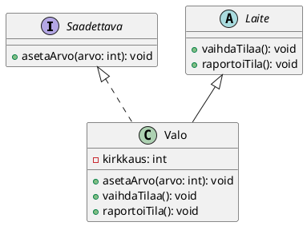

# Rajapinta

> [!Osaamistavoitteet]
> - Ymmärrät, mitä rajapinta (interface) tarkoittaa olio-ohjelmoinnissa.
> - Osaat määritellä ja käyttää rajapintoja Javassa.
> - Osaat käyttää rajapintaa aliohjelman parametrina ja muuttujan tyyppinä.
> - Ymmärrät, milloin kannattaa käyttää rajapintaa perinnän sijaan.
> - Ymmärrät, että luokka voi toteuttaa monta rajapintaa, mutta periä vain yhden luokan

*Rajapinta* toimii sitovana sopimuksena: Se määrittelee, mitä metodeja luokan on
tarjottava, ottamatta kantaa siihen, miten ne on teknisesti toteutettu. Toisin
kuin abstrakti luokka, joka luo pohjan luokan metodeille ja attribuuteille,
rajapinta keskittyy kuvailemaan olion kyvykkyyksiä. Rajapinta mahdollistaa
yhtenevän kyvykkyyksien määrittelyn, vaikka luokat olisivat täysin erilaisia tai
periytyisivät eri paikoista luokkahierarkiassa. Kun ohjelmoija sitten käsittelee
oliota rajapinnan kautta, hän voi luottaa siihen, että olio tarjoaa sovitun
kyvykkyyden riippumatta siitä, mitä luokkaa olio edustaa.

## Älykoti: säädettävät laitteet{#alykoti-saadettava}

Jatketaan [Osassa 3
aloittamaamme](../osa3/03-abstrakti-luokka.md#alykoti)
älykoti-esimerkkiä. Jotkin älykotimme laitteet voisivat olla säädettäviä, eli
niihin voisi asettaa suoraan arvon, kuten kirkkauden, lämpötilan tai
äänenvoimakkuuden. Näinhän periaatteessa toimimmekin jo esimerkkimme
`Valo`-luokassa, jossa kirkkaus vaihtelee kolmen arvon välillä. Olion käyttäjän
kannalta olisi kuitenkin kätevämpää, jos voisi asettaa kirkkauden suoraan
haluttuun arvoon (esim. 33%), sen sijaan, että pitäisi kutsua
`vaihdaTilaa()`-metodia useita kertoja ja toivoa, että arvo osuu kohdalleen.
Loppukäyttäjän kannalta tätä voisi verrata tilanteeseen, jossa käyttäjä voisi
asettaa vaikkapa mobiilisovelluksesta suoraan haluamansa kirkkauden sen sijaan,
että pitäisi klikkailla *Lisää kirkkautta*- tai *Vähennä kirkkautta*
-painikkeita useita kertoja. 

Määritellään rajapinta `Saadettava`, jossa on metodi `asetaArvo(int arvo)`.
Tiedosto tallennetaan nimellä `Saadettava.java`, eli samaan tapaan kuin luokat.

```java,ignore
/**
 * Laite, jonka voi säätää suoraan haluttuun arvoon.
 */
public interface Saadettava {
    void asetaArvo(int arvo);
}
```

Tämän voi lukea seuraavasti: Jokaisella `Saadettava`-rajapinnan toteuttavalla
luokalla tulee olla `asetaArvo`-metodi.

Nyt voimme muokata `Valo`-luokkaa toteuttamaan `Saadettava`-rajapinnan:

Lisätään `Valo`-luokkaan rajapinnan toteutus (klikkaa `Valo.java`-tiedostoa).
Jätämme `Kahvinkeitin`- ja `Turvakamera`-luokat tässä vaiheessa esimerkistä
pois, koska päätämme yksinkertaisuuden vuoksi, että ne eivät ole säädettäviä
laitteita.

```java
// FILE: main.java
public class Main {
    public static void main() {
        Valo valo = new Valo("PhilipsHue");
        valo.asetaArvo(33);
        valo.raportoiTila();

        valo.vaihdaTilaa();
        valo.raportoiTila();
    }
}
// FILE_END
// FILE: Saadettava.java
public interface Saadettava {
    void asetaArvo(int arvo);
}
// FILE_END
// FILE: Valo.java
public class Valo extends Laite implements Saadettava {
    private int kirkkaus = 0;

    protected Valo(String nimi) {
        super(nimi);
    }

    @Override
    public void asetaArvo(int arvo)
    {
        if (arvo < 0) arvo = 0;
        if (arvo > 100) arvo = 100;
        this.kirkkaus = arvo;
    }

    @Override
    public void vaihdaTilaa() {
        // Yksinkertainen päälle-pois
        if (kirkkaus == 100) kirkkaus = 0;
        else kirkkaus = 100;
    }

    @Override
    public void raportoiTila() {
        IO.println("Valon kirkkaus on " + kirkkaus + "%.");
    }
}
// FILE_END
// FILE: Laite.java
public abstract class Laite {
    private final String nimi;
    private boolean kytketty;

    protected Laite(String nimi) {
        this.nimi = nimi;
    }

    public void kytkePaalle() {
        if (!kytketty) {
            kytketty = true;
            IO.println(nimi + " käynnistyy.");
        }
    }

    public void kytkePois() {
        if (kytketty) {
            kytketty = false;
            IO.println(nimi + " sammuu.");
        }
    }

    public abstract void vaihdaTilaa();
    public abstract void raportoiTila();
}
// FILE_END
```

Luokkakaaviona esimerkkimme näyttäisi tältä. I-kirjain ilmaisee, että kyseessä
on rajapinta. Abstraktin luokan tapaan rajapinta on merkitty kursiivilla.
Rajapinnan toteuttaminen esitetään katkoviivalla, jossa on avoin nuoli kohti
rajapintaa.



## Usean rajapinnan toteuttaminen

Luokka voi toteuttaa useita rajapintoja. Esimerkiksi Javan sisäänrakennettu
`ArrayList`-luokka toteuttaa rajapintoja: `List`, `RandomAccess`, `Cloneable` ja
`Serializable` (ks. [`ArrayList`-luokan
dokumentaatio](https://docs.oracle.com/javase/8/docs/api/java/util/ArrayList.html)).

 * `List`-rajapinta määrittelee listan perustoiminnot, kuten elementtien
   lisäämisen, poistamisen ja hakemisen.
 * `RandomAccess`-rajapinta määrittelee, että listan alkioihin tulee päästä
   käsiksi nopeasti indeksien avulla. 
 * `Cloneable`-rajapinta sallii olion kloonauksen eli kopioinnin.
 * `Serializable`-rajapinta sallii olion tallentamisen tiedostoon tai
   lähettämiseen verkon yli.

Toisaalta myös [Javan
`Date`-luokka](https://docs.oracle.com/javase/8/docs/api/java/util/Date.html)
toteuttaa muun muassa `Cloneable`-rajapinnan, joka mahdollistaa päivämääräolion
kloonaamisen. Huomaa, että `Date`-luokka ei liity mitenkään
`ArrayList`-luokkaan, mutta molemmat toteuttavat saman rajapinnan.

Luodaan nyt itse kaksi rajapintaa ja luokkia, jotka toteuttavat molemmat
rajapinnat.

Otetaan esimerkki käyttöliittymäkomponenteista, joita voi piirtää näytölle ja
joita voi klikata hiirellä. Määritellään kaksi rajapintaa: `Piirrettava` ja
`Klikattava`. Näiden rajapintojen avulla voitaisiin määritellä, millaisia
komponentteja käyttöliittymässä on. Sovitaan niin, että piirrettävä komponentti
osaa piirtää itsensä, ja klikattava komponentti osaa käsitellä klikkauksia ja
korostaa itsensä, kun hiiri on sen päällä. 

```java,ignore
// FILE: Piirrettava.java
/**
 * Käyttöliittymään piirrettävä komponentti.
 */
public interface Piirrettava {
    public void piirra();
}
// FILE_END
// FILE: Klikattava.java
/**
 * Käyttöliittymän komponentti, jota voi klikata.
 */
public interface Klikattava {
    public void klikattu();

    public void asetaKorostus(boolean korostus);
}
// FILE_END
```

Huomaa, että emme tiedä emmekä välitä siitä, miten nämä metodit aikanaan
toteutetaan. Piirto voi tapahtua graafisella käyttöliittymällä,
tekstipohjaisella käyttöliittymällä tai vaikkapa tulostamalla tiedostoon. Meille
riittää, että tiedämme, että jokaisella `Pirrettava`-rajapinnan toteuttavalla
luokalla on `piirra()`-metodi, ja jokaisella `Klikattava`-rajapinnan
toteuttavalla luokalla on `klikattu()`- ja `asetaKorostus(boolean
korostus)`-metodit.

Mennään eteenpäin. Toteutetaan `Teksti`, joka on pelkkää tekstiä näyttävä
käyttöliittymäkomponentti.

```java,ignore
/**
 * Pelkkää tekstiä esittävä piirrettävä komponentti.
 */
public class Teksti implements Piirrettava {
    private String sisalto;
    public Teksti(String sisalto)
    {
        this.sisalto = sisalto;
    }

    @Override
    public void piirra() {
        // Piirretään vain pelkkä tekstisisältö ilman kehyksiä
        IO.println(sisalto);
    }
}
```

Rajapintojen hyöty ei vielä kokonaisuudessaan välity, osittain siksi, että
`piirra()`-metodi on ainoa metodi, jota `Piirrettava`-rajapinta tarjoaa. Nyt
kuitenkin voimme luoda toisen komponentin, `Painike`, joka on laatikon näköinen
klikkattava painike, jossa on tekstiä. `Painike`-luokka toteuttaa molemmat
rajapinnat: `Pirrettava` ja `Klikattava`.

```java,ignore
/**
 * Laatikon näköinen klikkattava painike,
 * jossa on tekstiä.
 */
public class Painike implements Piirrettava, Klikattava {

    private String sisalto;
    private boolean korostettu;

    public Painike(String sisalto)
    {
        this.sisalto = sisalto;
        this.korostettu = false;
    }

    @Override
    public void piirra() {
        // Piirretään suorakulmio ja teksti
        if (!korostettu) {
            IO.println("[ " + sisalto + " ]");
        } else {
            IO.println("[*" + sisalto + "*]");
        }
    }

    /**
     * Käsitellään klikkaustapahtuma
     */
    @Override
    public void klikattu() {
        IO.println("(Klikattiin painiketta, jossa lukee \"" + sisalto + "\")");
    }

    /**
     * Asetetaan korostustila. Jos tila muuttuu, piirretään komponentti uudestaan.
     */
    @Override
    public void asetaKorostus(boolean korostus) {
        if (this.korostettu == korostus) {
            return;
        }
        this.korostettu = korostus;
        this.piirra();
    }
}
```

Nyt meillä on kaksi erilaista käyttöliittymäkomponenttia, jotka molemmat voidaan
piirtää näytölle. `Painike`-komponentti on lisäksi klikattava. Käytetään näitä
komponentteja pääohjelmassa.

```java
// FILE: Piirrettava.java
/**
 * Käyttöliittymään piirrettävä komponentti.
 */
public interface Piirrettava {
    public void piirra();
}
// FILE_END
// FILE: Klikattava.java
/**
 * Käyttöliittymän komponentti, jota voi klikata.
 */
public interface Klikattava {
    public void klikattu();

    public void asetaKorostus(boolean korostus);
}
// FILE_END
// FILE: Teksti.java
/**
 * Pelkkää tekstiä näyttävä komponentti.
 */
public class Teksti implements Piirrettava {
    private String sisalto;
    public Teksti(String sisalto)
    {
        this.sisalto = sisalto;
    }

    @Override
    public void piirra() {
        // Piirretään vain pelkkä tekstisisältö ilman kehyksiä
        IO.println(sisalto);
    }
}
// FILE_END
// FILE: Painike.java
/**
 * Laatikon näköinen klikkattava painike,
 * jossa on tekstiä.
 */
public class Painike implements Piirrettava, Klikattava {

    private String sisalto;
    private boolean korostettu;

    public Painike(String sisalto)
    {
        this.sisalto = sisalto;
        this.korostettu = false;
    }

    @Override
    public void piirra() {
        // Piirretään suorakulmio ja teksti
        if (!korostettu) {
            IO.println("[ " + sisalto + " ]");
        } else {
            IO.println("[*" + sisalto + "*]");
        }
    }

    /**
     * Käsitellään klikkaustapahtuma
     */
    @Override
    public void klikattu() {
        IO.println("(Klikattiin painiketta, jossa lukee \"" + sisalto + "\")");
    }

    /**
     * Asetetaan korostustila.
     */
    @Override
    public void asetaKorostus(boolean korostus) {
        this.korostettu = korostus;
    }
}
// FILE_END
// FILE: main.java
public class Main {
    public static void main(String[] args) {
        Teksti otsikko = new Teksti("Haluatko aloittaa rajapintojen opiskelun?");
        otsikko.piirra();

        Painike okPainike = new Painike("OK!");
        okPainike.piirra();

        // Simuloidaan hiiren vieminen painikkeen päälle
        // Korostamisen jälkeen piirretään painike uudestaan
        okPainike.asetaKorostus(true);
        okPainike.piirra();

        // Simuloidaan klikkaus
        okPainike.klikattu();
    }
}
// FILE_END
```

Jos haluat testata tätä koodia omalla koneellasi, voit ladata tämänkin esimerkin
[GitHubista](https://github.com/ohj-perus-jy/ohj2/tree/main/src/examples/osa3/E32_Rajapinnat2/src).

<details closed><summary><i class="bi bi-stars jyu-gold"></i> Valinnaista lisätietoa: Piirtämisvastuun siirtäminen pois komponenteista </summary>

Yllä oleva esimerkkimme on siinä mielessä aavistuksen epätodellinen, että
käyttöliittymäkomponentit eivät yleensä huolehdi itse itsensä piirtämisestä,
vaan piirtämisvastuu on usein erotettu muuhun osaan järjestelmää. Tällöin
komponentit vain tarjoavat tiedot, jotka tarvitaan piirtämiseen, ja joku muu osa
järjestelmää huolehtii siitä, että komponentit piirretään oikein näytölle (tai
muuhun esitystapaan).

Muokataan esimerkkiämme tämän ajatuksen mukaisesti. Tehdään `Naytto`-luokka,
joka pitää kirjaa kaikista näytöllä näkyvistä käyttöliittymäkomponenteista. 

```java,ignore
/**
 * Naytto-luokka hallinnoi piirrettäviä komponentteja.
 */
public class Naytto {
    private ArrayList<Piirrettava> komponentit = new ArrayList<>();

    public void lisaaKomponentti(Piirrettava p) {
        komponentit.add(p);
    }

    public void poistaKomponentti(Piirrettava p) {
        komponentit.remove(p);
    }
}
```

Tehdään myös `Piirturi`-luokka, joka toimii välikerroksena `Naytto`-luokan ja
käyttöliittymäkomponenttien välillä. `Piirturi`-luokka huolehtii siitä, että
komponentit piirretään oikein näytölle. Tässä esimerkissä ne tulostetaan
konsolille, mutta oikeassa käyttöliittymässä ne piirrettäisiin graafiselle
näytölle.

```java,ignore
/**
 * Piirturi-luokka vastaa piirtoalueen piirtämisestä.
 */
public class Piirturi {
    public void piirraPainike(String teksti, boolean korostettu) {
        if (!korostettu) {
            IO.println("[ " + teksti + " ]");
        } else {
            IO.println("[*" + teksti + "*]");
        }
    }

    public void piirraTeksti(String teksti) {
            IO.println(teksti);
    }

    public void tyhjaa() {
        IO.println("Tyhjennetään piirtoalue");
        // Jätetään tässä toteuttamatta        
    }
}
```

Nyt `Naytto`-luokka voi käyttää `Piirturi`-luokkaa piirtämään ne tarvittaessa.
Lisätään `Naytto`-luokkaan metodi `paivita()`, joka käy läpi kaikki näytöllä
olevat komponentit ja pyytää niitä piirtämään itsensä `Piirturi`-olion avulla.

```java,ignore
import java.util.ArrayList;

/**
 * Naytto-luokka hallinnoi piirrettäviä komponentteja.
 */
public class Naytto {
    private ArrayList<Piirrettava> komponentit = new ArrayList<>();
    // HIGHLIGHT_GREEN_BEGIN
    private Piirturi piirturi = new Piirturi();
    // HIGHLIGHT_GREEN_END

    public void lisaaKomponentti(Piirrettava p) {
        komponentit.add(p);
    }

    public void poistaKomponentti(Piirrettava p) {
        komponentit.remove(p);
    }

    // HIGHLIGHT_GREEN_BEGIN
    public void paivita() {
        piirturi.tyhjaa();
        for (Piirrettava p : komponentit) {
            p.piirra(piirturi);
        }
    }
    // HIGHLIGHT_GREEN_END
}
```

Huomaa, että `Piirrettava`-rajapinnan `piirra()`-metodin tulee nyt ottaa
parametrina `Piirturi`-olio. Tämän avulla komponentit voivat käyttää
`Piirturi`-oliota piirtämiseen.

```java,ignore
public interface Piirrettava {
    // HIGHLIGHT_GREEN_BEGIN
    public void piirra(Piirturi piirturi);
    // HIGHLIGHT_GREEN_END
}
```

Ja nyt se oleellinen kohta: Tämän seurauksena `Teksti`- ja `Painike`-luokkien
`piirra()`-metodit eivät enää itse tulosta mitään, vaan ne kutsuvat
`Piirturi`-olion metodeja.

```java,ignore
/**
 * Pelkkää tekstiä esittävä piirrettävä komponentti.
 */
public class Teksti implements Piirrettava {
    private String sisalto;
    public Teksti(String sisalto)
    {
        this.sisalto = sisalto;
    }

    /**
     * Piirrä komponentti
     * @param piirturi Piirturi
     */
    @Override
    // HIGHLIGHT_GREEN_BEGIN
    public void piirra(Piirturi piirturi) {
        piirturi.piirraTeksti(sisalto);
    }
    // HIGHLIGHT_GREEN_END
}
```

Vastaava muutos tulee tehdä `Painike`-luokkaan.

Tässä meidän yksinkertaisessa esimerkissämme kaikki tietysti tapahtuu konsolille
tulostamalla, mutta oikeassa graafisessa käyttöliittymässä `Piirturi`-luokka
voisi käyttää jotain graafista kirjastoa, kuten JavaFX:ää tai Swingiä.

Esimerkki on pitkähkö, ja jos haluat ajaa sen omalla tietokoneellasi, lataa se
[GitHubista](https://github.com/ohj-perus-jy/ohj2/tree/main/src/examples/osa3/E34_Klikattava_ja_Piirrettava_2/src).

</details>


## Rajapinnan periminen

Rajapinta voi myös laajentaa (periä) toista rajapintaa. Syntaktisesti tämä
tapahtuu käyttämällä `extends`-avainsanaa, kuten luokkien perinnässä. Luokkien
perinnästä poiketen rajapinta voi periä useita rajapintoja. Alirajapinta saa
kaikki ylirajapinnan metodit. Alla synteettinen esimerkki. 

```java
// FILE: A.java
public interface A {
    void metodiA();
}
// FILE_END
// FILE: B.java
public interface B {
    void metodiB();
}
// FILE_END
// FILE: C.java
public interface C extends A, B {
    void metodiC();
}
// FILE_END
// FILE: D.java
public class D implements C {
    @Override
    public void metodiA() {
        IO.println("Toteutus metodille A");
    }

    @Override
    public void metodiB() {
        IO.println("Toteutus metodille B");
    }

    @Override
    public void metodiC() {
        IO.println("Toteutus metodille C");
    }
}
// FILE_END
// FILE: main.java
public class Main {
    public static void main(String[] args) {
        D olioD = new D();
        olioD.metodiA();
        olioD.metodiB();
        olioD.metodiC();
    }
}
// FILE_END
```

## Esimerkit

Löydät kaikki tällä sivulla esitellyt esimerkit
[GitHubista](https://github.com/ohj-perus-jy/ohj2/tree/main/src/examples/osa3)
(E34-alkuiset kansiot).

## Huomautuksia

<i class="bi bi-stars jyu-gold"></i> Valinnaista lisätietoa: Javan versiosta 8 alkaen rajapinnat voivat sisältää
myös metodien oletustoteutuksia. Ominaisuus saattaa olla hyödyllinen esimerkiksi
tilanteissa, jossa halutaan lisätä uusi metodi olemassa olevaan rajapintaan
rikkomatta vanhoja toteutuksia. Lue aiheesta lisää [Javan
dokumentaatiosta](https://docs.oracle.com/javase/tutorial/java/IandI/defaultmethods.html).

<!-- Tehtäväidea tulevaisuutta varten -->
<!-- Suunnittele `Hälytettävä`-rajapinta, jossa on metodit `trigger()` ja `reset()`. Toteuta rajapintaa hyödyntävä abstrakti `HälytinLaite`, joka pitää kirjaa siitä, montako kertaa hälytys on aktivoitu. Luo kaksi konkreettista laitetta (esim. `SavuHälytin` ja `VesivuotoHälytin`). Mieti, missä kohtaa sijoitat yhteisen lokituksen: rajapintaan (ei mahdollista) vai abstraktiin luokkaan? -->

## Tehtävät


<task>
  <task-title num="4.1">Muunnin.<points>1 p.</points></task-title>
  <handout>

{{#include ../exercises/4-1-muunnin/handout.md}}

  </handout>
  <task-link><a href="https://tim.jyu.fi/view/kurssit/tie/tiep111/tehtavat/osa4/tehtava1">Tee tehtävä TIMissä</a></task-link>
</task>


<task>
  <task-title num="4.2">Vakoojien viestijärjestelmä.<points>1 p.</points></task-title>
  <handout>

{{#include ../exercises/4-2-salakirjoitus/handout.md}}

  </handout>
    <task-link><a href="https://tim.jyu.fi/view/kurssit/tie/tiep111/tehtavat/osa4/tehtava2">Tee tehtävä TIMissä </a></task-link>
</task>

