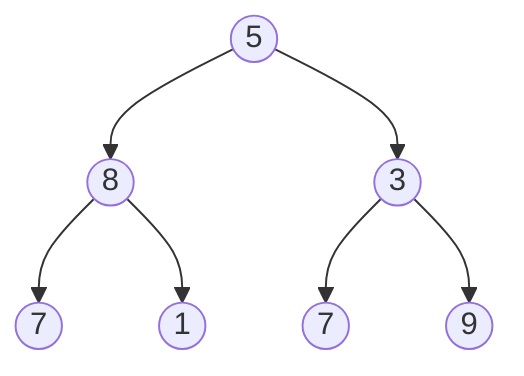

# Rekursio

> [!Osaamistavoitteet]
>
> - Ymmärrät miten rekursio toimii
> - Ymmärrät, miten rekursiota voidaan mallintaa pinon avulla

Rekursio tarkoittaa ongelman määrittelemistä itsensä avulla niin, että ongelma
muodostuu pienemmistä osista, jotka ovat rakenteeltaan samanlaisia kuin
alkuperäinen ongelma. 
Rekursiivinen ratkaisu on perusteltu, kun ongelmalla on
selkeä perustapaus ja
kun rekursiivinen askel pienentää ongelmaa siten, että perustapaukseen päädytään
varmasti. Rekursio on luonteva tapa toteuttaa niin kutsuttua *hajota ja
hallitse* -periaatetta: ongelma jaetaan pienempiin osiin, ratkaistaan pienet
ongelmat ja yhdistetään tulokset.

Rekursiivinen tietorakenne on rakenne, jonka määritelmä viittaa itseensä. Eräs
esimerkki rekursiivisesta tietorakenteesta on linkitetty lista, jossa jokainen
solmu sisältää viitteen seuraavaan solmuun tai null-arvon, joka merkitsee listan
loppua. Linkitettyihin listoihin törmää käytännössä esimerkiksi soittolistan
toistossa (seuraava kappale), sovellusten "takaisin/eteenpäin"- historiassa sekä
käyttöjärjestelmien ja ohjelmistokirjastojen (eli valmiiden ohjelmakokoelmien)
sisäisissä tietorakenteissa. 

Rekursiivisten algoritmien soveltaminen on erityisen luontevaa, kun käsitellään
rekursiivisia tietorakenteita. Seuraava Java-esimerkki näyttää kokonaislukuja
sisältävän linkitetyn listan rakenteen ja listan pituuden laskemisen
rekursiivisesti.

```java,ignore
class Solmu {
    int arvo;
    Solmu seuraava;

    Solmu(int arvo) {
        this.arvo = arvo;
    }
}
```

Tällä tavalla määritellyn listan pituuden laskemiseksi voidaan käyttää rekursiota:

```java,ignore
int pituus(Solmu solmu) {
    if (solmu == null) return 0;           // perustapaus
    return 1 + pituus(solmu.seuraava);     // rekursiivinen tapaus
}
```

Listan rakentelu "käsin" näyttäisi seuraavalta.

```java
//-class Solmu {
//-    int arvo;
//-    Solmu seuraava;
//-
//-    Solmu(int arvo) {
//-        this.arvo = arvo;
//-    }
//-}
//- 
//- int pituus(Solmu solmu) {
//-     if (solmu == null) return 0;           // perustapaus
//-     return 1 + pituus(solmu.seuraava);     // rekursiivinen tapaus
//- }
//-void main() {
Solmu eka = new Solmu(10);
eka.seuraava = new Solmu(20);
eka.seuraava.seuraava = new Solmu(30);

int n = pituus(eka); // n == 3
IO.println(n);
//-}
```

Tämä on kuitenkin hieman kömpelöä. Tyypillisessä käytössä listalla olisi oma
luokka, joka kapseloi `alku`-viitteen ja lisäämisen:

```java,ignore
class Lista {
    Solmu alku;

    void lisaaLoppuun(int arvo) {
        if (alku == null) {
            alku = new Solmu(arvo);
            return;
        }

        Solmu nykyinen = alku;
        while (nykyinen.seuraava != null) {
            nykyinen = nykyinen.seuraava;
        }
        nykyinen.seuraava = new Solmu(arvo);
    }

    int pituus() {
        return pituus(alku);
    }
}
```

Nyt listan käyttö näyttäisi seuraavalta:

```java
Lista lista = new Lista();
lista.lisaaLoppuun(10);
lista.lisaaLoppuun(20);
lista.lisaaLoppuun(30);

int n = lista.pituus(); // n == 3
```

## Rekursio käytännössä

Listat ovat lineaarisia: jokaisella solmulla on korkeintaan yksi seuraava solmu.
Monissa ongelmissa rakenne kuitenkin haarautuu. Puu on tällainen haarautuva
tietorakenne: se koostuu solmuista ja niiden lapsisolmuista, ja sillä on yksi
juurisolmu. Puu ei sisällä syklejä, mikä tarkoittaa, että kun etenet puussa
alaspäin lapsisolmuihin, et voi koskaan palata samaan solmuun pelkästään
lapsiviitteitä seuraamalla.

Yleinen erikoistapaus on binääripuu, jossa jokaisella solmulla on korkeintaan
kaksi lasta: vasen ja oikea. Rekursio sopii puiden käsittelyyn, koska puu
koostuu alipuista: jokainen lapsi on itsekin puu.

Esimerkki binääripuusta:



Seuraava esimerkki laskee binääripuun korkeuden rekursion avulla. Ajatus seuraa
suoraan korkeuden määritelmästä: tyhjän puun korkeus on 0, ja ei-tyhjän puun
korkeus on 1 + suurimman alipuun korkeus. Jokainen polku juuresta lehteen kulkee
ensin vasempaan tai oikeaan alipuuhun, joten pisin polku saadaan valitsemalla
näistä kahdesta suurempi. Rekursio pysähtyy, kun alipuuta ei ole (`juuri ==
null`), jolloin perustapaus palauttaa 0.

```java
public class Solmu {
    // Solmun tallettama arvo.
    int arvo;
    // Viite vasempaan lapseen (null jos ei ole).
    Solmu vasen;
    // Viite oikeaan lapseen (null jos ei ole).
    Solmu oikea;

    Solmu(int arvo) {
        this.arvo = arvo;
    }
}

public static int korkeus(Solmu juuri) {
    if (juuri == null) {
        return 0;
    }

    return 1 + Math.max(korkeus(juuri.vasen), korkeus(juuri.oikea));
}

void main() {
    // Muodostetaan binääripuu
    Solmu juuri = new Solmu(1);
    juuri.vasen = new Solmu(2);
    juuri.oikea = new Solmu(3);
    juuri.vasen.vasen = new Solmu(4);

    IO.println(korkeus(juuri));
}
```

Sivuhuomautuksena mainittakoon, että koodissamme mikään ei nyt estä meitä
luomasta syklisiä rakenteita, joissa solmut viittaavat toisiinsa muodostaen
silmukan. Tällöin rekursio ei pysähtyisi koskaan, vaan aiheuttaisi ohjelman
kaatumisen (pinon ylivuodon). Vaikka emme tässä harjoituksessa toteuta
syklisyyden tarkistusta, todellisessa ohjelmassa on syytä varmistaa, että
syklisiä rakenteita ei pääse syntymään, jos algoritmi olettaa puun kaltaista
rakennetta.

Kun `korkeus`-metodia kutsutaan juurisolmulle, laskenta etenee luonnollisesti
alaspäin puussa. Metodi kutsuu itseään vasemmalle ja oikealle alipuulle ja
jatkaa näin, kunnes vastaan tulee `null`, eli tyhjä puu. Tämä on rekursion
perustapaus: tyhjän puun korkeudeksi määritellään 0. 

Kun perustapaukseen on päästy, laskenta alkaa palautua takaisin päin kutsupinoa
pitkin. Jokainen solmu saa alipuittensa korkeudet ja määrittää oman korkeutensa
niiden perusteella arvona 1 + suuremman alipuun korkeus. Näin puun korkeus
rakentuu askel askeleelta lehdistä kohti juurta, pelkkien palautusarvojen
avulla. 

## Rekursion mallintaminen pinon avulla

Rekursiivinen ratkaisu näyttää usein hämmentävän yksinkertaiselta, jopa
"maagiselta". Miten tietokone tietää, mihin kohtaan suoritusta sen pitää palata,
kun funktio on kutsunut itseään kymmeniä kertoja sisäkkäin? Miten edellisen
kutsun muuttujat (kuten solmu, vasen tai oikea) pysyvät tallessa?

Tietokone ei tee taikatemppuja, vaan se käyttää kulissien takana pinoa. 
Joka kerta kun funktio kutsuu itseään, tietokone:

 * Keskeyttää nykyisen suorituksen.
 * Luo uuden pinokehyksen (stack frame), johon se tallentaa ainakin parametrit, paikalliset
muuttujat ja tiedon siitä, mihin kohtaan suoritusta palataan, kun kutsuttu
funktio palauttaa arvon.
 * Laittaa tämän kehyksen muistissa olevan kutsupinon päällimmäiseksi.

Kun rekursiivinen kutsu valmistuu, eli perustapaus saavutetaan, päällimmäinen
kehys "popataan" pois pinosta, ja suoritus jatkuu siitä, mihin edellisessä
kehyksessä jäätiin. Rekursio on siis pohjimmiltaan vain pinon täyttämistä ja
tyhjentämistä.

Tämä on mekanismi, joka tekee rekursiosta mahdollisen:
jokainen rekursiivinen kutsu keskeyttää nykyisen laskennan, tallentaa sen tilan
pinoon ja siirtää ohjauksen seuraavalle, pienemmälle aliongelmalle.

Seuraava pinokuvio havainnollistaa pinoa rekursiivisessa summassa, joka laskee
lukujen 1 + 2 + ... + n summan:

```java,ignore
int summa(int n) {
    if (n == 0) return 0;   // perustapaus
    return n + summa(n - 1);
}
```

Oletetaan, että kutsutaan `summa(3)`. Jokainen kehys sisältää parametrin `n`
ja keskeneräisen laskun "n + summa(n - 1)". Toisin sanoen kehys odottaa
alikutsun tulosta, jotta se voi lisätä oman lukunsa.

| Vaihe | Pino (alhaalta → ylös)                         | Mitä tapahtuu                 |
| ----- | ---------------------------------------------- | ----------------------------- |
| 1     | `summa(3)`                                     | Odottaa `summa(2)`            |
| 2     | `summa(3)`, `summa(2)`                         | Odottaa `summa(1)`            |
| 3     | `summa(3)`, `summa(2)`, `summa(1)`             | Odottaa `summa(0)`            |
| 4     | `summa(3)`, `summa(2)`, `summa(1)`, `summa(0)` | Perustapaus: palauttaa 0      |
| 5     | `summa(3)`, `summa(2)`, `summa(1)`             | Paluu: `summa(1) = 1 + 0 = 1` |
| 6     | `summa(3)`, `summa(2)`                         | Paluu: `summa(2) = 2 + 1 = 3` |
| 7     | `summa(3)`                                     | Paluu: `summa(3) = 3 + 3 = 6` |
| 8     | (tyhjä)                                        | Laskenta valmis, tulos 6      |

Kutsuvaiheessa pino kasvaa, koska jokainen kehys odottaa alikutsun tulosta
(esimerkiksi `n + summa(n - 1)`). Perustapauksen jälkeen laskenta etenee
takaisin päin, ja jokainen kehys täydentää omaa laskuaan alikutsun tuloksella.
Tämä on se "muisti", jonka ansiosta rekursio toimii.

Voisimmeko tehdä saman asian itse ilman rekursiota? Kyllä voimme. Voimme
"leikkiä tietokonetta" ja hallita pinoa manuaalisesti. Tämä ei ole vain
akateeminen harjoitus, vaan varsin hyödyllinen taito, sillä se auttaa
ymmärtämään syvällisesti, mitä koodissa tapahtuu. Lisäksi on tilanteita, kuten
erittäin syvät puut, joissa automaattinen kutsupino saattaa täyttyä (pinon
ylivuoto), mutta oma manuaalinen pinomme toimii yhä.

Lähdetään liikkelle klassisesta yksinkertaisesta esimerkistä, eli kertomasta.
Alla muistutus rekursiivisesta versiosta.

```java,ignore
int kertoma(int n) {
    if (n <= 1) return 1;
    return n * kertoma(n - 1);
}
```

Iteratiivinen versio voidaan kirjoittaa itse ylläpitämämme pinon avulla niin,
että ensin talletetaan "odottavat kertolaskut" ja sitten puretaan ne.
Nyky-Javassa
[`ArrayDeque`](https://docs.oracle.com/en/java/javase/11/docs/api/java.base/java/util/ArrayDeque.html)
on suositeltu pino-tietorakenne.

```java,ignore
int kertomaIter(int n) {
    Deque<Integer> pino = new ArrayDeque<>(); // eksplisiittinen pino odottaville kertoimille
    while (n > 1) { // kerätään kaikki kertoimet n, n-1, ..., 2 pinoon
        // Kutsuvaihe: talletetaan odottava kerroin.
        pino.push(n);
        n--;
    }

    int tulos = 1;
    while (!pino.isEmpty()) { // puretaan pino ja muodostetaan lopputulos
        // Paluuvaihe: puretaan kertoimet ja kerrotaan tulokseen.
        tulos *= pino.pop();
    }

    return tulos;
}
```

Tässä siis "pinokehys" on itse rakentamamme rakenne, joka kertoo mitä on vielä
tekemättä. Yksinkertaisissa tapauksissa, kuten kertoma-funktiossa, pinokehys voi
olla pelkkä arvo, joka on vain tieto siitä, mitä lukuja on vielä kerrottavana. 

Ratkaistaan myös puun korkeusongelma iteratiivisesti. Jotta onnistumme tässä,
tarvitsemme kaksi asiaa:

 * `while`-silmukan, joka pyörii niin kauan kuin töitä on jäljellä.
 * pino-tietorakenteen, johon talletamme solmut, joita emme ole vielä
   käsitelleet – aivan kuten rekursio teki automaattisesti. 

Korkeuden laskeminen tapahtuu niin, että käymme puun läpi tason kerrallaan (ns.
*leveys ensin*, engl. *breadth-first*) ja laskemme, kuinka monta tasoa puussa
on. Tason läpikäynti onnistuu hyvin jonotietorakenteella, joka pitää kirjaa
siitä, mitä solmuja on vielä käsittelemättä kullakin tasolla. Jokaisella tasolla
käydään läpi kaikki solmut, ja niiden lapset lisätään jonoon seuraavaa tasoa
varten. 


```java
//-public class Solmu {
//-    int arvo;
//-    Solmu vasen;
//-    Solmu oikea;
//-
//-    Solmu(int arvo) {
//-        this.arvo = arvo;
//-    }
//-}

public static int puunKorkeusIter(Solmu juuri) {
    if (juuri == null) return 0;

    // Käytetään jonoa tason läpikäyntiin. 
    // Jokaisella tasolla käydään läpi kaikki solmut,
    // ja niiden lapset lisätään jonoon seuraavaa tasoa varten.
    Queue<Solmu> odottavatSolmut = new ArrayDeque<>();
    odottavatSolmut.add(juuri);
    int korkeus = 0;

    while (!odottavatSolmut.isEmpty()) {
        int tasonSolmujenLkm = odottavatSolmut.size();
        korkeus++;

        for (int i = 0; i < tasonSolmujenLkm; i++) {
            // otetaan jonon ensimmäinen solmu käsittelyyn
            Solmu nykyinen = odottavatSolmut.poll(); 
            // Jos solmulla on vasen lapsi, lisätään se jonoon seuraavalle tasolle
            if (nykyinen.vasen != null) odottavatSolmut.add(nykyinen.vasen); 
            // Vastaavasti oikea lapsi, jos sellainen on
            if (nykyinen.oikea != null) odottavatSolmut.add(nykyinen.oikea); 
        }
    }

    return korkeus;
}

void main() {
    //Muodostetaan binääripuu
    Solmu juuri = new Solmu(1);
    juuri.vasen = new Solmu(2);
    juuri.oikea = new Solmu(3);
    juuri.vasen.vasen = new Solmu(4);

    IO.println(puunKorkeusIter(juuri));
}
```

<task>
  <task-title num="5.11">Summa pinolla.<points>1 p.</points></task-title>
  <handout>

{{#include ../exercises/5-11-summa-pinolla/handout.md}}

  </handout>
  <task-link><a href="https://tim.jyu.fi/view/kurssit/tie/tiep111/tehtavat/osa5/tehtava11">Tee tehtävä TIMissä</a></task-link>
</task>

Kertoman ja puun korkeuden laskemisessa ei tarvittu erillistä tilatietoa.
Kertomassa pinoon tallennettiin vain luvut ja puun korkeutta laskettaessa
käsiteltiin pelkkiä solmuja, joita kohdeltiin aina samalla tavalla. Rekursion
etenemis- ja paluuvaiheita ei tarvinnut erottaa, koska perustapauksen jälkeen
tulos rakentui automaattisesti palautusarvojen kautta. Siksi pelkkä pino tai
jono riitti käsittelyjärjestyksen ja lopputuloksen muodostamiseen.

Tilanne muuttuu, kun algoritmi tekee työtä sekä ennen että jälkeen rekursiivisen
kutsun, kuten puun läpikäynnissä. Tällöin pelkkä data pinossa ei riitä, vaan
mukaan on tallennettava myös tieto siitä, ollaanko kutsuvaiheessa vai
paluuvaiheessa. Tätä varten tarvitaan *pinokehys*, joka yhdistää solmuun liittyvän
datan ja rekursion vaiheen.

Seuraavassa esimerkissä rekursion etenemistä mallinnetaan omalla
pinokehys-oliolla. Kehys toimii muistilappuna, jonka avulla tiedetään, mihin
solmuun ollaan palaamassa ja missä vaiheessa laskentaa ollaan. Näin rekursion
kutsupinoon kätkeytyvä tieto tehdään eksplisiittiseksi omassa tietorakenteessa.

```java,ignore
static class Kehys {
    Solmu solmu;
    boolean kayty;

    Kehys(Solmu solmu, boolean kayty) {
        this.solmu = solmu;
        this.kayty = kayty;
    }
}
```

Tavoitteena on tulostaa binääripuun solmut jälkijärjestyksessä. Jälkijärjestys
(postorder) tarkoittaa, että ensin käsitellään vasen alipuu, sitten oikea alipuu
ja vasta lopuksi itse solmu. Olennaista on, että varsinainen työ tehdään vasta
alikutsujen jälkeen, ei silloin kun solmu kohdataan ensimmäisen kerran.

Koska emme käytä rekursiota, meidän täytyy itse muistaa, onko solmu jo käyty
läpi kutsuvaiheessa ja jätetty odottamaan vai ollaanko palaamassa siihen
alipuista. Tätä varten pinossa säilytetään `Kehys`-olioita. Kun solmu kohdataan
ensimmäistä kertaa, se merkitään käydyksi ja työnnetään takaisin pinoon
odottamaan. Samalla sen lapset lisätään pinoon niin, että ne käsitellään ennen
solmua. Kun sama kehys myöhemmin nousee pinosta uudelleen, tiedetään olevamme
paluuvaiheessa ja solmun arvo voidaan tulostaa.

```java,ignore
void tulostaJalkijarjestyksessa(Solmu juuri) {
    if (juuri == null) return;

    Deque<Kehys> pino = new ArrayDeque<>();
    pino.push(new Kehys(juuri, false));

    while (!pino.isEmpty()) {
        Kehys f = pino.pop();
        if (f.kayty) {
            IO.println(f.solmu.arvo); // paluuvaihe
            continue;
        }

        // Kutsuvaihe: laitetaan solmu odottamaan ja työnnetään lapset.
        f.kayty = true;
        pino.push(f);
        if (f.solmu.oikea != null) pino.push(new Kehys(f.solmu.oikea, false));
        if (f.solmu.vasen != null) pino.push(new Kehys(f.solmu.vasen, false));
    }
}
```

Tällä tavoin silmukka ja pino jäljittelevät täsmällisesti rekursion toimintaa:
ensin rakennetaan työtä alipuille, ja vasta paluuvaiheessa suoritetaan solmuun
liittyvä käsittely. Koodi seuraa suoraan jälkijärjestyksen määritelmää, mutta
ilman rekursiivisia metodikutsuja.

<task>
  <task-title num="5.12"><i class="bi bi-stars"></i>Puun summa pinolla.<points>1 p.</points></task-title>
  <handout>

{{#include ../exercises/5-12-puun-summa-pinolla/handout.md}}

  </handout>
  <task-link><a href="https://tim.jyu.fi/view/kurssit/tie/tiep111/tehtavat/osa5/tehtava12">Tee tehtävä TIMissä</a></task-link>
</task>
