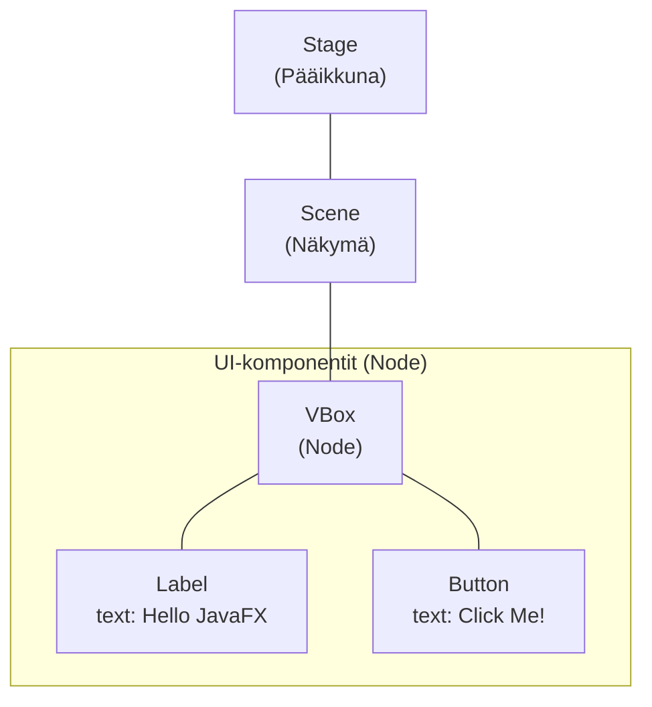

# JavaFX perusteet

> [!Osaamistavoitteet]
> - Ymmärrät JavaFX-sovelluksen rakenteen

Olemme tähän saakka tehneet komentorivisovelluksia ja lähinnä tulostaneet
tekstiä ruudulle. Graafinen käyttöliittymä (GUI) on kuitenkin monille ohjelmille
olennainen osa. Graafisen käyttöliittymän avulla käyttäjä näkee painikkeita,
valikoita ja kuvia sen sijaan, että hänen pitäisi opetella kirjoittamaan
komentoja oikeassa muodossa. 

Java-kielelle on useita kirjastoja graafisten käyttöliittymien toteuttamiseen,
mutta JavaFX on niistä ehkäpä nykyaikaisin ja monipuolisin. JavaFX käsittelee
käyttöliittymää puumaisena rakenteena. Jokainen ikkunan osa, kuten painike,
teksti tai ryhmittelyelementti on "solmu" (*Node*), joka kuuluu johonkin
suurempaan kokonaisuuteen. Tämä tekee monimutkaistenkin näkymien hallinnasta
loogista.

Ulkoasu ja logiikka erotetaan JavaFX:ssä toisistaan. Ulkoasun määritellään
käyttämällä **FXML**-kieltä, mikä on XML-pohjainen tiedostomuoto. Toiminnallinen
logiikka kirjoitetaan tavallisena Java-koodina. Tämä muistuttaa tapaa, jolla
web-kehityksessä erotetaan HTML (rakenne) ja JavaScript (toiminta).

JavaFX:ssä on oma toteutus CSS:stä (Cascading Style Sheets), joka tukee osaa CSS
2.1:n ominaisuuksista, ja joitain CSS 3:n ominaisuuksia. Tämän avulla
käyttöliittymäelementtien tyylittelyjä voidaan tietyssä määrin toteuttaa
web-kehityksestä tutulla tavalla. CSS-tuki on kuitenkin kohtalaisen rajallista,
eikä esimerkiksi float-, position- tai flexbox-ominaisuuksia tueta. Joihinkin
ominaisuuksiin löytyy joko JavaFX:n omat vastineensa, kuten flexboxin
tapauksessa VBox/HBox. Myös kehittäjäyhteisö tuottaa jatkuvasti avoimen
lähdekoodin kirjastoja, jotka tuovat joitain CSS:stä tuttuja ominaisuuksia
JavaFX:ään.

## Tutoriaali: Todo-sovellus

Osien 7 ja 8 aikana rakennamme yksinkertaisen Todo-sovelluksen. Tähän osioon
kuuluu tehtäviä, joissa opit tekemään saman sovelluksen omatoimisesti. Nämä osat
antavat sinulle tarvittavan ymmärryksen JavaFX:stä, jotta voit luoda oman
harjoitustyön osien 9-11 aikana. 

Osassa 7 teemme sovellukseen seuraavat ominaisuudet:

 * Käyttäjä voi lisätä uuden tehtävän
 * Käyttäjä näkee listan kaikista tehtävistä
 * Käyttäjä voi merkitä tehtävän tehdyksi
 * Käyttäjä voi poistaa tehtävän
 * Käyttäjä voi palauttaa tehdyn tehtävän takaisin tekemättömäksi
 * Tehtävät tallennetaan tiedostoon, jotta ne säilyvät sovelluksen sulkemisen jälkeen
 * Tehtävät haetaan tiedostosta sovelluksen käynnistyessä

Tämän osan lopuksi sovelluksemme toimii seuraavasti:

<video src="images/todo-app-final-product.mp4" controls></video>

Kuten aiemminkin, tämänkin osan tehtävistä täytyy tehdä vähintään 50%.
Erityisesti osissa 7 ja 8 kuitenkin suosittelemme tekemään kaikki tehtävät
jotta harjoitustyön tekeminen olisi helpompaa. Bonustehtävät jäävät kuitenkin
edelleen vapaavalintaisiksi. 

## Ensimmäinen JavaFX-sovellus

Tehdään nyt IDEAssa uusi JavaFX-projekti. Avaa IDEA ja valitse File <i class="bi
bi-chevron-right"></i> New <i class="bi bi-chevron-right"></i> Project. Avautuu
tuttu *New Project* -näkymä:


Aiemmissa osissa olemme luoneet tyhjiä projekteja, johon lisäsimme koodia
ja riippuvuuksia. JavaFX vaatii kuitenkin useita riippuvuuksia, asetuksia
ja alustuskoodia, joita olisi vaivallollista lisätä käsin aina, kun halutaan
tehdä uusi sovellus.

Maven-projektille voidaan määritellä valmis pohja, eli ns. *Maven-arkkityyppi*
(engl. Maven Archetype). Pohja sisältää esimerkiksi valmiin rakenteen
projektille, koodia ja valmiiksi määritellyt riippuvuudet. Maven-arkkityyppejä
on hyvin monenlaisia erilaisiin käyttötarkoituksiin. Olemme tehneet tälle
opintojaksolle oman pohjan ja käytämme sitä jatkossa.

Valitse vasemmasta laidasta **Maven Archetype** jolloin saat seuraavat asetukset
näkyviin:


Täytetään lomake meidän projektitiedoilla:

- **Name**: `TodoFx`
- **Location**: Valitse jokin kansio, johon haluat luoda projektin. Voit
  kirjoittaa kansion polun käsin tai käyttää kansionvalitsinta <i class="bi
  bi-folder"></i>-ikonista
- **Create Git repository**: Jätä tyhjäksi. Luomme uuden Git-varaston itse myöhemmin.
- **JDK**: Valitse jokin Java 25 -vaihtoehto. Oletusarvo on yleensä hyvä.
  Tarvittaessa voit ladata JDK:n seuraamalla [työkalujen asennusohjeita](../tyokalut.md#jdk).
- **Catalog**: `Maven Central`
- **Archetype**: `io.github.ohj-perus-jy:javafx-fxml-template`
- **Version**: Valitse uusin versio, jos se näkyy. Jos ei, kirjoita kenttään
  käsin `1.0.1`.
- **Additional properties**: Jätä muokkaamatta. Projektipohjan oletusarvot
  riittävät tähän tarkoitukseen.
- **Additional settings** (Klikkaa otsikosta jos sen alla olevia asetuksia ei näy):
  - **GroupId**: Julkinen, yksilöllinen tunniste sovellukselle. Javassa yleinen
    käytäntö on kirjoittaa tunniste muodossa `<oma verkkosivun osoite
    käänteisesti>.<sovelluksen tunniste>`. Tässä materiaalissa voit käyttää
    tunnisteena `fi.jyu.ohj2.nimesi.todo`, missä `nimesi` on etunimesi tai
    käyttäjätunnuksesi ilman erikoismerkkejä.
  - **ArtifactId**: Tämä täsmää projektin **Name**-kentän kanssa
  - **Version**: `0.1`

Tietojen täyttämisen jälkeen lomakkeen tulisi siten näyttää seuraavalta:


Paina sen jälkeen *Create*. Tämä luo projektin ja lataa Maven-arkkityypin
riippuvuudet. Tämä saattaa kestää hetken, joten odota rauhassa. Lopuksi
*Run*-paneelissa pitäisi lukea `BUILD SUCCESS`-teksti onnistumisen merkiksi:


Kokeillaan vielä käynnistää sovellus.
Avaa projektiselaimessa `src/main/java/<pakkauksen nimi>`-kansiossa
oleva `Main`-luokka ja klikkaa `main`-pääohjelman vieressä olevaa
ajopainiketta (<i class="bi bi-play-fill"></i>) ja valitse *Run*:


Tämä käynnistää sovelluksen, jossa sinun pitäisi nyt nähdä yksi klikattava
painike: 


Lisäksi tämä luo ajokonfiguraation, jolloin voit käynnistää projektin
yläpalkin ajopainikkeella.

## JavaFX-sovelluksen rakenne

Projektia ajaessa saatoit jo huomata, että JavaFX-projekti sisältää valmiiksi
muutaman tiedoston:

```bob
🗎 pom.xml
🖿 src
  └──🖿 main
      ├──🖿 java
      │    └──🖿 "fi/jyu/ohj2/nimesi/todo"⠀
      │        ├──🗎 App.java
      │        ├──🗎 MainController.java
      │        └──🗎 Main.java
      └──🖿 resources
          └──🖿 "fi/jyu/ohj2/nimesi/todo"
              └──🗎 main.fxml             
```

 * `pom.xml` on Maven-projektin konfiguraatiotiedosto.
 *  `fi/jyu/ohj2/nimesi/todo` vastaa äsken asettamaasi *GroupId*-arvoa ja on
    projektin pääpakkaus. Java-kooditiedostot sijaitsevat tässä kansiossa.
 * `App.java`, `MainController.java` ja `Main.java` ovat JavaFX-sovellukseen liittyviä Java-luokkia.
 * `main.fxml` on JavaFX-sovelluksen käyttöliittymään liittyvä tiedosto. 

JavaFX-sovellus koostuu yleensä kolmesta pääkomponentista: pääluokka, ulkoasu ja
kontrolleriluokka. 

**Pääluokka** on Java-luokka, joka toimii JavaFX-sovelluksen käynnistyspisteenä.
Esimerkissämme se on `App.java`, jota kutsutaan `Main.java`-tiedostossa olevasta
perinteisestä `main()`-pääohjelmasta. Pääluokka perii `Application`-luokan ja
määrittelee, miten sovellus luo ja näyttää ikkunan. Pääluokka on vastuussa
sovelluksen elinkaaren hallinnasta.

**Käyttöliittymän näkymä** määritellään niin kutsutussa FXML-tiedostossa, joka on XML-pohjainen
kuvaus käyttöliittymästä. Esimerkissämme se löytyy `resources`-kansiosta nimeltä
`main.fxml`. FXML-tiedosto määrittelee tekstimuodossa, millaisia komponentteja
eli käyttöliittymäosia ikkunassa on ja miten ne on järjestetty. Pienessä
projektissa FXML-tiedostoja on yleensä nolla tai yksi, mutta suuremmissa projekteissa
niitä voi olla useita. Jos esimerkiksi sovelluksella on useita eri näkymiä,
kuten pääikkuna, asetukset ja itse pääkäyttöliittymä, ja jokaiselle näkymälle
voidaan luoda oma FXML-tiedosto.

**Kontrolleriluokka** on Java-luokka, joka sisältää logiikan käyttöliittymän
komponenttien käsittelyyn. Kontrolleriluokka ja sitä vastaava
FXML-näkymätiedosto ovat kytköksessä toisiinsa. Esimerkiksi projektissamme
oleva `MainController.java` on kontrolleri näkymälle `main.fxml`.
Kontrolleriluokassa määritellään, miten sovellus reagoi
käyttöliittymän syötteisiin ja tapahtumiin.
Toisin sanoen, sillä aikaan kun FXML-tiedosto määrittelee käyttöliittymän,
kontrolleriluokka tekee käyttöliittymästä vuorovaikutteisen.

### JavaFX-sovelluksen käynnistys ja ydinluokat

Tutustutaan hieman `App.java`-pääluokan rakenteeseen tarkemmin:


```java,ignore
public class App extends Application {
    @Override
    public void start(Stage stage) throws IOException {
    /* 1 */ FXMLLoader loader = new FXMLLoader(getClass().getResource("main.fxml"));
    /* 1 */ Scene scene = new Scene(loader.load());

    /* 2 */ stage.setScene(scene);
    /* 3 */ stage.setTitle("MyApp");
    /* 4 */ stage.show();
    }
}
```

JavaFX-sovelluksen pääluokka perii `Application`-luokan, joka vastaa sovelluksen
alustamisesta ja ikkunan luomisesta käyttöjärjestelmätasolla.
JavaFX-kirjasto kutsuu `start()`-metodin, kun käyttöliittymälle on luotu ikkuna.

`start()`-metodin parametrina välittyy `Stage`-olio, joka vastaa sovellukselle
luotua ikkunaa. `start()`-metodin vastuulla on yleensä suorittaa seuraavat
neljä päävaihetta (ks. numerot kommenteissa):

1. **Näkymän alustaminen:** aivan alkuun käyttöliittymän ensisijainen näkymä
   alustetaan luomalla `Scene`-olio. `Scene` on kokoelma käyttöliittymässä
   olevia komponentteja, eli ns. *näkymäolio*. Tässä projektipohjassa komponentit ladataan
   `main.fxml`-tiedostosta käyttäen `FXMLLoader`-apuluokkaa, joka alustaa
   näkymässä olevia komponentteja. Komponentteja voitaisiin luoda myös
   manuaalisesti alustamalla komponenttiolioita.

2. **Näkymän asettaminen ikkunaan:** `stage.setScene()`-metodilla voidaan
   asettaa luotu `Scene`-olio ja siinä olevat komponentit näkyviin ikkunaan.
   Huomaa, että samassa ikkunassa (`Stage`) voi olla vain yksi näkymä (`Scene`)
   kerrallaan, mutta näkymä voidaan vaihtaa milloin tahansa. Tällä tavoin
   voidaan esimerkiksi toteuttaa erilaisia näkymiä samaan sovellukseen (esim.
   sisäänkirjautumisnäkymä, sovellusnäkymä, jne.)

3. **Ikkunan asetusten muuttaminen:** `Stage`-olio sisältää lukuisia metodeja,
   jolla sovelluksen ikkunan toimintaa voidaan muuttaa. Yleinen toiminto on
   esimerkiksi `setTitle()`-metodi, jolla voi muuttaa ikkunan otsikon.

4. **Ikkunan näyttäminen:** Aivan alussa sovelluksen ikkuna on piilossa
   käyttäjältä, jotta vältytään käyttöliittymän "välkkymiseltä". `Stage`-olion
   `show()`-metodi asettaa ikkunan näkyväksi, jolloin käyttäjä voi alkaa
   vuorovaikuttaa käyttöliittymän kanssa. Ikkuna laitetaan näkyväksi yleensä
   aivan viimeisenä, kun sovellus on täysin alustettu.

JavaFX:ssä kaikki käyttöliittymäosat perivät `Node`-luokan. `Node` eli ns.
*solmu* vastaa käyttöliittymän yksittäistä komponenttia, kuten painiketta tai
tekstiä. `Node`-oliot ovat rekursiivisia, eli solmu voi sisältää muita solmuja.
JavaFX-käyttöliittymä muodostaakin puurakenteen, jossa komponentit
sisältävät muita komponentteja. Esimerkiksi projektipohjan esimerkkisovelluksen
rakenne voitaisiin mallintaa seuraavasti:




<task>
  <task-title>Tehtävä 7.1: Todo-sovellus, vaihe 1 <points>1 p.</points> </task-title>
  <handout>

{{#include ../exercises/7-1-todo-1/handout.md}}

  </handout>
  <task-link><a href="https://tim.jyu.fi/view/kurssit/tie/tiep111/tehtavat/osa7/tehtava1">Tee tehtävä TIMissä</a></task-link>
</task>