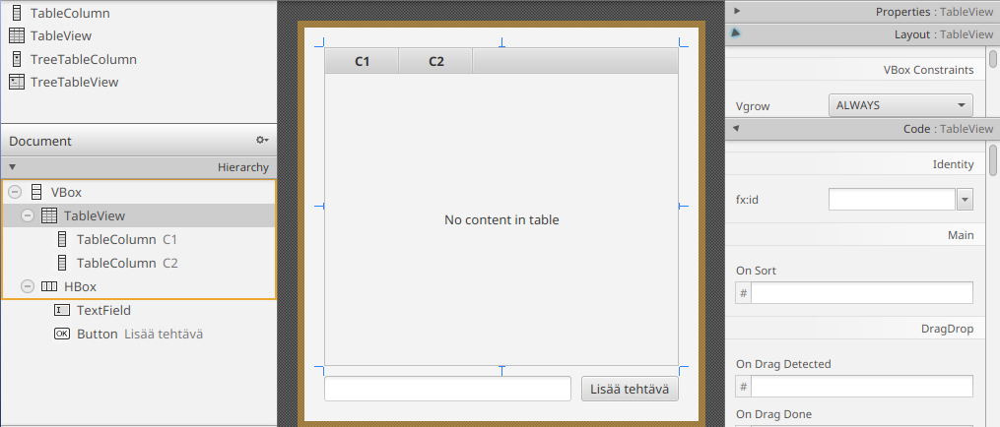
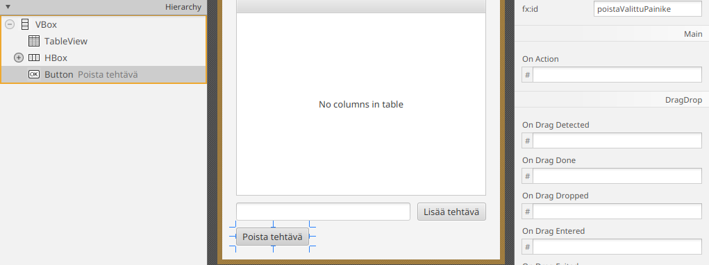

# TableView ja databinding

Osassa 7 tehtävät näytettiin VBox-säiliöissä CheckBox-komponentteja. Tämä on
oikein hyvä tapa opetella käyttöliittymän perusidea: luodaan komponentteja ja
lisätään ne näkymään. Huomasimme edellisessä osassa, että mallin ja
käyttöliittymän erottaminen toisistaan vaatii `paivitaNakyma()`-metodia, joka
kutsutaan aina, kun malli muuttuu. Näkymän päivittäminen mallin muuttuessa voi
kuitenkin osoittautua pullonkaulaksi sovelluksen koon kasvaessa, ja näkymän
päivittämisen optimointi on itsessään hankala ongelma, johon ei tämän kurssin
puitteissa pureuduta.

Tässä kohtaa onkin parempi nojautua JavaFX:n valmiin näkymäkomponentteihin,
jotka osaavat tehokkaasti esittää olioita ja reagoida niiden muutoksiin. Otamme
tässä osassa käyttöön `TableView`-komponentin. `TableView` on JavaFX:n valmis
komponentti, jolla olioita voidaan esittää riveinä ja olioiden ominaisuuksia
sarakkeina. `TableView`-komponenttia voi ajatella taulukkona, jossa jokainen
rivi on yksi tehtävä ja sarakkeet ovat ominaisuuksia, joita tehtävästä halutaan
näyttää, kuten otsikko, prioriteetti ja se, onko tehtävä tehty vai ei. 

## Esivalmistelu: Tehtävä-luokka havaittavaksi

JavaFX:n `TableView` osaa reagoida olioiden määrän muutosten lisäksi olioiden
attribuuttien muutoksiin. Esimerkiksi, jos jonkun tehtävän otsikkoa muutetaan
käyttöliittymässä, `TableView` osaa havaita muutoksen automaattisesti. Tätä
varten kuitenkaan pelkästään `ObservableList`-listan käyttö ei riitä, koska se
osaa ilmoittaa kuuntelijoille vain tehtävien lisäämistä ja poistamista. Sen
sijaan meidän tulee tehdä itse *tehtävät ja niiden ominasuudet havaittaviksi*.

Olion yksittäisiä ominaisuuksia voidaan muuttaa havaittaviksi käyttäen JavaFX:n
niin kutsuttuja property-tyyppejä. Property-tyypit "käärivät" tavalliset arvot,
kuten `Boolean` tai `String`, ja tarjoavat mekanismin ilmoittaa, kun niiden arvo
muuttuu. Esimerkiksi `StringProperty` on havaittava versio `String`-tyypistä,
`BooleanProperty` vastaavasti `Boolean`-tyypistä ja niin edelleen. Havaittavat
tyypit mahdollistavat sen, että olion yksittäisten attribuuttien arvojen
muutoksia voidaan havaita samalla tavalla kuin `ObservableList`-listassa voidaan
havaita olioiden lisäämistä ja poistoa.

Tarvitsemme `Tehtava`-luokkaamme siis merkkijono- ja totuusarvotyyppien
havaittavat versiot. Näille löytyy JavaFX:stä valmiit toteutukset:
`SimpleStringProperty` ja `SimpleBooleanProperty`.

Päivitetään `Tehtava`-mallimme käyttämään `Property`-kääreitä, jotta tehtävän
kaikki tiedot ovat havaittavia. Yksinkertaisesti sanottuna, kun aiemmin
tehtävällä oli tavallinen `boolean tehty` -muuttuja, joka oli piilotettu
ohjelman uumeniin, muutamme sen nyt _observable_-tyyppiseksi, `BooleanProperty
tehty`-muuttujaksi:

```java,ignore
import javafx.beans.property.*;

public class Tehtava {
    // Alkuperäiset attribuutit on korvattu Property-kääreillä
    private final StringProperty teksti = new SimpleStringProperty("");
    private final BooleanProperty tehty = new SimpleBooleanProperty(false);

    @SuppressWarnings("unused")
    public Tehtava() {}

    public Tehtava(String teksti, boolean tehty) {
        setTeksti(teksti);
        setTehty(tehty);
    }

    // --- Property-setterit ja getterit ---
    // Huomaa, että JavaFX-tyylissä on tapana tarjota kolme metodia per property:
    // 1. Tavallinen get-metodi (palauttaa esim. boolean)
    // 2. Tavallinen set-metodi (ottaa esim. boolean)
    // 3. property-metodi (palauttaa itse Property-olion, esim. BooleanProperty)

    public boolean getTehty() { return this.tehty.get(); }
    public void setTehty(boolean tehty) { this.tehty.set(tehty); }
    public BooleanProperty tehtyProperty() { return this.tehty; }

    public String getTeksti() { return this.teksti.get(); }
    public void setTeksti(String teksti) { this.teksti.set(teksti); }
    public StringProperty tekstiProperty() { return this.teksti; }

    @Override
    public String toString() {
        return getTeksti() + ": " + (getTehty() ? "TEHTY" : "EI TEHTY");
    }
}
```

Nyt yksittäisen tehtävän ominaisuudet ovat *observable* eli havaittavia. Tämä
mahdollistaa käyttöliittymän näkymän *sitomisen* (engl. binding) dataan. Näkymä
voi kuunnella tehtävien ominaisuuksien muutoksia. Näkymä päivittyy heti kun arvo
muuttuu datassa. Kun käyttäjä muuttaa arvoa näkymässä, muutos päivittyy samaan
propertyyn. Palaamme tähän ajatukseen seuraavaksi tarkemmin.

## TableView-komponentin lisääminen ja käyttöliittymän siistiminen

Aloitetaan näkymästä: avaa `main.fxml` SceneBuilderissa.
Poista käyttöliittymästä `tehdyt` ja `tekemattomat` `VBox`-komponentit sekä
niihin liittyvät nimiöt. Poistamisen jälkeen hierarkiaan jää vain
`HBox`-komponentti, jossa on syötekenttä ja painike:


Sen jälkeen etsi Library-näkymästä `TableView`-komponentti ja lisää se
syötekentän yläpuolelle. Ole tarkkana: valitse nimenomaan `TableView`, <u>ei</u>
`TreeTableView`.
Valitse lisätty `TableView` ja aseta sen Vgrow-asetukseksi `ALWAYS`, jotta se
täyttää kaiken vapaan tilan. Anna vielä `TableView`-komponentille fx:id-arvoksi
`tehtavaTaulu`.



Lopuksi, valitse ja poista Hierarchy-paneelista kummatkin
`TableColumn`-komponentit. Lopullinen hierarkia näyttää siis täältä:


Tallenna FXML-tiedosto.

Vielä muutama sana ennen kuin jatketaan. `TableView` on itse taulukko. Se
näyttää rivejä, mutta ei vielä tiedä, millaisia olioita rivit ovat. Se tieto
annetaan kontrollerin puolella Java-koodissa &ndash; teemme tämän kohta.
`TableView` sisältää useita `TableColumn`-komponentteja, jotka esittävät olion
ominaisuuksia sarakkeina. Tieto siitä, mitä sarakkeessa näytetään, annetaan myös
Java-koodissa. Tämänkin teemme ihan pian. 

Siistitään nyt `MainController`-luokka. Ensiksi, poista vanhat `VBox
tekemattomat` ja `VBox tehdyt` -attribuutit ja lisää niiden tilalle
`tehtavaTaulu`-attribuutti:

```java,ignore
// HIGHLIGHT_RED_BEGIN
@FXML
private VBox tekemattomat;

@FXML
private VBox tehdyt;
// HIGHLIGHT_RED_END
// HIGHLIGHT_GREEN_BEGIN
@FXML
private TableView<Tehtava> tehtavaTaulu;
// HIGHLIGHT_GREEN_END
```

Huomaa, että `tehtavaTaulu`-attribuutin tyyppi on `TableView<Tehtava>`.
`TableView` on geneerinen luokka, joka ottaa tyyppiparametrina sen olion tyypin,
jota taulukossa on tarkoitus näyttää. Meidän tapauksessamme taulukossa on
`Tehtava`-olioiden tietoja.

Muutoksen myötä näkymän päivittämisen tarkoitettu `paivitaNakyma()`-metodi
muuttuu turhaksi, sillä jatkossa `TableView` hoitaa näkymän päivittämisen
automaattisesti itse. Poistetaan siis `paivitaNakyma()`-metodi:

```java,ignore
// Poista koko metodi; TableView hoitaa näkymän päivittämisen itse
// HIGHLIGHT_RED_BEGIN
private void paivitaNakyma() {
    // ...
//-    // Tyhjennetään nykyiset listat
//-    tekemattomat.getChildren().clear();
//-    tehdyt.getChildren().clear();
//-
//-    // Rakennetaan näkymä uudestaan tehtävien perusteella.
//-    // Metodi luoCheckBox(tehtava) saa nyt koko olion parametrina.
//-    for (Tehtava tehtava : tehtavat) {
//-        CheckBox cb = luoCheckBox(tehtava);
//-        if (tehtava.getTehty()) {
//-            tehdyt.getChildren().add(cb);
//-        } else {
//-            tekemattomat.getChildren().add(cb);
//-        }
//-    }
}
// HIGHLIGHT_RED_END
```

Vastaavasti `initialize()`-metodissa oleva `tehtavat`-listan kuuntelijasta
voidaan poistaa `paivitaNakyma()`-kutsu:

```java,ignore
public void initialize(URL url, ResourceBundle resourceBundle) {
    tehtavat.addListener((ListChangeListener<Tehtava>) change -> {
        // HIGHLIGHT_RED_BEGIN
        paivitaNakyma();
        // HIGHLIGHT_RED_END
        tallenna();
    });
    // metodin loppuosa piilotettu...
//-    lataa();
//-    uusiTehtavaNimi.setOnAction(event -> lisaaTehtava());
//-    lisaaUusiTehtavaPainike.setOnAction(event -> lisaaTehtava());
}
```


## Tehtävien ja ominaisuuksien sitominen taulukkoon

Kun FXML-rakenne on määritelty, sidomme taulukon näkymän ja mallin yhteen.
Ensiksi sidomme `tehtavat`-listan taulukkoon käyttäen `setItems()`-metodia:

```java,ignore
public void initialize(URL url, ResourceBundle resourceBundle) {
    // HIGHLIGHT_GREEN_BEGIN
    tehtavaTaulu.setItems(tehtavat);
    // HIGHLIGHT_GREEN_END

    // metodin loppuosa piilotettu...
//-    tehtavat.addListener((ListChangeListener<Tehtava>) change -> {
//-        tallenna();
//-    });
//-
//-    lataa();
//-    uusiTehtavaNimi.setOnAction(event -> lisaaTehtava());
//-    lisaaUusiTehtavaPainike.setOnAction(event -> lisaaTehtava());
}
```

Kuten edellisessä osassa `ListView`-komponentin esimerkissä, tässä sidomme
tehtävälistan datan taulukkonäkymään. JavaFX lisää `setItems()`-kutsun myötä
listalle havaitsijan ja päivittää taulukon rivit aina, kun tehtävälistassa
olevia tehtäviä poistetaan tai lisätään.

Seuraavaksi määrittelemme taulukon sarakkeet ja sidomme tehtävän yksittäiset
attribuutit sarakkeisiin. Luodaan aluksi `tehty`-attribuutille sarake:

```java,ignore
public void initialize(URL url, ResourceBundle resourceBundle) {
    tehtavaTaulu.setItems(tehtavat);

    // HIGHLIGHT_GREEN_BEGIN
    TableColumn<Tehtava, Boolean> tehtySarake = new TableColumn<>("Tehty"); /* 1. */
    tehtySarake.setCellValueFactory(cd -> cd.getValue().tehtyProperty());   /* 2. */
    tehtavaTaulu.getColumns().add(tehtySarake);                             /* 3. */
    // HIGHLIGHT_GREEN_END

    // metodin loppuosa piilotettu...
//-    tehtavat.addListener((ListChangeListener<Tehtava>) change -> {
//-        tallenna();
//-    });
//-
//-    lataa();
//-    uusiTehtavaNimi.setOnAction(event -> lisaaTehtava());
//-    lisaaUusiTehtavaPainike.setOnAction(event -> lisaaTehtava());
}
```

Sarakkeen luominen tapahtuu siis seuraavasti:

1. Luodaan uusi sarake alustamalla `TableColumn<Tehtava, Boolean>`-olio.
   Ensimmäinen tyyppiparametri `Tehtava` kertoo, minkä typpisiä olioita taulukon
   riveillä on. Toinen tyyppiparametri `Boolean` kertoo, minkä tyyppisiä
   arvoja sarakkeessa näytetään.
2. Sidotaan `tehtySarake`-sarake `tehtyProperty`-ominaisuuden arvoon.   
   `setCellValueFactory()` määrittää, mistä oliosta tai ominaisuudesta sarakkeen
   näytettävä arvo otetaan. JavaFX kutsuu tässä annettua lambdalauseketta aina,
   kun se tarvitsee juuri tässä sarakkeessa näytettävän arvon. Lambdan parametri
   `cd` ("cell data") sisältää tiedon, minkä rivin tietoja ollaan
   käsittelemässä, ja `cd.getValue()` palauttaa kyseisen rivin `Tehtava`-olion.
   Edelleen `Tehtava`-olion `tehtyProperty()` sisältää
   `ObservableValue<Boolean>`-olion, eli juurikin sellaisen, jota `TableView`
   pystyy seuraamaan.
3. Lisätään sarake näkyviin tauluun.

Tehdään sarake myös tehtävän tekstille.

```java,ignore
public void initialize(URL url, ResourceBundle resourceBundle) {
    tehtavaTaulu.setItems(tehtavat);

    TableColumn<Tehtava, Boolean> tehtySarake = new TableColumn<>("Tehty");
    tehtySarake.setCellValueFactory(cd -> cd.getValue().tehtyProperty());
    tehtavaTaulu.getColumns().add(tehtySarake);

    // HIGHLIGHT_GREEN_BEGIN
    TableColumn<Tehtava, String> tekstiSarake = new TableColumn<>("Tehtävä");
    tekstiSarake.setCellValueFactory(cd -> cd.getValue().tekstiProperty());
    tehtavaTaulu.getColumns().add(tekstiSarake);
    // HIGHLIGHT_GREEN_END

    // metodin loppuosa piilotettu...
//-    tehtavat.addListener((ListChangeListener<Tehtava>) change -> {
//-        tallenna();
//-    });
//-
//-    lataa();
//-    uusiTehtavaNimi.setOnAction(event -> lisaaTehtava());
//-    lisaaUusiTehtavaPainike.setOnAction(event -> lisaaTehtava());
}
```

Mainittakoon, että sarakkeet voidaan määritellä myös SceneBuilderissa FXML:ään.
Monimutkaisemmissa taulukoissa voi olla kätevää määritellä sarakkeita etukäteen
SceneBuilderissa ja ainoastaan käyttää kontrolleria sitoakseen data ja tietty
sarake toisiinsa.

Kokeile käynnistää sovellus. Nyt tehtävät näkyvät taulukkonäkymässä, ja
tehtävien lisääminen lisää ne taulukkonäkymään. Lisäksi taulukkonäkymä tarjoaa
tavan lajitella tehtäviä ja siirtää sarakkeita haluamallaan tavalla:

<video src="images/todo-app-tableview-initial.mp4" controls></video>

Huomaa, että meidän ei tarvinnut enää muokata yhtään tehtävän lisäämiseen,
lataamiseen tai tallentamiseen liittyvää toimintoa, sillä mallin hallinta on
erotettu näkymän esittämisestä. 

*Datan sitominen* eli ns. *databinding* on taulukkonäkymän toiminnan ytimessä.
Jos tekisimme taulukon ilman propertyjä ja `TableView`:ta, joutuisimme usein
itse luomaan jokaiselle riville komponentit, täyttämään ne arvoilla sekä
päivittämään näkymän erikseen, kun data muuttuu. `TableView` yhdessä propertyjen
kanssa vähentää tätä käsityötä merkittävästi. Koodi kertoo enemmän siitä, mitä
halutaan näyttää ja JavaFX:n harteille jätetään itse käyttöliittymän
näyttäminen.

## Tehty-sarake valintaruuduksi

Oletuksena taulukossa näytetään arvojen merkkijonoesityksiä, minkä takia
tehty-tila näytetään `false` ja `true` -teksteinä. Olisi kuitenkin mukavaa, jos
tehtävän tila olisi edelleen valintaruutu, joka voisi merkata tehdyksi.

Tätä varten taulukkojen `TableColumn`-sarakekomponenteissa on olemassa
`setCellFactory()`-metodi, jonka avulla sarakkeessa näytetävien solujen ulkoasua
voi muuttaa. Lisäksi JavaFX tarjoaa valmiita rakentajia yleisimille
saraketyypeille. Esimerkiksi valintaruutuja voi luoda käyttäen
`CheckBoxTableCell`-luokkaa ([JavaDoc](https://download.java.net/java/GA/javafx25/docs/api/javafx.controls/javafx/scene/control/cell/CheckBoxTableCell.html)).
Luokassa oleva `forTableColumn`-luokkametodi palauttaa oikeanmuotoisen
rakentajan, jonka voi antaa `setCellFactory()`-metodille.

Lisäksi meidän tulee sallia taulukon arvojen muokkaamisen
`setEditable()`-metodilla, jotta valintaruudut olisivat klikattavissa. 

```java,ignore
public void initialize(URL url, ResourceBundle resourceBundle) {
    tehtavaTaulu.setItems(tehtavat);
    // HIGHLIGHT_GREEN_BEGIN
    tehtavaTaulu.setEditable(true);
    // HIGHLIGHT_GREEN_END

    TableColumn<Tehtava, Boolean> tehtySarake = new TableColumn<>("Tehty");
    tehtySarake.setCellValueFactory(cd -> cd.getValue().tehtyProperty());
    // HIGHLIGHT_GREEN_BEGIN
    tehtySarake.setCellFactory(CheckBoxTableCell.forTableColumn(tehtySarake));
    // HIGHLIGHT_GREEN_END
    tehtavaTaulu.getColumns().add(tehtySarake);

    // metodin loppuosa piilotettu...
//-    TableColumn<Tehtava, String> tekstiSarake = new TableColumn<>("Tehtävä");
//-    tekstiSarake.setCellValueFactory(cd -> cd.getValue().tekstiProperty());
//-    tehtavaTaulu.getColumns().add(tekstiSarake);
//-
//-    tehtavat.addListener((ListChangeListener<Tehtava>) change -> {
//-        tallenna();
//-    });
//-
//-    lataa();
//-    uusiTehtavaNimi.setOnAction(event -> lisaaTehtava());
//-    lisaaUusiTehtavaPainike.setOnAction(event -> lisaaTehtava());
}
```

Kun sovelluksen käynnistää, Tehty-sarake esittää tehtävien tilan
valintaruutuina, joita voi klikata:


Erityisesti aiempi tehty datan sitominen takaa, että valintaruudun tila ja
tehtäväolion tila pysyvät ajan tasalla: valintaruudun klikkaaminen muuttaa olion
tilaa, ja olion tilan muutos vaikuttaa taulukon näkymään.

Nyt kun valintaruutujen luominen on `TableView`-komponentin vastuulla, voimme
poistaa oman `luoCheckBox()`-metodin:

```java,ignore
// Ei tarvita enää; TableView tekee valintaruudut itse
// HIGHLIGHT_RED_BEGIN
private CheckBox luoCheckBox(Tehtava t) {
    // metodin toteutus piilotettu...
//-    CheckBox cb = new CheckBox(t.getTeksti());
//-    cb.setSelected(t.getTehty());
//-    cb.setOnAction(event -> {
//-        tehtavat.remove(t);
//-        tehtavat.add(new Tehtava(t.getTeksti(), !t.getTehty()));
//-    });
//-    return cb;
}
// HIGHLIGHT_RED_END
```

Kuitenkin huomaamme nopeasti ongelman: valintaruudun klikkaaminen ei enää
tallenna muuttunutta tilaa tiedostoon. 
Tämä on osin odotettua: vanhassa toteutuksessa valintaruudun klikkaaminen
pakotti muutoksen `tehtavat`-listaan käyttäen `remove()` ja `add()`-metodeja,
jotka puolestaan ilmoittivat muutoksesta `initialize()`-metodissa olevalla
havaitsijalle.
Valintaruutu ainoastaan muuttaa datan arvoa, jolloin `tehtavat`-lista ei muutu
eikä listan havaitsijassa olevaa `tallenna()`-metodia ikinä suoriteta.

## Tallennus tehtävän tilan muutoksesta

Yksi ratkaisu olisi sellainen, että kytkisimme `Tehtava`-olion `tehtyProperty`:n
muutokseen havaitsijan, joka kutsuu tallennusta. Tämä onnistuisi vaikkapa
`lisaaTehtava()`-metodissa. Alla on esimerkki, miten tämä voitaisiin tehdä
&ndash; älä kuitenkaan tee tätä nyt.

```java,ignore
private void lisaaTehtava() {
    // metodin alkuosa piilotettu...

//-    String teksti = uusiTehtavaNimi.getText();
//-    if (teksti == null || teksti.isBlank()) {
//-        uusiTehtavaNimi.requestFocus();
//-        return;
//-    }
//-    teksti = teksti.trim();
    // Näin **voitaisiin** tehdä, mutta älä tee tätä nyt!
    // HIGHLIGHT_GREEN_BEGIN
    Tehtava tehtava = new Tehtava(teksti, false);
    tehtava.tehtyProperty().addListener((obs, vanhaArvo, uusiArvo) -> tallenna());
    // HIGHLIGHT_GREEN_END
    tehtavat.add(tehtava);

    // metodin loppuosa piilotettu...
//-    uusiTehtavaNimi.clear();
//-    uusiTehtavaNimi.requestFocus();
}
```

Tämä tarkoittaisi, että aina kun `tehtyProperty` muuttuu (esimerkiksi valintaruutua
klikataan tai muutetaan `setTehty()`-metodilla), tallennettaisiin kaikki tehtävät.

Tämä olisi sinänsä kätevää, mutta pieneksi ongelmaksi muodostuu, että
Jackson-kirjaston kautta ladatut `Tehtava`-oliot eivät tätä kuuntelijaa saa. Jos
nyt muutamme UI:ssa `tehtavat.json`-tiedostosta ladatun tehtävän tilaa,
tallennus ei tapahdu, koska kuuntelijaa ei ole koskaan lisätty. Joutuisimme siis
lisäämään saman havaitsijan myös `lataa()`-metodiin sekä muutenkin kaikkiin
paikkoihin, jossa `Tehtava`-olioita saatetaan luoda.

Mietitään hetki tilannetta. Voisimme kyllä ratkaista yllä olevaa tekemällä
apumetodin, joka alustaa `Tehtava`-olion ja tarvittavan havaitsijan. Tosaalta
voisimme hyödyntää `ObservableList`-listan `addListener()`-metodia: lisätään
`initialize()`-metodissa `tehtavat`-listalle uusi havaitsija, joka toimisi
[luvun 8.1 alun esimerkin
tapaisesti](./01-malli-ja-observable-rajapinta.md#johdatteleva-esimerkki).
Havaitsija kävisi läpi kaikki lisättävät tehtävät ja lisäisi niiden
`tehtyProperty`-ominaisuudelle havaitsijan automaattisesti. Alla on esimerkki,
miten tämä voitaisiin tehdä &ndash; älä silti tee tätäkään nyt.

```java,ignore
public void initialize(URL url, ResourceBundle resourceBundle) {
    // Parempi, mutta älä tee tätäkään pelkästään tallentamista varten!
    tehtavat.addListener((ListChangeListener<Tehtava>) change -> {
        while (change.next()) {
            if (change.wasAdded()) {
                for (Tehtava tehtava : change.getAddedSubList()) {
                    tehtava.tehtyProperty().addListener((obs, vanhaArvo, uusiArvo) -> tallenna());
                }
            }
        }
    });

    // metodin loppuosa piilotettu...
}
```

Nyt aina, kun `tehtavat`-listaan lisätään uusi tehtävä, seuraisimme tehtävän
tehty-tilaa ja tallentaisimme tehtävät muutoksen jälkeen. Tämä pätisi sekä
käyttöliittymän että tiedoston kautta lisätyille tehtäville.

Tässä ratkaisussa kuitenkin edelleen jokaisen tehtäväolion `tehty`-ominaisuus
saa oman havaitsijan, mikä on hieman outoa. Yllä olevassa esimerkissä kaikkien
tehtävien tallentaminen sidotaan suoraan yksittäisen tehtävän tehty-tilan
muutokseen. Sen sijaan olisi loogisempaa, että kaikkien tehtävien tallennus
olisi sidottu kaikkia tehtäviä sisältävään tehtavat-listaan.

Tähän ongelmaan on olemassa toinenkin, aavistuksen elegantimpi ratkaisu.
`ObservableList`-oliolle voi sen luomisen yhteydessä määritellä niin sanottu
*ekstraktori* (engl. extractor), joka kertoo listalle, mitä kunkin olion
propertyjä tulee seurata. Muuta `ObservableList`-kokoelman luonti seuraavasti:

```java,ignore
// Parempi tapa, käytä tätä!
private final ObservableList<Tehtava> tehtavat 
   = FXCollections.observableArrayList(tehtava -> new Observable[] {tehtava.tehtyProperty()});
```

Tässä `tehtava -> new Observable[] { ... }` on ekstraktori. Se palauttaa
taulukon niistä `Observable`-olioista, joita listan halutaan seuraavan
jokaisessa `Tehtava`-oliossa. Tällöin `ObservableList` ilmoittaa listan
muutosten (olio lisätty/poistettu) *lisäksi* listan alkioiden ominaisuuksien
muutoksista. Toisin sanoen, `addListener()`-metodilla olevat havaitsijat saavat
nyt tiedon aina, kun listaan lisätään tehtävä, listasta poistetaan tehtävä (tätä
tosin emme ole vielä toteuttaneet) ja kun listassa olevien tehtävien
`tehtyProperty`-ominaisuuden arvo vaihtuu.

```java,ignore
public void initialize(URL url, ResourceBundle resourceBundle) {
    // metodin alkuosa piilotettu...
//-    tehtavaTaulu.setItems(tehtavat);
//-    tehtavaTaulu.setEditable(true);
//-
//-    TableColumn<Tehtava, Boolean> tehtySarake = new TableColumn<>("Tehty");
//-    tehtySarake.setCellValueFactory(cd -> cd.getValue().tehtyProperty());
//-    tehtySarake.setCellFactory(CheckBoxTableCell.forTableColumn(tehtySarake));
//-    tehtavaTaulu.getColumns().add(tehtySarake);
//-
//-    TableColumn<Tehtava, String> tekstiSarake = new TableColumn<>("Tehtävä");
//-    tekstiSarake.setCellValueFactory(cd -> cd.getValue().tekstiProperty());
//-    tehtavaTaulu.getColumns().add(tekstiSarake);

    // Tämä on jo olemassa!
    // Nyt tätä suoritetaan aina, kun
    // - Tehtävä lisätään
    // - Tehtävä poistetaan
    // - Jonkun tehtävän tehty-ominaisuus muuttuu (esim. taulukon kautta)
    tehtavat.addListener((ListChangeListener<Tehtava>) change -> {
        tallenna();
    });

    // metodin loppuosa piilotettu...
//-    lataa();
//-    uusiTehtavaNimi.setOnAction(event -> lisaaTehtava());
//-    lisaaUusiTehtavaPainike.setOnAction(event -> lisaaTehtava());
}
```

Kokeile nyt ajaa sovellus. Huomaat, että tehtävien merkkaaminen tehdyksi
tallentaa muutokset tiedostoon.

## Tehdyt tehtävät taulukon loppuun

Toteutetaan nyt aiemmasta VBox-pohjaisesta ratkaisusta se ominaisuus, jossa
tehdyt tehtävät asetetaan aina listan loppuun.

Tämä periaatteessa onnistuu jo nyt käyttöliittymästä, sillä `TableView` tukee
lajittelua klikkaamalla sarakkeen otsikosta. Tehdään kuitenkin tämä
kontrollerissa, jotta käyttäjän ei tarvitse kytkeä lajittelua päälle käsin.

JavaFX tarjoaa useamman tavan hoitaa lajittelu. Eräs tapa tehdä *pysyvä*
lajittelu on käyttää `ObservableList`-listan `sorted()`-metodia, joka
ottaa parametriksi `Comparator`-vertailijan ja palauttaa `SortedList`-listan
(ks.
[JavaDoc](https://download.java.net/java/GA/javafx25/docs/api/javafx.base/javafx/collections/ObservableList.html#sorted(java.util.Comparator))).
`SortedList`-listan voi puolestaan sitoa `TableView`-näkymään:

```java,ignore
public void initialize(URL url, ResourceBundle resourceBundle) {
    // HIGHLIGHT_GREEN_BEGIN
    SortedList<Tehtava> tehtavatLajiteltu = tehtavat.sorted(Comparator.comparing(Tehtava::getTehty));
    // HIGHLIGHT_GREEN_END
    // HIGHLIGHT_YELLOW_BEGIN
    tehtavaTaulu.setItems(tehtavatLajiteltu);
    // HIGHLIGHT_YELLOW_END

    // metodin loppuosa piilotettu...
//-    tehtavaTaulu.setEditable(true);
//-
//-    TableColumn<Tehtava, Boolean> tehtySarake = new TableColumn<>("Tehty");
//-    tehtySarake.setCellValueFactory(cd -> cd.getValue().tehtyProperty());
//-    tehtySarake.setCellFactory(CheckBoxTableCell.forTableColumn(tehtySarake));
//-    tehtavaTaulu.getColumns().add(tehtySarake);
//-
//-    TableColumn<Tehtava, String> tekstiSarake = new TableColumn<>("Tehtävä");
//-    tekstiSarake.setCellValueFactory(cd -> cd.getValue().tekstiProperty());
//-    tehtavaTaulu.getColumns().add(tekstiSarake);
//-
//-    tehtavat.addListener((ListChangeListener<Tehtava>) change -> {
//-        tallenna();
//-    });
//-
//-    lataa();
//-    uusiTehtavaNimi.setOnAction(event -> lisaaTehtava());
//-    lisaaUusiTehtavaPainike.setOnAction(event -> lisaaTehtava());
}
```

`SortedList`-lista sisältää alkuperäisen listan alkiot järjestettynä annetun
vertailijan mukaan. Kummatkin listat ovat sidottuja toisiinsa: alkion lisääminen
järjestettyyn listaan lisää alkion alkuperäiseen listaan ja toisinpäin.
Tässäkin korostuu, kuinka databinding-periaate suoraviivaistaa näkymän
päivittämistä.

Kokeile ajaa sovellus. Nyt tekemättömät tehtävät
näkyvät taulukossa ensin ja tehdyt lopussa, sillä `boolean`-tyypin
oletusvertailija asettaa `false`-arvot ennen `true`-arvoja.

## Tehtävän poistaminen

Nyt kun meillä on taulukko, voimme käyttää sitä tehtävän poistamisen
toteuttamiseen. 

Avaa `main.fxml` SceneBuilderssa ja lisää uusi Button-painikekomponentti
HBox-komponentin alapuolelle. Aseta painikkeen tekstiksi "Poista tehtävä" ja
anna painikkeelle fx:id-tunnisteeksi `poistaValittuPainike`:



Tallenna FXML-tiedosto. Lisää sitten `MainController`-luokkaan painiketta
vastaava attribuutti:

```java,ignore
@FXML
private Button poistaValittuPainike;
```

Lisätään sitten `poistaValittu()`-metodi, joka hoitaa poistamisen. Jotta poisto
toimii oikein, käyttöliittymän on ensin tiedettävä, mikä rivi taulukosta on
valittuna. `TableView` pitää kirjaa valituista riveistä erillisessä
`SelectionModel`-oliossa, johon pääsee käsiksi `getSelectionModel()`-metodilla.
Saamme valitun `Tehtava`-olion edelleen `getSelectedItem()`-metodilla. 
Tämän jälkeen voimme poistaa tehtävän `tehtavat`-listasta.

```java
private void poistaValittu() {
    // 1. Hae valittu tehtävä taulukon valintamallista
    Tehtava valittuTehtava = tehtavaTaulu.getSelectionModel().getSelectedItem();
    // 2. Jos mitään ei ole valittu, ei tehdä mitään
    if (valittuTehtava == null) {
        return;
    }
    // 3. Poistetaan tehtävä mallilistasta
    tehtavat.remove(valittuTehtava);
}
```

Lopuksi lisätään `poistaValittuPainike`-painikkeelle tapahtumakäsittelijä, joka
kutsuu tätä uutta metodia:

```java,ignore
public void initialize(URL url, ResourceBundle resourceBundle) {
//-    SortedList<Tehtava> tehtavatLajiteltu = tehtavat.sorted(Comparator.comparing(Tehtava::getTehty));
//-    tehtavaTaulu.setItems(tehtavatLajiteltu);
//-    tehtavaTaulu.setEditable(true);
//-
//-    TableColumn<Tehtava, Boolean> tehtySarake = new TableColumn<>("Tehty");
//-    tehtySarake.setCellValueFactory(cd -> cd.getValue().tehtyProperty());
//-    tehtySarake.setCellFactory(CheckBoxTableCell.forTableColumn(tehtySarake));
//-    tehtavaTaulu.getColumns().add(tehtySarake);
//-
//-    TableColumn<Tehtava, String> tekstiSarake = new TableColumn<>("Tehtävä");
//-    tekstiSarake.setCellValueFactory(cd -> cd.getValue().tekstiProperty());
//-    tehtavaTaulu.getColumns().add(tekstiSarake);
//-
//-    tehtavat.addListener((ListChangeListener<Tehtava>) change -> {
//-        tallenna();
//-    });
//-
//-    lataa();
//-    uusiTehtavaNimi.setOnAction(event -> lisaaTehtava());
//-    lisaaUusiTehtavaPainike.setOnAction(event -> lisaaTehtava());
    // metodin alkuosa piilotettu...

    poistaValittuPainike.setOnAction(event -> poistaValittu());
}
```

Kokeile ajaa sovellus. Kun valitset tehtävän taulukosta ja painat "Poista
tehtävä", tehtävän pitäisi poistua taulukosta. Tämäkin toimii datan sidonnan
takia: painike poistaa tehtävän `tehtavat`-listasta, mikä automaattisesti
muuttaa lajitellun `tehtavatLajiteltu`-listan. Puolestaan muutos
`tehtavatLajiteltu`-listassa aiheuttaa `TableView`-näkymän päivittymisen ilman
erillistä toimintaa. Tässäkin siis mallin muokkaus ja näkymän päivitys ovat vain
löyhästi kytkettyjä toisiinsa *observable*-rakenteiden avustuksella.

<details><summary><i class="bi bi-stars jyu-gold"></i>Bonus: Painikkeen klikkaamisen estäminen jos tehtävää ei valittu</summary>

Nyt "Poista tehtävä" -painike on aika klikattavissa vaikka tehtävää ei ole
valittu.
Hieman käyttäjäystävällisemmin olisi, että painike olisi klikattavissa vain, jos
taulukossa on ylipäätään valittuna jokin tehtävä.

`Button`-komponentissa on olemassa `setDisable()`-metodi sekä sitä vastaava
havaittava `disableProperty()`, joiden avulla painike voidaan kytkeä pois
päältä.
Vastaavasti taulukon `SelectionModel`-oliolla on olemassa
`selectedItemProperty()`, joka on havaittava ominaisuus tällä hetkellä valitusta
tehtävästä.

Koska `selectedItemProperty()` on havaittava ominaisuus, voimme toteuttaa
painikkeen kytkemisen päälle ja pois lisäämällä havaitsija:

```java,ignore
    poistaValittuPainike.setDisable(true);
    tehtavaTaulu.getSelectionModel().selectedItemProperty().addListener((observable, oldValue, newValue) -> {
        if (newValue == null) {
            poistaValittuPainike.setDisable(true);
        } else {
            poistaValittuPainike.setDisable(false);
        }
    });
```

TODO: Bindings-luokka ja bind-metodi

</details>

<details><summary><i class="bi bi-stars jyu-gold"></i>Bonus: Painikkeen ilmestyminen vain, jos tehtävää on valittu</summary>

Toinen vaihtoehto olisi, että "Poista tehtävä" -painike näkyisi vain, jos
taulukossa on valittuna jokin tehtävä. Tällöin painikkeen näkyvyyttä voisi
ohjata `setVisible()`-metodilla, joka on myös havaittava ominaisuus
`visibleProperty()`. Toteutus olisi muuten sama kuin edellisessä kohdassa, mutta
`setDisable()`-kutsut korvattaisiin `setVisible()`-kutsuilla.

</details>

<task>
  <task-title>Tehtävä 8.2: Todo-sovellus, vaihe 8. <points>1 p.</points> </task-title>
  <handout>

{{#include ../exercises/8-2-todo-8/handout.md}}

</handout>
      <task-link><a href="https://tim.jyu.fi/view/kurssit/tie/tiep111/tehtavat/osa8/tehtava2">Tee tehtävä TIMissä</a></task-link>
</task>
