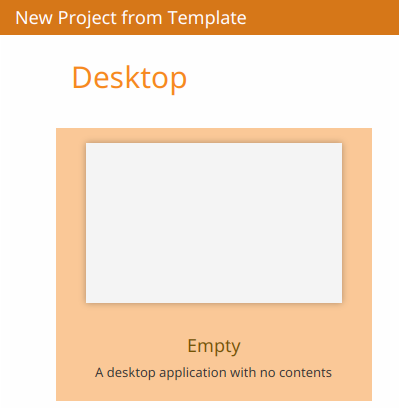
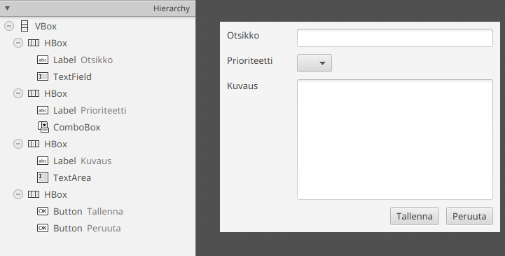
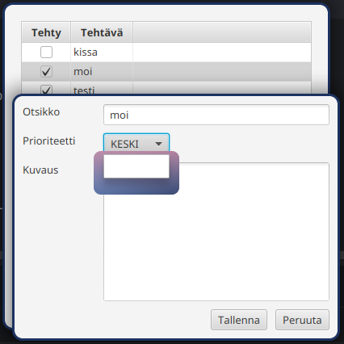
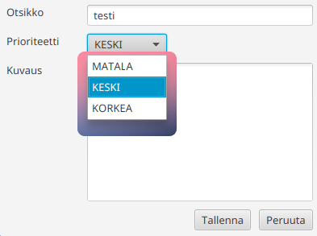

# Useita näkymiä ja tehtävän muokkaus

On hyvin tavallista, että sovelluksessa on useampiakin näkymiä kuin vain
pääikkuna.
JavaFX sallii useiden näkymien lataamista ja näyttämistä kolmella tavalla.
Ensiksi, pääikkunassa oleva näkymä voidaan korvata `stage.setScene()`-metodilla,
kuten [osassa 7.1](../osa7/01-javafx-perusteet.md#javafx-sovelluksen-käynnistys-ja-ydinluokat) oli mainittu.
Toiseksi, näkymä voidaan ladata ja lisätä toisen näkymän sisään ikään kuin
erillisenä komponenttina. Esimerkiksi voisimme lisätä pääikkunaan välilehtiä,
jossa jokainen välilehti olisi jaettu omaan näkymään.

Kolmanneksi, voimme luoda uusia ikkunoita, joissa näytetään haluttu näkymä.
Ikkunat voivat toimia pääikkunan rinnalla tai voivat olla myös *modaalisia*, eli
ikkunan ollessa auki pääikkunaa ei voi käyttää. 
Modaalisilla ikkunoille voimme esimerkiksi toteuttaa dialogeja, joilla pyydetään
käyttäjältä syötettä.

Tässä osassa tutustumme kolmesta tavasta viimeiseen. Teemme dialogin, jossa
käyttäjä voi muokata yksittäisen tehtävän yksityiskohtaiset tiedot. Dialogi
avautuu, kun käyttäjä tuplaklikkaa tehtävää.

## Esivalmistelu: lisää tietoja tehtäviin

Muokataan alkuun `Tehtava`-luokkaa lisäämällä siihen lisää tietoja. Haluaisimme,
että jatkossa tehtävällä olisi

- Otsikko, joka näytetään taulukossa
- Tehty/ei-tehty tila, kuten nytkin
- Tarkempi kuvaus
- Prioriteetti, jossa on kolme sallittua arvoa: matala, keski, korkea

Ensimmäiset kaksi hoituvat nykyisillä tehtävän attribuuteilla; refaktoroimme
vain `teksti`-attribuutin `otsikko`-attribuutiksi.
Puolestaan tarkempi kuvaus voidaan mallintaa merkkijonona.

Prioriteetti voitaisiin mallintaa numerolla 0, 1 ja 2. Java kuitenkin tarjoaa
tällaisille tapauksille erillisen *luetelmatyypin* (engl. enumeration, enum),
jonka avulla voi mallintaa rajattu määrä arvovaihtoehtoja.
Esimerkiksi prioriteetti voidaan mallintaa luetelmana seuraavasti:

```java
// Luetelmatyyppi Prioriteetti
// Prioriteetti sallii vain kolme mahdollista arvoa: MATALA, KESKI, KORKEA
public enum Prioriteetti {
    MATALA, KESKI, KORKEA
}

// Esimerkki enum-tyypin käytöstä
void main() {
    Prioriteetti prio = Prioriteetti.MATALA;
    IO.println(prio);
}
```

Luetelmatyypin arvoja voidaan tallentaa attribuutteihin tai muuttujiin
tavallisten olioiden tapaan, mutta luetelmatyypin arvona voi olla ainoastaan
tyypissä ennalta mainitut arvot.

Luo `model`-alipakkaukseen uusi tiedosto `Prioriteetti.java` ja määritä siihen
luetelma:

```java,ignore
package fi.jyu.ohj2.dezhidki.todo.model;

public enum Prioriteetti {
    MATALA, KESKI, KORKEA
}
```

Tämän jälkeen laajenna `Tehtava`-luokkaa lisäämällä siihen uudet attribuutit
kuvaukselle ja prioriteetille. Samalla refaktoroi `teksti`-attribuutti uudeksi
`otsikko`-attribuutiksi: 

```java,ignore
public class Tehtava {
    // HIGHLIGHT_YELLOW_BEGIN
    private final StringProperty otsikko = new SimpleStringProperty("");
    // HIGHLIGHT_YELLOW_END
    // HIGHLIGHT_GREEN_BEGIN
    private final StringProperty kuvaus = new SimpleStringProperty("");
    // HIGHLIGHT_GREEN_END
    private final BooleanProperty tehty = new SimpleBooleanProperty(false);
    // HIGHLIGHT_GREEN_BEGIN
    private final ObjectProperty<Prioriteetti> prioriteetti = new SimpleObjectProperty<>(Prioriteetti.KESKI);
    // HIGHLIGHT_GREEN_END

    @SuppressWarnings("unused")
    public Tehtava() {}

    // HIGHLIGHT_YELLOW_BEGIN
    public Tehtava(String otsikko, boolean tehty) {
        setOtsikko(otsikko);
    // HIGHLIGHT_YELLOW_END
        setTehty(tehty);
    }

    public boolean getTehty() { return this.tehty.get(); }
    public void setTehty(boolean tehty) { this.tehty.set(tehty); }
    public BooleanProperty tehtyProperty() { return this.tehty; }

    // HIGHLIGHT_YELLOW_BEGIN
    public String getOtsikko() { return this.otsikko.get(); }
    public void setOtsikko(String otsikko) { this.otsikko.set(otsikko); }
    public StringProperty otsikkoProperty() { return this.otsikko; }
    // HIGHLIGHT_YELLOW_END

    // HIGHLIGHT_GREEN_BEGIN
    public String getKuvaus() { return kuvaus.get(); }
    public void setKuvaus(String kuvaus) { this.kuvaus.set(kuvaus); }
    public StringProperty kuvausProperty() { return this.kuvaus; }

    public Prioriteetti getPrioriteetti() { return this.prioriteetti.get(); }
    public void setPrioriteetti(Prioriteetti prioriteetti) { this.prioriteetti.set(prioriteetti); }
    public ObjectProperty<Prioriteetti> prioriteettiProperty() { return this.prioriteetti; }
    // HIGHLIGHT_GREEN_END

    @Override
    public String toString() {
        return getOtsikko() + ": " + (getTehty() ? "TEHTY" : "EI TEHTY");
    }
}
```

Huomaa, että `teksti`-attribuutin refaktorointi edellyttää, että refaktoroit
myös `get`-, `set`- ja `property`-metodit sekä kontrollerissa olevat viitteet.
Voit helposti muuttaa nimen siirtämällä kursorin uudelleennimettävän kohteen
kohdalle, klikkaamalla hiiren toissijaisella painikkeella ja valitsemalla
**Rename**. Tämän jälkeen anna attribuutille uusi nimi ja paina
<kbd>Enter</kbd>. IDEA tämän jälkeen kysyy, haluatko samalla uudelleennimetä
metodit sekä kaikki muut mahdolliset paikat, joissa attribuuttia käytetään.

<video src="images/intellij-rename-attr.mp4" controls></video>

Vaihtoehtoisesti voit uudelleennimetä attribuutit ja metodit käsin. Muista, että
`MainControllerissa` on myös viitteitä `tekstiProperty()`-metodiin, joita on
nimettävä uudelleen.

Tallenna muutokset. Kun ajat ohjelman nyt, huomaat että vanhoista tehtävistä
katosivat otsikot, sillä muutimme attribuutin nimen. Koska vain testaamme
sovelluksen toimintaa, voit yksinkertaisesti poistaa `tehtavat.json`-tiedoston
projektiselaimesta. Jos IDEA kysyy, haluatko poistamisen yhteydessä tehdä ns.
turvallisen poiston ("Safe delete"), ota se pois päältä.

## Uuden muokkausnäkymän luominen

Luodaan uusi näkymä tulevalle dialogille. Muistamme, että käyttöliittymää varten
tarvitsemme näkymän eli FXML-tiedoston sekä kontrolleriluokan.
Aloitamme ensin näkymästä.

Avaa SceneBuilder ja valitse etusivulta "New Project from Template" -kohdasta
*Empty* -pohjan.



Tallenna uusi FXML-tiedosto saman tien. Valitse tallennuspaikaksi sama kansio,
jossa projektisi `main.fxml` on, eli
`src/main/resources/fi/jyu/ohj2/nimesi/todo`.
Anna uuden tiedoston nimeksi esimerkiksi `tehtava-edit.fxml`.

Tämän jälkeen luo SceneBuilderilla seuraava käyttöliittymä:



Aseta komponenttien asetukset seuraavasti:

- `VBox`-säiliö
   - Spacing: `10`
   - Padding: `10` kaikkiin reunoihin
   - Pref Width: `400`
   - Pref Height: `300`
- Kaikki `Label`-nimiöt
   - Min Width: `100`
   - Muut Width ja Height -arvot: `USE_COMPUTED_SIZE`
- `HBox`-säiliöt otsikkokentälle, prioriteettikentälle sekä painikkeille
   - Vgrow: `NEVER`
- `HBox`-säiliö kuvauskentälle
   - Vgrow: `ALWAYS`
- `HBox`-säiliö painikkeille
   - Alignment: `TOP_RIGHT` 
   - Spacing: `10` 
- `TextField`, `ComboBox` ja `TextArea` -kentät:
   - Hgrow: `ALWAYS`
   - Kaikki Width ja Height -arvot: `USE_COMPUTED_SIZE` 

Anna myös kentille ja painikkeille sopivat fx:id-tunnisteet:

- Otsikon `TextField`: `otsikkoKentta`
- Prioriteetin `ComboBox`: `prioriteettiCombo`
- Kuvauksen `TextArea`: `kuvausKentta`
- Tallennuspainikkeen `Button`: `tallennaPainike`
- Peruutuspainikkeen `Button`: `peruutaPainike`

Tallenna FXML-tiedosto.

<details closed><summary>Voit myös kopioida valmiin FXML-tiedoston täältä</summary>

```xml
<?xml version="1.0" encoding="UTF-8"?>

<?import javafx.geometry.Insets?>
<?import javafx.scene.control.Button?>
<?import javafx.scene.control.ComboBox?>
<?import javafx.scene.control.Label?>
<?import javafx.scene.control.TextArea?>
<?import javafx.scene.control.TextField?>
<?import javafx.scene.layout.HBox?>
<?import javafx.scene.layout.VBox?>

<VBox maxHeight="-Infinity" maxWidth="-Infinity" minHeight="-Infinity" minWidth="-Infinity" prefHeight="300.0" prefWidth="400.0" spacing="10.0" xmlns="http://javafx.com/javafx/25" xmlns:fx="http://javafx.com/fxml/1">
   <children>
      <HBox VBox.vgrow="NEVER">
         <children>
            <Label minWidth="100.0" text="Otsikko" />
            <TextField fx:id="otsikkoKentta" HBox.hgrow="ALWAYS" />
         </children>
      </HBox>
      <HBox>
         <children>
            <Label minWidth="100.0" text="Prioriteetti" />
            <ComboBox fx:id="prioriteettiCombo" HBox.hgrow="ALWAYS" />
         </children>
      </HBox>
      <HBox VBox.vgrow="ALWAYS">
         <children>
            <Label minWidth="100.0" text="Kuvaus" />
            <TextArea fx:id="kuvausKentta" prefHeight="200.0" prefWidth="200.0" HBox.hgrow="ALWAYS" />
         </children>
      </HBox>
      <HBox alignment="TOP_RIGHT" spacing="10.0" VBox.vgrow="NEVER">
         <children>
            <Button fx:id="tallennaPainike" mnemonicParsing="false" text="Tallenna" />
            <Button fx:id="peruutaPainike" mnemonicParsing="false" text="Peruuta" />
         </children>
      </HBox>
   </children>
   <padding>
      <Insets bottom="10.0" left="10.0" right="10.0" top="10.0" />
   </padding>
</VBox>
```
</details>

## Kontrolleriluokan luominen

Kun näkymä on valmis, tarvitaan myös kontrolleriluokka. 
Luodaan uusi `TehtavaEditController`-luokka `controller`-alipakettiin.
Muistamme toteuttaa `Initializable`-rajapinnan sekä näkymän oleelliset
komponentit, joille annettiin fx:id-tunniste.

```java,ignore
package fi.jyu.ohj2.nimi.todo.controller;

//-import fi.jyu.ohj2.nimi.todo.model.Prioriteetti;
//-import javafx.fxml.FXML;
//-import javafx.fxml.Initializable;
//-import javafx.scene.control.Button;
//-import javafx.scene.control.ComboBox;
//-import javafx.scene.control.TextArea;
//-import javafx.scene.control.TextField;
//-
//-import java.net.URL;
//-import java.util.ResourceBundle;
// import-määreet piilotettu...

public class TehtavaEditController implements Initializable {
    @FXML
    private TextField otsikkoKentta;

    @FXML
    private ComboBox<Prioriteetti> prioriteettiCombo;

    @FXML
    private TextArea kuvausKentta;

    @FXML
    private Button tallennaPainike;

    @FXML
    private Button peruutaPainike;

    @Override
    public void initialize(URL location, ResourceBundle resources) {

    }
}
```

Muutama sana uusista komponenteista. `TextArea`-komponentti on monirivinen
syötekenttä; se toimii pitkälti kuten `TextField`, mutta sallii rivinvaihtoja.
`ComboBox<T>` on komponentti, joka esittää `ObservableList<T>`-listassa olevia
alkioita alasvetovalikkona. 

Vaikka kontrolleri on luotu, emme vielä kertoneet JavaFX:lle, että FXML-näkymä
ja kontrolleriluokka liittyvät toisiinsa.
Palaa takaisin SceneBuilderiin ja klikkaa oikean puolen Document-näkymästä
alhaalla oleva Controller-paneeli auki:


Paneelissa oleva *Controller class* -asetus määrittää, mikä kontrolleriluokka
tulee ladata aina näkymän yhteydessä. Aseta asetuksen arvoksi 
`fi.jyu.ohj2.nimi.todo.controller.TehtavaEditController`, jossa
`fi.jyu.ohj2.nimi.todo`
on projektisi pääpaketti ja tunniste (korjaa oikeaksi!) ja
`controller.TehtavaEditController` viittaa `controller`-alipaketissa olevaan
`TehtavaEditController`-luokkaan.

Tallenna FXML-tiedosto. Nyt aina, kun muokkausnäkymä näytetään, JavaFX lataa
näkymää vastaavan `TehtavaEditController`-kontrollerin.

## Dialogin avaaminen päänäkymästä

Haluaisimme nyt avata dialogin aina, kun taulukossa oleva tehtävä klikataan
kahdesti. Valitettavasti `TableView` ei tarjoa suoraan mitään tapahtumaa
yksittäisen rivin klikkaamiselle. Sen sijaan rivin klikkaus aiheuttaa tapahtuman
yksittäistä riviä mallintavalla `TableRow`-oliolle.

Rivien muokkaamista varten `TableView` tarjoaa `setRowFactory()`-metodin (ks.
[JavaDoc](https://download.java.net/java/GA/javafx25/docs/api/javafx.controls/javafx/scene/control/TableView.html#setRowFactory(javafx.util.Callback))).
Metodille annetaan lambdalauseke, joka kutsutaan aina, kun tauluun lisätään uusi
rivi. Lambdalausekkeen tulee luoda ja palauttaa `TableRow`-olio uudelle
lisättävälle riville. Tämän kautta voimme samalla lisätä uusille riveille
`onMouseClicked`-tapahtumakäsittelijän, joka laukeaa aina, kun riviä klikataan.

Lisäämme `setRowFactory()`-metodin `MainController`-luokan
`initialize()`-metodiin samaan kohtaan, jossa taulukon sarakkeet alustetaan:

```java,ignore
public void initialize(URL url, ResourceBundle resourceBundle) {
    // metodin alkuosa piilotettu...
//-    SortedList<Tehtava> tehtavatLajiteltu = tehtavakokoelma.getTehtavat().sorted(Comparator.comparing(Tehtava::getTehty));
//-    tehtavaTaulu.setItems(tehtavatLajiteltu);
//-    tehtavaTaulu.setEditable(true);
//-
//-    TableColumn<Tehtava, Boolean> tehtySarake = new TableColumn<>("Tehty");
//-    tehtySarake.setCellValueFactory(cd -> cd.getValue().tehtyProperty());
//-    tehtySarake.setCellFactory(CheckBoxTableCell.forTableColumn(tehtySarake));
//-    tehtavaTaulu.getColumns().add(tehtySarake);
//-
//-    TableColumn<Tehtava, String> tekstiSarake = new TableColumn<>("Tehtävä");
//-    tekstiSarake.setCellValueFactory(cd -> cd.getValue().otsikkoProperty());
    tehtavaTaulu.getColumns().add(tekstiSarake);

    // HIGHLIGHT_GREEN_BEGIN
    // Asetetaan taulukolle rakentaja, jolla uudet rivit luodaan
    tehtavaTaulu.setRowFactory(tv -> {
        // Luodaan TableRow-olio riville
        TableRow<Tehtava> row = new TableRow<>();

        // Lisätään uudelle riville tapahtumakäsittelijä klikkauksille
        row.setOnMouseClicked(event -> {
            // Jos oli tuplaklikkaus eikä tyhjän rivialueen klikkaus, niin käsitellään tapahtuma
            if (event.getClickCount() == 2 && !row.isEmpty()) {
                // Haetaan riviä vastaava Tehtava-olio
                Tehtava tehtava = row.getItem();
                // Avataan muokkausdialogi
                avaaTehtavanMuokkaus(tehtava);
            }
        });

        return row;
    });
    // HIGHLIGHT_GREEN_END

    tehtavakokoelma.lataa();
    // metodin loppuosa piilotettu...
//-    uusiTehtavaNimi.setOnAction(event -> lisaaTehtava());
//-    lisaaUusiTehtavaPainike.setOnAction(event -> lisaaTehtava());
//-    poistaValittuPainike.setOnAction(event -> poistaValittu());
}
```

Lisäämme vastaavasti `avaaTehtavanMuokkaus()`-metodin, joka avaa dialogin:

```java,ignore
private void avaaTehtavanMuokkaus(Tehtava tehtava) {
    try {
    /* 1 */ FXMLLoader loader = new FXMLLoader(App.class.getResource("tehtava-edit.fxml"));
    /* 1 */ Parent root = loader.load();
    /* 1 */ Scene scene = new Scene(root);

    /* 2 */ Stage dialogi = new Stage();
    /* 2 */ dialogi.setScene(root);

    /* 3 */ dialogi.setTitle("Tehtävän muokkaus: " + tehtava.getOtsikko());
    /* 3 */ dialogi.setMinWidth(400);
    /* 3 */ dialogi.setMinHeight(300);
    /* 3 */ dialogi.initModality(Modality.APPLICATION_MODAL);

    /* 4 */ dialogi.showAndWait();
    } catch (IOException e) {
        throw new RuntimeException(e);
    }
}
```

Huomaa, että `avaaTehtavanMuokkaus()`-metodin logiikka on sama kuin [osassa
7.1](../osa7/01-javafx-perusteet.md#javafx-sovelluksen-käynnistys-ja-ydinluokat)
käsitelty `App`-luokassa oleva sovelluksen käynnistyskoodi muutamalla erolla:

1. **Näkymän alustaminen:** lataamme näkymän FXML-tiedostosta käyttäen
   `FXMLLoader`-apuluokkaa. Tämän jälkeen alustamme varsinaisen
   `Scene`-näkymäolion, jolle annamme parametrina ladatun näkymän
   pääkomponentin.
   
2. **Näkymän asettaminen ikkunaan:** asetamme näkymän aktiiviseksi
   `scene.setScene()`-metodilla. Nyt `Stage`-ikkunaolio ei tule JavaFX:stä
   suoraan, vaan alustamme sen itse. Tämä käytännössä luo uuden ikkunan.

3. **Ikkunan asetusten muuttaminen:** asetamme ikkunan minimikoon ja otsikon.
   Lisäksi teemme ikkunasta *modaalisen* `initModality()`-metodilla (ks.
   [JavaDoc](https://download.java.net/java/GA/javafx25/docs/api/javafx.graphics/javafx/stage/Stage.html#initModality(javafx.stage.Modality))).
   Ikkunan muuttaminen modaaliseksi tarkoittaa, että pääikkunassa olevia
   komponentteja ei voi klikata kunnes modaalinen ikkuna on sulkeutunut. Tämä on
   hyvä ratkaisu dialogeille, jotka vaativat käyttäjän huomiota.

4. **Ikkunan näyttäminen:** lopuksi näytämme ikkunan. Käytämme tässä
   `showAndWait()`-metodia. Metodi toimii kuten `show()`, mutta metodin suoritus
   päättyy vasta, kun avattu dialogi sulkeutuu.


Kokeile nyt ajaa sovellus. Nyt rivien klikkaaminen kahdesti avaa dialogin.

<video src="images/todo-app-dialog-open.mp4" controls></video>

## Valitun tehtävän välittäminen dialogin kontrolleriluokalle

Emme vielä pysty näyttämään tehtävän tietoja dialogissa, koska dialogilla ei ole
mitään tietoa valitusta tehtävästä.
Meidän tulee siis välittää valitun `Tehtava`-olion muokkausdialogin
kontrollerille, jotta tehtävän tiedot voidaan näyttää.

Aivan alkuun, lisätään `TehtavaEditController`-luokkaan uusi attribuutti, johon
tallennetaan dialogissa näytettävän tehtävän tiedot:

```java,ignore
public class TehtavaEditController implements Initializable {
    // HIGHLIGHT_GREEN_BEGIN
    private Tehtava muokattavaTehtava;
    // HIGHLIGHT_GREEN_END
```

Kapseloinnin takia attribuutti on `private`. Jotta voimme välittää tehtäväolion
pääikkunasta dialogille, tehdään julkinen `setTehtava()`-metodi
`TehtavaEditController`-luokkaan. Metodi päivittää attribuutin ja samalla
asettaa tehtävän attribuutit dialogin kenttiin:

```java,ignore
public void setTehtava(Tehtava tehtava) {
    this.muokattavaTehtava = tehtava;
    otsikkoKentta.setText(tehtava.getOtsikko());
    prioriteettiCombo.setValue(tehtava.getPrioriteetti());
    kuvausKentta.setText(tehtava.getKuvaus());
}
```

> [!HUOMAUTUS]
>
> Tässäkin voisimme käyttää datan sidontaa ja sitoa kenttien arvojen
> ominaisuudet tehtäväolion ominaisuuksiin seuraavasti:
>
> ```java,ignore
> // Sitoo otsikkokentän tekstin tehtävän otsikko-attribuuttiin
> otsikkoKentta.textProperty().bindBidirectional(tehtava.otsikkoProperty());
> ```
>
> Jos tekisimme näin, jokainen näppäimen painallus muuttaisi tehtävän
> otsikon välittömästi taustalla.
> Sen sijaan haluamme tässä antaa käyttäjälle mahdollisuuden peruuttaa muutokset
> Peruuta-painikkeen painalluksella. Tämän takia tiedon sitomisen sijaan
> kopioimme arvot tehtävästä kenttiin ja kentistä tehtäviin käsin.

Palataan `MainController`-luokan `avaaTehtavanMuokkaus()`-metodiin. 
Nyt ennen ikkunan luomista voimme hakea `TehtavaEditController`-luokasta luotu
ilmentymä ja välittää sille muokattava tehtävä. Näkymälle luotu
kontrolleriluokan olio saamme `FXMLLoader`-olion `getController()`-metodilla (ks.
[JavaDoc](https://download.java.net/java/GA/javafx25/docs/api/javafx.fxml/javafx/fxml/FXMLLoader.html#getController())).

```java,ignore
private void avaaTehtavanMuokkaus(Tehtava tehtava) {
    // metodin alkuosa piilotettu...
//-    try {
//-        FXMLLoader loader = new FXMLLoader(App.class.getResource("tehtava-edit.fxml"));
//-        Parent root = loader.load();
        Scene scene = new Scene(root);

        // HIGHLIGHT_GREEN_BEGIN
        // Haetaan näkymälle luotu kontrolleriolio
        TehtavaEditController controller = loader.getController();
        // Välitetään kontrollerille muokattava tehtävä
        controller.setTehtava(tehtava);
        // HIGHLIGHT_GREEN_END

        Stage dialogi = new Stage();
    // metodin loppuosa piilotettu...
//-        dialogi.setScene(scene);
//-        dialogi.setTitle("Tehtävän muokkaus: " + tehtava.getOtsikko());
//-        dialogi.setMinWidth(400);
//-        dialogi.setMinHeight(300);
//-        dialogi.initModality(Modality.APPLICATION_MODAL);
//-
//-        dialogi.showAndWait();
//-    } catch (IOException e) {
//-        throw new RuntimeException(e);
//-    }
}
```

Kokeile ajaa sovellus. Nyt tehtävän klikkaaminen kahdesti avaa dialogin, ja
dialogin kentät täyttyvät tehtävän tiedoista:



Huomaamme tässä vaiheessa pienen bugin: prioriteetti-alasvetolaatikossa ei vielä
näy kaikkia prioriteettivaihtoehtoja. 
Korjaamme tämän asettamalla `ComboBox`-komponenttiin näytettävät
`Prioriteetti`-arvot käyttäen `setItems()`-metodia samankaltaisesti kuin
aiemmin osassa esitellyssä `ListView`-komponentissa:

```java,ignore
public void initialize(URL location, ResourceBundle resources) {
    prioriteettiCombo.setItems(FXCollections.observableArrayList(Prioriteetti.values()));
}
```

Tässä `Prioriteetti.values()` palauttaa taulukon kaikista mahdollisista
`Prioriteetti`-luetelman arvoista (eli `MATALA`, `KESKI` ja `KORKEA`). Nämä
kääritään `ObservableList`-olioon ja asetetaan näytettäväksi
`ComboBox`-komponentissa.
Nyt alasvetovalikossa kaikki mahdolliset vaihtoehdot ovat valittavissa:




## Dialogin logiikan toteuttaminen

Toteutetaan lopuksi varsinainen logiikka dialogiin
`TehtavaEditController`-luokassa. Muokkausdialogissa on kaksi
painiketta: 

- Tallenna-painike tallentaa tehtävän muutokset `Tehtava`-olioon ja sulkee
  dialogin. Tässä meidän
  tulee varmistaa, että emme salli tehtävän tallentamista ilman otsikkoa.
  Tehtävän kuvaus kuitenkin on tässä tapauksessa valinnainen kenttä.
- Peruuta-painike sulkee dialogin siirtämättä tietoja oliolle. 

Lisätään alkuun `TehtavaEditController`-luokkaan apumetodi `sulje()`, joka
sulkee dialogin sekä tapahtumakäsittelijät Tallenna- ja Peruuta-painikkeille:

```java,ignore
public void initialize(URL location, ResourceBundle resources) {
//-    prioriteettiCombo.setItems(FXCollections.observableArrayList(Prioriteetti.values()));
    // metodin alkuosa piilotettu...

    tallennaPainike.setOnAction(event -> {
        muokattavaTehtava.setOtsikko(otsikkoKentta.getText());
        muokattavaTehtava.setPrioriteetti(prioriteettiCombo.getValue());
        muokattavaTehtava.setKuvaus(kuvausKentta.getText());
        sulje();
    });
    peruutaPainike.setOnAction(event -> sulje());
}

private void sulje() {
    // Kikka: haetaan Scene-olio jostain komponentista
    Scene scene = otsikkoKentta.getScene();
    // Scene-olion getWindow()-metodi palauttaa tämänhetkisen ikkunan
    // Tiedämme, että ikkuna on nyt tyyppiä Stage, joten tehdään tyyppimuunnos
    Stage ikkuna = (Stage) scene.getWindow();
    ikkuna.close();
}
```

Muistetaan, että tehtävää ei saa tallentaa, jos otsikkokenttä on tyhjä.
Toteutetaan tämä tarkistus käyttäjäystävällisenä *validointina*: jos
otsikkokenttä on tyhjä, muutamme kentän väriä ja lisäämme kenttään selkeän
varoitustekstin.
Tehdään tätä varten apumetodi `validoi()`, joka tarkistaa otsikkokentän
oikeellisuuden ja palauttaa `boolean`-arvona, onko kaikki kentät oikein (`true`)
tai väärin (`false`). Lisäksi, jos otsikkokenttä ei sisällä mitään arvoa,
väritetään kentän reunus punaisella ja lisätään syötekenttään virhe
vihjetekstinä (`Tooltip`):

```java,ignore
private boolean validoi() {
    // Nollataan mahdolliset aiemmat virhetyylit ja vihjetekstit
    otsikkoKentta.setStyle("");
    otsikkoKentta.setTooltip(null);

    String otsikko = otsikkoKentta.getText();
    if (otsikko == null || otsikko.isBlank()) {
        // Vaihdetaan reunus punaiseksi virheen merkiksi
        otsikkoKentta.setStyle("-fx-border-color: red;");
        // Lisätään kenttään vihjeteksti, joka sisältää virheen
        Tooltip virhe = new Tooltip("Tehtävän otsikko ei saa olla tyhjä!");
        otsikkoKentta.setTooltip(virhe);
        // Palautetaan false sen merkiksi, että validointi epäonnistui
        return false;
    }

    return true;
}
```

Tällöin voimme kutsua `validoi()`-metodin suoraan tallennuspainikkeen
tapahtumakäsittelijässä:

```java,ignore
public void initialize(URL location, ResourceBundle resources) {
    // metodin alkuosa piilotettu...
//-    prioriteettiCombo.setItems(FXCollections.observableArrayList(Prioriteetti.values()));
//-
    tallennaPainike.setOnAction(event -> {
        // HIGHLIGHT_GREEN_BEGIN
        if (!validoi()) {
            return;
        }
        // HIGHLIGHT_GREEN_END

        muokattavaTehtava.setOtsikko(otsikkoKentta.getText());
        muokattavaTehtava.setPrioriteetti(prioriteettiCombo.getValue());
        muokattavaTehtava.setKuvaus(kuvausKentta.getText());
        sulje();
    });
    // metodin loppuosa piilotettu...
//-    peruutaPainike.setOnAction(event -> sulje());
}
```

Kokeile nyt sovellusta taas. Nyt Tallenna- ja Peruuta-painikkeet toimivat.
Lisäksi otsikkokentän jättäminen turhaksi näyttää virheen käyttäjälle.

<video src="images/todo-app-dialog-works.mp4" controls></video>

## Tehtävien tallentaminen tietojen muutoksesta

Huomaamme, että tietojen muokkaaminen dialogista muokkaa taulukossa näkyvät
tiedot, mutta ei vielä tallenna tietoja tiedostoon. Tämä johtuu siitä, että
tallennus tapahtuu nyt ainoastaan, jos `Tehtavakokoelma`-luokan `tehtavat`-lista
muuttuu. Puolestaan lista muuttuu nyt vain, jos listaan lisätään tehtävä,
listasta poistetaan tehtäviä, tai jos tehty-ominaisuus muuttuu, kuten
ekstraktorissa on mainittu:

```java,ignore
private final ObservableList<Tehtava> tehtavat = FXCollections.observableArrayList(tehtava -> new Observable[]{tehtava.tehtyProperty()});
```

Tallentaminen dialogin jälkeen voitaisiin hoitaa eri tavoin. Pidetään kuitenkin
tässä vaiheessa ratkaisu suoraviivaisena ja lisäämme `Tehtava`-luokan kaikki
ominaisuudet ekstraktoriin:

```java,ignore
private final ObservableList<Tehtava> tehtavat = FXCollections.observableArrayList(
        tehtava -> new Observable[] {
                tehtava.tehtyProperty(),
                tehtava.otsikkoProperty(),
                tehtava.kuvausProperty(),
                tehtava.prioriteettiProperty()
        }
);
```

Tällöin `tehtava`-lista ilmoittaa kaikista tehtävien ominaisuuksiin tehdyistä
muutoksista. Toisin sanoen aina, kun jokin tehtävän ominaisuus muuttuu,
`Tehtavakokoelma`-luokassa määritelty havaitsija tallentaa kaikki tehtävät.

<details closed><summary><i class="bi bi-stars jyu-gold"></i>Bonus: Tallentaminen pienellä viiveellä</summary>
Yllä oleva ratkaisu ei ole ideaalinen: nyt jokainen tehtävän `set`-metodin kutsuminen
aiheuttaa kaikkien tehtävien tallentumista. 

Eräs tapa ratkaista tämä käyttäen JavaFXää on lisätä ns. rajoittaja- eli
*debounce*-olio. Rajoittajaolio estää saman koodin suorittamista tietyn
aikavälin sisällä. Esimerkiksi, voimme rajoittaa `tallenna()`-funktion kutsua
niin, että funktio suoritetaan vain yhden kerran 500 millisekunnissa.
JavaFX tarjoaa tätä varten `PauseTransition`-apuluokan, jota voidaan käyttää
seuraavasti:

```java,ignore
private final PauseTransition tallennaDebounce = new PauseTransition(Duration.millis(500));

public Tehtavakokoelma() {
    // Määritellään koodi, jonka suoritusta rajoitetaan
    tallennaDebounce.setOnFinished(event -> tallenna());
    
    tehtavat.addListener((ListChangeListener<Tehtava>) change -> {
        // Suoritetaan aikarajoitettu koodi 500 millisekunnin päästä
        // Jos 500 millisekunnin sisällä tätä koodia kutsutaan uudestaan, aloitetaan uusi aikalaskenta
        tallennaDebounce.playFromStart();
    });
}
```

Tämän muutoksen myötä monta peräkkäistä `set`-metodin kutsua aiheuttaa vain
yhden `tallenna()`-metodin kutsua.
</details>

<task>
  <task-title>Tehtävä 8.4: Todo-sovellus, vaihe 10. <points>1 p.</points> </task-title>
  <handout>

{{#include ../exercises/8-4-todo-10/handout.md}}

</handout>
</task>
