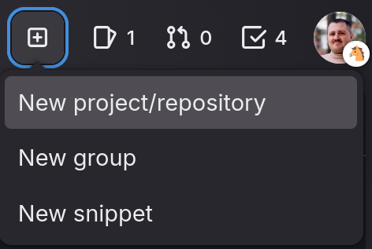
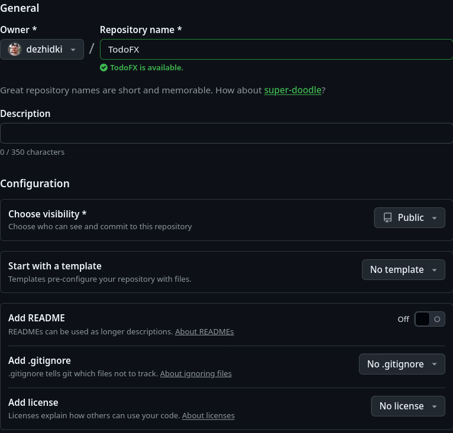
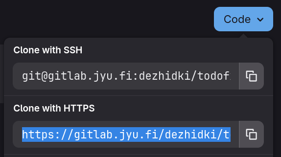

# Versionhallinnan etäkäyttö 

Tähän asti olemme käyttäneet versiohallintaa vain omalla koneella. Jotta koodi 
on turvassa kiintolevyn rikkoutumiselta ja jotta sen voi jakaa muille, 
koodi pitää yleensä viedä **etävarastoon** (engl. *remote repository*).
Etävarasto voi olla vaikkapa toinen verkossa oleva tietokone, mutta nykyään on
yleisempää käyttää jotakin julkista etävarastopalvelua, kuten GitHub- tai
GitLab-palveluita. Kummatkin palvelut toimivat etävarastona sekä tarjoavat
projektihallintaan hyödyllisiä lisäominaisuuksia, kuten
tehtävähallintatyökaluja, keskustelupalstoja ja muita yhteistyötä helpottavia
työkaluja. 

Tässä osassa siirrämme paikallisen projektin GitLab- tai GitHub-palveluun.
Jyväskylän yliopiston opiskelijoilla on käytössään Jyväskylän yliopiston
GitLab-palvelin. Muussa tapauksessa koodin voi ladata GitHub-palveluun.

## Etävaraston luominen

Jotta git-varaston voi ladata etävarastopalveluun, palvelussa tulee ensin luoda
etävarasto. Etävarastopalvelut kutsuvat etävarastoja usein myös projekteiksi
tarjottujen lisäpalvelujen takia.

### [GitLab (JYU)](#tab/gitlab)

1. Kirjaudu sisään [JYU:n GitLabiin](https://gitlab.jyu.fi/) yliopiston
   tunnuksilla. Kirjoita tunnus muodossa `tunnus` **ilman** `@jyu.fi`-päätettä.
2. Paina oikeassa yläpalkissa olevaa `+`-painiketta ja valitse **New project/repository**:

    

3. Valitse annetuista vaihtoehdoista **Create blank project**.

4. Täytä projektin tiedot seuraavasti:

    - **Project name**: Anna projektille nimi, esimerkiksi `TodoFX`.
    - **Project URL**: Varmista, että `https://gitlab.jyu.fi/`-kentän perässä
      olevassa alasvetovalikossa lukee oma käyttäjätunnus. Jos ei, klikkaa
      alasvetovalikkoa ja kirjoita tunnus.
    - **Project slug**: Sen pitäisi olla automaattisesti projektin nimi ilman
      erikoiskirjaimia, esimerkiksi `todofx`.
    - **Visibility level**: Valitse tässä projektissa Internal tai Public, jotta
      muut ihmiset pääsevät näkemään projektin koodin.
      Omissa projekteissa voi valita mielestään sopivan.
    - **Project configuration**: Ota kaikki ruksit pois päältä. **Poista**
      valinta erityisesti kohdasta *Initialize repository with a README*, sillä
   meillä on jo lokaalisti olemassa oleva projekti.

    Lomakkeen pitäisi lopuksi näyttää täältä:

    

5. Paina lopuksi **Create project**.

***

### [GitHub](#tab/github)

1. Kirjaudu sisään [GitHubiin](https://github.com/). Jos tunnusta ei ole, luo
   sellainen.

2. Paina oikeassa yläpalkissa olevaa `+`-painiketta ja valitse **New repository**.

3. Täytä etävaraston tiedot seuraavasti:

    - **Repository name**: Anna projektille nimi, esimerkiksi `TodoFX`.
    - **Description**: Voit jättää tyhjäksi tai keksiä lyhyen kuvauksen.
    - **Choose visibility**: Valitse tässä tapauksessa Public. Omissa projekteissa voi valita mielestään sopivan.
    - **Start with template**: No template
    - **Add README**: Pois päältä (Off)
    - **Add .gitignore**: No .gitignore
    - **Add license**: No license
  
    Lopuksi lomakkeen pitäisi näyttää täältä:

    

4. Paina lopuksi **Create repository**.

***

### [Valitse](#tab/default)

Valitse käytettävä etävarastopalvelu:

- **Jyväskylän yliopiston opiskelijat**: valitse GitLab (JYU). Halutessaan voi vaihtoehtoisesti käyttää GitHubia.
- **Muussa tapauksessa**, valitse GitHub.

***

## Etävaraston yhdistäminen lokaaliin projektiin

Avaa komentorivi ja siirry projektin juurikansioon. Juurikansio on se kansio, jossa on
`src`-kansio ja `pom.xml`-tiedosto.
Oikean kansion voi varmistaa suorittamalla `git
status` -komennon, jolloin pitäisi näkyä git-varaston tila samalla tavalla kuin
[osassa 7.3](../osa7/03-versionhallinta.md).

Lisäämme seuraavaksi etävaraston osoitteen paikalliseen varastoon. Tätä varten
meidän ensin pitäisi tietää git-etävaraston osoite.

### [GitLab (JYU)](#tab/gitlab)

1. Mene tekemäsi projektin sivulle. Sivun osoitteen pitäisi olla muotoa
   `https://gitlab.jyu.fi/tunnus/projektin-nimi`. Kaikki projektit löytyvät
   helposti myös osoitteesta
   <https://gitlab.jyu.fi/dashboard/projects/personal>.
   
2. Kopioi git-etävaraston osoite. Klikkaa sinisestä **Code**-painikkeesta ja
   kopioi *Clone with HTTPS* -kentässä oleva osoite:

   

***

### [GitHub](#tab/github)

1. Mene tekemäsi etävaraston sivulle. Sivun osoitteen pitäisi olla muotoa
   `https://github.com/tunnus/varaston-nimi`. Kaikki etävarastot löytyvät
   helposti myös osoitteesta <https://github.com/repos>.

2. Kopioi git-etävaraston osoite.

    Jos etävarasto on tyhjä, osoite näkyy suoraan etävarastosivulla:

    

    Jos taas etävarastossa on jo koodia, osoitteen näkee klikkaamalla vihreästä
    **Code**-painikkeesta ja valitsemalla HTTPS-osoitteen:

    

***

### [Valitse](#tab/default)

Valitse käytettävä etävarastopalvelu:

- **Jyväskylän yliopiston opiskelijat**: valitse GitLab (JYU). Halutessaan voi vaihtoehtoisesti käyttää GitHubia.
- **Muussa tapauksessa**, valitse GitHub.

***

Kopioi etävaraston osoite ja lisää se paikalliseen varastoon `git remote add` -komennolla:

<asciinema src="images/git-remote-add.cast" rows="4" poster="npt:10"></asciinema>

`git remote add` -komento ottaa kaksi parametria: etävaraston nimen ja etävaraston osoitteen.
Sana `origin` on Git-maailmassa vakiintunut nimitys projektin pääasialliselle etävarastolle.

## Koodin lähettäminen etävarastoon ensimmäistä kertaa

Voimme nyt lähettää koodin etävarastoon.
Ennen koodin lähettämistä meidän tulee vielä selvittää etävaraston käyttäjätunnus ja
salasana. Nämä riippuvat palvelusta.

### [GitLab (JYU)](#tab/gitlab)

Etävarastoon lähettämisen yhteydessä käyttäjätunnus on aina yliopiston tunnus
ilman `@jyu.fi`-päätettä. Salasanana toimii yliopiston salasana.

***

### [GitHub](#tab/github)

Etävarastoon lähettämisen yhteydessä käyttäjätunnus on oma
GitHub-käyttäjätunnus.
Salasanaksi **ei kelpaa** GitHub-salasana, vaan sen sijaan on luotava
erillinen pääsyavain (engl. Personal Access Token, PAT):

1. Mene osoitteeseen <https://github.com/settings/tokens>
2. Klikkaa **Generate new token** ja valitse *Generate new token (classic)*.
3. Täytä lomake seuraavasti:

    - **Note**: Anna jokin kuvaava nimi, vaikkapa `git-komentorivi`.
    - **Expiration**: Valitse jokin pitkä aika tai `No expiration`. Huomaa, että
      aikarajan asettaminen tarkoittaa, että pääsyavain lakkaa toimimasta
      aikarajan jälkeen, jolloin on luotava uusi avain.
    - **Select scopes**: Valitse `repo` ja varmista, että kaikki sen kohdalla
      olevat alavalinnat on valittu.

4. Paina lopuksi **Generate token** sivun alapuolella.
5. Pääsyavain näkyy vihreässä kentässä. Tämä avain toimii jatkossa salasanana
   aina, kun koodia lähetetään GitHubiin. Laita tämä koodi talteen.

***

### [Valitse](#tab/default)

Valitse käytettävä etävarastopalvelu:

- **Jyväskylän yliopiston opiskelijat**: valitse GitLab (JYU). Halutessaan voi vaihtoehtoisesti käyttää GitHubia.
- **Muussa tapauksessa**, valitse GitHub.

***

Kun tunnus ja salasana on tiedossa, projektin voi lähettää ensimmäistä kertaa
etävarastoon käyttäen `git push` -komentoa:

<asciinema src="images/git-push-first.cast" rows="15" poster="npt:15"></asciinema>

Tämä komento tekee kaksi asiaa:

1. `push` lähettää paikalliset commitit etävarastoon.
2. `-u origin main` linkittää paikallisen `main`-haaran varaston
   `main`-haaraan. Tämän avulla git-työkalu jatkossa tietää, että `git
   push` -komento ilman parametreja lähettää koodia aina `origin`-etävarastoon.

Huomaa, että ensimmäisen koodin lähettämisen, eli ns. push-komennon yhteydessä,
git-työkalu voi kysyä tunnusta ja salasanaa. Tunnus- ja salasanadialogi eroaa
käyttöjärjestelmästä toiseen, mutta periaate on sama: anna yllä olevien ohjeiden
mukainen tunnus ja salasana.

## Jatkossa

Kun etävarasto on kerran määritelty ja ensimmäinen push on tehty, jatkossa
työnkulku on yksinkertainen:

1. Tee muutoksia koodiin.
2. `git add .`, joka lisää muutokset git-työkalun "käsittelyjonoon".
3. `git commit -m "Lisätty muokkausikkuna"`, joka tekee jonossa olevista
   muutoksista commitin.
4. `git push`, joka lähettää kaikki tähän mennessä tehdyt commitit etävarastoon talteen.
