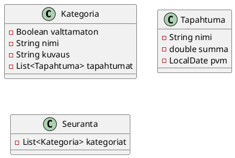
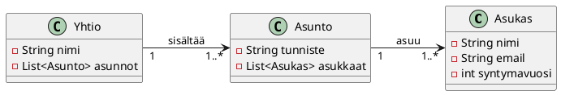
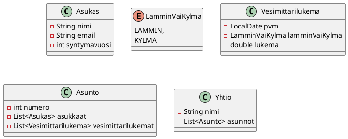
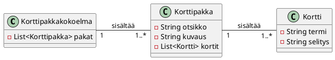

# Harjoitustyö

Tällä viikolla aloitetaan oman harjoitustyön toteutus. Harjoitustyö toteutetaan
vaiheittain osissa 9-12, ja viimeistään osan 12 loppuun mennessä harjoitustyö
tulee palauttaa ja hyväksyttää tuntiopettajalla etä- tai lähiohjauksessa. 

Harjoitustyösi tulee täyttää kaikki [harjoitustyölle asetetut
vaatimukset](../harjoitustyo.md). Lue huolellisesti harjoitustyön vaatimukset
ennen aloittamista. 

Osissa 9-12 on annettu ohjeita, joiden tarkoituksena on auttaa sinua etenemään
harjoitustyössä, mutta harjoitustyötä ei ole pakko toteuttaa näissä osissa
kuvattua vaiheustusta hyödyntäen. 

## Projektin aihe

Voit valita valmiin aiheen alla olevista vaihtoehdoista, tai keksiä oman aiheen,
joka täyttää harjoitustyölle asetetut vaatimukset.


<details><summary>

### Kulujen seuranta

Tässä sovelluksessa käyttäjä voi seurata omia kulujaan ja menojaan. 

</summary>

 * Käyttäjä voi syöttää kuluja ja menoja. 
 * Käyttäjä näkee kaikki kulut ja menot taulukossa, jossa on ainakin kulun nimi, summa ja päivämäärä. 
 * Käyttäjä voi määrittää kulukategorioita
 * Käyttäjä voi määrittää, mihin kategoriaan kulu kuuluu.
 * Käyttäjä näkee tietyn kategorian kulut
 * Käyttäjä voi katsoa kulut tietyltä aikaväliltä (kaksi päivämäärää)
 * Käyttäjä voi vaihtaa kulun kategoriaa jälkikäteen
 * Käyttäjä näkee kuvaajan, jossa esitetään kaiki kulut kuukausittain

Käytä ainakin seuraavia komponentteja (pakolliset):

 * DatePicker
 * TableView-komponenttiin FilteredList, joka tuottaa suodatetun näkymän
   taulukkomallista, ja joka mahdollistaa taulukon suodattamisen esimerkiksi
   kategorian tai päivämäärän mukaan. TODO: Tarvitaan esimerkki filtteröidyn
   listan tuottamisesta sortedlist-oliolle.
 * ControlsFX: CheckComboBox
 * Pakollinen 1
 * Pakollinen 2

Saatat tarvita / hyötyä seuraavista JavaFX-komponentteja:  (valinnaiset)

 * Valinnainen 1
 * Valinnainen 2
 * Valinnainen 3

Bonus

 * Käyttäjä näkee kategorioittain aikasarjan kuluista




<details><summary>Valmiit kulukategoriat</summary>

Sovelluksessa ei ole pakko pystyä muuttamaan kulukategorioita, vaan voit
toteuttaa sovelluksen valmiilla kategorioilla. Alla on [Marttojen budjettioppaan](https://www.martat.fi/omat-rahat/taloudenhallinnan-perustaidot/talouden-suunnittelu/)
mukaiset kulukategoriat. Voit käyttää näitä kategorioita, tai keksiä omat kategoriasi. 

 * Ruoka kotona
 * Ravintolat
 * Vuokra ja vastike
 * Vesi
 * Sähkö
 * Muu asuminen
 * Vaatteet
 * Terveys
 * Auto
 * Julkinen liikenne
 * Muu matkustus
 * Suoratoistot
 * Päivähoito
 * Vakuutukset
 * Kodin hankinnat
 * Vapaa-aika
 * Lahjat, lahjoitukset
 * Säästäminen
 * Lainanhoito ja korot
 * Muut menot

</details>

</details>


<details><summary>

### Tuotteiden varastohallinta
 
Tässä sovelluksessa käyttäjä voi hallita tuotteita ja tehdä ostotapahtumia. 

</summary>

 * Käyttäjä voi syöttää tuotteita ja niiden määriä varastossa. 
 * Käyttäjä näkee kaikki tuotteet taulukossa, jossa on ainakin tuotteen nimi, määrä ja hinta. 
 * Käyttäjä voi tehdä ostotapahtumia, joissa hän syöttää ostettavan tuotteen,
   ostettavan määrän. Ei voi ostaa, jos tuotetta ei ole varastossa tarpeeksi 
 * Näytetään rivin yksikköhinta ja rivin loppuhinta (yksikköhinta * määrä)
   ostotapahtuman yhteydessä. Tarvitset sarakkeen, joka laskee
   kertolaskun tuotteiden hinnasta ja ostettavasta määrästä. 
 * Näytetään ostosten loppuhinnan. 
 * Seuraava vaatimus...

Bonus

 * Maksutapa voi olla kortti tai käteinen
 * Käteismaksujen jälkeen käteiskassa päivittyy
 * Rivialennus tai ostotapahtumakohtainen alennus

</details>

<details><summary>

### Kirjasto

Kirjastossa on kirjoja ja lainaajia. Lainaaja voi lainata ja palauttaa kirjoja.
Kirjaston hoitaja voi hallita kirjojen tietoja ja lainatilannetta, sekä tutkia
kirjojen lainahistoriaa.

</summary>

 * Käyttäjä voi syöttää kirjoja ja niiden tietoja. 
 * Käyttäjä näkee kaikki kirjat taulukossa, jossa on ainakin kirjan nimi, tekijä ja lainatilanne. 
 * Käyttäjä voi lainata ja palauttaa kirjoja. 
 * Seuraava vaatimus...
 * Seuraava vaatimus...

Esimerkki siitä, miltä JSON voisi näyttää. 

```json
{
  "kirjat": [
    {
      "id": 1,
      "nimi": "Sota ja rauha",
      "tekijä": "Leo Tolstoi",
      "lainassa": { "lainaajaId": 1, "lainauspaivamaara": "2024-01-01", "palautuspäivämäärä": "2024-01-15" }
    },
    {
      "id": 2,
      "nimi": "Anna Karenina",
      "tekijä": "Leo Tolstoi",
      "lainassa": null
    },
    {
      "id": 3,
      "nimi": "Rautatie",
      "tekijä": "Juhani Aho",
    }
  ],
  "lainaajat": [
    {
      "id": 1,
      "nimi": "Matti Meikäläinen",
      "lainatutKirjat": [1]
    },
    {
      "id": 2,
      "nimi": "Maija Meikäläinen",
      "lainatutKirjat": []
    },
    {
      "id": 3,
      "nimi": "Mikko Meikäläinen",
      "lainatutKirjat": [2,3]
    }
  ]
}
```

<details><summary>Bonus: Kirjaston lainahistoria</summary>

Bonus 1: Lisää kirja-olioon tieto siitä, kuka on lainannut kirjan, jos se on
lainassa, milloin se on lainattu ja milloin se palautuu. 

Bonus 2: Tieto siitä, milloin kirja on lainattu ja milloin se palautuu kirjastoon.
Tarvitset lainaushistoria-luokan, joka kuvaa yhtä lainatapahtumaa, ja joka
sisältää ainakin lainattavan kirjan id:n, lainaajan nimen, lainauspäivämäärän ja
palautuspäivämäärän. Lainaushistoria-luokkien lista kuuluu kirjastoon, ja joka
kerta, kun kirja lainataan tai palautetaan, luodaan uusi lainaushistoria-olio ja
lisätään se kirjaston lainaushistoria-listaan. Näin kirjastolla on täydellinen
historia siitä, milloin kukin kirja on lainattu ja palautettu, ja kuka on
lainannut kunkin kirjan.

</details>

</details>


<details><summary>

### Taloyhtiön hallinta

Taloyhtiön hallintasovelluksessa taloyhtiön isännöitsijä voi hallita taloyhtiön
tietoja, kuten asuntoja, asukkaita ja taloyhtiön tapahtumia. 

</summary>

**Toiminnalliset vaatimukset**

 * Käyttäjä voi syöttää asuntoja ja niiden tietoja. 
 * Käyttäjä näkee kaikki asunnot taulukossa, jossa on asunnon
   numero ja asukkaiden lukumäärä
 * Käyttäjä voi lisätä ja poistaa asukkaita asuntoon.
 * Käyttäjä näkee asunnon asukkaat taulukossa, jossa on ainakin asukkaiden
   nimet, sähköpostiosoitteet ja syntymävuodet.

**Sovelluksen tietomalli**

Sovellus sisältää kaksi oleellista tietomallin kohdetta: `Asunto` ja
`Asukas`. Lisäksi tietomallissa on kaikkia korttipakkoja hallinnoiva
`Yhtio`-luokka. Tietomalli näyttää seuraavalta:




<details><summary><i class="bi bi-stars jyu-gold"></i> Bonus: Lisää ominaisuuksia</summary>

Voit halutessasi lisätä sovellukseen myös alla olevia ominaisuuksia.
Lisäominaisuudet eivät vaikuta harjoitustyön hyväksyntään, ja voit toteuttaa ne
haluamallasi tavalla. Mikäli kuitenkin
lisäät ylimääräisiä ominaisuuksia, tulee ne toteuttaa [harjoitustyön vaatimuksia
noudattaen](../harjoitustyo.md).

**Isännöitsijän ja asukkaan näkymät**

* Sovelluksesa on kaksi tilaa: Isännöitsijän näkymä ja asukkaan näkymä.
* Sovelluksen aloitusnäytössä käyttäjä valitsee, haluaako hän käyttää isännöitsijän vai asukkaan näkymää.
  Jos valitaan asukkaan näkymä, käyttäjän tulee valita asukas, jona hän
  "kirjautuu" näkymään.
* Isännöitsijä voi hallita asuntojen tietoja, asukkaita ja taloyhtiön tapahtumia (kuten perusversiossakin)
* Asukkaan näkymässä käyttäjä näkee sen asunnon tiedot, johon hän kuuluu. Asukas ei
  voi muokata asunnon perustietoja.
* Asukkaan näkymässä käyttäjä voi antaa palautetta isännöitsijälle.
* Isännöitsijänäkymässä käyttäjä näkee palautteet taulukossa, jossa on ainakin palautteen tekijän nimi, päivämäärä ja palautteen sisältö.

**Vesimittarilukemien kirjaus**

 * Asukasnäkymässä asukas voi syöttää asunnolle vesimittarilukemia. Vesimittarilukema sisältää
   lukeman, päivämäärän ja sen, onko lukema otettu kylmästä vai lämpimästä
   vedestä.
 * Asukas näkee asuntonsa vesimittarilukemat taulukossa
 
**Vesilaskun luominen**

* Isännöitsijä voi syöttää taloyhtiölle lämpimän ja kylmän veden hinnat ja niiden
  alkamispäivät.
* Käyttäjä voi luoda asunnolle vesilaskun. Vesilasku sisältää kahden
  viimeisimmän kylmän ja lämpimän veden lukeman erotuksen. Riittää, että
  vesilasku näyttää laskukauden (alku- ja loppupvm), kulutetun kylmän ja
  lämpimän veden määrän, sekä vesilaskun loppusumman (kylmä ja lämmin vesi eroteltuina).

Voit hyötyä seuraavista tietomalleista.


</details>

</details>


<!-- DZ: Tuo ei toimi vielä, sillä vaatii JRE:n asennusta tai osassa 1 olevan PATH-kikan käyttäminen  -->
<!-- Voit halutessasi tutkia valmista sovellusta
[täällä](https://github.com/ohj-perus-jy/malliharkat/blob/main/Taloyhtio-1.0.jar).
Lataa tiedosto. Selain varoittaa, että sovellus ei ole turvallinen, mutta voit
hyväksyä sen silti. Käynnistä sovellus komennolla `java -jar Taloyhtio-1.0.jar`.  -->

<details><summary>

### Muistikorttisovellus

Sovellus, jolla voi luoda ja hallita muistikortteja (vrt. [Anki](https://fi.wikipedia.org/wiki/Anki_(ohjelma))).
Käyttäjä voi luoda muistikortteja, jotka sisältävät termin ja siihen liittyvän
selityksen. Samaan aiheeseen kuuluvia muistikortteja kerätään korttipakkoihin,
joita voi harjoitella sovelluksessa.

</summary>

**Toiminnalliset vaatimukset**

* Käyttäjä voi luoda korttipakkoja, jotka sisältävät kortteja. Korttipakalla on
  nimi ja valinnainen kuvaus.
* Käyttäjä voi lisätä kortteja korttipakkaan. Kortilla on termi ja termin selitys.
* Käyttäjä voi selata ja muokata lisättyjä korttipakkoja.
* Käyttäjä voi harjoitella korttipakan kortteja ns. harjoitustilassa. Harjoitustilassa 
* käyttäjälle näytetään yhden kortipakan kortin termi. Käyttäjä voi katsoa kortin
  selityksen (eli ns. "kääntää kortin").
  Käyttäjä voi sen jälkeen siirtyä seuraavaan korttiin tai edelliseen korttiin.
* Harjoitustilassa kortit näytetään aina satunnaisessa järjestyksessä.
* Käyttäjä voi muokata ja poistaa korttipakkoja tai sen kortteja.

**Sovelluksen tietomalli**

Sovellus sisältää kaksi oleellista tietomallin kohdetta: `Kortti` ja
`Korttipakka`. Lisäksi tietomallissa on kaikkia korttipakkoja hallinnoiva
`Korttipakkakokoelma`-luokka. Tietomalli näyttää siten seuraavalta:



<details><summary><i class="bi bi-stars jyu-gold"></i> Bonus: Lisää ominaisuuksia</summary>

Voit halutessasi lisätä sovellukseen myös alla olevia ominaisuuksia.
Lisäominaisuudet eivät vaikuta harjoitustyön hyväksyntään, ja voit toteuttaa ne
haluamallasi tavalla. Mikäli kuitenkin
lisäät ylimääräisiä ominaisuuksia, tulee ne toteuttaa [harjoitustyön vaatimuksia
noudattaen](../harjoitustyo.md).

**Pelitilastot**

* Lisää kortteille katselukertojen lukumäärän. Aina, kun käyttäjä paljastaa
  kortin selityksen harjoitustilassa, kortin katselukerta kasvaa yhdellä.
* Korttien katselukerrat näytetään korttipakan muokkausnäkymässä korttitaulukossa.
* Lisää korttipakalle harjoituskertojen lukumäärän. Aina, kun käyttäjä avaa
  harjoitustilan ja harjoittelee jokaisen kortin kerran, kasvatetaan
  harjoituskertojen lukumäärää.
* Korttipakan harjoituskerrat näytetään päänäkymässä omana sarakkeena.

**Tenttitila**

* Lisää korttipakoille tenttitila. Tenttitilassa käyttäjälle näytetään yhden
  kortin termi ja kolme mahdollista selitystä monivalintakysymyksenä. Käyttäjän
  tulee valita oikea termiä vastaava selitys. Käyttäjä saa palautteena oikean
  vastauksen, minkä jälkeen näytetään seuraava monivalintakysymys.
* Tenttitilan tulee olla toimia yhtä hyvin niin kolmen kortin että usean sadan
  kortin pakalla. 
* Tenttitilaan pääsee vain, jos pakassa on vähintään kolme korttia.
* Voit hyötyä mm.
  [RadioButton ja
  ToggleGroup](https://jenkov.com/tutorials/javafx/radiobutton.html)
  -komponenteista.

</details>

</details>

<!-- DZ: Keväällä 2026 tämä voisi kuulua "Jokin muu oma idea" -aiheeseen.  -->
<!-- ### Bonus: Todo-sovelluksen laajentaminen

Laajenna osissa 7 ja 8 tehtyä Todo-sovellusta...

<details><summary>Ominaisuudet</summary>
  * Käyttäjä voi merkitä tehtävän tärkeäksi, jolloin se näkyy listassa erottuvalla tavalla.
</details> -->

<details><summary>

### Oma idea

Oma vapaavalinnainen JavaFX-käyttöliittymäsovellus, joka täyttä opintojakson 
[harjoitustyön vaatimukset](../harjoitustyo.md).

</summary>

Voit keksiä oman JavaFX-käyttöliittymäsovellusaihe. 
Halutessasi voit myös laajentaa osissa 7 ja 8 työstettyä Todo-sovellusta.

Jos valitset oman aiheen, sinun on kirjoitettava alustava
harjoitustyösuunnitelma, jossa ilmenevät sovelluksen oleelliset toiminnalliset
vaatimukset sekä sovelluksessa käytettävä tietomalli.
Voit ottaa mallia suunnitelman laajuudesta yllä olevista harjoitustyöaiheista.

Suunnitelma tulee hyväksyttää tuntiopettajalla ennen kuin aloitat toteutuksen.


</details>


## Tehtävät

1. Suunnitelma

Kerro minkä aiheen valitset. Jos valitset oman aiheen, se tulee hyväksyttää
tuntiopettajalla. Teet samanlaisen vaatimusmäärittelyn kuin yllä, mutta
sovelluksesi tarpeisiin sopivaksi.

Kaikki tekevät: 

 - Käyttöliittymän suunnitelma wireframe.cc:llä, paintilla tai käsin piirrettynä.
 - Suunnitelmassa tulee kuvata:
   - mitä käyttäjä näkee näkymissä (päänäkymä, muokkausnäkymä, tms.)
   - mitä käyttäjä voi tehdä näkymissä
   - millä komponenteilla tärkeimmät toiminnot on tarkoitus toteuttaa

Jos teet oman aiheen: 

 - Mitä varten sovellus on
 - Toiminnot, mitä käyttäjä voi tehdä
 - Sovelluksen tietomalli

1. Tee JavaFX-projekti. 

2. Tee Git-varasto. Lisää projektiin .gitignore ja README.md. README voi
   toistaiseksi olla tyhjä tai sisältää vain projektisi nimen. Lähetä
   Git-varasto GitLabiin tai GitHubiin. Palauta TIMiin
   etävaraston URL-osoite. 

3. Toteuta tietomalli sovellukseen. Olennaisimmat attribuutit ja metodit tulee
   olla toteutettuina, mutta ei tarvitse vielä olla täydellisiä. Toimintoja ei
   tarvitse vielä toteuttaa; ei esim. tarvitse vielä tallentaa tiedostoon eikä
   lukea sovelluksessa.
   
<details><summary>Jos ehdit, aloita jo validointia ja aloita yksikkötestaus</summary>

Seuraavat asiat tehdään joka tapauksessa osassa 10, mutta tee ne nyt jos ehdit. 

 * toteuta malliluokille yksinkertainen validointi (`String onkoValidi()`),
   joka estää ilmeisen virheellisen datan, kuten tyhjän nimen tai
   negatiivisen summan. Esimerkki tästä voisi olla malliolion metodi `String
   onkoValidi()`, joka palauttaa tyhjän merkkijonon jos olio on validi, ja
   virheilmoituksen muuten.      

   Esimerkiksi `Tehtava`-olion `onkoValidi()`-metodi voisi olla seuraava: 
   
   ```java,ignore
   public String onkoValidi() {
       if (this.nimi == null || this.nimi.isBlank()) {
           return "Nimi ei saa olla tyhjä";
       }
       return "";
   }
   ```
   
   Jos luokassa on useita tarkistettavia kenttiä, `onkoValidi()`-metodi voisi
   tarkistaa kaikki kentät ja palauttaa kaikki virheilmoitukset yhdessä
   merkkijonossa.      
   
 * toteuta yksikkötestit, joissa hyödynnät `onkoValidi()`-metodia. 

</details>

5. Kokeile `Main`-luokassa, että malliluokkasi toimivat odotetulla tavalla.
   Olioita täytyy pystyä luomaan, poistamaan, muokkaamaan ja hakemaan --
   riippuen siitä, mitä sovelluksessasi on tarkoitus tehdä. Voit tehdä tästä
   aliohjelman, jota kutsut pääohjelmassa. Bonus: Kirjoita yksikkötestejä
   malliluokillesi.