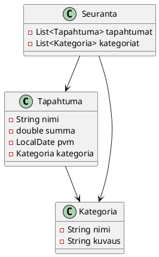
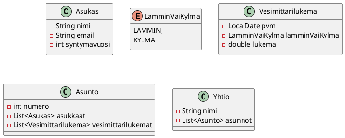

# Harjoitustyö

## Projektin aihe

### Kulujen seuranta

Tässä sovelluksessa käyttäjä voi seurata omia kulujaan ja menojaan. 

<details><summary>Vaatimukset</summary>

 * Käyttäjä voi syöttää kuluja ja menoja. 
 * Käyttäjä näkee kaikki kulut ja menot
taulukossa, jossa on ainakin kulun nimi, summa ja päivämäärä. 
 * Käyttäjä voi määrittää kulukategorioita
 * Käyttäjä voi määrittää, mihin kategoriaan kulu kuuluu.
 * Käyttäjä näkee tietyn kategorian kulut
 * Käyttäjä voi katsoa kulut tietyltä aikaväliltä (kaksi päivämäärää)
 * Käyttäjä voi vaihtaa kulun kategoriaa jälkikäteen
 * Käyttäjä näkee kuvaajan, jossa esitetään kaiki kulut kuukausittain

Käytä ainakin seuraavia komponentteja (pakolliset):

 * DatePicker
 * TableView-komponenttiin FilteredList, joka tuottaa suodatetun näkymän
   taulukkomallista, ja joka mahdollistaa taulukon suodattamisen esimerkiksi
   kategorian tai päivämäärän mukaan. TODO: Tarvitaan esimerkki filtteröidyn
   listan tuottamisesta sortedlist-oliolle.
 * ControlsFX: CheckComboBox
 * Pakollinen 1
 * Pakollinen 2

Saatat tarvita / hyötyä seuraavista JavaFX-komponentteja:  (valinnaiset)

 * Valinnainen 1
 * Valinnainen 2
 * Valinnainen 3

Bonus

 * Käyttäjä näkee kategorioittain aikasarjan kuluista

</details>



### Tuotteiden varastohallinta
 
Tässä sovelluksessa käyttäjä voi hallita tuotteiden varastotietoja.

<details><summary>Vaatimukset</summary>

 * Käyttäjä voi syöttää tuotteita ja niiden varastotietoja. 
 * Käyttäjä näkee kaikki tuotteet taulukossa, jossa on ainakin tuotteen nimi, määrä ja hinta. 
 * Seuraava vaatimus...
 * Seuraava vaatimus...

</details>

### Kirjasto

Kirjastossa on kirjoja ja lainaajia. Lainaaja voi lainata ja palauttaa kirjoja.
Kirjaston hoitaja voi hallita kirjojen tietoja ja lainatilannetta, sekä tutkia
kirjojen lainahistoriaa.

<details><summary>Vaatimukset</summary>

 * Käyttäjä voi syöttää kirjoja ja niiden tietoja. 
 * Käyttäjä näkee kaikki kirjat taulukossa, jossa on ainakin kirjan nimi, tekijä ja lainatilanne. 
 * Käyttäjä voi lainata ja palauttaa kirjoja. 
 * Seuraava vaatimus...
 * Seuraava vaatimus...
  

Esimerkki siitä, miltä JSON voisi näyttää. 

```json
{
  "kirjat": [
    {
      "id": 1,
      "nimi": "Sota ja rauha",
      "tekijä": "Leo Tolstoi",
      "lainassa": { "lainaajaId": 1, "lainauspaivamaara": "2024-01-01", "palautuspäivämäärä": "2024-01-15" }
    },
    {
      "id": 2,
      "nimi": "Anna Karenina",
      "tekijä": "Leo Tolstoi",
      "lainassa": null
    },
    {
      "id": 3,
      "nimi": "Rautatie",
      "tekijä": "Juhani Aho",
    }
  ],
  "lainaajat": [
    {
      "id": 1,
      "nimi": "Matti Meikäläinen",
      "lainatutKirjat": [1]
    },
    {
      "id": 2,
      "nimi": "Maija Meikäläinen",
      "lainatutKirjat": []
    },
    {
      "id": 3,
      "nimi": "Mikko Meikäläinen",
      "lainatutKirjat": [2,3]
    }
  ]
}
```

</details>


<details><summary>Bonus: Kirjaston lainahistoria</summary>

Bonus 1: Lisää kirja-olioon tieto siitä, kuka on lainannut kirjan, jos se on
lainassa, milloin se on lainattu ja milloin se palautuu. 

Bonus 2: Tieto siitä, milloin kirja on lainattu ja milloin se palautuu kirjastoon.
Tarvitset lainaushistoria-luokan, joka kuvaa yhtä lainatapahtumaa, ja joka
sisältää ainakin lainattavan kirjan id:n, lainaajan nimen, lainauspäivämäärän ja
palautuspäivämäärän. Lainaushistoria-luokkien lista kuuluu kirjastoon, ja joka
kerta, kun kirja lainataan tai palautetaan, luodaan uusi lainaushistoria-olio ja
lisätään se kirjaston lainaushistoria-listaan. Näin kirjastolla on täydellinen
historia siitä, milloin kukin kirja on lainattu ja palautettu, ja kuka on
lainannut kunkin kirjan.

</details>

### Taloyhtiön hallinta

Taloyhtiön hallintasovelluksessa taloyhtiön isännöitsijä voi hallita taloyhtiön
tietoja, kuten asuntoja, asukkaita ja taloyhtiön tapahtumia. 

Asukkaat voivat nähdä ilmoittaa isännöitsijälle vesimittarilukemat, ilmoittaa
asunnossa olevista ongelmista tai toiveista. 

Tietomalli: Yhdessä asunnossa voi olla monta asukasta. 

Ei voi olla asukkaita, jotka eivät kuulu mihinkään asuntoon. 

### Muistikorttisovellus

Käyttäjä voi luoda muistikortteja, jotka sisältävät kysymyksen/termin/tms., ja
siihen liittyvän vastauksen/määritelmän/tms. Käyttäjä voi selata muistikortteja,
merkitä kortteja opituiksi tai opettelemattomiksi, ja hakea kortteja esimerkiksi
avainsanan perusteella.

<details><summary>Vaatimukset</summary>

 * Käyttäjä voi luoda muistikortteja, jotka sisältävät kysymyksen/termin/tms., ja siihen liittyvän vastauksen/määritelmän/tms. 
 * Käyttäjä näkee kaikki muistikortit taulukossa, jossa on ainakin kortin kysymys/termi ja opittu/opettelematon -tila. 
 * Käyttäjä voi luoda kategorian, johon voi lisätä kortteja
 * Kategorialla on otsikko, kuvaus ja lista korteista, jotka kuuluvat kategoriaan

 * Harjoittelumoodi: 
    * Käyttäjä voi harjoitella kategoriaa siten, että hän näkee jonkin satunnaisen
   termin. Kun hän painaa korttia, hän näkee siihen liittyvän määritelmän. 
    * Käyttäjä voi painaa painiketta, jolla hän näkee seuraavan kortin
  * Bonus: Tenttimoodi:
    * Käyttäjä näkee satunnaisen kortin/kysymyksen, ja neljä kappaletta saman
      kategorian vastauksia/määritelmiä, joista yksi on oikea. Käyttäjä valitsee yhden vastauksen, ja saa tietää, oliko se oikea vai väärä. 

 </details>

### Bonus: Todo-sovelluksen laajentaminen

Laajenna osissa 7 ja 8 tehtyä Todo-sovellusta...

<details><summary>Vaatimusket</summary>

  * Käyttäjä voi merkitä tehtävän tärkeäksi, jolloin se näkyy listassa erottuvalla tavalla.

</details>



## Jokin muu oma sovellusidea, joka täyttää vaatimukset


## Projektin perusvaatimukset

- Työ on JavaFX-projekti.

## Käyttöliittymä 

 - Sovelluksessa on vähintään kaksi näkymää

---------------

## Perustoiminnallisuus

- Sovelluksessa on vähintään yksi selkeä päätietotyyppi, joka vastaa
  Todo-sovelluksen `Tehtava`-oliota. Se voi olla esimerkiksi tapahtuma, kirja,
  asiakas, treeni, peli, resepti tai jokin muu oman sovelluksen keskeinen
  tieto-olio.
- Käyttäjä voi lisätä uusia olioita käyttöliittymästä.
- Käyttäjä näkee kaikki oliot käyttöliittymässä.
- Käyttäjä voi muuttaa olion jotakin keskeistä tilaa tai ominaisuutta suoraan
  päänäkymästä. Todo-sovelluksessa tämä oli tehty/ei-tehty -tila.
- Käyttäjä ei saa voida lisätä ilmeisen virheellistä tietoa, kuten tyhjää nimeä
  tai muuta pakollisen kentän puuttumista.

## Tallennus

- Sovelluksen tiedot tallennetaan tiedostoon, jotta ne säilyvät ohjelman
  sulkemisen jälkeen.
- Tallennetut tiedot ladataan takaisin ohjelman käynnistyessä.

## Käyttöliittymä

- Sovelluksessa on graafinen käyttöliittymä, jossa on vähintään yksi selkeä
  päänäkymä.
- Käyttöliittymä on jäsennelty ja käyttökelpoinen: syöttökentät, painikkeet,
  nimiöt ja listaus eivät saa olla sattumanvaraisesti aseteltuja.
- Käyttäjän kannalta keskeiset toiminnot löytyvät päänäkymästä ilman, että
  ohjelmaa pitää käyttää komentorivin kautta.

## Käyttöliittymäsuunnitelma

- Palautuksessa on mukana lyhyt suunnitelma käyttöliittymästä.
- Suunnitelmassa kuvataan ainakin:
  - mitä käyttäjä näkee päänäkymässä
  - mitä käyttäjä voi tehdä päänäkymässä
  - millä komponenteilla tärkeimmät toiminnot on tarkoitus toteuttaa

## Versiohallinta

- Työstä on Git-varasto, jossa näkyy committeja


## Tavoitetaso

Jos oma sovelluksesi on tässä vaiheessa suunnilleen samalla tasolla kuin osan 7
Todo-sovellus, olet oikealla tasolla. Seuraavalla sivulla kuvataan vaiheen 1
toinen puolikas, joka vastaa osan 8 tasoa.

## Checklist

--


# Harjoitustyö, vaihe 1: osa 2

Tavoitteena on, että työ ei ole vain toimiva käyttöliittymä,
vaan myös rakenteeltaan järkevästi suunniteltu sovellus, jossa malli,
käyttöliittymä ja tallennus on erotettu toisistaan.

## Tietomalli ja käyttöliittymän kytkentä

- Sovelluksen dataa ei mallinneta käyttöliittymäkomponenteilla, vaan omilla
  malliluokilla.
- Sovelluksessa käytetään JavaFX:n havaittavia rakenteita silloin, kun ne
  liittyvät käyttöliittymän ja datan kytkemiseen. Käytännössä tämä tarkoittaa
  vähintään sitä, että keskeinen tietokokoelma on `ObservableList` tai vastaava
  havaittava rakenne.
- Datan esittämiseen käytetään tarkoituksenmukaista komponenttia. Jos työssä on
  useita samantyyppisiä olioita, `TableView` on yleensä luonteva ratkaisu.
- Käyttäjä voi valita yksittäisen olion käyttöliittymästä ja poistaa sen.

## Arkkitehtuuri ja vastuunjako

- Sovelluksen rakenteen tulee noudattaa vähintään karkeasti samaa ajatusta kuin
  malliharjoitustyössä: data, käyttöliittymä ja niitä yhteen kytkevä logiikka on
  erotettu toisistaan.
- Käyttöliittymäluokka tai kontrolleri ei saa sisältää kaikkea sovelluksen dataa
  ja tallennuslogiikkaa itsessään.
- Tiedon lataus ja tallennus on erotettu omaksi vastuukseen pois
  käyttöliittymälogiikasta.

## Muokkausnäkymä tai sen suunnitelma

- Sovelluksessa on oltava ajatus siitä, miten yksittäisen olion tarkempia tietoja
  voidaan muokata.
- Tämä voi olla erillinen näkymä, dialogi tai muu perusteltu ratkaisu.
- Osiin 7 ja 8 perustuvan malliharjoitustyön hengessä oliolla on hyvä olla
  vähintään yksi tai kaksi lisätietoa pelkän nimen tai otsikon lisäksi.
- Jos et vielä toteuta varsinaista muokkausnäkymää valmiiksi, suunnitelman tulee
  olla mukana palautuksessa.

## Komponenttien ja luokkien vastuut

- Palautuksessa on mukana lyhyt kuvaus komponenttien ja luokkien vastuista.
- Kuvauksesta tulee käydä ilmi ainakin:
  - mikä luokka tai luokat muodostavat sovelluksen mallin
  - mikä luokka vastaa käyttöliittymän ohjaamisesta
  - missä tiedon tallennus ja lataus hoidetaan
  - miten käyttöliittymä ja malli keskustelevat keskenään

## Testaus 

- Sovelluksen keskeiselle mallille tai bisneslogiikalle on kirjoitettu ainakin
  joitakin yksikkötestejä.

## Versiohallinta

- Työlle on tehty julkinen Git-etävarasto GitLabiin tai GitHubiin.
- Projektissa on vähintään `.gitignore` ja lyhyt `README.md`, jossa kerrotaan,
  mikä sovellus on kyseessä ja miten se käynnistetään.


## Tavoitetaso

Jos oma sovelluksesi on tässä vaiheessa suunnilleen samalla tasolla kuin osien
7 ja 8 Todo-sovellus ilman bonuksia, olet oikealla tasolla. Vaiheen 1 lopussa
työssäsi pitäisi näkyä sekä toimiva perussovellus että uskottava rakenne sen
jatkokehitykselle.
