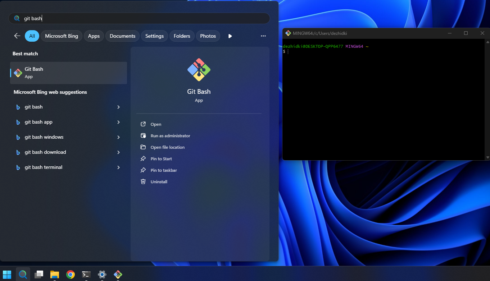
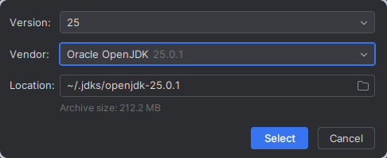
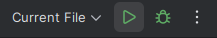
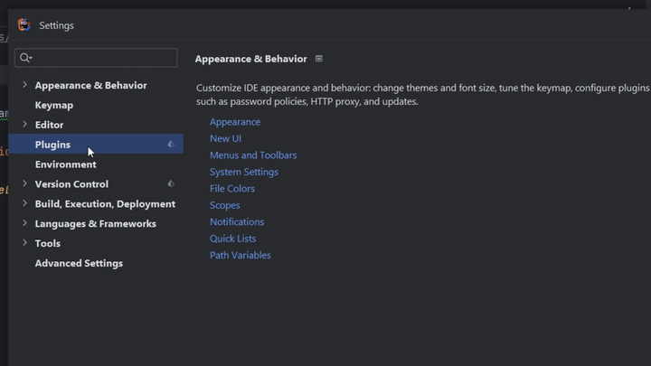

# Työkalut

**Ohjelmointi 2** -opintojaksolla käytämme seuraavia työkaluja:


- **Java Development Kit (JDK)** - Java-kielen *ohjelmistokehityspaketti*. Paketti sisältää kaikki Java-kehittämiseen tarvittavat työkalut, kuten Java-kielen kääntäjän sekä Java-virtuaalikoneen käännettyjen ohjelmien ajamista varten. JDK sisältää myös valmiita kirjastoja yleisimpiin käyttötarkoituksiin (esim. tekstin tulostaminen näytölle, kokoelmien käsittely) ja niiden dokumentaatiot.

- **Git** - *versiohallintaohjelma* (engl. Version Control Software, VCS), joka mahdollistaa koodin versioinnin ja yhteistyön koodaajien välillä.

- **IntelliJ IDEA** - *integroitu kehitysympäristö* (engl. Integrated Development Environment, IDE).
  IDE sisältää oleellisimmat toiminnot ohjelmien tekemiseen (koodin muokkaus, kääntäminen, ajaminen, virheenjäljitys).
  IntelliJ IDEA on erityisesti Java- ja Kotlin-ohjelmille tarkoitettu IDE.
  Tällä kurssille käytämme ilmaista Community Edition -versiota.

- **ComTest** - työkalu *dokumentaatiotestien* kirjoittamiselle ja ajamiselle.


Tässä dokumentissa käydään läpi yllä olevien työkalujen ja ohjelmien asentaminen.

Yllä olevat ohjelmat ovat valmiiksi asennettuna Agoran mikroluokissa.
*Suosittelemme, että asennat ohjelmat lisäksi niille tietokoneille, joilla aiot suorittaa opintojakson.*
Erityisesti harjoitustyön tekeminen pääteohjausten ulkopuolella on
helpompaa, kun kaikki tarvittavat ohjelmat on myös omalla tietokoneella.

> [!TÄRKEÄÄ]
>
> Tämän sivun ohjeet vaativat komentorivin avaamista ja käyttöä.  
>
> Voit tarvittaessa kerrata komentorivin käytön perustaitoja seuraavista linkeistä:
>
> - [OpenCS: Johdatus komentorivin käyttöön](https://opencs.it.jyu.fi/cli-intro/)
> - [Ohjelmointi 1: Pikakurssi komentorivin käyttöön](https://tim.jyu.fi/view/kurssit/tie/itkp102/ohjeet/tyokalut#pikakurssi-komentorivin-k%C3%A4ytt%C3%B6%C3%B6n)

Tällä sivulla olevat ohjeet riippuvat käyttämästäsi käyttöjärjestelmästä.
Valitse käyttöjärjestelmäsi alta:

### [Windows](#tab/win)

Valitsit Microsfot Windows -käyttöjärjestelmän. Alla olevat ohjeet on testattu seuraavilla käyttöjärjestelmillä:

- Windows 11
- Windows 10 (käyttöjärjestelmän version on oltava vähintään 1809)

Näet käyttöjärjestelmän version suorittamalla seuraava komento PowerShell-komentorivissä:

```bash
winver
```

***

### [macOS](#tab/macos)

Valitsit macOS-käyttöjärjestelmän. Alla olevat ohjeet on testattu seuraavilla käyttöjärjestelmillä:

- macOS 15 Sequoia

***

### [Linux](#tab/linux)

Valitsit Linux-käyttöjärjestelmän. Alla olevat ohjeet on testattu seuraavilla käyttöjärjestelmillä:

- Arch Linux (`6.17.7-arch1-1`)

***

### [Valitse](#tab/default)

Valitse käyttöjärjestelmäsi yllä olevista vaihtoehdoista.

***

## Esivalmistelu

### [Windows](#tab/win)

Varmista, että tietokoneesi on ajan tasalla (Windows Update:ssa ei uusia päivityksiä).

Varmista sen jälkeen, että tietokoneellasi on `winget`-pakkaushallintaohjelma asennettuna:

1. Avaa PowerShell-komentorivi (*Haku-ikoni* > *Kirjoita PowerShell* > *Windows PowerShell*).
2. Kokeile, että `winget` on asennettu suorittamalla seuraava komento:

    ```bash
    winget -v
    ```

    Tuloksena pitäisi tulostua `winget`-työkalun versio. Jos sen sijaan saat virheen, jossa
    lukee *'winget' is not recognized as the name of a cmdlet, function, script file, or operable program*,
    tarkoittaa tämä, että sinulla todennäköisesti ei ole `winget`-työkalua asennettuna.
    Jos käyttöjärjestelmän päivitys ei auta, kokeile seuraavia ratkaisuja:
    
    - Tarkista, että käyttöjärjestelmäsi on ajan tasalla (katso yhteensopivat käyttöjärjestelmäversiot ylempänä).
    - Kokeile ladata ja asentaa `winget`-käsin: [Lataa asennusohjelma](https://github.com/microsoft/winget-cli/releases/download/v1.11.430/Microsoft.DesktopAppInstaller_8wekyb3d8bbwe.msixbundle)
      Asennuksen jälkeen sulje ja käynnistä PowerShell uudelleen.

***

### [macOS](#tab/macos)

Varmista ensin, että tietokoneesi on ajan tasalla.

Varmista sen jälkeen, että tietokoneellasi on Homebrew-pakkaushallintaohjelma asennettuna:

1. Avaa Pääte tai Termimal (*Launchpad* > *Pääte/Terminal*)
2. Kokeile, että Homebrew on asennettu suorittamalla seuraava komento:

    ```bash
    brew --version
    ```

Jos saat yllä olevan komennon suorittamisen jälkeen virheen `command not found: brew`,
sinun tulee asentaa Homebrew-pakkaushallintaohjelma alla olevilla ohjeilla:

<details>
<summary>Homebrew-työkalun asennusohjeet (<b>Avaa klikkaamalla</b>)</summary>

1. Avaa Pääte tai Termimal (*Launchpad* > *Pääte/Terminal*)
2. Asenna ensin macOS:n kehitystyökalut suorittamalla alla oleva komento:

    ```bash
    xcode-select --install
    ```
    
    Komennon suorittamisen jälkeen saatat saada seuraavanlaisen ilmoituksen:
    *Komento "xcode-select" vaatii komentorivikehitystyökalut. Haluatko asentaa työkalut nyt?*
    (Englanniksi: *The 'xcode-select' command requires the command line developer tools. Would you like to install the tools now?*)
    
    Jos tällainen ilmoitus ilmestyy, valitse *Asenna*/*Install* ja odota työkalujen asentumista.
    Hyväksy tarvittaessa käyttöehdot.
    Kun asennus on valmis, saat *Ohjelmisto asennettiin*/*The software was installed* -dialogin.
    Klikkaa silloin *Valmis*.
    
    Jos saat virheen, jossa lukee `command line tools are already installed`, sinulla
    on jo tarvittavat työkalut asennettuna ja voit jatkaa seuraavaan vaiheeseen.  
3. Asenna Homebrew-ohjelmahallintatyökalu seuraavalla komennolla:

    ```bash
    /bin/bash -c "$(curl -fsSL https://raw.githubusercontent.com/Homebrew/install/HEAD/install.sh)"
    ```
    
    *Anna työkalun latautua rauhassa.*
    
    Kirjoita macOS-käyttäjäsi salasana, kun *Password*-kenttä ilmestyy.
    *Huomaa, että salasanan kirjoittaminen ei tuota mitään näkyvää tulostetta komentoriville,
    ei edes `*`-merkkejä.* Paina Enter-painiketta, kun olet kirjoittanut salasanan.
    
    Ennen asennusta Homebrew vielä tulostaa varmistusdialogin, jonka lopussa lukee
    
    ```
    Press RETURN/ENTER to continue or any other key to abort:
    ```
    
    Paina siinä tapauksessa Enter-näppäintä ja odota ohjelman asentumista.
4. Kopioi ja suorita seuraava komento (huom: tämä on yksi iso komento)

    ```bash
    BREW_PREFIX=$( [[ $(uname -m) == arm64 ]] && echo /opt/homebrew || echo /usr/local ) \
    echo >> ~/.zprofile \
    echo "eval \"\$(${BREW_PREFIX}/bin/brew shellenv)\"" >> ~/.zprofile \
    eval "$(${BREW_PREFIX}/bin/brew shellenv)"
    ```
5. Testaa, että Homebrew toimii suorittamalla komento:

    ```bash
    brew --version
    ```
    
    Jos asennus suoritettiin onnistuneesti, näet seuraavanlaisen tulosteen:
    
    ```
    Homebrew X.X.X
    ```
    
    Versionumero `X.X.X` voi olla mikä tahansa; olennaista on, että tuloste ilmestyy näkyviin.
</summary>

***

### [Linux](#tab/linux)

Alla olevissa ohjeissa oletetaan, että sinulla on kokemusta ohjelmien asentamisesta
käyttämälläsi Linux-jakelulla.
Linux-ohjeet toimivat täten ohjenuorana; käytä tarvittaessa omaa harkintaa.

Ota huomioon seuraavat asiat seuratessa ohjeita:

- Vaikka osa työkaluista löytyy jakelujen omasta pakkaustehallinnasta, jotkin graafiset ohjelmat (erityisesti Rider ja VS Code)
   eivät ole yleensä julkaistu jakelukohtaisissa repoissa.
   *Suosittelemme* käyttämään jakelusta riippumatonta pakkaustenhallintaa, 
   kuten [Snap](https://snapcraft.io/docs/installing-snapd) tai [Flatpak](https://flatpak.org/).
   
   Tällä sivulla olevat ohjeet käyttävät ensisijaisesti Snapia tai jakelukohtaisia
   pakkauksia, jos niitä on.

- Kun olet asentanut tarvittavat esipakkaukset, käynnistä uusi tyhjä pääte.

***

### [Valitse](#tab/default)

Valitse käyttöjärjestelmäsi yllä olevista vaihtoehdoista.

***

## Git

### [Windows](#tab/win)

Tarkista ensin, onko sinulla jo Git asennettuna.

1. Avaa PowerShell-komentorivi.
2. Kokeile, onko Git jo valmiiksi asennettu suorittamalla komento:

    ```bash
    git --version
    ```

    
Jos näet git-työkalun version (esim. `git version X.XX.XX`, jossa `X.XX.XX` on työkalun tarkka versio),
**voit ohittaa Git-työkalun asennusohjeen kokonaan.**

Jos saat tuloksena virheen, että komentoa ei löydy, jatka alla olevilla ohjeilla.

<details>
<summary>Git-työkalun asennusohjeet (<b>Avaa klikkaamalla</b>)</summary>

1. Avaa PowerShell-komentorivi.
2. Asenna Git for Windows suorittamalla alla oleva komento:

    ```bash
    winget install -e --id=Git.Git --custom '/COMPONENTS="ext,ext\shellhere,ext\guihere"'
    ```
    
    Odota komennon suorittamista loppuun ja anna tarvittaessa asennusoikeus.
    Jos näet komentorivillä kysymyksen, kuten:
    
    ```
    Do you agree to all the source agreements terms?
    [Y] Yes [N] No:
    ```
    
    Paina komentorivillä `y`-näppäintä ja sen jälkeen `Enter`-näppäintä.
    
    Tarkista lopuksi, että komentorivillä olevassa tulosteessa on teksti `Successfully installed`.
    
3. Sulje kaikki auki olevat komentorivit ja avaa uusi PowerShell-komentorivi
4. Testaa, että `git`-komento on asennettu suorittamalla komento:

    ```bash
    git --version
    ```
    
    Jos asennus onnistui, näet seuraavanlaisen tulosteen:
    
    ```
    git version X.XX.XX
    ```
    
    Tekstin `X.XX.XX` tilalla näkyy git-työkalun tarkka versio.

5. Testaa, vielä, että Git Bash on asennettu. Mene *Haku-ikoni* > Kirjoita *Git Bash* > Valitse *Git Bash*.

    Jos kaikki toimii, pitäisi avautua Git Bash -komentorivi:

    

</details>

***

### [macOS](#tab/macos)

Tarkista ensin, onko sinulla jo Git asennettuna.

1. Avaa Pääte.
2. Kokeile, onko Git jo valmiiksi asennettu suorittamalla komento:

    ```bash
    git --version
    ```

    
Jos saat tuloksena virheen, että komentoa ei löydy, jatka alla olevilla ohjeilla.

<details>
<summary>Git-työkalun asennusohjeet (<b>Avaa klikkaamalla</b>)</summary>

1. Avaa Pääte.
2. Git-työkalun pitäisi olla jo valmiiksi asennettu jos teit Valmistelu-vaiheessa olevat asiat. Tarkista, että Git toimii suorittamalla seuraava komento:

    ```bash
    git --version
    ```
    
    Jos asennus onnistui, näet seuraavanlaisen tulosteen:
    
    ```
    git version X.XX.XX
    ```
    
    Tekstin `X.XX.XX` tilalla näkyy git-työkalun tarkka versio.

</details>

***

### [Linux](#tab/linux)

Tarkista ensin, onko sinulla jo Git asennettuna.

1. Avaa jakelusi pääteohjelma.
2. Kokeile, onko Git jo valmiiksi asennettu suorittamalla komento:

    ```bash
    git --version
    ```

    
Jos näet git-työkalun version (esim. `git version X.XX.XX`, jossa `X.XX.XX` on työkalun tarkka versio),
**voit ohittaa Git-työkalun asennusohjeen kokonaan.**

Jos saat tuloksena virheen, että komentoa ei löydy, jatka alla olevilla ohjeilla.

<details>
<summary>Git-työkalun asennusohjeet (<b>Avaa klikkaamalla</b>)</summary>

1. Avaa jakelusi pääteohjelma.
2. Asenna Git-pakkaus: `git`. Pakkauksen nimi on yleensä sama
   kaikissa yleisillä jakeluissa (Ubuntu, Debian, Fedora, Arch, jne.)
3. Asennuksen jälkeen sulje ja avaa pääte uudelleen
4. Testaa, että `git`-komento on asennettu suorittamalla komento:

    ```bash
    git --version
    ```
    
    Jos asennus onnistui, näet seuraavanlaisen tulosteen:
    
    ```
    git version X.XX.XX
    ```
    
    Tekstin `X.XX.XX` tilalla näkyy git-työkalun tarkka versio.

</details>

***

### [Valitse](#tab/default)

Valitse käyttöjärjestelmäsi yllä olevista vaihtoehdoista.

***

## IntelliJ IDEA

### [Windows](#tab/win)

1. Avaa PowerShell-komentorivi.
2. Asenna IntelliJ IDEA Community Edition suorittamalla alla oleva komento:

    ```bash
    winget install --interactive -e --id=JetBrains.IntelliJIDEA.Community
    ```

    Ohjelman lataamisen jälkeen avautuu asennusohjelma.
    Etene asennusohjelmassa eteenpäin *Next*-painikkeella.
    Kohdassa *Installation Options* valitse seuraavat ruksit päälle:
    
    - Add "Open Folder as Project"
    - Create Associations: .java, .gradle, .kt
    
    Etene asennusohjelmassa ja anna ohjelman asentua. 
3. Kun pääset asennusohjelman loppuun, valitse *Run IntelliJ IDEA* ja paina *Finish*.
   Testaa, että ohjelma toimii.

    Ensimmäisellä kerralla käynnistys saattaa kestää, sillä järjestelmä tarkistaa sovelluksen.
    Hyväksy mahdolliset IDEAn käyttöehdot.

4. Jos sinulla on jo jokin muu kehitysympäristö asennettuna (JetBrains Rider tai Visual Studio Code),
   IntelliJ IDEA voi kysyä, haluatko tuoda (eng. *import*) asetuksia niistä.

   Voit siinä tapauksessa painaa *Skip Import*. IDEAan asetetaan erilliset asetukset myöhemmin.

5. Kun olet valmis ja pääset *Welcome to IntelliJ IDEA* -ikkunaan, voit sulkea sen.
   Ohjelman asennus on valmis!


***

### [macOS](#tab/macos)

1. Avaa Pääte.
2. Asenna IntelliJ IDEA suorittamalla alla oleva komento:

    ```bash
    brew install --cask intellij-idea-ce
    ```

    Anna asennuksen suoriutua loppuun asti. Sinulta saatetaan pyytää
    macOS-käyttäjän salasanaa `Password:`-kentässä. Kirjoita silloin
    salasana paikalle ja paina <kbd>Enter</kbd>.

3. Tarkista, että IntelliJ IDEA toimii. Avaa Launchpad ja käynnistä sieltä *IntelliJ IDEA CE*.

    Ensimmäisellä kerralla käynnistys saattaa kestää, sillä järjestelmä tarkistaa sovelluksen.
    Järjestelmä saattaa myös kysyä, *IntelliJ IDEA CE on internetsitä ladattu appi. Avataanko se?*.
    Siinä tapauksessa voi valita *Avaa*.
    
    Hyväksy mahdolliset IDEAn käyttöehdot.

4. Jos sinulla on muu kehitysympäristö asennettuja (JetBrains Rider tai Visual Studio Code),
   IntelliJ IDEA voi kysyä, haluatko tuoda (eng. *import*) asetuksia niistä.

   Voit siinä tapauksessa painaa *Skip Import*. IDEAan asetetaan erilliset asetukset myöhemmin.


5. Kun olet valmis ja pääset *Welcome to IntelliJ IDEA* -ikkunaan, voit sulkea sen.
   Ohjelman asennus on valmis!


***

### [Linux](#tab/linux)

1. Avaa jakelusi pääteohjelma.
2. Asenna IntelliJ IDEA Community Edition. Asennustapa vaihtelee jakelun mukaan:

    - Arch: Asenna [`intellij-idea-community-edition`](https://aur.archlinux.org/packages/intellij-idea-community-edition)-pakkaus AUR:sta.
      Voit asentaa sen käsin tai käyttämällä [yay](https://github.com/Jguer/yay)-työkalua:
      
      ```bash
      yay -S intellij-idea-community-edition
      ```
      
    - Muut jakelut: Suosittelemme asentamaan [IDEA-snapin](https://snapcraft.io/intellij-idea-community) käyttäen `snap`-pakkaustenhallintaa:
    
        ```bash
        snap install intellij-idea-community --classic
        ```
        
        Vaihtoehtoisesti voit asentaa IntelliJ:n käsin seuraamalla [virallisia asennusohjeita](https://www.jetbrains.com/help/idea/installation-guide.html#standalone_linux)

3. Tarkista, että IntelliJ IDEA toimii. Käynnistä JetBrains IntelliJ IDEA (joko sovellusvalikosta tai `idea`-komennolla).
    
    Hyväksy mahdolliset IDEAn käyttöehdot.

4. Jos sinulla on muu kehitysympäristö asennettuja (JetBrains Rider tai Visual Studio Code),
   IntelliJ IDEA voi kysyä, haluatko tuoda (eng. *import*) asetuksia niistä.

   Voit siinä tapauksessa painaa *Skip Import*. IDEAan asetetaan erilliset asetukset myöhemmin.

5. Kun olet valmis ja pääset *Welcome to IntelliJ IDEA* -ikkunaan, voit sulkea sen.
   Ohjelman asennus on valmis!

***

### [Valitse](#tab/default)

Valitse käyttöjärjestelmäsi yllä olevista vaihtoehdoista.

***

## Java Development Kit (JDK)


> 1. Avaa IntelliJ IDEA ja odota, kunnes pääset *Welcome to IntelliJ IDEA* -näkymään.
> 
> 2. Klikkaa ikkunan keskellä tai ylädassa olevaa *New Project* -painiketta:
> 
>     
> 
> 3. Avautuneesta ikkunasta klikkaa *JDK*-alasvetolaatikkoa ja valitse *Download JDK...* -painike:
> 
>     
> 
> 4. Aseta avautuneessa ikkunassa asetukset seuraavasti:
> 
>     - **Version:** 25
>     - **Vendor:** Oracle OpenJDK
>     
>     *Älä muuta Location-kohdassa olevaa polkua!*
> 
>     Paina lopuksi **Select**-painiketta.
> 
>     
> 
> 5. Jätä muut projektin asetukset sellaiseksi kuin ne ovat. Paina oikeassa alalaidassa olevaa **Create**-painiketta ja anna projektin latautua.
> 
>     Tämä avaa IntelliJ IDEA -kehitysympäristön käyttöliittymän.
> 
>     JDK:n lataamisessa voi mennä aikaa. Odota rauhassa, kunnes kaikki virheet ja punaiset tekstit häviää.
> 
> 6. Kun projekti on latautunut eikä virheitä näy, kokeile ajaa projekti painamalla oikeassa ylälaidassa olevaa *Play*-painiketta:
> 
>     
> 
> 7. Odota, kunnes ohjelma kääntyy. Jos kaikki toimii, ikkunan alapuolelle pitäisi ilmestyä konsoli-ikkuna, jossa näet seuraavan tekstin:
> 
> 
>     ```text
>     Hello and welcome!
>     i = 1
>     i = 2
>     i = 3
>     i = 4
>     i = 5
>     ```
> 
> 8. Voit nyt sulkea IntelliJ IDEA:n.


## ComTest

> 1. Avaa IntelliJ IDEA ja odota, kunnes pääset *Welcome to IntelliJ IDEA* -näkymään.
>
>    **Jos sinulle avautui jokin vanha projekti**, klikkaa yläpalkista tai hampurilaisvalikosta *File* > *Close project*. Tämä vie sinut takaisin *Welcome to IntelliJ IDEA* -näkymään.
>
> 2. Klikkaa ikkunan vasemmassa alalaidassa oleva *Configure* (Ratas-ikoni) > *Settings*.
>
> 3. Valitse vasemmalla puolella olevista asetusnäkymistä *Plugins*
>
> 4. Valitse *Marketplace*-välilehti ja hae hakusanalla `ComTest`
>
> 5. Valitse Comtest Runner -pluginin kohdalta *Install*
>
>       
>
> 6. Paina *Save*
>
> 7. Sulje IntelliJ IDEA


## Mitä seuraavaksi?

Onneksi olkoon! Sinulla on seuraavaksi kaikki tarvittavat kurssityökalut. Voit jatkaa tästä varsinaisiin materiaaleihin.